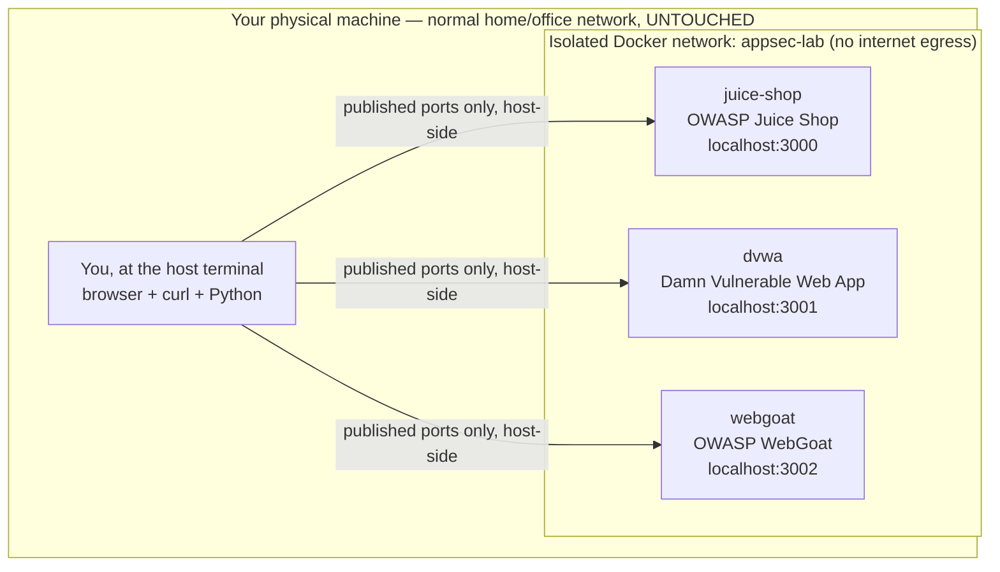

# Week 1 — AppSec Foundations & the Attacker/Defender View

> **Goal:** by Sunday you can look at any piece of software and name what it's protecting, who might attack it and why, how bad it would be if they succeeded — and you have an isolated lab of your own, built the legal way, where you'll spend the rest of this course proving it.

Welcome to **C50 · Crunch AppSec**. Application security is not a checklist of scary acronyms — it's a discipline of *reasoning under uncertainty about a system you're responsible for*. This week gives you the vocabulary and the mindset that every later week assumes: assets, threats, vulnerabilities, risk, the CIA triad, and the single habit that separates a security engineer from someone who just memorized OWASP — **the attacker/defender view**: for every attack you learn, you can also state the detection and the fix.

You'll also do something that matters as much as any technical concept this week: build a **legal, isolated, no-network lab** you own, governed by written authorization and a defined scope. Everything offensive in this entire 12-week course happens inside that lab, against targets built to be broken, on hardware or VMs that cannot reach anyone else's system. That boundary is not a formality — it's the thing that makes the rest of the course legal, safe, and honest. Read the ethics note below before you touch a single tool.

> **Ethics & legality — binding, every week.** All work in this course is **authorized, legal, defensive-minded** security practice performed **only inside an isolated lab you own** — deliberately-vulnerable VMs, containers, and CTF targets with **no route to the internet or to any real third-party system**. You will never be given instructions aimed at a system you don't own or don't have explicit written authorization to test. Every offensive technique taught here exists **to be detected and defended against**, not to be pointed at someone else. Malware analysis and reverse engineering (Week 12 of the companion C52 course) run **only** inside a no-network sandbox. Written authorization, a defined scope, and the law govern every exercise this week and every week after it.

## Learning objectives

By the end of this week, you will be able to:

- **Define** assets, threats, vulnerabilities, and risk, and compute risk as **likelihood × impact** for a concrete scenario.
- **Hold the attacker/defender view**: for any attack technique, state both how it works *and* how you would detect it or prevent it — the two-sided habit this entire course drills.
- **Explain** the CIA triad (confidentiality, integrity, availability), attack surface, and trust boundary, and use them to reason about a real application.
- **Stand up an isolated, no-network lab** — a hypervisor or container network with deliberately-vulnerable targets you own (OWASP Juice Shop, DVWA, WebGoat) — and **prove** its isolation rather than assume it.
- **State and apply** the three rules that govern every lab exercise in this course: written authorization, defined scope, and legality.
- **Map an application's attack surface** — its entry points, trust boundaries, and data flows — and record the findings in a queryable store (SQLite + Python), never a spreadsheet.
- **Build a risk register** that ranks findings by likelihood × impact and drives what gets fixed first.

## Prerequisites

- Comfortable in a terminal (navigate directories, run a command, read output/errors).
- Docker Desktop (or Docker Engine) installed and working — you'll run vulnerable targets as containers. Free, all platforms.
- Python 3.10+ and `sqlite3` (ships with Python — no separate install). No prior security experience assumed; this week starts from zero.
- Helpful but not required: [C33 Crunch SQL](../../../C33-CRUNCH-SQL/) for `SELECT` fluency, and [C16 Crunch Pro Web Backend](../../../C16-CRUNCH-PRO-WEB-BACKEND/) for how a web app is put together. This week doesn't require either — it defines its own terms from scratch.

## The lab you'll build this week

Every exercise from here to Week 12 runs against **one isolated lab environment** you stand up in Exercise 1 and never let touch a real network:

You reach the targets from your own host over `localhost`-published ports; the targets themselves sit on a Docker network with no route out. Section 6 of Lecture 3 shows you how to prove that, not just assume it.

## This week's map

Work top to bottom. Each piece assumes the ones before it.

| # | File | What's inside | ~Time |
|--:|------|---------------|------:|
| 1 | [lecture-notes/01-why-software-is-insecure.md](./lecture-notes/01-why-software-is-insecure.md) | Why software is insecure, the threat landscape, breach economics, where bugs enter the SDLC | 2h |
| 2 | [lecture-notes/02-assets-threats-risk-and-the-cia-triad.md](./lecture-notes/02-assets-threats-risk-and-the-cia-triad.md) | Assets, threats, vulnerabilities, risk = likelihood × impact, CIA triad, attack surface, trust boundaries | 2h |
| 3 | [lecture-notes/03-building-a-legal-isolated-lab.md](./lecture-notes/03-building-a-legal-isolated-lab.md) | Docker-based isolated lab, vulnerable targets, authorization/scope/legality, verifying isolation | 2h |
| 4 | [exercises/exercise-01-provision-the-isolated-lab.md](./exercises/exercise-01-provision-the-isolated-lab.md) | Stand up the lab network and three vulnerable targets; verify isolation | 1.5h |
| 5 | [exercises/exercise-02-map-an-attack-surface.md](./exercises/exercise-02-map-an-attack-surface.md) | Map Juice Shop's entry points and trust boundaries into a SQLite findings store | 1.5h |
| 6 | [exercises/exercise-03-build-a-risk-register.md](./exercises/exercise-03-build-a-risk-register.md) | Score assets/threats by likelihood × impact in SQLite; query for "fix first" | 1.5h |
| 7 | [challenges/challenge-01-write-a-rules-of-engagement.md](./challenges/challenge-01-write-a-rules-of-engagement.md) | Write and self-sign a rules-of-engagement document for your own lab | 1h |
| 8 | [challenges/challenge-02-attacker-defender-story.md](./challenges/challenge-02-attacker-defender-story.md) | One vulnerability, told twice — as attacker, then as defender | 1h |
| 9 | [mini-project/README.md](./mini-project/README.md) | Stand up the lab, map an attack surface, build a risk register, sign a RoE | 3h |
| 10 | [homework.md](./homework.md) | Extra practice, spread across the week | 4h |
| 11 | [quiz.md](./quiz.md) | 15 self-check questions + answer key | 1h |
| 12 | [resources.md](./resources.md) | Official docs + the few links worth your time | — |

## Weekly schedule

Adds up to roughly the course's full-time pace of **~28 hours**. Treat it as a target, not a stopwatch.

| Day | Focus | Lectures | Exercises | Challenges | Quiz/Read | Homework | Mini-Project | Daily Total |
|-----------|------------------------------------------|---------:|----------:|-----------:|----------:|---------:|-------------:|------------:|
| Monday | Why software fails; threat landscape | 2h | 0h | 0h | 0.5h | 1h | 0h | 3.5h |
| Tuesday | Assets/threats/risk/CIA triad | 2h | 0h | 0h | 0.5h | 1h | 0h | 3.5h |
| Wednesday | Building the isolated lab | 2h | 1.5h | 0h | 0.5h | 1h | 0h | 5h |
| Thursday | Attack surface mapping into SQLite | 0h | 1.5h | 1h | 0.5h | 1h | 0.5h | 4.5h |
| Friday | Risk register + challenges | 0h | 1.5h | 1h | 0.5h | 1h | 0.5h | 4.5h |
| Saturday | Mini-project | 0h | 0h | 0h | 0h | 0h | 2h | 2h |
| Sunday | Quiz + review | 0h | 0h | 0h | 1h | 0h | 0h | 1h |
| **Total** | | **6h** | **4.5h** | **2h** | **3.5h** | **5h** | **3h** | **28h** |

## By the end of this week you can…

- Explain to a non-security teammate, in plain language, why "we'll patch it later" is how breaches happen.
- Score any finding as risk = likelihood × impact and defend the numbers you chose.
- Stand up and *prove* the isolation of a lab you'll use for the next eleven weeks.
- Turn "here's an app" into a recorded, queryable list of entry points, trust boundaries, and a ranked risk register — in SQLite, never a spreadsheet.
- State, from memory, the three non-negotiable rules that govern every exercise in this course: written authorization, defined scope, legality.

## Up next

[Week 2 — Threat modeling with STRIDE](../week-02-threat-modeling-with-stride/) — once you can name assets, threats, and risk, you're ready to run a structured session that finds them systematically instead of by instinct.

---

*Part of the Code Crunch Worldwide open curriculum · GPL-3.0 · If you find errors, please open an issue or PR.*
