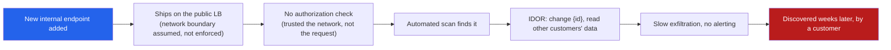
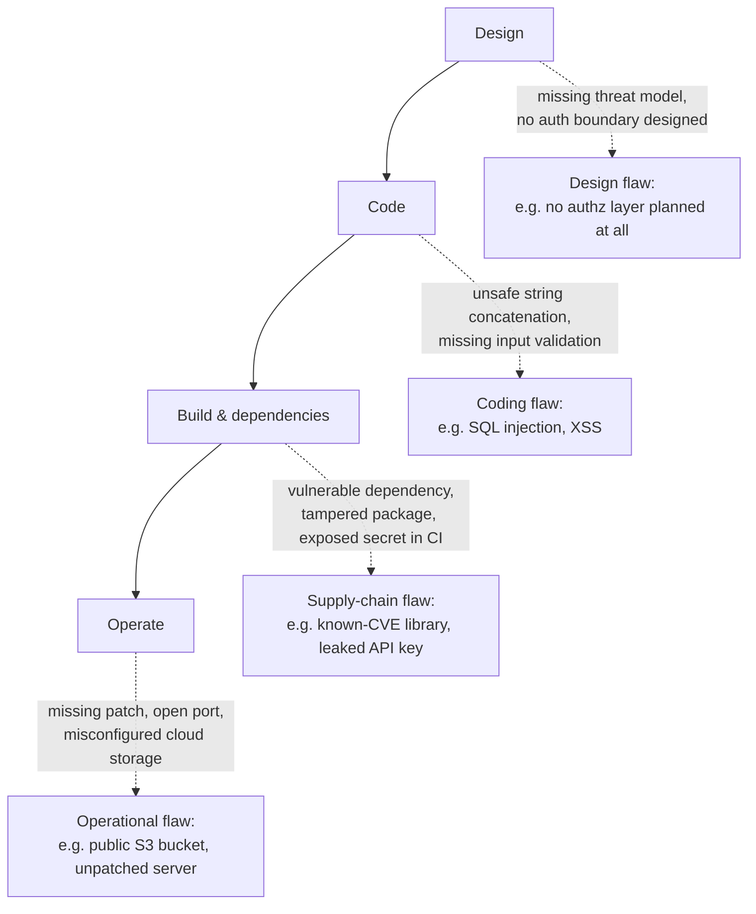

# Lecture 1 — Why Software Is Insecure

> **Duration:** ~2 hours. **Outcome:** You can explain, with a real breach as evidence, why insecure software is the economically rational default rather than an accident; name the four places a vulnerability enters the SDLC; and state this course's core habit — every attack you learn is taught so you can detect and stop it.

> **Framing, read first.** Everything in this lecture — every breach, every technique, every attacker motive — is discussed so you can **recognize and defend against it**. Nothing here is instruction for attacking a system you don't own or don't have written authorization to test. That boundary holds for all 12 weeks of this course.

## 1. Software is not "insecure by mistake" — it's insecure by default

New engineers often assume vulnerabilities are rare bugs that slip through occasionally, and that "good" teams simply don't have them. The uncomfortable truth security engineers work with every day: **insecure software is the default outcome of normal software development**, and secure software is what you get only when someone deliberately spends effort to make it so.

Why is insecurity the default? Because of a simple economic asymmetry:

- **Shipping a feature that works** is directly rewarded — it's visible, demoed, and often tied to revenue or a deadline.
- **Shipping a feature that resists misuse** is invisible when it succeeds. Nobody praises a login form for the SQL injection attack that *didn't* happen. The absence of a breach doesn't show up in a demo.
- **The cost of insecurity is deferred and probabilistic.** A missing input check might never be exploited — or it might cost the company millions two years from now. Humans (and the organizations they build) systematically underweight deferred, probabilistic costs against immediate, certain ones (shipping on time).

This is not a moral failing of individual developers. It's a structural incentive problem, and understanding it is the first step to fighting it: **you don't win by asking people to "just care more" — you win by making the secure path the easy, default, and rewarded path.** That's the thread running through this entire course, from Week 3's OWASP Top 10 to Week 10's secure SDLC.

## 2. A worked example: how a real-shaped breach happens

You don't need a specific company's name to learn the pattern — the shape repeats across nearly every major breach disclosure. Walk through a composite, realistic sequence:

1. **A developer adds a new internal admin endpoint** to check a batch job's status, `/api/internal/jobs/{id}/status`, intending it to be reachable only from the internal network.
2. **The endpoint ships behind the same public load balancer as everything else**, because a network-boundary control that should have enforced "internal only" was never actually configured — it existed only as an assumption in someone's head, not as code or infrastructure.
3. **The endpoint trusts the `{id}` path parameter with no authorization check** — it was written for an internal tool where "if you can reach the API at all, you're trusted," an assumption that made sense on day one and silently stopped being true once the endpoint became reachable from the internet.
4. **An external actor finds the endpoint** through automated scanning (a routine, low-effort activity — see Section 4) and discovers that changing `{id}` returns *other customers'* job data: an Insecure Direct Object Reference (IDOR — you'll build the defense for this in Week 6).
5. **Data is exfiltrated slowly, below any rate-limiting or anomaly-detection threshold** that would have triggered an alert, because none was configured for this endpoint specifically.
6. **The breach is discovered weeks later**, not by a security control, but by a customer noticing their data somewhere it shouldn't be.

Notice what's *absent* from this story: no zero-day, no nation-state tooling, no exotic cryptographic attack. **Every single step is an ordinary engineering decision that seemed reasonable in isolation** — ship behind the existing load balancer, trust the internal caller, skip the authorization check for now, move on to the next ticket. This is the normal shape of a breach: not one dramatic flaw, but a chain of small, individually-defensible shortcuts that compound.

*The composite breach pattern: no single dramatic flaw, a chain of ordinary shortcuts. Each arrow is a place a defense from this course would have broken the chain — a scope-enforced network boundary (Week 6), authorization-by-default (Week 6), rate limiting and logging (Week 9), and a secure code review that would have asked "who can call this?" before merge (Week 11).*

## 3. The economics of attack vs. defense

Security is often framed as a battle of skill. It's more accurately a battle of **economics**. Three asymmetries explain most of what you'll see this course:

| Asymmetry | What it means |
|---|---|
| **Attacker needs one hole; defender must close all of them.** | A defender must secure every endpoint, every input, every dependency, every misconfiguration, forever. An attacker only needs one that was missed. This asymmetry is *why* automated, systematic approaches (threat modeling in Week 2, checklists like the OWASP Top 10 in Week 3, automated scanning in Week 8) beat ad-hoc "we'll catch it in review." |
| **Automation collapses attacker cost, but not defender cost.** | Scanning the entire internet for one specific misconfigured endpoint type takes an attacker minutes with a free tool and costs them nothing meaningful. Reviewing every endpoint for that same misconfiguration by hand costs a defender real engineering hours. This is why Week 8 (SAST/DAST/SCA) matters — it's how defenders get some of that automation advantage back. |
| **A breach's cost is paid by many parties; the shortcut's benefit is captured by one.** | The engineer who skipped the authorization check to hit a deadline captured a real, immediate benefit (shipped on time). The cost of the eventual breach is paid by customers (data exposure), the company (remediation, fines, reputation), and often the engineer's own team (the incident response). This misalignment is why security has to be a *structural* practice — built into process, tooling, and review — not an individual virtue you hope people have enough of. |

## 4. The threat landscape: who attacks, and why

"Attacker" is not one actor with one motive. Recognizing the *type* of adversary you're defending against shapes what defenses matter most — this connects directly to Week 2's threat modeling, where you'll formally enumerate this per-system.

| Actor type | Typical motive | Typical method | What defends against them |
|---|---|---|---|
| **Opportunistic/automated scanners** | Volume — find *any* exploitable target, at scale, cheaply | Mass internet scanning for known CVEs, default credentials, exposed admin panels | Patching cadence, no default creds, closing unnecessary exposure (Weeks 3, 9) |
| **Financially motivated criminal groups** | Money — ransomware, data theft for resale, fraud | Phishing for initial access, then exploiting whatever misconfiguration gets them further; increasingly targets software supply chains | MFA, least privilege, secrets hygiene, supply-chain integrity (Weeks 4, 6, 7, 9) |
| **Insiders (malicious or careless)** | Varies — grievance, coercion, or simple mistake | Abusing legitimate access beyond its intended scope | Least privilege, audit logging, deny-by-default authorization (Week 6) |
| **Competitors / targeted actors** | Specific advantage — IP theft, sabotage, disruption | Reconnaissance-heavy, patient, tailored to the specific target | Defense in depth, monitoring, incident response readiness |
| **Security researchers (authorized or via bug bounty)** | Disclosure, reputation, bounty payout — usually beneficial to the defender | Structured testing under a defined scope and rules of engagement | This is the *legitimate* category — and it's the role you practice in this course's lab, under the same authorization discipline real researchers follow |

Notice the last row deliberately: **the same techniques a criminal group uses, a bug-bounty researcher also uses, under authorization** — the technique is identical, the legality and ethics come entirely from consent, scope, and disclosure practice. That distinction is the spine of this whole course and is spelled out precisely in Lecture 3.

## 5. Where vulnerabilities enter the SDLC

A vulnerability isn't planted in one place — it can enter at any of four stages, and each stage has a different, appropriate defense (you'll build all four across this course):

*A vulnerability can enter at any of four SDLC stages, and each needs its own defense.*

| Stage | Example flaw | This course's defense |
|---|---|---|
| **Design** | No authorization model was ever designed — access control was an afterthought bolted on late | Week 2 (threat modeling with STRIDE), Week 6 (deny-by-default access control) |
| **Code** | Untrusted input concatenated straight into a SQL query or rendered straight into HTML | Week 3 (OWASP Top 10), Week 5 (injection & validation), Week 11 (secure code review) |
| **Build & dependencies** | A third-party library with a known CVE is pulled in and never updated; a secret is hardcoded and committed | Week 7 (secrets & crypto), Week 9 (API & supply-chain security) |
| **Operate** | A server runs an outdated, unpatched service; a cloud storage bucket is misconfigured to be publicly readable | Week 10 (secure SDLC & CI/CD security), and the ongoing discipline of Week 8's scanning |

The point of this diagram: **"AppSec" is not just "writing careful code."** It's a set of controls distributed across the entire lifecycle, because a flaw introduced at design time cannot be fixed by careful coding, and a flaw introduced by an unpatched dependency cannot be fixed by a perfect design. You need defenses at every stage, which is exactly why this course has twelve weeks and not one.

## 6. The habit this course drills: the attacker/defender view

From this lecture forward, every offensive concept you learn gets paired with its defensive twin, every time, without exception. This is not a stylistic choice — it's the operational discipline that keeps this course strictly defensive even though it discusses real attack techniques. Practice it now on the breach story from Section 2:

| Step in the attack | The matching defense |
|---|---|
| Endpoint shipped without an enforced network boundary | Infrastructure-as-code that makes "internal only" a checked, testable property — not a comment |
| No authorization check on the endpoint | Deny-by-default authorization: every endpoint requires an explicit "who is allowed to call this" decision before merge (Week 6) |
| Automated scanning found the endpoint | Reduce and monitor attack surface: an inventory of what's actually exposed, reviewed regularly (this week's Exercise 2) |
| IDOR let one ID access another customer's data | Object-level authorization checks on every request, not just "are you logged in" (Week 6) |
| Slow exfiltration triggered no alert | Logging and anomaly detection tuned to the data sensitivity, not just uptime (Week 9, Week 10) |
| Discovered by a customer, not a control | A secure code review process that would have asked "who can call this, and did we check?" before the code ever shipped (Week 11) |

Practice this translation reflexively. Every time you read about an attack — in this course or anywhere else — ask yourself two questions before moving on: **"How would I detect this happening?"** and **"How would I have prevented it in the first place?"** If you can't answer both, you don't understand the vulnerability yet — you've only memorized its name.

## 7. Check yourself

- In your own words, why is insecure software the economically rational *default*, not an accident?
- Walk through the composite breach in Section 2 and name the point where a single design decision would have broken the whole chain.
- Name the three economic asymmetries between attackers and defenders from Section 3.
- Pick two actor types from the threat-landscape table and explain why the *same defense* (e.g., MFA) helps against both.
- Name the four SDLC stages a vulnerability can enter at, with one example flaw each.
- For any attack technique, what are the two questions you must be able to answer before you've "understood" it?

If those are automatic, Lecture 2 gives you the vocabulary — assets, threats, vulnerabilities, risk, and the CIA triad — to turn "this feels risky" into a number you can rank and act on.

## Further reading

- **OWASP — About the OWASP Foundation:** <https://owasp.org/about/>
- **OWASP Top 10 (2021) — Introduction:** <https://owasp.org/Top10/>
- **Verizon Data Breach Investigations Report (annual, free):** <https://www.verizon.com/business/resources/reports/dbir/>
- **NIST — Secure Software Development Framework (SSDF, SP 800-218):** <https://csrc.nist.gov/pubs/sp/800/218/final>
- **CISA — Secure by Design:** <https://www.cisa.gov/securebydesign>
