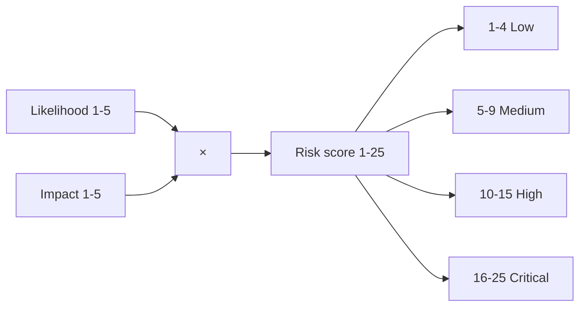
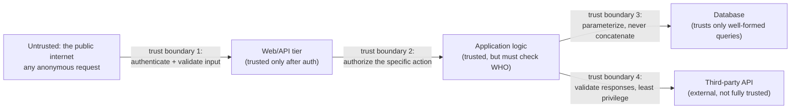

# Lecture 2 — Assets, Threats, Risk, and the CIA Triad

> **Duration:** ~2 hours. **Outcome:** You can define asset, threat, vulnerability, and risk precisely (not as synonyms); compute risk as likelihood × impact for a concrete scenario with defensible numbers; explain the CIA triad and use it to categorize a real-world impact; and identify attack surface and trust boundaries on a simple system diagram.

## 1. Four words people use interchangeably — and shouldn't

Casual conversation treats "threat," "vulnerability," and "risk" as roughly the same word. In security work they are three distinct, precisely-defined concepts, plus a fourth — "asset" — that anchors all of them. Confusing these is not pedantry; it's the difference between a risk register that helps you prioritize and one that's just a list of scary words.

| Term | Definition | Example |
|---|---|---|
| **Asset** | Anything of value you're trying to protect | The customer database; the admin credentials; the payment API; the company's reputation |
| **Threat** | A potential cause of harm to an asset — an actor or event that *could* cause damage | A criminal group that steals and resells customer data; a disgruntled employee; a misconfigured backup that silently fails |
| **Vulnerability** | A weakness that a threat could exploit to actually cause harm | An API endpoint with no authorization check; a password stored in plaintext; a dependency with a known CVE |
| **Risk** | The *combination* of a threat exploiting a vulnerability against an asset — and how much it matters | "A criminal group (threat) exploiting the missing authorization check (vulnerability) on the customer database (asset) is a **high** risk" |

**A threat without a vulnerability is not a risk.** A criminal group wanting your data is a threat regardless of your defenses — but if there's no exploitable vulnerability, the risk of that threat succeeding is low. Conversely, **a vulnerability without a relevant threat is a lower priority than the same vulnerability facing an active threat.** An unpatched library with no known exploit in the wild and no plausible attacker interested in your specific system is a real vulnerability, but a lower risk than the same library actively being exploited by opportunistic scanners across the internet (Lecture 1, Section 4). Risk is always the product of both sides, never either one alone.

## 2. Risk = likelihood × impact

This is the formula you will use every week of this course, starting with this week's mini-project and continuing straight through Week 3's Top 10 work and Week 11's findings reports:

```
Risk = Likelihood × Impact
```

Both sides need a defensible, written justification — not a gut feeling. A simple, usable 1–5 scale for each axis:

**Likelihood** — how probable is it that this vulnerability actually gets exploited?

| Score | Meaning | Example |
|---:|---|---|
| 1 | Very unlikely | Requires physical access to a locked server room and insider knowledge |
| 2 | Unlikely | Requires a sophisticated, targeted attack against this specific system |
| 3 | Possible | Exploitable by a moderately skilled attacker with some reconnaissance |
| 4 | Likely | Exploitable with commonly available tools; the flaw class is actively scanned for on the internet |
| 5 | Almost certain | Trivially exploitable, no special access needed, and actively being exploited in the wild for this exact flaw class |

**Impact** — how bad is it if the exploitation succeeds?

| Score | Meaning | Example |
|---:|---|---|
| 1 | Negligible | Cosmetic issue, no data or availability affected |
| 2 | Minor | Limited, low-sensitivity data exposed, or brief, contained disruption |
| 3 | Moderate | Sensitive data for a subset of users exposed, or a meaningful service disruption |
| 4 | Major | Sensitive data for all users exposed, or significant, sustained disruption, or a foothold for further compromise |
| 5 | Severe | Full compromise of the system, regulated data (health, financial, government ID) exposed at scale, or safety-impacting failure |

Multiply the two scores for a **risk score from 1 to 25**. That number is what drives prioritization — it's the backbone of Exercise 3's risk register and every findings report you'll write for the rest of this course.

**Worked example** — the IDOR from Lecture 1's breach story:

- **Likelihood: 4.** No special access needed; changing a path parameter is trivial; automated scanners routinely probe for exactly this pattern.
- **Impact: 4.** Other customers' job data (potentially containing sensitive business information) is exposed at scale, to anyone who finds the endpoint.
- **Risk score: 4 × 4 = 16 → High.** This sits at the top of a risk register and gets fixed before anything scored lower.

A simple banding turns the number into an action:

| Score range | Band | Typical response |
|---:|---|---|
| 1–4 | Low | Track it; fix opportunistically |
| 5–9 | Medium | Fix within a defined window (e.g., this sprint) |
| 10–15 | High | Fix urgently; consider a temporary mitigation now |
| 16–25 | Critical | Stop and fix immediately; treat as an incident if already exploitable in production |



## 3. The CIA triad — what, precisely, are you protecting?

"Security" is vague until you say *which property* you're protecting. The CIA triad names the three:

| Property | Means | A violation looks like |
|---|---|---|
| **Confidentiality** | Only authorized parties can *read* the data or system | A leaked customer database; an IDOR exposing other users' records; a stolen API key granting read access |
| **Integrity** | Data and system state can only be *modified* by authorized parties, in authorized ways | An attacker altering a bank balance; a supply-chain attack that tampers with a build artifact; a user editing another user's order after checkout |
| **Availability** | The system is *usable* by legitimate users when they need it | A denial-of-service attack; a ransomware encryption event; a misconfiguration that takes a service down |

Every vulnerability you study in this course maps to at least one CIA property, and naming which one sharpens your thinking about both the risk and the fix:

- SQL injection that dumps a table → **confidentiality** violation (attacker reads data they shouldn't).
- SQL injection that runs `UPDATE`/`DELETE` → **integrity** violation (attacker changes or destroys data).
- An unauthenticated endpoint that lets anyone trigger an expensive operation thousands of times → **availability** violation (resource exhaustion).
- Broken access control that lets User A view User B's private order → **confidentiality**.
- Broken access control that lets User A *cancel* User B's order → **integrity**.

Note the last two: **the same underlying flaw class (broken access control, Week 6) can violate different CIA properties** depending on whether the unauthorized action is a read or a write. This is why precise language matters — "there's a security bug" tells you nothing; "this is a confidentiality violation via broken object-level authorization, risk score 16" tells you exactly what's wrong and how bad it is.

## 4. Attack surface — everything an attacker could touch

The **attack surface** of a system is the complete set of points where an untrusted actor could interact with it — every place data or a request can enter, and everywhere the system exposes something to the outside. Mapping it is the practical skill behind Exercise 2.

Common categories, using a typical web application as the running example:

| Category | Examples |
|---|---|
| **Network-exposed endpoints** | Every API route, every page, every WebSocket connection — including ones not linked from the UI |
| **Input fields** | Login forms, search boxes, file uploads, URL parameters, HTTP headers, cookies |
| **Authentication & session mechanisms** | Login flow, password reset, "remember me" tokens, session cookies, API keys |
| **Third-party integrations** | OAuth providers, payment processors, webhooks received from external services |
| **Administrative interfaces** | Admin panels, debug endpoints, internal APIs (Lecture 1's breach started here) |
| **Infrastructure** | Open ports, exposed cloud storage, misconfigured DNS, forgotten staging environments |
| **The software supply chain** | Every third-party dependency your code pulls in and executes with your application's privileges (Week 9) |

A larger attack surface is not automatically worse — a system that needs to expose ten endpoints to function is not "insecure" for having ten endpoints. What matters is that **every point in the attack surface has a matching, deliberate defense**, and that nothing is exposed *accidentally* (like Lecture 1's internal endpoint that ended up on the public load balancer by omission, not by design). Reducing attack surface — turning off what you don't need, restricting what's reachable from where — is one of the cheapest, highest-leverage defenses in all of AppSec, which is why Exercise 2 has you inventory it before you do anything else this course.

## 5. Trust boundaries — where "who do you believe" changes

A **trust boundary** is any point in a system where data crosses from one level of trust to another — from a zone you don't control into a zone you do, or from one privilege level to another. Every trust boundary is a place where you must **validate, authenticate, or authorize**, because the assumptions that held on one side don't automatically hold on the other.



The IDOR from Lecture 1 was, precisely, a **missing check at trust boundary 2**: the request crossed from "anonymous internet" to "authenticated user" correctly (boundary 1 held — you needed *some* valid session), but nothing checked whether *this* authenticated user was authorized for *this specific* job ID before the application logic queried the database. The most dangerous vulnerabilities are almost always a missing or misplaced check at exactly one of these boundaries — which is why Week 2's STRIDE threat modeling walks a data-flow diagram boundary by boundary, and why this lecture teaches you to see them before you have a formal process for it.

## 6. Putting it together: from a system to a risk register

Here's the full reasoning chain, worked end to end, that Exercise 3 will have you do formally in SQLite:

1. **Name the asset.** *Customer job-status data in the internal jobs API.*
2. **Name the threat.** *Opportunistic external scanners and financially motivated actors who resell exposed business data (Lecture 1, Section 4).*
3. **Name the vulnerability.** *Missing object-level authorization check on `/api/internal/jobs/{id}/status`, combined with the endpoint being reachable from the public internet due to a missing network trust boundary.*
4. **Identify the CIA property violated.** *Confidentiality* (this is a read; a companion endpoint that let you *edit* job status would be an *integrity* violation too).
5. **Score likelihood and impact, with justification.** *Likelihood 4 — no special access, trivially scanned for. Impact 4 — sensitive data for all customers exposed at scale.*
6. **Compute risk.** *4 × 4 = 16 → Critical.*
7. **Record it, queryable, not buried in a document.** *A row in a `findings` table you can filter, sort, and re-score as new information arrives — this is exactly what Exercise 3 builds.*

Every OWASP Top 10 category you'll study starting Week 3 is really just a *named, well-studied pattern* of steps 3–4 above — a common shape of vulnerability with a common CIA impact. Assets/threats/risk is the general reasoning tool; the Top 10 is the specific, high-frequency vocabulary built on top of it.

## 7. Check yourself

- Define asset, threat, vulnerability, and risk in one sentence each, and explain why "risk" requires *both* a threat and a vulnerability.
- Score likelihood and impact (1–5 each) for a hardcoded admin password found in a public GitHub repository of a live production app, and justify both numbers.
- Give one example each of a confidentiality, an integrity, and an availability violation, none of which are from this lecture.
- Explain why "attack surface" isn't automatically bad, and what actually matters about it.
- Walk through the four trust boundaries in Section 5's diagram and, for a system you've personally used (any web app), name what data crosses at least two of them.
- Why does risk = likelihood × impact require you to justify both numbers in writing rather than just stating a score?

If those are automatic, Lecture 3 turns this reasoning loose on a real, deliberately-vulnerable target — and walks you through building the isolated lab, the right way, before you touch it.

## Further reading

- **NIST — Guide for Conducting Risk Assessments (SP 800-30):** <https://csrc.nist.gov/pubs/sp/800/30/r1/final>
- **OWASP — Risk Rating Methodology:** <https://owasp.org/www-community/OWASP_Risk_Rating_Methodology>
- **OWASP — Threat Modeling (overview, previews Week 2):** <https://owasp.org/www-community/Threat_Modeling>
- **NIST — Glossary (asset, threat, vulnerability, risk definitions):** <https://csrc.nist.gov/glossary>
- **CISA — Understanding the CIA triad primer:** <https://www.cisa.gov/news-events/news/security-tip-st04-013>
