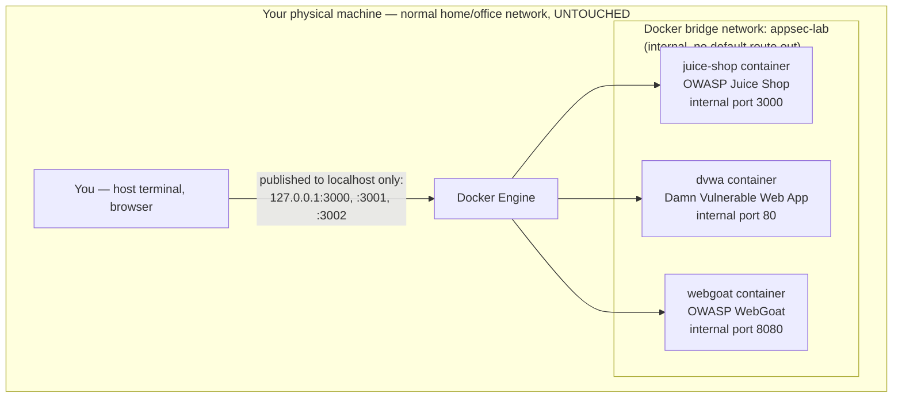
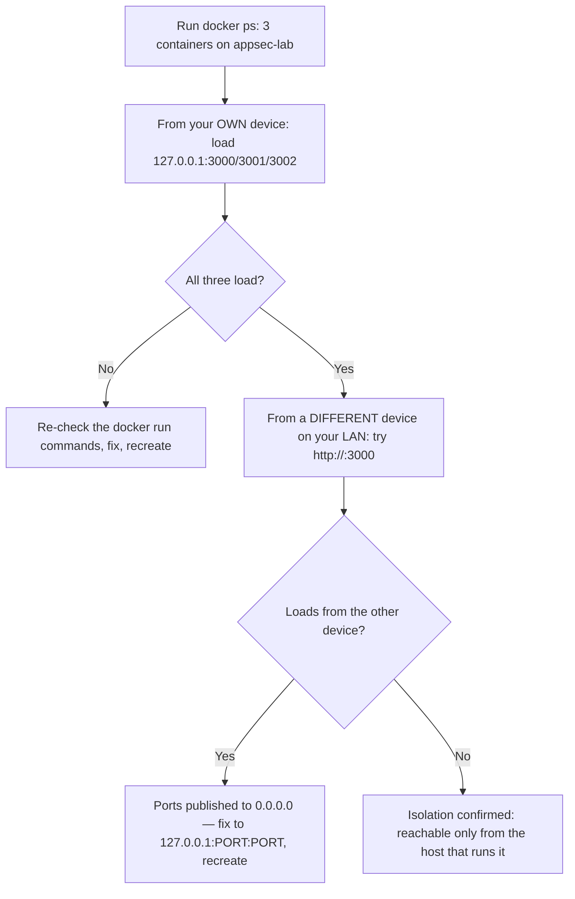

# Lecture 3 — Building a Legal, Isolated Lab

> **Duration:** ~2 hours. **Outcome:** You can explain why authorization, scope, and isolation are three independent controls (not one); stand up a Docker-based, no-internet-egress lab with deliberately-vulnerable targets (Juice Shop, DVWA, WebGoat) you own; and verify — not assume — that the lab cannot reach anything outside itself.

## 1. Three rules, and why they're independent controls, not one

Every exercise in this course that touches a "vulnerable" target rests on three separate guarantees. They are not redundant — each one covers a failure the others don't:

| Rule | What it guarantees | What happens if it's the *only* one you have |
|---|---|---|
| **Written authorization** | You have explicit, documented permission to test *this specific system* | Without isolation or scope, "I have permission" doesn't stop you from accidentally testing something you *don't* have permission for, next to it on the same network |
| **Defined scope** | Exactly what you're allowed to do, to what, and for how long is written down and agreed | Without authorization, a scope document is just a wish list — nobody with authority over the target agreed to it. Without isolation, a correctly-scoped test can still leak outside its intended boundary through a network misconfiguration |
| **Isolation (legality's technical backstop)** | Even if you make a mistake, there is no path from your actions to a system outside your own control | Without authorization and scope, even a perfectly isolated lab doesn't teach you the *process* real, legal security work requires — and the isolation itself doesn't grant you permission to do this against anything reachable from it |

**All three, together, are what makes this course legal, safe, and honest.** You'll practice all three explicitly this week: Exercise 1 builds the isolation, Challenge 1 writes the authorization and scope as a signed rules-of-engagement document, and this lecture explains why you need both, not one or the other.

> **The law does not care about your intent.** In most jurisdictions (in the US, the Computer Fraud and Abuse Act; equivalents exist in the UK, EU, and elsewhere), accessing a computer system "without authorization" is the legal standard — not "I meant well" or "I was just curious." A system you own, in a network with no route to anything else, sidesteps this question entirely: there is no "other system" to have accessed without authorization. That is *why* isolation is the default posture for this entire course, not an optional convenience.

## 2. The lab topology: Docker, not a full hypervisor

Where a course like C45 Crunch Red uses VirtualBox/VMware VMs with host-only networking (network-level attacks need real network stacks), this course's targets are **web applications** — so a Docker network with no published egress is sufficient isolation, faster to stand up, and reproducible across macOS, Linux, and Windows without a hypervisor.


*Three vulnerable targets sit on an internal Docker network published only to localhost.*

The key property: containers on the `appsec-lab` network reach **each other and nothing else** by default. You reach them from your host via ports Docker publishes to `127.0.0.1` — never to `0.0.0.0` (which would make them reachable from your LAN) and never with a cloud/public deployment. Section 5 shows you how to prove this rather than trust it.

## 3. The targets: what each one teaches, and why three

One target isn't enough — different vulnerable apps emphasize different flaw classes, and seeing the same underlying concept (e.g., broken access control) implemented differently builds the pattern-recognition this course is training.

### 3.1 OWASP Juice Shop

A deliberately vulnerable, modern web application (Node.js/Angular) that covers the entire OWASP Top 10 in one running app, with a built-in scoreboard that tracks which vulnerability classes you've found — useful as a running syllabus companion from Week 3 onward. This is your **primary** target this week and for most of the course.

### 3.2 DVWA — Damn Vulnerable Web Application

A PHP/MySQL app with **adjustable difficulty levels** (low/medium/high/impossible) for each vulnerability class. Its superpower for this course: you can see the *same* flaw (say, SQL injection) implemented insecurely, then partially fixed, then fully fixed — which is exactly the "attacker/defender" pairing this course drills, made concrete in code you can diff.

### 3.3 OWASP WebGoat

A Java-based, lesson-driven vulnerable app that walks you through *why* each vulnerability works with in-app explanations, not just a target to poke at blind. Useful when a concept from a lecture needs a guided, step-by-step first encounter before you try the more open-ended Juice Shop or DVWA.

All three are **official, actively maintained OWASP or Rapid7-adjacent training projects** — never download a "vulnerable app" from an unofficial or unknown source; you have no way to verify it doesn't also contain something that harms *your* machine, which would defeat the entire purpose of a safe lab.

## 4. Step-by-step build

1. **Install Docker Desktop** (macOS/Windows) or Docker Engine (Linux). See [`resources.md`](../resources.md) for links. Confirm with:

   ```bash
   docker --version
   docker run hello-world
   ```

2. **Create the isolated network** — no `--internal` flag means it can still reach the internet through your host's normal routing (fine for *pulling* images), but nothing publishes beyond `127.0.0.1`, so nothing is reachable *from* the outside:

   ```bash
   docker network create appsec-lab
   ```

3. **Pull and run OWASP Juice Shop**, published only to localhost:

   ```bash
   docker run -d \
     --name juice-shop \
     --network appsec-lab \
     -p 127.0.0.1:3000:3000 \
     bkimminich/juice-shop
   ```

4. **Pull and run DVWA**:

   ```bash
   docker run -d \
     --name dvwa \
     --network appsec-lab \
     -p 127.0.0.1:3001:80 \
     vulnerables/web-dvwa
   ```

   DVWA needs a one-time database setup click on first load — visit `http://127.0.0.1:3001/setup.php` and click "Create / Reset Database," then log in with the documented default credentials (`admin` / `password` — see [`resources.md`](../resources.md); this default-credential pattern is itself something you'll study in Week 4).

5. **Pull and run OWASP WebGoat**:

   ```bash
   docker run -d \
     --name webgoat \
     --network appsec-lab \
     -p 127.0.0.1:3002:8080 \
     webgoat/webgoat
   ```

6. **Confirm all three are up:**

   ```bash
   docker ps --filter network=appsec-lab
   ```

   You should see three running containers. Visit `http://127.0.0.1:3000` (Juice Shop), `http://127.0.0.1:3001` (DVWA), and `http://127.0.0.1:3002/WebGoat` (WebGoat) in your browser to confirm each loads.

7. **Snapshot your work, the low-tech way.** Unlike VM snapshots, Docker containers are cheap to destroy and recreate from the same image — your "reset" is `docker rm -f <name>` followed by re-running the same `docker run` command. Keep your exact `docker run` commands in a `lab-setup.sh` script in your portfolio so rebuilding is one command, not a re-read of this lecture.

## 5. Verifying isolation — don't assume, prove it

An isolated lab you haven't tested is a lab you *hope* is isolated. Prove the two properties that matter, from your host terminal:

```bash
# 1. Confirm the containers are NOT reachable from anywhere but localhost.
#    Find your machine's real LAN IP first:
#    macOS/Linux: ifconfig | grep "inet " ; Windows: ipconfig
#    Then, from a DIFFERENT device on your home network (a phone on the same Wi-Fi
#    works well), try to reach your machine's LAN IP on the published ports:
#    http://<your-LAN-IP>:3000  — this should FAIL to connect.
#    If it succeeds, you published to 0.0.0.0 instead of 127.0.0.1 — fix your
#    `docker run` command (change -p 3000:3000 to -p 127.0.0.1:3000:3000) and
#    recreate the container.

# 2. Confirm the containers can't reach a real, live internal endpoint you own
#    (a lightweight sanity check that they aren't silently scanning your host).
#    Get a shell inside the Juice Shop container:
docker exec -it juice-shop sh

# From inside the container, confirm it can resolve/reach ONLY its lab siblings
# and the outside internet it needed to start up (expected) — the property that
# actually matters for this course is #1 above: nothing OUTSIDE reaches IN.
exit
```


*The property that matters for a web-app lab: reachable from you, unreachable from anyone else on your network. Confirm it before your first exercise.*

If step 2 in the diagram succeeds (another device on your network *can* load the app), your containers are exposed to your whole LAN — stop, fix the port publishing to bind explicitly to `127.0.0.1`, and recreate the containers before running any exercise against them.

## 6. Cleaning up and resetting

You'll intentionally break these targets throughout the course — that's the point of DVWA's difficulty levels and Juice Shop's scoreboard. When a target gets into a state you don't understand, or you're just done for the day:

```bash
# Stop and remove one target, keep the others running
docker rm -f dvwa

# Nuke everything and start clean (re-run the docker run commands from Section 4 after)
docker rm -f juice-shop dvwa webgoat
docker network rm appsec-lab
```

Keep your `lab-setup.sh` script from Section 4, Step 7 up to date — resetting the whole lab should be one command, not a re-read of this lecture, every single week for the rest of this course.

## 7. Why this discipline outlasts the course

Every real, professional security engagement you eventually do — a bug bounty, a pentest, an internal security review at your job — will *also* have a defined boundary: a scoped set of hosts, a signed authorization, a testing window. The habit you're building this week — **write the authorization down, define the scope precisely, and verify your technical boundary instead of assuming it** — is a direct transfer to that real work. Engineers who skip this step are the ones who end up explaining to a legal team why they tested something nobody agreed to.

## 8. Check yourself

- Name the three rules from Section 1 and explain why isolation alone isn't sufficient without authorization and scope.
- Why does "I meant well" not matter legally, and what technical property does isolation give you instead?
- Why are three different vulnerable targets used instead of just one?
- Walk through, in your own words, what each of the two isolation checks in Section 5 is proving, and what a *failing* result would look like for each.
- Why is `-p 127.0.0.1:3000:3000` different from `-p 3000:3000`, and why does that difference matter for this course's safety guarantee?
- How does the habit of verifying your lab boundary this week connect to something you'd do on a real, authorized engagement later in your career?

If those are automatic, you're ready for the exercises: build exactly this lab, verify it, map one target's attack surface into a queryable store, and score your first risk register.

## Further reading

- **Docker — Get Docker (install):** <https://docs.docker.com/get-started/get-docker/>
- **Docker — Networking overview:** <https://docs.docker.com/network/>
- **OWASP Juice Shop — official docs:** <https://owasp.org/www-project-juice-shop/>
- **DVWA — official repository:** <https://github.com/digininja/DVWA>
- **OWASP WebGoat — official docs:** <https://owasp.org/www-project-webgoat/>
- **U.S. DOJ — Computer Fraud and Abuse Act overview:** <https://www.justice.gov/jm/jm-9-48000-computer-fraud>
- **HackerOne — Disclosure Guidelines (the professional norm for scope/authorization):** <https://www.hackerone.com/disclosure-guidelines>
