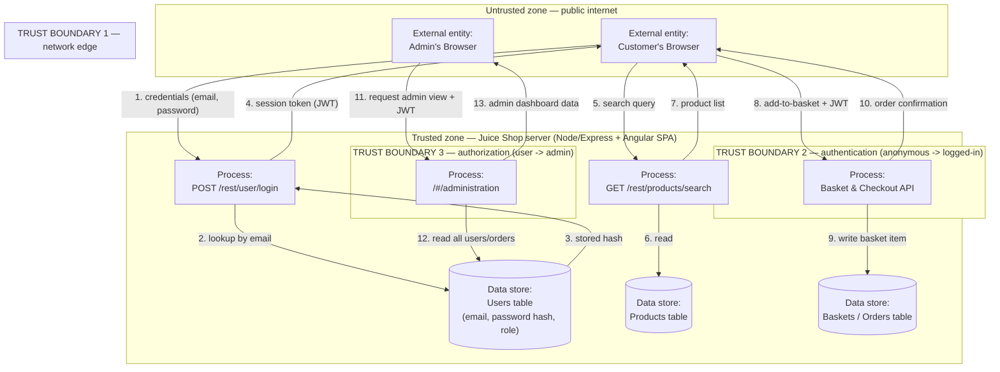

# Lecture 1 — Data-Flow Diagrams & Trust Boundaries

> **Duration:** ~2 hours. **Outcome:** You can name the four DFD element types, draw a correct data-flow diagram for a real system with trust boundaries marked, and explain why this diagram — not a network map, not an org chart — is the one every threat model is built on.

> **Framing, read first.** This lecture draws the diagram for a system you own — Juice Shop, running in your own isolated Week 1 lab, `localhost:3000`, no route to the internet. Nothing here is instruction for mapping or attacking a system you don't own. Drawing a DFD is a *design-review* activity: you're describing how data moves, not touching anything.

## 1. Why draw a picture before you touch a tool

Every later week of this course reaches for a tool: a scanner in Week 8, a fuzzer implicitly in Week 5, a code reviewer's checklist in Week 11. This week reaches for nothing but a pencil (or a `mermaid` code block) — and that's deliberate. **Threat modeling is a design-review activity, not a testing activity.** You are not trying to find out whether a specific input crashes a specific endpoint (that's penetration testing, Week 3 onward). You are trying to answer a cheaper, earlier, and arguably more valuable question: **"Looking at how this system is *supposed* to work, what could go wrong, systematically, before we write or run a single exploit?"**

That question needs a map first. You cannot reason systematically about "what could go wrong" if you can't first point at the specific thing that could go wrong. A **data-flow diagram (DFD)** is that map: a small, precise picture of how data enters a system, where it's processed, where it's stored, and where it leaves — with the one addition that makes it a *security* map instead of just an architecture diagram: **trust boundaries**, marking every place data crosses from one level of trust to another.

This is also where threat modeling and penetration testing start to diverge in a way worth naming now, because Lecture 3 builds on it: a DFD describes the system **as designed** — you can draw one for a system that doesn't exist yet, on a whiteboard, before a line of code is written. A pen test can only run against a system **as built**. That's why threat modeling belongs at design time (and should be *repeated* whenever the design changes) while penetration testing belongs after something exists to test. Neither replaces the other — Lecture 3, Section 6 spells out exactly when to reach for which.

## 2. The four DFD element types

A data-flow diagram has exactly four kinds of things on it. Learn the four shapes; every DFD you'll ever draw, in this course or in your job, uses only these:

| Element | Conventional shape | What it represents | Ask |
|---|---|---|---|
| **External entity** | Rectangle | A person or system *outside* your control that sends or receives data — a user's browser, a third-party API, an admin | Who or what talks to this system from the outside? |
| **Process** | Rounded rectangle / circle | Something that *does work* — transforms, validates, routes, or acts on data | What code actually runs and makes a decision? |
| **Data store** | Open-ended rectangle / cylinder | Something that *holds* data at rest — a database table, a file, a cache, a session store | Where does data sit still, even briefly? |
| **Data flow** | Labeled arrow | Data *moving* between any two of the above | What, specifically, travels from A to B, and in which direction? |

Two rules keep beginners' diagrams correct:

- **Data flows never connect two data stores directly.** If data moves from one store to another, there is always a process in between doing the moving (even if that process is "a scheduled job" or "a database trigger") — draw the process, don't skip it. Skipping it is the single most common DFD mistake, because it hides exactly the place a threat usually lives.
- **A DFD shows data flow, not control flow.** You are not drawing a sequence diagram or a call graph. An arrow means "this specific data travels this specific direction," not "this function calls that function." If you can't name what's flowing, you don't have a data flow yet — you have a guess.

## 3. Trust boundaries — the whole reason you're drawing this

A **trust boundary** is a line on the diagram marking a place where the level of trust changes — typically because control changes hands (your code stops running, someone else's starts) or because a privilege level changes (an anonymous request becomes an authenticated one, or a regular user's request becomes an admin's).

This is the single most important concept in the whole lecture, so state it plainly: **threats cluster at trust boundaries.** A process reading data that never crossed a boundary — internal, generated, and consumed by code you control the whole time — is comparatively low risk. The moment data crosses from "outside my control" to "inside," or from "low privilege" to "high privilege," is exactly where an attacker gets to inject something you didn't expect. STRIDE, next lecture, gets applied *everywhere*, but the boundaries are where you should expect to find the most and the worst threats.

Common trust boundaries you'll draw over and over in this course:

- **The network edge** — anywhere a request enters from a browser, a mobile app, or the public internet. Everything on the other side of this line is attacker-controlled input, full stop, no exceptions.
- **The authentication boundary** — the line between "anonymous" and "logged in." Crossing it should always require proving an identity; a process on the trusted side that forgets to check is a Spoofing threat waiting to happen (Lecture 2).
- **The authorization / privilege boundary** — the line between "logged in as a normal user" and "logged in as an admin" (or between one user's data and another's). This is a *second*, separate boundary from authentication — being logged in proves *who* you are, not *what you're allowed to do*. Conflating the two is one of the most common design flaws in real applications (you'll fix exactly this class of bug in Week 6).
- **The process boundary** — anywhere execution moves from one process, container, or service to another, even if both are "yours" (e.g., your API calling a third-party payment processor).

## 4. Levels of abstraction — how deep to go

You can draw a DFD at any zoom level, and picking the right one is a skill in itself:

- **Context diagram (Level 0):** the entire system as a single process, showing only its external entities and the flows crossing its outer boundary. Useful for a one-slide overview; too coarse to find real threats.
- **Level 1 DFD:** the system opened up into its major processes and data stores. **This is the level you work at for this whole course** — detailed enough to find real threats, coarse enough to finish in an hour.
- **Level 2+ DFDs:** individual processes from Level 1 exploded further (e.g., "the login process" broken into "parse request → look up user → verify password → issue token"). Reach for this only when a Level 1 process is dense enough that STRIDE against it as one box would miss something real — don't default to it. Section 6 covers this trade-off directly.

## 5. Worked example — Juice Shop's login, browse, basket, and admin slice

Here is the Level 1 DFD for the four flows described in this week's README, drawn as data flows crossing three trust boundaries: the **network edge** (browser to server), the **authentication boundary** (anonymous to logged-in), and the **authorization boundary** (regular user to admin).

*Four flows, three trust boundaries, three data stores. Every arrow that crosses a boundary line is a place STRIDE will find something in Lecture 2. Notice flow 12 in particular — the admin panel reading the full users table is exactly the kind of privileged read that Elevation of Privilege threats target if the boundary isn't actually enforced.*

Read the diagram left to right: an external entity (browser) sends a flow, across a boundary, into a process, which reads or writes a data store, and sends a flow back out. That's the entire grammar of a DFD — four element types, boundaries marked, nothing else.

## 6. Common mistakes (and how to catch them in your own diagram)

- **Drawing a network diagram instead of a data-flow diagram.** A network diagram shows servers, IPs, and cables. A DFD shows *data* and *processes that touch it*. Two servers with no data flow between them don't belong connected on a DFD, even if a network cable connects them physically.
- **Skipping the "read the hash" flow.** Beginners draw `browser → login → token`, and it looks complete — until you ask "how did the process know the password was right?" There's a missing flow to the `users` store. If you can't trace where a process got the information it needed to make a decision, you're missing a flow, and that missing flow is usually where a bug hides.
- **Missing an obvious boundary because "it's all our code."** The line between "authenticated user" and "admin" is a trust boundary even though both requests hit the same server, the same process type, and the same codebase. Trust boundaries are about *privilege*, not physical location — Section 3's authorization boundary above is the one beginners skip most often, and it's exactly the one Juice Shop's admin panel threats live on.
- **Going too deep, too soon.** Exploding every process to Level 2 before you've even run STRIDE once at Level 1 is how a one-hour exercise becomes a four-day rabbit hole. Finish a Level 1 pass first (Lecture 3, Section 5 has the time-boxing rule); go deeper only where the first pass tells you to.
- **An arrow with no label, or a vague one ("data").** If you can't say *what* is flowing (credentials? a session token? a search string?), you can't reason about what an attacker could do to it. Label every arrow with the actual payload.

## 7. Check yourself

- Name the four DFD element types and the shape convention for each.
- Why can a data flow never go directly from one data store to another? What's always missing if you find yourself drawing that?
- Give the definition of a trust boundary in one sentence, and explain why threats cluster there.
- What's the difference between the authentication boundary and the authorization boundary in the Juice Shop diagram above? Why are they drawn as two separate boundaries, not one?
- What's the difference between a context diagram (Level 0) and a Level 1 DFD, and which one do you use for this course?
- A colleague draws a DFD that's really a network diagram with IP addresses on it. What's the one question you'd ask them to find the missing element?

If those are automatic, Lecture 2 takes the diagram you now know how to draw and runs a systematic, six-category pass against every element on it — turning "the admin panel feels risky" into a specific, named, arguable threat.

## Further reading

- **OWASP Threat Modeling Process:** <https://owasp.org/www-community/Threat_Modeling_Process>
- **Microsoft — "What's a Data Flow Diagram" (Threat Modeling Tool docs):** <https://learn.microsoft.com/en-us/azure/security/develop/threat-modeling-tool-getting-started>
- **OWASP Threat Modeling Cheat Sheet:** <https://cheatsheetseries.owasp.org/cheatsheets/Threat_Modeling_Cheat_Sheet.html>
- **OWASP Juice Shop — official docs (architecture overview):** <https://pwning.owasp-juice.shop/companion-guide/latest/part1/introduction.html>
