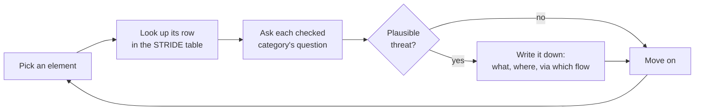

# Lecture 2 — The STRIDE Taxonomy

> **Duration:** ~2 hours. **Outcome:** You can name all six STRIDE categories, the security property each one violates, and which categories apply to which DFD element type — and you can run a full STRIDE-per-element pass against a real diagram, producing a named, specific threat for each cell that applies.

> **Framing, read first.** Every threat named in this lecture is identified against **your own isolated Juice Shop container**, for the purpose of enumerating it and pairing it with a defense. No exploitation happens this week — that's Weeks 3, 5, and 6, once you know exactly what you're testing for and why.

## 1. What STRIDE is, and why a mnemonic

Lecture 1 gave you a map. This lecture gives you the method for walking it systematically instead of by gut feeling. **STRIDE** is a mnemonic Microsoft introduced in the late 1990s for six categories of threat, each one named for the security property it violates:

| Letter | Category | Property violated | The question to ask |
|---|---|---|---|
| **S** | **Spoofing** | Authentication | Can someone pretend to be a user, process, or system they're not? |
| **T** | **Tampering** | Integrity | Can someone modify data or code without authorization? |
| **R** | **Repudiation** | Non-repudiation | Can someone perform an action and then credibly deny having done it, because nothing proves otherwise? |
| **I** | **Information disclosure** | Confidentiality | Can someone see data they shouldn't be able to see? |
| **D** | **Denial of service** | Availability | Can someone make the system (or a part of it) unavailable to legitimate users? |
| **E** | **Elevation of privilege** | Authorization | Can someone do something they shouldn't be allowed to do — gain capabilities beyond what was granted? |

Notice the pattern: STRIDE is just the *opposite* of six properties you want a secure system to have (authenticity, integrity, non-repudiation, confidentiality, availability, authorization — the last four of which extend the CIA triad from Week 1). That's what makes it systematic rather than creative: instead of brainstorming "what could an attacker do" from nothing, you take a fixed list of six properties and ask, for each element on your diagram, **"is this property at risk here?"**

## 2. STRIDE-per-element — the repeatable method

Applying all six letters to every element every time wastes effort, because not every category makes sense for every DFD element type. Microsoft's original guidance — still the standard approach — maps categories to element types:

| Element type | S | T | R | I | D | E |
|---|:---:|:---:|:---:|:---:|:---:|:---:|
| **External entity** | ✔ | | ✔ | | | |
| **Process** | ✔ | ✔ | ✔ | ✔ | ✔ | ✔ |
| **Data store** | | ✔ | ✔* | ✔ | ✔ | |
| **Data flow** | | ✔ | | ✔ | ✔ | |

*\* Repudiation applies to a data store when it's the store of record for audit/logging data itself — is the log tamper-evident?*

Read the table's shape, not just its checkmarks: **processes get all six**, because a process is where logic executes and every property can be violated by flawed logic. **External entities** only get Spoofing and Repudiation, because you don't control their internal behavior — you can only ask "can I be tricked about who this is" and "can they deny having sent something." **Data stores and data flows** never get Spoofing, because you don't authenticate *to* a data flow or *to* a database row — spoofing always targets an *actor* (a process or an entity), never inert data.

The method, then, is mechanical and that's the point:

1. Take your DFD (Lecture 1).
2. For each element, look up its row in the table above.
3. For each checked category, ask that category's question (Section 1) about that *specific* element.
4. If the answer is "yes, plausibly" — write down a threat. One sentence: what could happen, to which element, via which flow.
5. Move to the next element. Don't stop to design the fix yet — that's Lecture 3.

This is deliberately boring. Boring is the feature: a creative, unstructured "what could go wrong" session finds the threats you happen to think of. STRIDE-per-element finds the threats the *method* forces you to consider, including the unglamorous ones (Repudiation is the category most brainstorming sessions skip entirely — nobody free-associates their way to "what if nothing logs this?").

## 3. Walking the Juice Shop diagram, element by element

Apply the method to the DFD from Lecture 1. This isn't the complete list (Exercise 2 asks you to find more) — it's enough worked examples to show the pattern.

### External entity: Customer's Browser

- **Spoofing:** Can someone present another customer's session token as their own? *(Threat: if the JWT isn't bound to any other signal and is stored somewhere readable by other scripts on the page, a stolen token fully impersonates the customer.)*
- **Repudiation:** If a customer places an order and later claims they didn't, is there anything besides the order record itself to corroborate it? *(Threat: no separate audit trail of the request — IP, timestamp, user-agent — beyond the order row means "I never did that" is hard to refute or confirm.)*

### Process: `POST /rest/user/login`

This process gets all six — it's the richest single element on the diagram, and not by accident: login is where an anonymous external entity crosses the authentication trust boundary, which is exactly where Lecture 1 told you to expect the most threats.

- **Spoofing:** Can someone log in as another user without their real password? *(Threat: a login query that concatenates the submitted email/password into a SQL statement instead of using parameters allows an attacker to manipulate the query's logic itself — this is the same injection-class flaw Week 5 covers in depth; here we only need to *name* the threat, not exploit it.)*
- **Tampering:** Can the request be modified in transit or by the client in a way the server trusts blindly? *(Threat: a role or user-ID field trusted from client-supplied data — e.g., a JWT payload the server decodes without verifying its signature — lets a client tamper with its own claimed identity.)*
- **Repudiation:** Are failed and successful login attempts logged with enough detail (who, when, from where) to reconstruct an incident later? *(Threat: if only successes are logged, a string of failed attempts — a credential-stuffing signature — leaves no trace.)*
- **Information disclosure:** Does a failed login reveal *which part* was wrong? *(Threat: "invalid password" vs. "invalid email" as distinct error messages lets an attacker enumerate which emails have accounts at all, before ever guessing a password.)*
- **Denial of service:** Is there any limit on login attempts? *(Threat: an unthrottled login endpoint lets an attacker hammer it with credential-stuffing traffic or simply exhaust server resources, denying the endpoint to legitimate users.)*
- **Elevation of privilege:** Can a successful login as a normal user somehow yield admin-level claims? *(Threat: if the token-issuing code trusts a client-suppliable "role" field instead of looking the role up server-side from the `users` store, a crafted login request could mint itself admin privileges.)*

### Data store: Users table

- **Tampering:** Can stored password hashes or roles be modified other than through the intended, authorized code path? *(Threat: if any process other than the login/registration flow has write access to this table — e.g., a debug endpoint — that's an unintended tampering path.)*
- **Information disclosure:** If this store were read through an unintended path, what's exposed? *(Threat: password hashes stored with a fast, unsalted, or otherwise weak algorithm turn "the attacker read the table" into "the attacker now has everyone's password," not just "the attacker read some rows" — this is exactly why Week 7 covers password storage as its own topic.)*
- **Denial of service:** Can a flood of writes or an unindexed lookup path make this store slow enough to affect every process that depends on it? *(Threat: every process on this diagram reads or writes here — it's a single point of failure for availability, not just confidentiality.)*

### Data flow: browser → basket API (flow 8, crossing the authentication boundary)

- **Tampering:** Can the basket contents or price be modified by the client before the server trusts them? *(Threat: if the server trusts a client-submitted price instead of looking the authoritative price up from the `products` store server-side, a modified request changes what the customer pays.)*
- **Information disclosure:** Is this flow encrypted in transit? *(Threat: a plaintext flow between browser and server lets anyone positioned on the network path read the basket contents and the session token riding alongside it.)*

### Process: `/#/administration` (crossing the authorization boundary)

- **Elevation of privilege:** Does reaching this view require anything beyond "is logged in"? *(Threat: if the server-side route only checks for a valid session and never checks that the session's role is actually `admin`, any logged-in customer can reach the admin view by navigating to the URL directly — a **missing function-level access control** flaw, and one of the most common real-world findings in web applications. You'll fix exactly this class of bug in Week 6.)*
- **Information disclosure:** What does this process expose if the authorization check above fails? *(Threat: flow 12 on the Lecture 1 diagram reads the *entire* users table — a broken authorization check here doesn't leak one record, it leaks every customer's data at once.)*

## 4. The habit continues: every threat above gets a defense

Notice that Section 3 already started pairing threats with a defensive direction, in parentheses, even though full mitigation design is Lecture 3's job. That's not accidental — it's the same attacker/defender discipline from Week 1, applied at threat-*identification* time instead of after the fact. A STRIDE pass that only names threats and never sketches a direction for fixing them is half a threat model. Get in the habit now of writing, for every threat, at least a one-clause pointer toward its fix — "…because the query wasn't parameterized," "…because the role wasn't re-checked server-side" — even before Lecture 3 formalizes scoring and disposition.

*The whole method, looped over every element on the diagram. Mechanical on purpose — Lecture 3 is where judgment comes back in, at the scoring and mitigation step.*

## 5. Check yourself

- Name all six STRIDE letters, the property each violates, and the one-sentence question each asks.
- Why does an external entity never get a Tampering or Denial of Service check, while a process gets all six?
- Why does Spoofing never apply to a data flow or a data store?
- Walk the login process's six STRIDE questions from memory, using Section 3 as a check afterward — not before.
- What made the admin-panel Elevation of Privilege threat in Section 3 also produce a severe Information Disclosure threat? What does that tell you about why processes near a trust boundary tend to have "chained" threats?
- Why is it useful to jot a rough mitigation direction next to each threat *as you find it*, rather than waiting for a separate pass?

If those are automatic, Lecture 3 takes the (long, unranked) list STRIDE just produced and turns it into something a team can actually act on: a risk score per threat, a disposition, and a rule for knowing when your pass is good enough to stop.

## Further reading

- **Microsoft — "The STRIDE Threat Model":** <https://learn.microsoft.com/en-us/previous-versions/commerce-server/ee823878(v=cs.20)>
- **OWASP — Threat Modeling Cheat Sheet (STRIDE section):** <https://cheatsheetseries.owasp.org/cheatsheets/Threat_Modeling_Cheat_Sheet.html>
- **Adam Shostack, *Threat Modeling: Designing for Security* — publisher page (the book STRIDE-per-element practice is drawn from):** <https://shostack.org/books/threat-modeling-book>
- **OWASP Juice Shop — official vulnerability categories (for names, not exploit steps):** <https://pwning.owasp-juice.shop/companion-guide/latest/part2/challenges.html>
