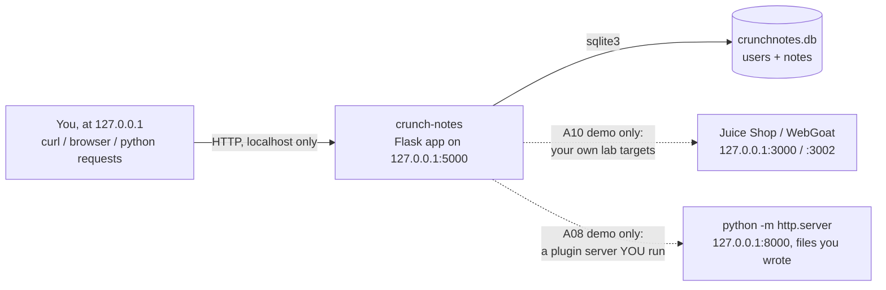

# Week 3 — The OWASP Top 10 in Depth

> **Goal:** by Sunday you can look at the OWASP Top 10 list and, for every single category, do four things from memory: recognize it as a concrete code pattern, demonstrate it in your own lab target, fix it at the source, and prove the fix with a re-test recorded in a database — not a slide of acronyms you can recite but never find.

Welcome back to **C50 · Crunch AppSec**. Week 1 gave you the vocabulary (assets, threats, risk). Week 2 gave you the method (STRIDE threat modeling — finding problems in a design before code exists). This week gives you the **industry's shared dictionary**: the OWASP Top 10, the ten vulnerability categories that show up, over and over, in real breaches, real bug bounty reports, and real code review. When a security engineer says "that's an A01," every other security engineer in the world knows roughly what they mean, roughly how bad it usually is, and roughly what the fix looks like. That shared shorthand is what you're building this week.

The Top 10 is not a checklist to memorize and forget — it's ten *patterns you learn to see in code*. This week you'll see every one of them twice: once as a short, readable snippet of vulnerable Python, and once as a live request/response against a real running app. Then you'll fix the snippet, re-run the request, and watch the flaw disappear. That demonstrate → remediate → re-test loop, recorded as structured evidence rather than a memory of "yeah I think I fixed that," is the actual day-to-day work of an application security engineer — and it's exactly what Weeks 4–7 dig into individually (authentication, injection, access control, and crypto each get a full week of their own later). This week's job is breadth with real depth on the highest-blast-radius three; later weeks go deep on each.

> **Ethics & legality — binding, every week.** All work below is **authorized, legal, defensive-minded** security practice performed **only inside the isolated lab** you built in Week 1 and the small app you'll build yourself in this week's setup — deliberately-vulnerable code you write, own, and run only on `127.0.0.1`, with no route to the internet or to any real third-party system. Every flaw demonstrated here is demonstrated **against your own local target**, and every single one is immediately paired with a source-level fix and a re-test — you never leave a category "shown but not fixed." Where this week references a real, publicly-known CVE or a real breach, that is historical/educational context, never a live target. Written authorization, defined scope, and the law govern every exercise this week and every week after it.

## Learning objectives

By the end of this week, you will be able to:

- **Name and explain** all ten OWASP Top 10 (2021) categories — what each one covers, roughly how common it is, and roughly how bad it tends to get.
- **Recognize each category as a code pattern**, not just a label — you can look at a route handler and say "that's A03" before you've even finished reading it.
- **Demonstrate** a representative flaw from each category against your own lab target and capture the request/response as evidence.
- **Remediate** each flaw at the source — in the actual Python, not by hiding the symptom — and **re-test** to prove the fix holds.
- **Record** every demonstrate/remediate/re-test cycle as structured rows in a SQL findings store, never a spreadsheet, so "what's still open" is one query away.

## Prerequisites

- **Week 1 completed** — your isolated `appsec-lab` Docker network is up (Juice Shop at `localhost:3000` is used again this week; DVWA and WebGoat are optional extras for the challenges).
- **Week 2 completed**, or at least comfortable with risk = likelihood × impact and reading a simple data-flow diagram — this week reuses that scoring, it doesn't re-teach it.
- Python 3.10+, `pip`, and `sqlite3` (ships with Python).
- Comfortable reading ~20-line Python functions and simple SQL. No prior AppSec experience beyond Weeks 1–2 assumed.

## The app you'll harden this week: `crunch-notes`

Every lecture, exercise, challenge, and the mini-project all point at the **same small app** — a Flask + SQLite notes service called `crunch-notes`. It is deliberately built to contain **exactly one clear, representative flaw from each of the ten OWASP categories**, so that by the end of the week you will have touched all ten, in one coherent codebase, instead of ten disconnected toy snippets.



Everything reachable from `crunch-notes` in this diagram is something *you* start on your own machine. Nothing here ever reaches out to a real third party.

### Set it up once (do this before Lecture 1)

```bash
mkdir -p crunch-notes && cd crunch-notes
python3 -m venv .venv && source .venv/bin/activate
```

`requirements.txt` — pinned to old versions **on purpose** (Lecture 3, Section 2 uses this):

```
Flask==0.12.2
Jinja2==2.10
requests==2.31.0
```

```bash
pip install -r requirements.txt
```

`schema.sql`:

```sql
CREATE TABLE users (
    id            INTEGER PRIMARY KEY,
    username      TEXT UNIQUE NOT NULL,
    password_hash TEXT NOT NULL,
    role          TEXT NOT NULL DEFAULT 'user'
);

CREATE TABLE notes (
    id         INTEGER PRIMARY KEY,
    user_id    INTEGER NOT NULL REFERENCES users(id),
    title      TEXT NOT NULL,
    body       TEXT NOT NULL,
    created_at TEXT NOT NULL DEFAULT (datetime('now'))
);
```

`seed.py`:

```python
import hashlib
import sqlite3

def md5(text):
    return hashlib.md5(text.encode()).hexdigest()

db = sqlite3.connect("crunchnotes.db")
db.executescript(open("schema.sql").read())
db.execute(
    "INSERT INTO users (id, username, password_hash, role) VALUES (1, 'alice', ?, 'user')",
    (md5("alice-pass"),),
)
db.execute(
    "INSERT INTO users (id, username, password_hash, role) VALUES (2, 'bob', ?, 'admin')",
    (md5("bob-pass"),),
)
db.execute(
    "INSERT INTO notes (id, user_id, title, body) VALUES "
    "(1, 1, 'Alice private thoughts', 'Q3 budget review notes, not for sharing.')"
)
db.execute(
    "INSERT INTO notes (id, user_id, title, body) VALUES "
    "(2, 2, 'Bob admin runbook', 'Rotate the deploy key on the 1st of every month.')"
)
db.commit()
db.close()
print("seeded crunchnotes.db")
```

`app.py` — the full app; each lecture below walks through one or more of its marked `# VULNERABLE` lines:

```python
import hashlib
import os
import pickle
import sqlite3

import requests
from flask import Flask, g, jsonify, request, session

app = Flask(__name__)
app.config["SECRET_KEY"] = "dev"  # VULNERABLE (A02) — weak, hardcoded, committed to source
DB_PATH = os.path.join(os.path.dirname(__file__), "crunchnotes.db")


def get_db():
    if "db" not in g:
        g.db = sqlite3.connect(DB_PATH)
        g.db.row_factory = sqlite3.Row
    return g.db


@app.teardown_appcontext
def close_db(exception=None):
    db = g.pop("db", None)
    if db is not None:
        db.close()


def md5(text):
    return hashlib.md5(text.encode()).hexdigest()  # VULNERABLE (A02) — fast, unsalted hash


@app.route("/login", methods=["POST"])
def login():
    username = request.form["username"]
    password = request.form["password"]
    db = get_db()
    row = db.execute("SELECT * FROM users WHERE username = ?", (username,)).fetchone()
    # VULNERABLE (A07) — no attempt counter, no lockout, no delay: brute-forceable forever
    if row is None or row["password_hash"] != md5(password):
        return jsonify(error="invalid credentials"), 401
    session["user_id"] = row["id"]
    session["username"] = row["username"]
    return jsonify(message=f"welcome {row['username']}")


@app.route("/notes")
def list_notes():
    if "user_id" not in session:
        return jsonify(error="login required"), 401
    db = get_db()
    rows = db.execute(
        "SELECT id, title FROM notes WHERE user_id = ?", (session["user_id"],)
    ).fetchall()
    return jsonify([dict(r) for r in rows])


@app.route("/notes/<note_id>")
def get_note(note_id):
    if "user_id" not in session:
        return jsonify(error="login required"), 401
    db = get_db()
    # VULNERABLE (A01) — no check that this note belongs to session['user_id']: IDOR
    row = db.execute("SELECT * FROM notes WHERE id = ?", (note_id,)).fetchone()
    if row is None:
        return jsonify(error="not found"), 404
    return jsonify(dict(row))


@app.route("/admin/users")
def admin_users():
    # VULNERABLE (A01) — checks login, never checks role: missing function-level access control
    if "user_id" not in session:
        return jsonify(error="login required"), 401
    db = get_db()
    rows = db.execute("SELECT id, username, role FROM users").fetchall()
    return jsonify([dict(r) for r in rows])


@app.route("/search")
def search_notes():
    if "user_id" not in session:
        return jsonify(error="login required"), 401
    q = request.args.get("q", "")
    db = get_db()
    # VULNERABLE (A03) — query built by string formatting, not parameterized: SQL injection
    sql = f"SELECT id, title FROM notes WHERE user_id = {session['user_id']} AND title LIKE '%{q}%'"
    rows = db.execute(sql).fetchall()
    return jsonify([dict(r) for r in rows])


@app.route("/notes/export")
def export_notes():
    # VULNERABLE (A04) — insecure design: no pagination and no size cap were ever designed in
    if "user_id" not in session:
        return jsonify(error="login required"), 401
    db = get_db()
    rows = db.execute(
        "SELECT title, body FROM notes WHERE user_id = ?", (session["user_id"],)
    ).fetchall()
    blob = "\n\n".join(f"# {r['title']}\n{r['body']}" for r in rows)
    return blob, 200, {"Content-Type": "text/plain"}


@app.route("/avatar")
def avatar():
    if "user_id" not in session:
        return jsonify(error="login required"), 401
    url = request.args.get("url")
    # VULNERABLE (A10) — server-side fetch of an attacker-supplied URL, no allowlist: SSRF
    resp = requests.get(url, timeout=5)
    ct = resp.headers.get("Content-Type", "application/octet-stream")
    return resp.content, resp.status_code, {"Content-Type": ct}


@app.route("/admin/install-plugin", methods=["POST"])
def install_plugin():
    if session.get("username") != "bob":
        return jsonify(error="admins only"), 403
    plugin_url = request.form["plugin_url"]
    resp = requests.get(plugin_url, timeout=5)
    # VULNERABLE (A08) — deserializes remote, unsigned content with pickle: arbitrary code execution
    plugin = pickle.loads(resp.content)
    return jsonify(message=f"installed plugin: {plugin}")


# NOTE (A09): search this file for "logging" — you won't find it. No auth failures, no
# admin actions, no exceptions are ever recorded anywhere. That absence is the vulnerability.

if __name__ == "__main__":
    # VULNERABLE (A05) — debug=True leaks source, environment, and an interactive shell
    # via the Werkzeug debugger to anyone who can reach a stack trace; no security headers set
    app.run(host="127.0.0.1", port=5000, debug=True)
```

```bash
python3 seed.py
python3 app.py
```

Sanity check — this should return `{"message":"welcome alice"}`:

```bash
curl -s -c cookies.txt -X POST http://127.0.0.1:5000/login -d "username=alice&password=alice-pass"
```

Ten flaws, one file, one category each — that's the map for the whole week:

| OWASP category | Where it lives in `crunch-notes` | Covered in |
|---|---|---|
| A01 Broken Access Control | `/notes/<note_id>` (IDOR), `/admin/users` (no role check) | Lecture 1 |
| A02 Cryptographic Failures | `md5()` password hashing, hardcoded `SECRET_KEY` | Lecture 2 |
| A03 Injection | `/search` (string-built SQL) | Lecture 2 |
| A04 Insecure Design | `/notes/export` (no pagination/size limit by design) | Lecture 2 |
| A05 Security Misconfiguration | `debug=True`, no security headers | Lecture 3 |
| A06 Vulnerable & Outdated Components | `requirements.txt` pins | Lecture 3 |
| A07 Identification & Authentication Failures | `/login` (no lockout), session cookie flags | Lecture 3 |
| A08 Software & Data Integrity Failures | `/admin/install-plugin` (`pickle.loads`) | Lecture 3 |
| A09 Logging & Monitoring Failures | absence of any logging, anywhere | Lecture 3 |
| A10 Server-Side Request Forgery | `/avatar?url=` | Lecture 3 |

## This week's map

Work top to bottom. Each piece assumes the ones before it.

| # | File | What's inside | ~Time |
|--:|------|---------------|------:|
| 1 | [lecture-notes/01-top-10-overview-and-access-control.md](./lecture-notes/01-top-10-overview-and-access-control.md) | How the Top 10 list is built and used; deep dive on A01 Broken Access Control — IDOR, missing function-level checks, the fixes | 2h |
| 2 | [lecture-notes/02-crypto-failures-injection-and-design.md](./lecture-notes/02-crypto-failures-injection-and-design.md) | A02 Cryptographic Failures, A03 Injection, A04 Insecure Design — each shown in code and remediated | 2h |
| 3 | [lecture-notes/03-the-remaining-risks.md](./lecture-notes/03-the-remaining-risks.md) | A05–A10 surveyed with a demo-and-fix for each | 2h |
| 4 | [exercises/exercise-01-demonstrate-access-control-flaw.md](./exercises/exercise-01-demonstrate-access-control-flaw.md) | Demonstrate the IDOR and the missing role check yourself, capture evidence, fix, re-test | 1.5h |
| 5 | [exercises/exercise-02-find-a-misconfiguration.md](./exercises/exercise-02-find-a-misconfiguration.md) | Trigger the debugger, check headers, fix `crunch-notes`'s misconfiguration | 1.5h |
| 6 | [exercises/exercise-03-log-findings-to-a-database.md](./exercises/exercise-03-log-findings-to-a-database.md) | Build the `findings` SQLite schema; load Exercises 1–2's results; query it | 1.5h |
| 7 | [challenges/challenge-01-full-top-10-sweep.md](./challenges/challenge-01-full-top-10-sweep.md) | Sweep OWASP Juice Shop for a representative flaw per category, far less hand-holding | 2h |
| 8 | [challenges/challenge-02-remediate-and-retest.md](./challenges/challenge-02-remediate-and-retest.md) | Remediate and re-test three `crunch-notes` flaws not already fixed in the exercises | 1.5h |
| 9 | [mini-project/README.md](./mini-project/README.md) | Full Top 10 evidence report on `crunch-notes`: demonstrate, remediate, re-test, and store all ten | 4h |
| 10 | [homework.md](./homework.md) | Extra practice, spread across the week | 5h |
| 11 | [quiz.md](./quiz.md) | 15 self-check questions + answer key | 1h |
| 12 | [resources.md](./resources.md) | Official docs, real tools, and the few links worth your time | — |

## Weekly schedule

Adds up to roughly **27.5 hours**. Treat it as a target, not a stopwatch.

| Day | Focus | Lectures | Exercises | Challenges | Quiz/Read | Homework | Mini-Project | Daily Total |
|-----------|------------------------------------------|---------:|----------:|-----------:|----------:|---------:|-------------:|------------:|
| Monday | Top 10 overview + A01 Broken Access Control | 2h | 1.5h | 0h | 0.5h | 1h | 0h | 5h |
| Tuesday | A02 Crypto, A03 Injection, A04 Insecure Design | 2h | 1.5h | 0h | 0.5h | 1h | 0h | 5h |
| Wednesday | A05–A10 survey; findings database | 2h | 1.5h | 0h | 0.5h | 1h | 0h | 5h |
| Thursday | Full Top 10 sweep of Juice Shop | 0h | 0h | 2h | 0.5h | 1h | 0.5h | 4h |
| Friday | Remediate and re-test three flaws | 0h | 0h | 1.5h | 0.5h | 1h | 1h | 4h |
| Saturday | Mini-project | 0h | 0h | 0h | 0h | 0h | 2.5h | 2.5h |
| Sunday | Quiz + review | 0h | 0h | 0h | 1h | 0h | 0h | 1h |
| **Total** | | **6h** | **4.5h** | **3.5h** | **3.5h** | **5h** | **4h** | **26.5h** |

## By the end of this week you can…

- Recite all ten OWASP Top 10 categories and, for each, give a one-sentence code-pattern description without looking it up.
- Read `crunch-notes/app.py` cold and point at ten distinct lines, each a different category — because you've now fixed every one of them yourself.
- Turn "I found a bug" into a demonstrate → remediate → re-test cycle, every time, with evidence, not a vague memory.
- Query your own findings store for "what's still open, ranked by risk" — because you stored it as data from the start, exactly like Weeks 1 and 2.
- Explain why A01, A02, and A03 got a full lecture each this week and why A04–A10 got a survey — and know that Weeks 4–7 return to authentication, injection, access control, and crypto in much greater depth.

## Up next

[Week 4 — Authentication: password storage, MFA, and session security](../week-04-authentication-passwords-mfa-and-sessions/) — this week you fixed `crunch-notes`'s login with a quick patch; next week you rebuild it properly, from password hashing algorithm choice through MFA to session-fixation defenses.

---

*Part of the Code Crunch Worldwide open curriculum · GPL-3.0 · If you find errors, please open an issue or PR.*
