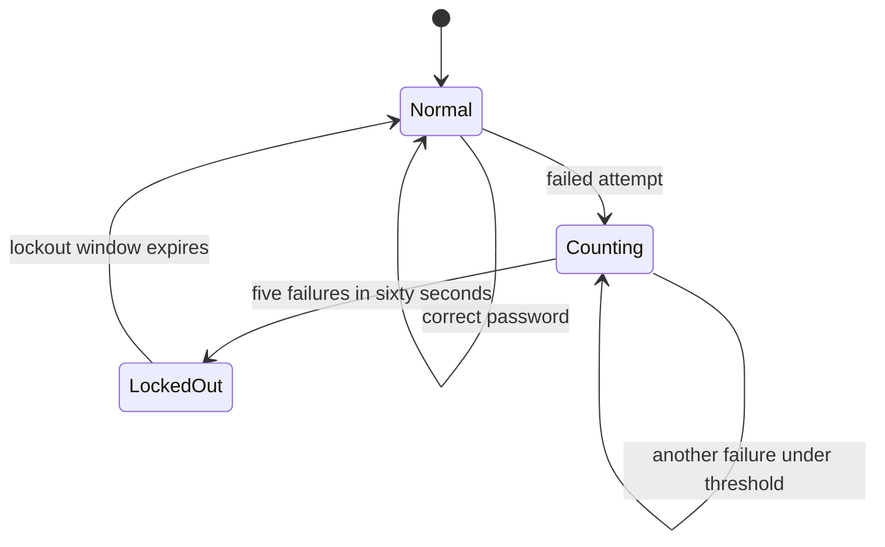
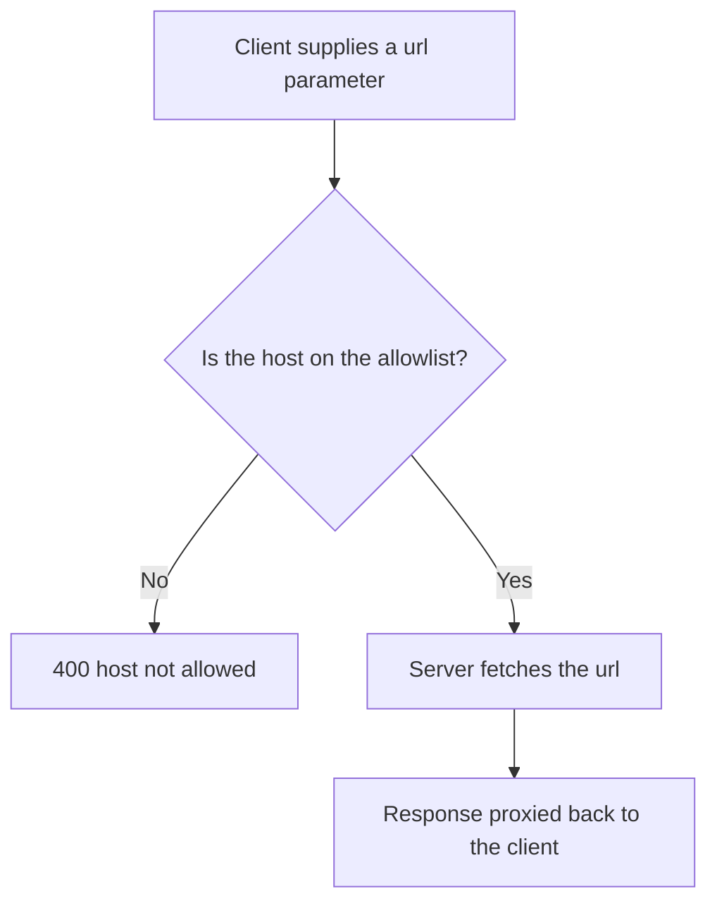

# Lecture 3 — The Remaining Risks: A05 Through A10

> **Duration:** ~2 hours. **Outcome:** You can define A05 through A10, recognize each as a code or configuration pattern, and you have demonstrated and fixed a representative flaw from each against `crunch-notes`.

Six categories, one demo-and-fix each. These get survey depth this week — Weeks 4–7 return to authentication (A07) and parts of injection/access-control/crypto in far greater depth — but "survey" does not mean "skip." Every flaw below is real, live, and fixable in `crunch-notes` right now.

## 1. A05 — Security Misconfiguration

**Security misconfiguration** covers any case where a secure setting existed and wasn't enabled, or an insecure default (built for development convenience) shipped somewhere it shouldn't have. It's one of the most common categories precisely because it requires no coding mistake at all — just an unchanged default.

`crunch-notes` has two, both in the app's startup line:

```python
if __name__ == "__main__":
    # VULNERABLE (A05) — debug=True leaks source, environment, and an interactive shell
    # via the Werkzeug debugger; no security headers set anywhere
    app.run(host="127.0.0.1", port=5000, debug=True)
```

**Demonstrate the debug leak** — trigger an unhandled exception and see what Flask's debug mode exposes:

```bash
# note_id isn't validated as an integer anywhere — pass something that breaks the query
curl -s -b alice.txt "http://127.0.0.1:5000/notes/not-a-number"
```

With `debug=True`, this doesn't return a clean error — it returns the interactive **Werkzeug debugger**: a full HTML page showing the exact source file and line that raised the exception, every local variable's value at that point (including, in a real app, things like database connection strings or the contents of `session`), and — if you reach it from a browser rather than `curl` — a live Python console you can execute arbitrary code in, right there in the response. This is not a hypothetical; leaving `debug=True` reachable outside a developer's own laptop is a real, repeated cause of full remote code execution in production Flask apps.

**Demonstrate the missing headers:**

```bash
curl -s -I http://127.0.0.1:5000/notes
```

Compare that to what a hardened response should include: `X-Content-Type-Options: nosniff` (stops the browser from guessing content types in a way that can enable an XSS), `X-Frame-Options: DENY` (stops the page from being embedded in another site's clickjacking iframe), and a `Content-Security-Policy`. `crunch-notes` sets none of them.

**Remediate it:**

```python
@app.after_request
def set_security_headers(response):
    response.headers["X-Content-Type-Options"] = "nosniff"
    response.headers["X-Frame-Options"] = "DENY"
    response.headers["Content-Security-Policy"] = "default-src 'self'"
    return response


if __name__ == "__main__":
    debug_mode = os.environ.get("CRUNCH_NOTES_DEBUG", "false").lower() == "true"
    app.run(host="127.0.0.1", port=5000, debug=debug_mode)  # default OFF; opt in locally only
```

**Re-test:** with `CRUNCH_NOTES_DEBUG` unset, re-run the same malformed request — it must now return a generic 500 with no source, no locals, and no console. Re-run `curl -I` and confirm all three headers are present.

## 2. A06 — Vulnerable and Outdated Components

**Vulnerable and outdated components** covers any case where your application ships a dependency with a publicly known vulnerability. This is the category with the least code involved and the most process involved — the fix is almost never "write different code," it's "know what you're running and keep it current."

`crunch-notes`'s `requirements.txt` pins deliberately old versions:

```
Flask==0.12.2
Jinja2==2.10
requests==2.31.0
```

**Demonstrate it** with a real, free, offline-capable auditing tool rather than trusting memory of which CVE applies to which version — this is the actual professional workflow, and it's more reliable than any human recalling CVE numbers:

```bash
pip install pip-audit
pip-audit -r requirements.txt
```

`pip-audit` cross-references your exact pinned versions against the Python Packaging Advisory Database and prints every matching, publicly disclosed vulnerability with its advisory ID and a description — for both `Flask==0.12.2` and `Jinja2==2.10` you should see real findings. Read what it reports; the specific CVE identifiers change as the advisory database is updated, which is exactly why you run the tool instead of memorizing a number.

**Remediate it** by upgrading to current, supported versions and re-auditing:

```
Flask==3.0.3
Jinja2==3.1.4
requests==2.31.0
```

```bash
pip install -r requirements.txt --upgrade
pip-audit -r requirements.txt
```

**Re-test:** `pip-audit` must now report no known vulnerabilities for the pinned versions. This is also why A06 needs a **recurring** process, not a one-time fix — a version that's clean today can have a new CVE published against it next month. Real teams run `pip-audit` (or `npm audit`, `safety`, or a dependency-scanning tool built into their CI, previewed in Week 8) on every build, not once at project kickoff.

## 3. A07 — Identification and Authentication Failures

**Identification and authentication failures** cover weaknesses in how an application confirms *who* is making a request — weak or missing brute-force protection, session tokens that don't expire or aren't invalidated on logout, and session cookies missing the flags that protect them from theft. Week 4 rebuilds authentication from the ground up; this section demonstrates the two failures already sitting in `crunch-notes`.

**Failure 1 — no lockout on `/login`:**

```python
@app.route("/login", methods=["POST"])
def login():
    username = request.form["username"]
    password = request.form["password"]
    db = get_db()
    row = db.execute("SELECT * FROM users WHERE username = ?", (username,)).fetchone()
    # VULNERABLE (A07) — no attempt counter, no lockout, no delay: brute-forceable forever
    if row is None or row["password_hash"] != md5(password):
        return jsonify(error="invalid credentials"), 401
```

**Demonstrate it** with a small, local, rate-limited script — proving the *absence* of a defense, not running a real attack against a real account:

```python
import requests

guesses = ["password", "123456", "alice", "alice-pass", "letmein"]
for guess in guesses:
    r = requests.post(
        "http://127.0.0.1:5000/login", data={"username": "alice", "password": guess}
    )
    print(guess, r.status_code)
```

Every one of those five requests is accepted or rejected instantly, with no growing delay, no CAPTCHA, and no lockout after repeated failures — an automated version of this script can try thousands of guesses per minute against a real deployment, limited only by network latency.

**Remediate it** with a simple in-memory (for the lab; Week 4 covers a persistent, multi-instance-safe version) attempt counter:

```python
from collections import defaultdict
import time

FAILED_ATTEMPTS = defaultdict(list)
LOCKOUT_THRESHOLD = 5
LOCKOUT_WINDOW_SECONDS = 60

@app.route("/login", methods=["POST"])
def login():
    username = request.form["username"]
    password = request.form["password"]
    now = time.time()
    FAILED_ATTEMPTS[username] = [t for t in FAILED_ATTEMPTS[username] if now - t < LOCKOUT_WINDOW_SECONDS]
    if len(FAILED_ATTEMPTS[username]) >= LOCKOUT_THRESHOLD:
        return jsonify(error="too many attempts, try again later"), 429

    db = get_db()
    row = db.execute("SELECT * FROM users WHERE username = ?", (username,)).fetchone()
    if row is None or not check_password_hash(row["password_hash"], password):
        FAILED_ATTEMPTS[username].append(now)
        return jsonify(error="invalid credentials"), 401
    session["user_id"] = row["id"]
    session["username"] = row["username"]
    return jsonify(message=f"welcome {row['username']}")
```


*The fixed login route tracks failures per username and locks the account out for a rolling time window instead of allowing unlimited guesses.*

**Failure 2 — session cookie missing hardening flags.** Inspect the cookie Flask issued:

```bash
curl -sD - -o /dev/null -X POST http://127.0.0.1:5000/login -d "username=alice&password=alice-pass" | grep -i set-cookie
```

By default the cookie lacks `Secure` (would restrict it to HTTPS-only transmission — fine for this HTTP-only lab, but a real gap over the open internet) and doesn't set `SameSite=Lax`/`Strict` explicitly. Remediate with explicit config:

```python
app.config["SESSION_COOKIE_HTTPONLY"] = True     # JavaScript can never read the cookie
app.config["SESSION_COOKIE_SAMESITE"] = "Lax"     # blocks it being sent on most cross-site requests
app.config["SESSION_COOKIE_SECURE"] = True        # HTTPS-only — enable once you're actually on HTTPS
```

**Re-test:** re-run the brute-force script — after 5 failures within 60 seconds it must return `429` for every subsequent attempt, then succeed again once the window passes. Re-run the `grep -i set-cookie` check and confirm `HttpOnly` and `SameSite=Lax` are present.

## 4. A08 — Software and Data Integrity Failures

**Software and data integrity failures** cover any case where code or data is trusted and executed/used without verifying it came from where it claims to, or wasn't tampered with in transit. Insecure deserialization — trusting untrusted bytes to reconstruct into live objects — is the highest-impact example on the list, and `crunch-notes` has a real one:

```python
@app.route("/admin/install-plugin", methods=["POST"])
def install_plugin():
    if session.get("username") != "bob":
        return jsonify(error="admins only"), 403
    plugin_url = request.form["plugin_url"]
    resp = requests.get(plugin_url, timeout=5)
    # VULNERABLE (A08) — deserializes remote, unsigned content with pickle: arbitrary code execution
    plugin = pickle.loads(resp.content)
    return jsonify(message=f"installed plugin: {plugin}")
```

Python's `pickle` format is not just data — it can encode instructions to construct arbitrary objects, including a call to `os.system`. Anything that reaches `pickle.loads()` on bytes it doesn't fully control is a code-execution vulnerability, not a data-parsing one, regardless of the `if session.get("username") != "bob"` check above it — that check gates who can *reach* the route, it does nothing about what the route then does with unsigned, attacker-influenced content.

**Demonstrate it — entirely locally, no network egress, proving the mechanism without touching anything you don't own.** Craft a harmless payload that proves code execution by writing a marker file, then serve it from a plain local HTTP server you start yourself:

```python
# make_evil_pickle.py — run this yourself, in your own lab, to build the proof
import pickle

class Evil:
    def __reduce__(self):
        # __reduce__ is pickle's legitimate hook for "how do I rebuild this object" —
        # this is exactly the mechanism that makes untrusted unpickling dangerous
        return (open, ("pwned.txt", "w"))

with open("evil.pkl", "wb") as f:
    pickle.dump(Evil(), f)
```

```bash
python3 make_evil_pickle.py
python3 -m http.server 8000 &      # serves evil.pkl from 127.0.0.1:8000, a server YOU own

curl -s -c bob.txt -X POST http://127.0.0.1:5000/login -d "username=bob&password=bob-pass"
curl -s -b bob.txt -X POST http://127.0.0.1:5000/admin/install-plugin \
  -d "plugin_url=http://127.0.0.1:8000/evil.pkl"

ls pwned.txt   # if this file exists, arbitrary code ran on the server via a "plugin install"
```

The `__reduce__` payload above only opens a file — a deliberately harmless proof. Left unfixed, the same mechanism lets an attacker supply a pickle that runs `os.system("...")` with any command they choose, with the full privileges of the Flask process.

**Remediate it** — never deserialize untrusted data with `pickle`. Use a data-only format like `json`, which cannot encode executable behavior:

```python
import json

@app.route("/admin/install-plugin", methods=["POST"])
def install_plugin():
    denial = require_role("admin")
    if denial:
        return denial
    plugin_url = request.form["plugin_url"]
    resp = requests.get(plugin_url, timeout=5)
    plugin = json.loads(resp.content)  # data only — cannot construct arbitrary objects
    return jsonify(message=f"installed plugin: {plugin}")
```

**Re-test:** repeat the demonstration with `evil.pkl`. `json.loads()` on pickle-formatted bytes raises `json.JSONDecodeError` instead of executing anything — confirm `pwned.txt` is not created. Then confirm a legitimate plugin descriptor (`{"name": "spellcheck", "version": "1.0"}` served the same way) still installs successfully.

## 5. A09 — Security Logging and Monitoring Failures

**Security logging and monitoring failures** cover the case where an attack succeeds — or is attempted and fails — and no record exists anywhere that would let a human or a system notice. This is the one category `crunch-notes` demonstrates by *absence* rather than a specific bad line:

```bash
grep -c "logging\." app.py    # 0 — there is no logging import, call, or audit trail anywhere
```

Every failed login (Section 3's brute-force script), every 403 from the access-control fixes (Lecture 1), every exception the debugger caught (Section 1) happened with **zero trace left behind**. In a real incident, this is the difference between "we found the breach in our logs three hours after it started" and "we found out from a customer, or a journalist, or never."

**Remediate it** with structured logging to a queryable store — SQLite, consistent with this course's data-tooling rule, not a scrolling text file nobody greps until it's too late:

```python
import logging
import sqlite3
import time

logging.basicConfig(level=logging.INFO)

def log_security_event(event_type, username, detail=""):
    db = sqlite3.connect(DB_PATH)
    db.execute(
        "CREATE TABLE IF NOT EXISTS security_events "
        "(id INTEGER PRIMARY KEY, ts TEXT, event_type TEXT, username TEXT, detail TEXT)"
    )
    db.execute(
        "INSERT INTO security_events (ts, event_type, username, detail) VALUES (?, ?, ?, ?)",
        (time.strftime("%Y-%m-%dT%H:%M:%SZ", time.gmtime()), event_type, username, detail),
    )
    db.commit()
    db.close()
    logging.info("security_event type=%s user=%s detail=%s", event_type, username, detail)
```

Call it at every point that matters — a failed login, a lockout trigger, a 403 from `require_role`:

```python
if row is None or not check_password_hash(row["password_hash"], password):
    FAILED_ATTEMPTS[username].append(now)
    log_security_event("login_failed", username)
    return jsonify(error="invalid credentials"), 401
```

**Re-test:** repeat a few failed logins and a blocked admin-route request, then query the evidence directly instead of trusting that it happened:

```bash
sqlite3 crunchnotes.db "SELECT event_type, username, ts FROM security_events ORDER BY id DESC LIMIT 5;"
```

Confirm each attempt produced exactly one row. A logging fix that isn't queryable isn't really fixed — the whole point is that "did anyone try to break in this week" becomes a `SELECT`, not an archaeology project.

## 6. A10 — Server-Side Request Forgery (SSRF)

**SSRF** happens when an application makes a server-side HTTP request to a destination that an attacker controls or influences, letting the attacker use the *server's* network position — often with access to internal-only services a browser could never reach directly — as a proxy.

```python
@app.route("/avatar")
def avatar():
    if "user_id" not in session:
        return jsonify(error="login required"), 401
    url = request.args.get("url")
    # VULNERABLE (A10) — server-side fetch of an attacker-supplied URL, no allowlist: SSRF
    resp = requests.get(url, timeout=5)
    ct = resp.headers.get("Content-Type", "application/octet-stream")
    return resp.content, resp.status_code, {"Content-Type": ct}
```

The feature's intent is harmless — "fetch my avatar image from a URL I paste in" — but the implementation lets `url` be *anything*, including addresses that are only reachable from the server's own network position, not from the public internet.

**Demonstrate it** against your own Week 1 lab, still running on the same isolated Docker network — proving `crunch-notes` can be tricked into reaching a service that has nothing to do with avatars:

```bash
curl -s -b alice.txt "http://127.0.0.1:5000/avatar?url=http://127.0.0.1:3000/rest/admin/application-version"
```

Instead of an image, `crunch-notes` faithfully proxies back Juice Shop's internal application-version API response — proof that the "avatar fetcher" can be repurposed to reach any service the server can see, including ones that were never meant to be internet-facing. In a real deployment, the equivalent request often targets cloud metadata endpoints or internal admin panels with no authentication of their own, because they were built assuming only trusted internal callers could ever reach them.

**Remediate it** with a strict allowlist — never a blocklist, which is always incomplete:

```python
from urllib.parse import urlparse

ALLOWED_AVATAR_HOSTS = {"images.example-cdn.test"}  # the only hosts avatars may ever come from

@app.route("/avatar")
def avatar():
    if "user_id" not in session:
        return jsonify(error="login required"), 401
    url = request.args.get("url", "")
    host = urlparse(url).hostname
    if host not in ALLOWED_AVATAR_HOSTS:
        return jsonify(error="host not allowed"), 400
    resp = requests.get(url, timeout=5)
    ct = resp.headers.get("Content-Type", "application/octet-stream")
    return resp.content, resp.status_code, {"Content-Type": ct}
```


*An allowlist stops the server from being tricked into acting as a proxy into its own internal network.*

**Re-test:** re-run the exact Juice Shop request from above — it must now return `{"error":"host not allowed"}` with a 400, not the proxied response. A blocklist approach ("reject `127.0.0.1`, reject `localhost`") is not an acceptable substitute — it can always be bypassed (`127.1`, a DNS name that resolves to `127.0.0.1`, an IPv6 loopback form) and it grows a new exception every time someone finds the next bypass. An allowlist has no such gap: anything not explicitly permitted is refused, matching the deny-by-default principle from Lecture 1.

## 7. Check yourself

- Why does `pip-audit` matter more than trying to memorize which package versions are vulnerable?
- What two cookie flags harden a session cookie against theft and cross-site misuse, and what does each one specifically stop?
- Why is `pickle.loads()` on remote content fundamentally different from `json.loads()` on the same content, from a security standpoint?
- What makes A09 different from every other category this week — what's actually "broken" when the failure is an absence of logging?
- Why is an allowlist the correct fix for SSRF and a blocklist not, even a well-intentioned one?

You've now demonstrated and fixed all ten categories once. Exercises 1–3 have you repeat two of them yourself, unassisted, and build the findings database that makes every future finding queryable instead of anecdotal.

## Further reading

- **OWASP Top 10:2021 — A05 through A10** (one page per category): <https://owasp.org/Top10/>
- **`pip-audit` (PyPA official tool):** <https://github.com/pypa/pip-audit>
- **OWASP Cheat Sheet — Server-Side Request Forgery Prevention:** <https://cheatsheetseries.owasp.org/cheatsheets/Server_Side_Request_Forgery_Prevention_Cheat_Sheet.html>
- **OWASP Cheat Sheet — Deserialization:** <https://cheatsheetseries.owasp.org/cheatsheets/Deserialization_Cheat_Sheet.html>
- **OWASP Cheat Sheet — Logging:** <https://cheatsheetseries.owasp.org/cheatsheets/Logging_Cheat_Sheet.html>
