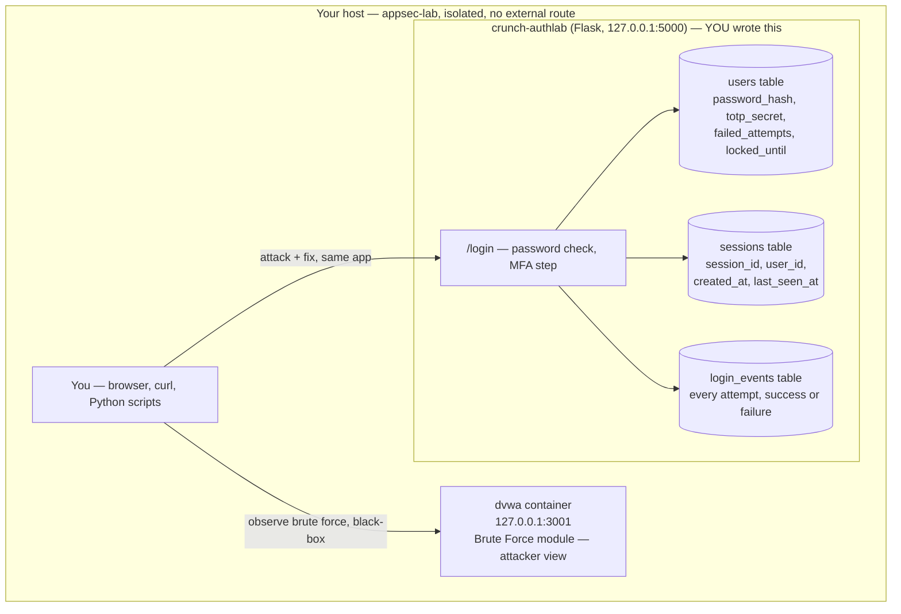

# Week 4 — Authentication & Session Security

> **Goal:** by Sunday you've taken a login flow you built with your own hands from "plaintext passwords, no rate limit, no MFA, a guessable session ID" to "argon2id, locked-out brute force, working TOTP, and a session cookie that survives fixation and hijacking attempts" — and you can point at your own attack script and your own fix for every single change.

Welcome back to **C50 · Crunch AppSec**. Weeks 1–3 gave you the mindset, the method, and the map (the OWASP Top 10). This week you go deep on the single most attacked surface in almost every application: **the login.** Authentication answers "who are you," and session management answers "how do I keep believing you, request after request, without asking again." Get either wrong and every other control in the app is decoration — an attacker who owns the session owns the account, full stop.

This week is different from Weeks 1–3 in one important way: you don't just attack an existing target, you **build the target yourself.** You'll write `crunch-authlab` — a small, real Flask + SQLite login app — deliberately broken the way real logins are broken (plaintext passwords, no lockout, a predictable session token), and then you'll harden it, feature by feature, proving each fix against the attack it closes. That's the attacker/defender habit from Week 1, but this time the code you're defending is code you wrote.

> **Ethics & legality — binding, every week.** Everything below is **authorized, legal, defensive-minded** security work performed **only inside your isolated `appsec-lab`** from Week 1 — against `crunch-authlab`, an app **you write and own**, and against **DVWA's Brute Force module**, a deliberately-vulnerable lab target already running on your isolated Docker network with no route to the internet or to any real system. You will never be given instructions aimed at a login you don't own or don't have explicit written authorization to test. Cracking, brute-forcing, and hijacking are demonstrated **only** against your own fictional lab accounts, and every offensive technique this week is immediately paired with the detection query and the source-level fix that defeats it. Written authorization, defined scope, and the law govern every exercise this week and every week after it.

## Learning objectives

By the end of this week, you will be able to:

- **Store passwords** with a modern slow hash (argon2id via `argon2-cffi`, with bcrypt as the fallback) and a unique per-user salt — and explain, from the algorithm up, why a fast hash (MD5/SHA-256) and plaintext both fail.
- **Defend against credential stuffing and brute force** with per-account lockout, per-IP rate limiting, and a database of login events you can actually query for attack patterns.
- **Add MFA** (TOTP, RFC 6238) to a login flow, explain what threat each authentication factor closes, and name the pitfalls (SIM swap on SMS OTP, phishable OTP, unhashed recovery codes) that undo it if you're careless.
- **Manage sessions** to resist fixation, hijacking, and CSRF — session ID entropy, cookie flags (`HttpOnly`, `Secure`, `SameSite`), ID rotation on privilege change, idle and absolute timeout, and a logout that actually invalidates server-side state.
- **Detect authentication attacks from logs** — write SQL against a `login_events` table to tell a brute-force pattern from a credential-stuffing pattern from normal failed logins.

## Prerequisites

- **Week 1 completed** — your isolated `appsec-lab` Docker network is up, with DVWA reachable at `127.0.0.1:3001` and its database initialized (`/setup.php` → "Create / Reset Database").
- **Week 3 (OWASP Top 10)** helpful but not required — this week is a deep dive on A07:2021 (Identification and Authentication Failures), the one Top 10 category Week 3 only introduced.
- Python 3.10+, `pip`, and `sqlite3` (ships with Python). A code editor. Basic Flask familiarity helps but isn't assumed — the exercises hand you the starting code.
- Comfortable with the terminal and reading a stack trace without panicking.

## This week's lab: `crunch-authlab`

You build this app in Exercise 1 and hardened versions of it carry through the rest of the week and into the mini-project. It is a single Flask process talking to a single SQLite file — small enough to read end to end, real enough that every fix is a fix you'd recognize in production code.

Two roles, on purpose: **DVWA's Brute Force module** (already running from Week 1) is the black-box "attacker view" — you hammer a login you don't control the source of, the way a real attacker would. **`crunch-authlab`** is the white-box "defender view" — code you control end to end, where every fix this week is a diff you write and can explain line by line.

## This week's map

Work top to bottom. Each piece assumes the ones before it.

| # | File | What's inside | ~Time |
|--:|------|---------------|------:|
| 1 | [lecture-notes/01-password-storage-and-attacks.md](./lecture-notes/01-password-storage-and-attacks.md) | Why plaintext and fast hashes fail; salting; argon2id/bcrypt; offline cracking and credential stuffing, demonstrated and detected | 2h |
| 2 | [lecture-notes/02-mfa-and-authentication-flows.md](./lecture-notes/02-mfa-and-authentication-flows.md) | TOTP internals, WebAuthn/FIDO2, recovery codes; SIM swap and phishable-OTP pitfalls | 2h |
| 3 | [lecture-notes/03-session-management-security.md](./lecture-notes/03-session-management-security.md) | Session tokens vs. JWTs, cookie flags, fixation, hijacking, CSRF, timeout, real logout | 2h |
| 4 | [exercises/exercise-01-break-and-fix-password-storage.md](./exercises/exercise-01-break-and-fix-password-storage.md) | Build `crunch-authlab` v0 (plaintext), crack it, then rebuild storage on argon2id | 1.5h |
| 5 | [exercises/exercise-02-add-totp-mfa.md](./exercises/exercise-02-add-totp-mfa.md) | Add TOTP enrollment and verification to the login flow, plus hashed recovery codes | 1.5h |
| 6 | [exercises/exercise-03-harden-session-cookies.md](./exercises/exercise-03-harden-session-cookies.md) | Fix session ID entropy, cookie flags, fixation, timeout, and a real logout | 1.5h |
| 7 | [challenges/challenge-01-defend-credential-stuffing.md](./challenges/challenge-01-defend-credential-stuffing.md) | Write and prove a rate-limit + lockout defense against your own stuffing script | 1.5h |
| 8 | [challenges/challenge-02-audit-a-login-flow.md](./challenges/challenge-02-audit-a-login-flow.md) | Given a login flow's source, find every A07 flaw and write the findings up | 1.5h |
| 9 | [mini-project/README.md](./mini-project/README.md) | Harden `crunch-authlab` end to end and prove every fix against the original attack | 3h |
| 10 | [homework.md](./homework.md) | Extra practice, spread across the week | 5h |
| 11 | [quiz.md](./quiz.md) | 15 self-check questions + answer key | 1h |
| 12 | [resources.md](./resources.md) | Official docs, RFCs, and the few links worth your time | — |

## Weekly schedule

Adds up to roughly the course's full-time pace of **~28 hours**. Treat it as a target, not a stopwatch.

| Day | Focus | Lectures | Exercises | Challenges | Quiz/Read | Homework | Mini-Project | Daily Total |
|-----------|------------------------------------------|---------:|----------:|-----------:|----------:|---------:|-------------:|------------:|
| Monday | Password storage & attacks | 2h | 1.5h | 0h | 0.5h | 1h | 0h | 5h |
| Tuesday | MFA & authentication flows | 2h | 1.5h | 0h | 0.5h | 1h | 0h | 5h |
| Wednesday | Session management security | 2h | 1.5h | 0h | 0.5h | 1h | 0h | 5h |
| Thursday | Credential-stuffing defense | 0h | 0h | 1.5h | 0.5h | 1h | 0.5h | 3.5h |
| Friday | Audit a full login flow | 0h | 0h | 1.5h | 0.5h | 1h | 0.5h | 3.5h |
| Saturday | Mini-project | 0h | 0h | 0h | 0h | 0h | 2h | 2h |
| Sunday | Quiz + review | 0h | 0h | 0h | 1h | 0h | 0h | 1h |
| **Total** | | **6h** | **4.5h** | **3h** | **3.5h** | **5h** | **3h** | **28h** |

## By the end of this week you can…

- Look at any password column and say, from the hash prefix alone, whether it's safe (`$argon2id$…`, `$2b$…`) or a liability (plaintext, MD5, unsalted SHA-256) — and migrate it without forcing a mass password reset.
- Write a rate-limit and lockout policy that stops both credential stuffing (many usernames, one attacker) and brute force (one username, many guesses) without locking out your own legitimate users.
- Add TOTP MFA to a real login flow and explain, factor by factor, which threats it closes and which it doesn't.
- Configure a session cookie so that `document.cookie` in a browser console can't read it, a network sniff on plain HTTP can't steal it usefully, and a stolen pre-login session ID is worthless after the user authenticates.
- Query a `login_events` table in SQL and tell a credential-stuffing attack from a brute-force attack from an ordinary user who forgot their password.

## Up next

[Week 5 — Injection & input validation](../week-05-injection-and-input-validation/) — you've locked down *who* gets in; next week is about never trusting *what* they send you once they're in the door.

---

*Part of the Code Crunch Worldwide open curriculum · GPL-3.0 · If you find errors, please open an issue or PR.*
