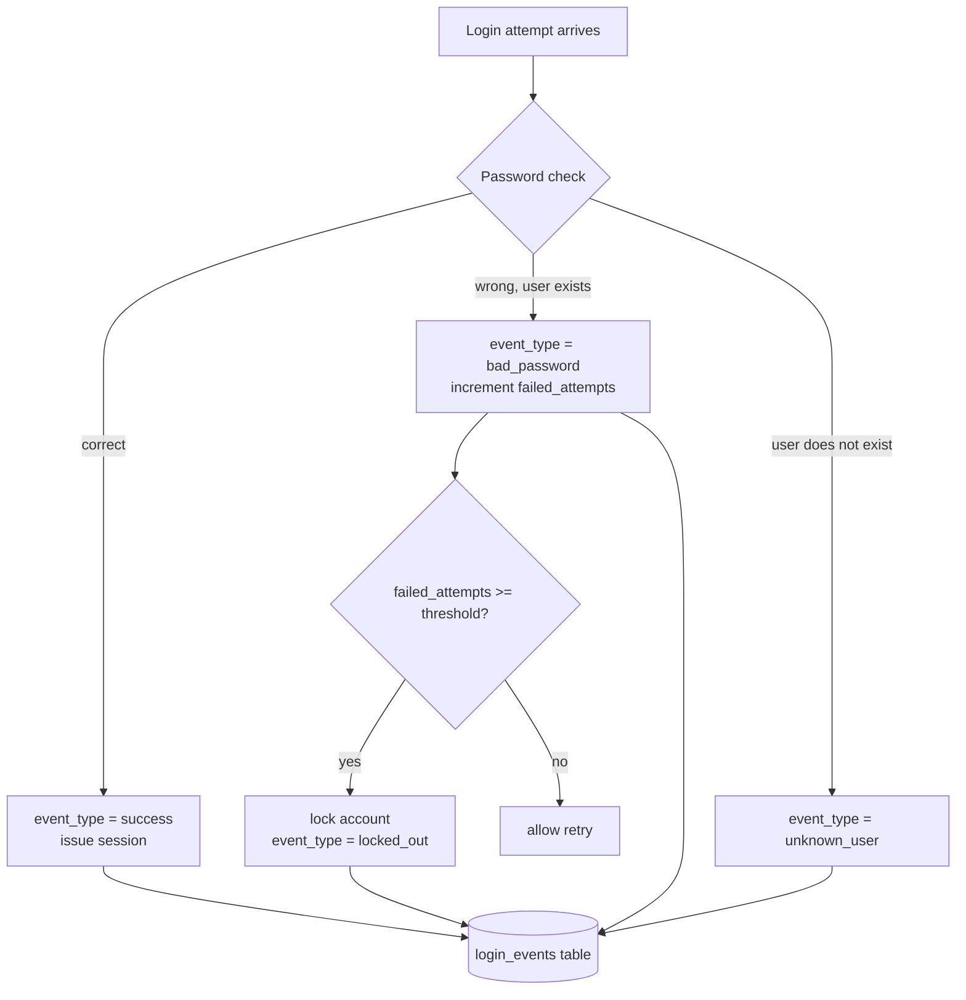

# Lecture 1 — Password Storage & Attacks

> **Duration:** ~2 hours. **Outcome:** You can explain, from first principles, why plaintext and fast-hash password storage both fail; store passwords with argon2id and a per-user salt; migrate an existing user table without forcing a mass reset; and tell a brute-force login pattern from a credential-stuffing pattern in a table of login events.

> **Lab reminder.** Every attack in this lecture runs against **fictional accounts you create yourself** in `crunch-authlab` (your own app, your own SQLite file) or against **DVWA's Brute Force module** on your isolated `appsec-lab` network from Week 1. Nothing here is aimed at a login you don't own.

## 1. The one column that ends every breach headline

Read enough breach post-mortems and a pattern jumps out: the database gets exfiltrated (via SQL injection, a misconfigured backup, an insider, a leaked credential — the *how* varies), and then the headline turns on one question: **how were the passwords stored?** If the answer is "plaintext" or "MD5," every one of those users is compromised, immediately, at every other site where they reused the password — which, by every large-scale study, is most of them. If the answer is "argon2id with per-user salts," the breach is still bad (usernames, emails, metadata are out), but the passwords themselves buy the defenders time and, for most users, hold.

This lecture is about making sure your app is always in the second case.

## 2. Plaintext: the failure mode that needs no attack

```sql
-- crunch-authlab v0 — never do this
SELECT username, password_hash FROM users WHERE username = 'grace';
-- password_hash = 'CorrectHorseBattery1'
```

If the column literally holds the password, there is no "cracking" step — a breach *is* a full credential dump. This sounds too obviously bad to need saying, and yet it is still found in real audits, usually via one of two paths: a developer says "we'll hash it later" and later never comes, or a support tool needs to "look up" a user's password for a helpdesk flow (a **process** failure disguised as a storage one — the right fix is a password *reset* flow, never a password *lookup* flow). If you ever see a "forgot password" email that contains your actual current password, that service is storing it in a form it can recover — plaintext or reversible encryption — and you should assume it's one breach away from a full dump.

## 3. Fast hashes: better than plaintext, still broken

The next instinct is "hash it" — and a fast general-purpose hash (MD5, SHA-1, plain SHA-256) genuinely does stop the *literal* plaintext-in-the-database problem. It does not stop the attack that actually matters: **offline guessing.**

A cryptographic hash like SHA-256 is designed to be *fast* — that's a feature for checksums and a liability for passwords. Modern GPU/ASIC hardware computes billions of SHA-256 hashes per second. Once an attacker has your `password_hash` column, they don't need your server at all — they hash guesses **offline**, on hardware they control, at whatever rate their budget buys, with no rate limit, no lockout, and no logging on your end to see it happening.

```python
# A tiny, honest demonstration — hashing SPEED, not a full cracking rig.
# Run this against a hash YOU generated from a lab password YOU chose.
import hashlib, time

target = hashlib.sha256(b"letmein123").hexdigest()   # a password you picked, for this demo only
wordlist = ["password", "123456", "letmein123", "qwerty", "dragon"]

start = time.perf_counter()
for guess in wordlist:
    if hashlib.sha256(guess.encode()).hexdigest() == target:
        print(f"cracked: {guess!r} in {time.perf_counter() - start:.6f}s")
        break
```

That loop checks five guesses in well under a millisecond on an ordinary laptop CPU — no GPU required. Real cracking rigs (`hashcat` against real hardware) push **billions** of SHA-256 guesses per second; against a 10-million-word dictionary plus common mangling rules (capitalize, append digits, leetspeak), an unsalted fast hash of a weak-to-medium password is not a question of *if*, it's a question of *how many seconds*.

### 3.1 Why salting alone isn't enough

A **salt** is random data, unique per user, stored alongside the hash and mixed in before hashing: `hash(salt || password)`. Salting defeats two specific attacks — **rainbow tables** (precomputed hash→password lookup tables, which only work because unsalted identical passwords produce identical hashes) and **cross-user batch cracking** (without a salt, cracking one hash of `"password123"` cracks it for *every* user who chose that password; with a unique salt per user, each hash must be attacked independently).

Salting does **not** slow the hash function down. A salted SHA-256 is still billions-of-guesses-per-second fast — it just forces the attacker to run that speed separately against each salted hash instead of once against the whole table. For a weak password, that's a delay, not a defense.

## 4. Slow hashing: bcrypt and argon2id

The actual fix is a **password hashing function** — deliberately, tunably **slow**, and (for argon2id) deliberately memory-hard, which blunts the GPU/ASIC advantage that makes fast hashes crackable at scale.

| Algorithm | Era | Tunable cost | Memory-hard? | This course's default |
|---|---|---|---|---|
| **bcrypt** | 1999, still solid | work factor (rounds) | No — GPU-crackable, just slower than SHA | Acceptable fallback |
| **scrypt** | 2009 | CPU + memory cost | Yes | Rare in the wild, fine if you meet it |
| **argon2id** | 2015, Password Hashing Competition winner | memory, iterations, parallelism | Yes, by design | **Use this** |

`argon2id` is the current OWASP-recommended default: it hybridizes `argon2i` (side-channel resistant) and `argon2d` (GPU-resistant via memory hardness) into one mode safe for password storage. Both bcrypt and argon2id embed the **algorithm, cost parameters, and salt** directly in the stored string, so you never manage a separate salt column:

```
$argon2id$v=19$m=19456,t=2,p=1$c2FsdHNhbHRzYWx0$4Yz8fkP2N3qk...
   \_____/ \___/ \_______________/ \____________/ \___________/
   algorithm  ver   memory/time/par      salt          hash
```

### 4.1 Storing and verifying with `argon2-cffi`

```python
from argon2 import PasswordHasher
from argon2.exceptions import VerifyMismatchError, VerificationError, InvalidHash

ph = PasswordHasher()   # sane OWASP-aligned defaults: m=19456 KiB, t=2, p=1

def hash_password(plaintext: str) -> str:
    return ph.hash(plaintext)          # includes a fresh random salt every call

def verify_password(stored_hash: str, plaintext: str) -> bool:
    try:
        ph.verify(stored_hash, plaintext)
        return True
    except (VerifyMismatchError, VerificationError, InvalidHash):
        return False
```

Two properties worth internalizing: `ph.hash()` generates a **new random salt on every call**, so hashing the same password twice produces two *different* strings — that's correct and expected, never compare hashes with `==`. And `ph.verify()` deliberately runs in roughly constant time regardless of where the mismatch occurs, so a timing attack can't leak information about *how close* a guess was.

### 4.2 Tuning cost without breaking existing hashes

`PasswordHasher(time_cost=3, memory_cost=65536, parallelism=2)` lets you dial the cost up as hardware gets faster — the target is roughly **250–500ms per hash on your production server**, which is imperceptible to one legitimate login and brutal to millions of offline guesses. `ph.check_needs_rehash(stored_hash)` tells you if a stored hash was made with older, weaker parameters — check it on every successful login and silently re-hash with current parameters. That's how you raise the bar for your **entire** user base over time without ever forcing a reset.

### 4.3 Migrating a live table without a mass reset

You can't re-hash a password you don't have — by design, argon2id and bcrypt are one-way. The standard, safe migration is **lazy, on next successful login**:

```python
def login(username: str, submitted_password: str) -> bool:
    row = db_get_user(username)
    if row is None:
        return False

    if row["password_hash"].startswith(("$argon2", "$2b$", "$2a$")):
        ok = verify_password(row["password_hash"], submitted_password)
    else:
        # legacy path — e.g., an old unsalted SHA-256 column being retired
        ok = hashlib.sha256(submitted_password.encode()).hexdigest() == row["password_hash"]
        if ok:
            db_update_password_hash(username, hash_password(submitted_password))  # upgrade in place

    return ok
```

Every user who logs in gets silently upgraded to argon2id; users who never come back stay on the weak scheme until they do — an acceptable, well-known tradeoff versus forcing tens of thousands of people to reset a password on your timeline instead of theirs.

## 5. Offline cracking, demonstrated honestly

"Cracking" a hash is not magic — it is trying candidate passwords (a **dictionary attack**, a curated wordlist plus mangling rules) or every possible string (a **brute-force attack**, exhaustive and only fast against short/simple passwords) and checking each against the hash. The entire lesson of Section 3–4 is that **the hash algorithm decides how expensive each check is** — that's the whole defense.

```python
# Dictionary attack against a hash YOU generated, from a small lab wordlist.
# This is the SAME technique real attackers use offline against a stolen dump —
# the difference is scope: you own both the hash and the wordlist.
import hashlib

def crack_sha256(target_hash: str, wordlist_path: str) -> str | None:
    with open(wordlist_path) as f:
        for line in f:
            guess = line.strip()
            if hashlib.sha256(guess.encode()).hexdigest() == target_hash:
                return guess
    return None
```

Run this against a SHA-256 hash of a weak lab password with a 100-word list and it resolves instantly. Run the equivalent attack against an argon2id hash — even with the correct password sitting in the wordlist — and each candidate costs the *same* ~250ms your real login does, turning "instant" into "hours, for a 100-word list; centuries, for a real one." That gap **is** the entire value of slow hashing, made concrete instead of abstract.

## 6. Credential stuffing vs. brute force — the online attacks

Offline cracking needs the database. Two other attacks work against the **live login form**, with no database access at all:

| Attack | Shape | Why it works |
|---|---|---|
| **Brute force** | One username, many password guesses | No rate limit or lockout on that account |
| **Credential stuffing** | Many usernames, each tried with **one** password pair — pulled from a *different* site's breach dump | Users reuse passwords across sites; the attacker never has to guess anything, just replay |
| **Password spraying** | Many usernames, one *common* password (`Summer2024!`) tried against each, spread out to dodge lockout thresholds | Avoids triggering per-account lockout by never trying the same account twice in a row |

Credential stuffing is the one worth sitting with: the attacker isn't guessing at all. Somewhere, some *other* site was breached and its plaintext-or-cracked username/password pairs are sold or leaked; the attacker replays them against **your** login, betting — correctly, at scale — that some fraction of your users reused that exact password. Your password hashing algorithm is completely irrelevant to this attack; it never touches your database. The defense lives entirely in the login endpoint's behavior, which is where Exercise 1 and Challenge 1 take you next.

## 7. Logging attempts as queryable data

Detecting either attack requires a record of every attempt — success and failure — as **rows in a database**, never a log file you `grep` by hand:

```sql
CREATE TABLE login_events (
    event_id     INTEGER PRIMARY KEY,
    username     TEXT    NOT NULL,
    event_type   TEXT    NOT NULL,   -- 'success' | 'bad_password' | 'unknown_user' | 'locked_out'
    source_ip    TEXT    NOT NULL,
    occurred_at  TEXT    NOT NULL DEFAULT (datetime('now'))
);
```

With that table, the two attack shapes from Section 6 become two SQL queries instead of two guesses:

```sql
-- Brute force signature: ONE username, MANY failed attempts, short window
SELECT username, COUNT(*) AS attempts
FROM login_events
WHERE event_type IN ('bad_password', 'locked_out')
  AND occurred_at >= datetime('now', '-10 minutes')
GROUP BY username
HAVING COUNT(*) >= 10
ORDER BY attempts DESC;

-- Credential-stuffing signature: ONE source IP, MANY distinct usernames, short window
SELECT source_ip, COUNT(DISTINCT username) AS distinct_users
FROM login_events
WHERE event_type IN ('bad_password', 'unknown_user')
  AND occurred_at >= datetime('now', '-10 minutes')
GROUP BY source_ip
HAVING COUNT(DISTINCT username) >= 15
ORDER BY distinct_users DESC;
```

Same table, two `GROUP BY` axes — `username` finds brute force, `source_ip` finds stuffing. This is the pattern Exercise 1's `crunch-authlab` build logs into from its very first version, and it's what Challenge 1 asks you to alert on in real time.


*Every branch of the login flow writes a row — that's what makes Section 7's detection queries possible after the fact.*

## 8. Check yourself

- Why does hashing a password with plain SHA-256 stop a database leak from being a plaintext leak, but not stop an offline cracking attack?
- What two specific attacks does a per-user salt defeat, and why doesn't a salt slow down the hash function itself?
- Name the three cost parameters argon2id exposes and what happens to your login latency if you set them too high.
- Walk through the lazy-migration login path: what happens on the first login after you switch from SHA-256 to argon2id, and what happens to a user who never logs in again?
- Give the one-sentence difference between brute force, credential stuffing, and password spraying.
- Why is credential stuffing indifferent to how strong your password hashing is? Where does its defense actually have to live?
- Write, from memory, the `GROUP BY` column that distinguishes a brute-force query from a credential-stuffing query against the same `login_events` table.

If those are automatic, Exercise 1 has you build `crunch-authlab` v0 exactly as broken as Sections 2–3 describe, crack it yourself, and then rebuild its storage on argon2id — proving the fix against the exact attack that motivated it.

## Further reading

- **OWASP — Password Storage Cheat Sheet:** <https://cheatsheetseries.owasp.org/cheatsheets/Password_Storage_Cheat_Sheet.html>
- **OWASP — Credential Stuffing Prevention Cheat Sheet:** <https://cheatsheetseries.owasp.org/cheatsheets/Credential_Stuffing_Prevention_Cheat_Sheet.html>
- **Password Hashing Competition — argon2 (winning spec):** <https://www.password-hashing.net/>
- **`argon2-cffi` documentation:** <https://argon2-cffi.readthedocs.io/>
- **NIST SP 800-63B — Digital Identity Guidelines, Authentication:** <https://pages.nist.gov/800-63-3/sp800-63b.html>
