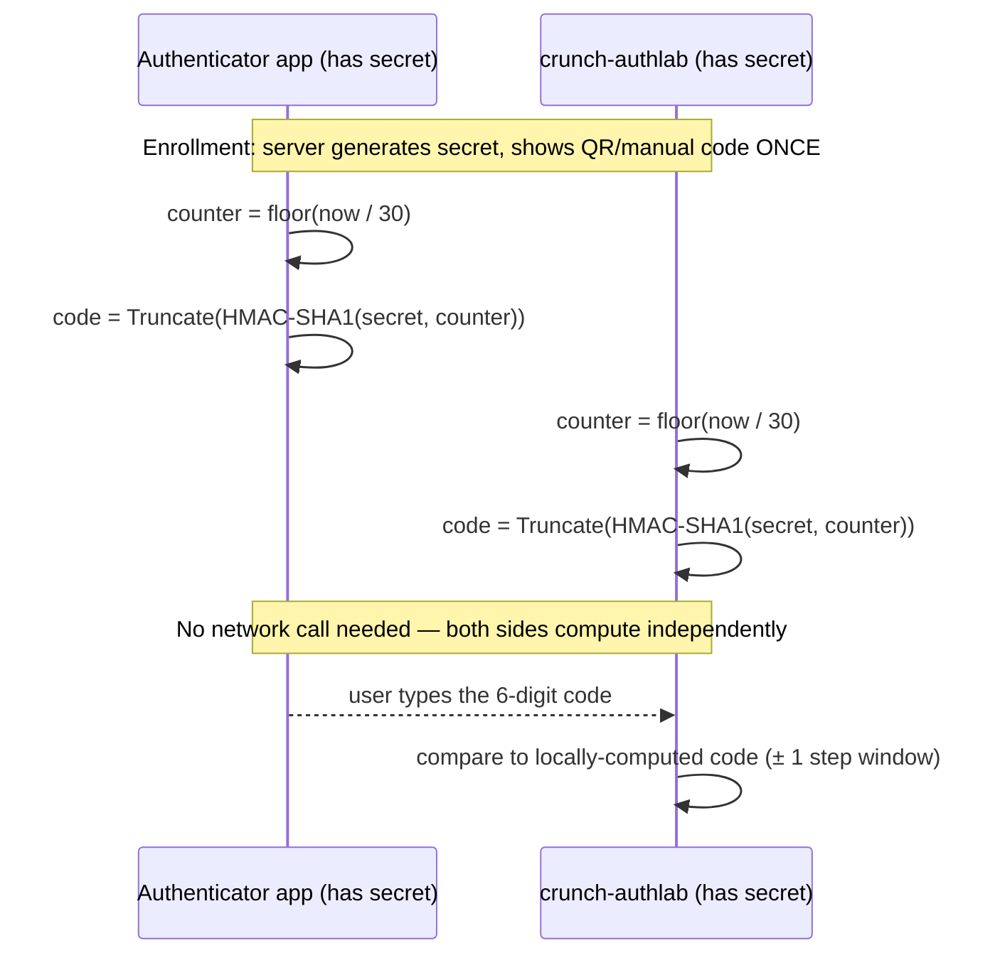
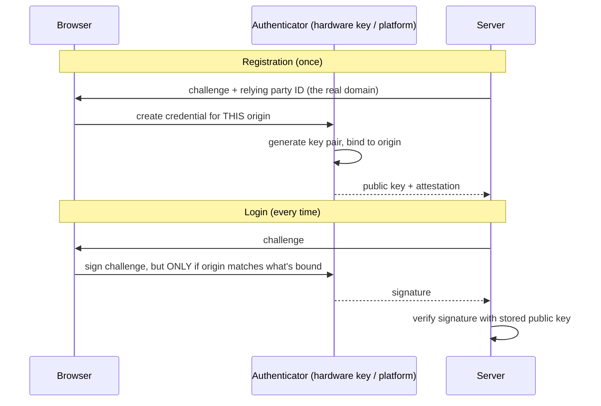
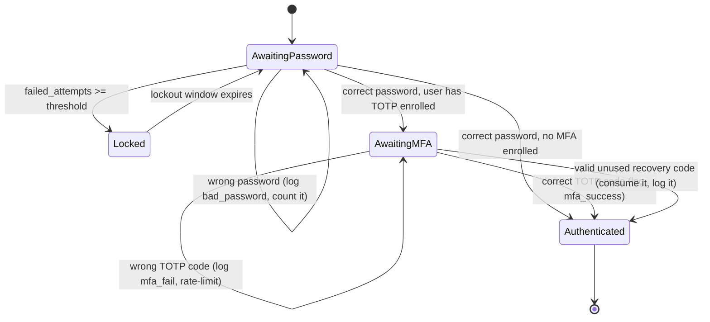

# Lecture 2 — MFA & Authentication Flows

> **Duration:** ~2 hours. **Outcome:** You can explain the three authentication factors and what compromising each requires; implement TOTP enrollment and verification (RFC 6238) end to end; explain why WebAuthn/FIDO2 is phishing-resistant in a way OTP fundamentally is not; issue and store recovery codes safely; and name the specific pitfalls (SIM swap, phishable OTP, plaintext recovery codes) that quietly undo MFA's benefit.

> **Lab reminder.** All enrollment and verification below happens against your own account in `crunch-authlab`, with a TOTP secret you generate for yourself and an authenticator app you control. No real third party is ever involved.

## 1. Why "something you know" alone isn't enough

Section 6 of Lecture 1 established that a password can leak without your database ever being touched — credential stuffing, phishing, keyloggers, or a breach at a *different* site the user reused a password on all hand an attacker a valid password with zero interaction with your app's crypto. **Multi-factor authentication (MFA)** closes that gap by requiring a second, independent proof, drawn from a different category:

| Factor | Examples | What compromising it requires |
|---|---|---|
| **Something you know** | Password, PIN | Guessing, phishing, breach reuse — cheap, scalable |
| **Something you have** | Phone (TOTP app), hardware key (YubiKey), SMS | Physical access, SIM control, or a real-time relay |
| **Something you are** | Fingerprint, face | Physical presence or a spoofed biometric — rare at internet scale |

The security value of MFA comes entirely from **independence**: a password breach at some other site tells an attacker nothing about your phone's TOTP seed or your hardware key. The moment two "factors" share a failure mode (e.g., a password-reset email that also resets the second factor), you no longer have two independent factors — you have one factor with extra steps.

## 2. TOTP — Time-based One-Time Passwords (RFC 6238)

TOTP is the six-digit code your authenticator app (Google Authenticator, Authy, 1Password, etc.) generates that changes every 30 seconds. It requires **no network connection** at verification time because both sides compute the same value independently from a **shared secret** and the current time.

### 2.1 How the algorithm actually works

```
TOTP = HOTP(secret, floor(current_unix_time / 30))
HOTP(secret, counter) = Truncate(HMAC-SHA1(secret, counter))
```

Unpacked: take the current Unix time, divide by the 30-second step and floor it — this "time counter" is the same integer for you and the server as long as your clocks roughly agree. Run that counter through **HMAC-SHA1**, keyed with the shared secret, producing a 20-byte digest. **Truncate** that digest down to a 6-digit number using a scheme from the RFC (take 4 bytes at an offset determined by the digest's own last nibble, mask to 31 bits, mod 10^6). The result is deterministic: anyone holding the same secret and roughly the same clock computes the same 6 digits, with no message ever sent between enrollment and verification.


*Both sides derive the same six digits independently from time and a shared secret — no network round trip required.*

### 2.2 Enrollment and verification with `pyotp`

```python
import pyotp

def generate_totp_secret() -> str:
    return pyotp.random_base32()          # 160-bit random secret, base32-encoded for QR/manual entry

def provisioning_uri(secret: str, username: str) -> str:
    # This URI is what a QR code encodes — the authenticator app scans it once.
    return pyotp.totp.TOTP(secret).provisioning_uri(
        name=username, issuer_name="Crunch AppSec Lab"
    )

def verify_totp(secret: str, submitted_code: str) -> bool:
    totp = pyotp.TOTP(secret)
    return totp.verify(submitted_code, valid_window=1)   # accept ±30s clock drift
```

`valid_window=1` accepts the current 30-second step plus one step on either side — a deliberate, narrow tolerance for clock drift between the user's phone and your server, not an invitation to widen it further. A wider window directly increases the number of valid codes an online guesser could try in a brute-force window against the verification endpoint — which is exactly why **MFA verification needs its own rate limit**, same as password login (Lecture 1, Section 6 — a six-digit TOTP code is only ~1 million possibilities, small enough to be guessable online without a lockout).

### 2.3 What TOTP defends against, and what it doesn't

TOTP closes the "attacker only has the password" case completely — a stuffed or phished password is useless without the secret that only lives on the user's device. It does **not** close:

- **Phishing that also asks for the TOTP code.** A convincing fake login page can prompt for the 6-digit code and relay it to the real site within its 30-second window — see the "adversary-in-the-middle" pitfall in Section 5.
- **Malware on the user's device** that reads the authenticator app's storage.
- **A compromised enrollment step** — if an attacker enrolls their own TOTP secret on a victim's account (e.g., via a broken account-recovery flow), the "second factor" now belongs to the attacker, not the user.

## 3. WebAuthn / FIDO2 — the phishing-resistant factor

TOTP's phishing weakness exists because the human is the one checking that they're on the real site before typing the code. **WebAuthn** (the browser API; **FIDO2** is the umbrella standard including it) removes the human from that check entirely by binding the credential to the **origin** — the exact domain — at the cryptographic level.

### 3.1 The core idea: public-key crypto, no shared secret

Where TOTP shares one secret between server and device, WebAuthn generates a **key pair** per site during registration: the private key never leaves the authenticator (a hardware key, a phone's secure enclave, a platform authenticator like Touch ID/Windows Hello); the server stores only the **public** key.


*Registration binds a key pair to the exact origin; login only produces a signature if that origin still matches.*

The critical property: the authenticator **refuses to sign a challenge for the wrong origin.** A phishing page at `crunch-appsec-login.evil.com` can show a pixel-perfect copy of your login page and relay the challenge to the real server, but the authenticator checks the origin *itself*, in hardware/OS code the phishing page can't intercept or spoof — and simply won't produce a signature. This is what "phishing-resistant" means precisely: not "harder to phish," but structurally incapable of being phished via a fake-domain relay, because there's no shared secret and no human-checked code to steal.

### 3.2 Where WebAuthn fits this course

Implementing a full WebAuthn relying party is a significant undertaking (the browser API, attestation verification, credential storage) — outside this lecture's scope, but you should leave here able to **explain** it correctly and recognize it in the wild: any "sign in with a security key" or "use Face ID / Windows Hello to sign in" prompt is WebAuthn. Exercise 2 has you build TOTP hands-on; the homework points you at a minimal WebAuthn demo library if you want to go further.

## 4. Recovery codes — the factor you hope nobody uses

Every MFA rollout needs a recovery path for "I lost my phone." The naive version (email a plaintext code, or worse, let support disable MFA on a phone call) reintroduces exactly the account-takeover risk MFA was meant to close. The safe pattern:

```python
import secrets

def generate_recovery_codes(count: int = 8) -> list[str]:
    # Human-typeable, high-entropy, one-time codes — generated ONCE, shown ONCE.
    return [f"{secrets.token_hex(4)}-{secrets.token_hex(4)}" for _ in range(count)]
```

Store them the **same way you store passwords** — hashed with argon2id, never plaintext — and mark each one **consumed** the instant it's used:

```sql
CREATE TABLE recovery_codes (
    code_id     INTEGER PRIMARY KEY,
    user_id     INTEGER NOT NULL,
    code_hash   TEXT    NOT NULL,   -- argon2id hash of the code, never the code itself
    used_at     TEXT                -- NULL until consumed; a used code is dead forever
);
```

A recovery code is a one-time password with no expiry and no rate-limit story unless you build one — treat the verification endpoint for recovery codes with the **same** lockout and logging discipline as Lecture 1's password login, because it's just as attackable.

## 5. Pitfalls that quietly undo MFA

- **SIM swap on SMS OTP.** SMS-delivered codes rely on the phone network correctly routing to the legitimate SIM. A SIM swap — a social-engineering attack against the *carrier*, not your app — redirects the victim's number (and thus their "something you have") to an attacker's SIM, with the app never seeing anything wrong. This is why NIST SP 800-63B deprecated SMS OTP as a *restricted* authenticator and why this course teaches TOTP and WebAuthn, not SMS, as the defaults.
- **Phishable OTP via adversary-in-the-middle (AiTM) proxies.** Tools like Evilginx sit between the victim and the real site, relaying the login form *and* the TOTP prompt in real time — the victim types their real code into a fake page, the proxy immediately replays it to the real site within the 30-second window, and captures the resulting session cookie. TOTP does not defend against this; **only** origin-bound WebAuthn does (Section 3.1).
- **Unhashed or reused recovery codes.** If recovery codes sit in the database as plaintext, a database breach hands the attacker a bypass for every MFA-enrolled account at once — worse than not having MFA, because it creates false confidence.
- **A broken recovery/reset flow that lets an attacker re-enroll MFA.** If "forgot your authenticator" only requires answering security questions or clicking an email link with no additional verification, the account-recovery flow *is* the actual authentication boundary — and it usually gets far less security review than the login page itself.
- **Treating MFA enrollment as optional forever.** MFA that's available but never required defends only the fraction of users who opt in — Exercise 2 makes it a required step in the login state machine for any account that has enrolled, not an optional extra screen.

## 6. The login flow as a state machine

Password check and MFA check are two separate steps, and the session must not be considered "authenticated" until **both** pass:


*A session is never Authenticated until both the password step and the MFA step succeed.*

Notice the session created after the password step alone must be marked **not yet fully authenticated** — it should be able to reach only the MFA-verification endpoint, nothing else. A common real-world bug is issuing a fully-privileged session cookie right after the password check and treating the TOTP prompt as pure UI decoration the server never actually enforces server-side. Exercise 2 has you build the state machine so that a captured "post-password, pre-MFA" session genuinely cannot reach `/dashboard`.

## 7. Check yourself

- Name the three authentication factor categories and give one example of each that isn't in this lecture.
- Walk through the TOTP algorithm from shared secret to 6-digit code without looking at Section 2.1 — what two inputs does `HMAC-SHA1` take?
- Why does a wider `valid_window` in TOTP verification trade security for usability, and what's the specific attack it makes marginally easier?
- Explain, precisely, why WebAuthn is phishing-resistant in a way TOTP is not — what does the authenticator check that a human checking a URL bar might miss?
- Why must recovery codes be hashed, and why does a used code need to be marked dead rather than deleted?
- What made SMS OTP a *restricted* authenticator in NIST's guidance, and what attack surface does it depend on that has nothing to do with your app's code?
- In the state machine in Section 6, why is it dangerous to issue a fully-authenticated session cookie immediately after the password check succeeds, before MFA is verified?

If those are automatic, Exercise 2 has you add TOTP enrollment, verification, and hashed recovery codes to `crunch-authlab`'s login state machine — and prove that a stolen post-password session genuinely can't skip the MFA step.

## Further reading

- **RFC 6238 — TOTP: Time-Based One-Time Password Algorithm:** <https://datatracker.ietf.org/doc/html/rfc6238>
- **RFC 4226 — HOTP: An HMAC-Based One-Time Password Algorithm:** <https://datatracker.ietf.org/doc/html/rfc4226>
- **`pyotp` documentation:** <https://pyauth.github.io/pyotp/>
- **WebAuthn Guide (webauthn.guide) — plain-language walkthrough:** <https://webauthn.guide/>
- **W3C — Web Authentication (WebAuthn) Level 3 spec:** <https://www.w3.org/TR/webauthn-3/>
- **NIST SP 800-63B §5.1.3 — Out-of-Band and SMS restrictions:** <https://pages.nist.gov/800-63-3/sp800-63b.html#5163-out-of-band-devices>
- **OWASP — Multifactor Authentication Cheat Sheet:** <https://cheatsheetseries.owasp.org/cheatsheets/Multifactor_Authentication_Cheat_Sheet.html>
