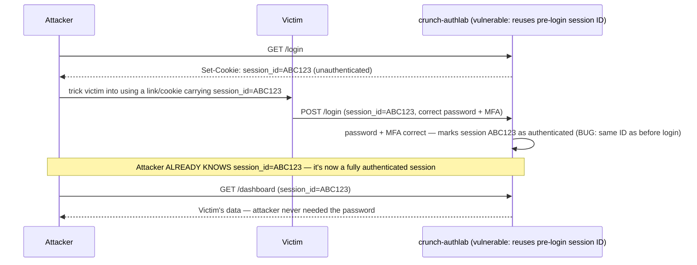

# Lecture 3 — Session Management Security

> **Duration:** ~2 hours. **Outcome:** You can choose between server-side session tokens and JWTs with the tradeoffs stated correctly; set every cookie flag that matters (`HttpOnly`, `Secure`, `SameSite`); explain and demonstrate session fixation and hijacking against your own lab app; defend against CSRF; and implement idle timeout, absolute timeout, and a logout that actually invalidates state on the server.

> **Lab reminder.** Every attack below runs against `crunch-authlab` on `127.0.0.1`, using accounts and a session store you created. No traffic here ever leaves your machine.

## 1. What a session actually is

HTTP is stateless — every request arrives with no memory of the last one. A **session** is the mechanism that fakes continuity: after Lecture 1–2's login succeeds, the server hands the browser a token, the browser sends that token back on every subsequent request, and the server uses it to look up "who is this, and are they still allowed to be here." Get the token's generation, storage, transport, or lifecycle wrong, and everything Lectures 1–2 built — slow hashing, MFA, lockouts — is bypassed in one step, because the attacker never has to touch the password or the second factor at all. They just need the token.

## 2. Server-side sessions vs. JWTs

Two designs answer "how do I keep believing you" differently, and this course defaults to the first for a specific reason:

| | **Server-side session (opaque token)** | **JWT (self-contained token)** |
|---|---|---|
| What the token contains | A random ID, meaningless on its own | Signed claims (user ID, roles, expiry) readable by anyone |
| Where "truth" lives | A database row you control | Inside the token itself |
| **Revocation** | Delete the row — instantly invalidated | **Cannot revoke** before expiry without a server-side denylist, which reintroduces the exact state a JWT was meant to avoid |
| Logout | Delete the row | Client discards the token — but a captured JWT is still valid until it expires |
| Good fit | Traditional web apps, anything needing "log this user out everywhere, right now" | Stateless APIs, service-to-service auth, short-lived tokens (minutes, not days) |

`crunch-authlab` uses **server-side sessions** stored in SQLite for exactly the reason the "Revocation" row states: this course's threat model (fixation, hijacking, forced logout on password change) needs the server to be able to say "this token is dead" **immediately**, and an opaque, database-backed session ID is the simplest thing that guarantees it. If you reach for JWTs later — a legitimate choice for a stateless API — keep expiries short (minutes) and pair them with a refresh-token rotation scheme; a long-lived JWT is a bearer token nobody can take back.

```sql
CREATE TABLE sessions (
    session_id     TEXT PRIMARY KEY,   -- 256 bits of randomness, see Section 3
    user_id        INTEGER NOT NULL,
    mfa_verified   INTEGER NOT NULL DEFAULT 0,
    created_at     TEXT NOT NULL,
    last_seen_at   TEXT NOT NULL
);
```

## 3. Session ID entropy — the token itself must be unguessable

The whole scheme collapses if an attacker can *predict* a valid session ID without stealing one. It must come from a **cryptographically secure random source**, be long enough that guessing is infeasible, and never be derived from anything predictable (timestamp, username, incrementing counter):

```python
import secrets

def new_session_id() -> str:
    return secrets.token_urlsafe(32)   # 256 bits of randomness — never uuid4() for this, never a counter
```

`secrets.token_urlsafe(32)` draws from the OS's cryptographically secure random number generator and yields 256 bits of entropy — astronomically unguessable. Contrast this with `crunch-authlab` v0's original session ID (Exercise 1's starting point): `f"{username}-{int(time.time())}"` — a string an attacker can construct for *any* username just by knowing roughly when they logged in. That is not a session ID, it's a guess with extra steps, and it's the first thing Exercise 3 rips out.

## 4. Cookie flags — how the token travels

Once you have an unguessable ID, how the browser stores and sends it back matters just as much:

```python
response.set_cookie(
    "session_id",
    session_id,
    httponly=True,      # JavaScript (document.cookie) cannot read this — blocks the #1 XSS session-theft path
    secure=True,         # browser sends it ONLY over HTTPS — never over plain HTTP where a network sniff reads it
    samesite="Lax",       # browser withholds it on most cross-site requests — the primary CSRF defense (Section 6)
    max_age=1800,         # 30 minutes — ties to idle timeout, Section 7
    path="/",
)
```

| Flag | Defends against | What breaks if you skip it |
|---|---|---|
| `HttpOnly` | Session theft via XSS (`document.cookie`) | Any injected `<script>` on the page can read and exfiltrate the cookie |
| `Secure` | Network-level interception on plain HTTP | The cookie rides in cleartext over any unencrypted hop — a coffee-shop Wi-Fi sniff, a misconfigured proxy |
| `SameSite=Lax` (or `Strict`) | CSRF (Section 6) | The browser attaches the cookie to cross-site requests an attacker's page triggers, e.g. an auto-submitting form |

`SameSite=Strict` is the strongest setting (the cookie is withheld even when a user clicks a link *into* your site from elsewhere) but breaks that "click a link from an email, land already logged in" experience; `Lax` is the practical default most sites ship — it still sends the cookie on top-level navigations (clicking a link) but withholds it on cross-site `POST`s, iframes, and background requests, which is exactly where CSRF lives.

Verify the flags landed with `curl -v` rather than trusting the code you wrote:

```bash
curl -v -c cookies.txt -d "username=grace&password=..." http://127.0.0.1:5000/login 2>&1 | grep -i "set-cookie"
# Set-Cookie: session_id=...; HttpOnly; SameSite=Lax; Path=/; Max-Age=1800
# (Secure won't appear over plain http:// in local dev — that's expected; it MUST appear in any real deployment behind TLS)
```

## 5. Session fixation — the attacker sets the ID, not the victim

**Fixation** is the attack where the attacker doesn't need to *steal* a session ID — they **plant** one on the victim before login, then wait for the victim to authenticate under it:


*The attacker plants the session ID before login; rotating the ID on login is what breaks this chain.*

The fix is one rule, applied without exception: **rotate the session ID on every privilege change** — specifically, on successful login and again on successful MFA verification. The pre-login session ID is discarded entirely rather than "upgraded" in place:

```python
def complete_login(old_session_id: str, user_id: int) -> str:
    db_delete_session(old_session_id)          # the pre-auth ID is dead, full stop
    new_id = new_session_id()                   # Section 3 — fresh 256 bits
    db_create_session(new_id, user_id, mfa_verified=False)
    return new_id   # caller sets THIS as the new cookie value
```

An attacker who planted `ABC123` before login gains nothing — the ID that becomes authenticated is one the server generated *after* login, that the attacker never saw.

## 6. Session hijacking and CSRF — stealing vs. riding along

**Hijacking** is theft: an attacker obtains a victim's *already-valid* session ID directly — via XSS reading an unprotected cookie, a network sniff on plain HTTP, a leaked server log that captured the `Set-Cookie` header, or physical access to a device. Sections 3–4's entropy and cookie flags are the direct defense; there's no clever protocol fix for "the attacker has your actual token" beyond keeping them from ever getting it, plus detecting anomalous use (a session suddenly used from a new IP/user-agent is a real, if imperfect, signal — Challenge 2 asks you to reason about this).

**CSRF (Cross-Site Request Forgery)** is different: the attacker never sees or steals the session cookie at all. They rely on the browser's default behavior of **automatically attaching cookies** to any request to a site, regardless of which page triggered the request:

```html
<!-- Hosted on attacker.example, visited by a victim who is ALREADY logged into crunch-authlab -->
<form action="http://127.0.0.1:5000/change-email" method="POST" id="csrf">
  <input type="hidden" name="new_email" value="attacker@evil.example">
</form>
<script>document.getElementById("csrf").submit();</script>
```

If the victim's browser has a valid `session_id` cookie for `crunch-authlab` and that cookie isn't `SameSite`-protected, the browser attaches it to this cross-site `POST` automatically — the server sees a validly-authenticated request and executes it, with the victim never knowing it happened. Two layered defenses:

1. **`SameSite=Lax`/`Strict`** (Section 4) — the browser itself withholds the cookie on this cross-site `POST`, so the request arrives with no session at all and gets rejected. This alone stops the vast majority of real-world CSRF today.
2. **Synchronizer token pattern** (defense in depth, for browsers or configurations where `SameSite` isn't trusted alone) — the server embeds a random, per-session CSRF token in every state-changing form; the attacker's cross-site form can't know that token, so the request is rejected even if the cookie *did* ride along.

```python
# Synchronizer token — generate once per session, verify on every state-changing POST
def csrf_token_for(session_id: str) -> str:
    return hashlib.sha256(f"{session_id}{app.secret_key}".encode()).hexdigest()

def verify_csrf(session_id: str, submitted_token: str) -> bool:
    return secrets.compare_digest(csrf_token_for(session_id), submitted_token)
```

`secrets.compare_digest` matters here for the same reason argon2's `verify()` did in Lecture 1 — a naive `==` string comparison short-circuits on the first mismatched character, leaking timing information about how much of the token an attacker got right.

## 7. Timeout — idle, absolute, and why you need both

A session that never expires is a permanently valid stolen token, if one is ever stolen despite everything above:

- **Idle timeout** — expire after N minutes of *inactivity* (`last_seen_at` not updated recently). Protects a session left open on a shared or unattended device.
- **Absolute timeout** — expire N hours after `created_at`, *no matter how active the session is*. Bounds the maximum lifetime of a stolen token even if the attacker keeps using it to look "active."

```python
from datetime import datetime, timedelta

IDLE_TIMEOUT = timedelta(minutes=30)
ABSOLUTE_TIMEOUT = timedelta(hours=12)

def session_is_valid(session_row) -> bool:
    now = datetime.utcnow()
    created = datetime.fromisoformat(session_row["created_at"])
    last_seen = datetime.fromisoformat(session_row["last_seen_at"])
    if now - last_seen > IDLE_TIMEOUT:
        return False
    if now - created > ABSOLUTE_TIMEOUT:
        return False
    return True
```

Check this on **every** authenticated request, not just at login — a session that passed the check five minutes ago can be idle-expired now.

## 8. Logout that actually logs out

The single most common session bug in real apps: "logout" that only clears the browser's cookie, leaving the server-side session row alive. A copy of that cookie taken *before* logout (from a proxy log, a browser history sync, a shared computer) is still fully valid:

```python
def logout(session_id: str) -> None:
    db_delete_session(session_id)          # kill the SERVER-SIDE truth
    response.delete_cookie("session_id")   # THEN clear the browser's copy — order matters less than doing both
```

`db_delete_session` is the half that actually matters from a security standpoint; `delete_cookie` is UX, not defense.

## 9. Check yourself

- State the tradeoff between server-side sessions and JWTs in one sentence each — specifically around revocation.
- Why must `secrets.token_urlsafe(32)` (or equivalent) generate the session ID, and what's wrong with `f"{username}-{timestamp}"`?
- Explain, in your own words, why `HttpOnly` stops an XSS-based cookie theft but does nothing against CSRF — and why `SameSite` is the reverse.
- Walk through the fixation attack in Section 5 step by step, then state the one-line fix and why it defeats it completely.
- Why is CSRF a "the attacker never sees your cookie" attack, unlike hijacking?
- Why does a session need **both** an idle timeout and an absolute timeout — what does each catch that the other doesn't?
- What's wrong with a "logout" implementation that only calls `response.delete_cookie()`?

If those are automatic, Exercise 3 has you rip the guessable session ID and missing cookie flags out of `crunch-authlab`, fix fixation by rotating the ID on login, and implement a logout and timeout that actually invalidate server-side state — then Challenge 2 has you audit a full login flow's source and find every gap in this lecture, unguided.

## Further reading

- **OWASP — Session Management Cheat Sheet:** <https://cheatsheetseries.owasp.org/cheatsheets/Session_Management_Cheat_Sheet.html>
- **OWASP — Cross-Site Request Forgery (CSRF) Prevention Cheat Sheet:** <https://cheatsheetseries.owasp.org/cheatsheets/Cross-Site_Request_Forgery_Prevention_Cheat_Sheet.html>
- **MDN — Using HTTP cookies (`Set-Cookie`, `SameSite`, `HttpOnly`, `Secure`):** <https://developer.mozilla.org/en-US/docs/Web/HTTP/Cookies>
- **OWASP — Testing for Session Fixation:** <https://owasp.org/www-project-web-security-testing-guide/latest/4-Web_Application_Security_Testing/06-Session_Management_Testing/03-Testing_for_Session_Fixation>
- **RFC 6265bis — Cookies: HTTP State Management Mechanism:** <https://datatracker.ietf.org/doc/html/draft-ietf-httpbis-rfc6265bis>
- **Python `secrets` module documentation:** <https://docs.python.org/3/library/secrets.html>
