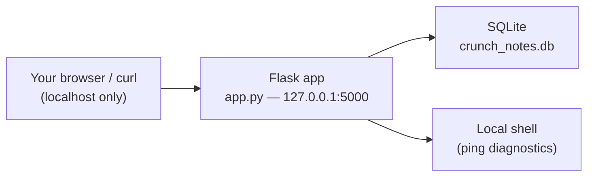

# Week 5 — Injection & Input Validation

> **Goal:** by Sunday you can look at any code that touches a database, a shell, or a browser and immediately spot where untrusted data is about to be interpreted as code — and you can fix it for good, not with a filter that a cleverer payload slips past next week.

Welcome back to **C50 · Crunch AppSec**. Weeks 1–4 gave you the mindset (attacker/defender), the method (STRIDE threat modeling), the map (the OWASP Top 10), and hardened the front door (authentication). This week you go after the vulnerability class that has topped nearly every "most damaging" list for two decades running: **injection**. SQL injection alone has powered some of the largest breaches in history, and the pattern behind it — untrusted data crossing into an interpreter that can't tell data from instructions — is the *same* pattern behind OS command injection, LDAP injection, template injection, and cross-site scripting. Learn the shape once, and you'll recognize it in languages and frameworks you've never seen before.

This week has a sharp, non-negotiable center: **parameterized queries are the fix for SQL injection.** Not "better" than escaping or blocklists — the *complete, correct* fix, full stop. You'll prove that to yourself by breaking a deliberately vulnerable app, fixing it the right way, and then re-running your own attack payloads to watch them fail. The same discipline — validate what comes in, encode what goes out, use the safe API instead of hand-building a command — carries straight into this week's second half: killing reflected, stored, and DOM-based XSS with context-aware output encoding and a Content Security Policy as backup.

> **Ethics & legality — binding, every week.** Everything below is **authorized, legal, defensive-minded** security work performed **only inside the isolated lab you own** — this week, a small Flask + SQLite app you run yourself on `127.0.0.1`, alongside the Juice Shop/DVWA/WebGoat targets from Week 1. Every injection payload you write this week is typed against **your own machine, your own database, your own app** — never a system you don't have explicit written authorization to test. Blind SQL injection (Challenge 2) is taught for exactly one reason: so you can **detect** it happening to someone else's application from the logs, and **defend** against it in your own. Written authorization, defined scope, and the law govern every exercise this week and every week after it.

## Learning objectives

By the end of this week, you will be able to:

- **Explain** why injection happens: untrusted data interpreted as code once it crosses a trust boundary into an interpreter (SQL engine, shell, template engine, LDAP directory).
- **Kill SQL injection with parameterized queries** — and explain precisely why escaping, blocklists, and "just be careful" are not a substitute.
- **Apply the right defense per context**: validate input against an allowlist, encode output for the context it lands in, and reach for a safe API instead of building a command string by hand.
- **Demonstrate and then remediate** reflected, stored, and DOM-based XSS in a lab target — the same attacker/defender pairing this course has drilled since Week 1.
- **Verify** that your defenses hold by re-running a stored library of injection payloads against the fixed code and recording pass/fail as data, not a feeling.

## Prerequisites

- **Weeks 1–4 completed.** Specifically: your isolated lab is up (Week 1), you can reason about trust boundaries and STRIDE's Tampering category (Week 2), you know the OWASP Top 10 names for these bugs — A03:2021 Injection and, historically, XSS (Week 3) — and you've hardened a login flow, so you understand *why* the login endpoint below still being SQL-injectable this week is a second, independent bug on top of authentication (Week 4).
- Python 3.10+ and `pip`. `sqlite3` ships with Python.
- Comfortable running a local web server and hitting it with `curl` or a browser.
- [C33 Crunch SQL](../../../C33-CRUNCH-SQL/) helps but isn't required — the SQL you need this week is explained from scratch.

## This week's target: Crunch Notes

This week introduces a **second lab app**, built specifically to be broken and fixed by hand: a tiny Flask + SQLite notes/diagnostics app called **Crunch Notes**. Unlike Juice Shop or DVWA, you have the full, short source in front of you — every fix this week is a code change *you* make and can diff against the original.



It runs on `127.0.0.1` only, with no route out — same isolation discipline as Week 1's Docker lab, just process-level instead of container-level.

### Set up Crunch Notes (do this first)

```bash
mkdir -p ~/c50-week-05/crunch-notes && cd ~/c50-week-05/crunch-notes
python3 -m venv venv && source venv/bin/activate
pip install flask
```

Save the following as `app.py`. Read every comment — each one names the vulnerability and points at the lecture that covers it. **Do not "fix as you go."** You exploit these bugs first (Exercises 1–3), then fix them deliberately (also Exercises 1–3) — fixing blind defeats the point of the week.

```python
#!/usr/bin/env python3
"""
Crunch Notes — a DELIBERATELY vulnerable Flask + SQLite app for C50 Week 5.

RUN ONLY ON 127.0.0.1, INSIDE YOUR OWN ISOLATED LAB. Never deploy this code,
never expose it beyond localhost, never point any technique you practice here
at a system you don't own. Every route below is broken ON PURPOSE so you can
find, exploit (against yourself only), and then fix the exact bug.
"""
import os
import sqlite3
import time
from flask import Flask, request, render_template_string, g

DB_PATH = "crunch_notes.db"
app = Flask(__name__)


def get_db():
    if "db" not in g:
        g.db = sqlite3.connect(DB_PATH)
        g.db.row_factory = sqlite3.Row
        # VULN LAB ONLY: a custom SQL function so this week's SQLite database
        # can demonstrate time-based blind injection, which SQLite has no
        # built-in SLEEP() for. Never register anything like this outside a
        # teaching lab.
        g.db.create_function("sleep", 1, lambda n: time.sleep(float(n)))
    return g.db


@app.teardown_appcontext
def close_db(exception=None):
    db = g.pop("db", None)
    if db is not None:
        db.close()


def init_db():
    db = sqlite3.connect(DB_PATH)
    db.executescript(
        """
        DROP TABLE IF EXISTS users;
        DROP TABLE IF EXISTS notes;
        DROP TABLE IF EXISTS sessions;

        CREATE TABLE users (
            id       INTEGER PRIMARY KEY,
            username TEXT UNIQUE NOT NULL,
            password TEXT NOT NULL,   -- plaintext ON PURPOSE, see note below
            is_admin INTEGER NOT NULL DEFAULT 0
        );

        CREATE TABLE notes (
            id         INTEGER PRIMARY KEY,
            author     TEXT NOT NULL,
            title      TEXT NOT NULL,
            body       TEXT NOT NULL,
            created_at TEXT NOT NULL DEFAULT CURRENT_TIMESTAMP
        );

        CREATE TABLE sessions (
            id      INTEGER PRIMARY KEY,
            user_id INTEGER NOT NULL,
            token   TEXT UNIQUE NOT NULL,
            FOREIGN KEY (user_id) REFERENCES users(id)
        );
        """
    )
    db.executemany(
        "INSERT INTO users (username, password, is_admin) VALUES (?, ?, ?)",
        [("grace", "correct-horse-battery", 0), ("admin", "S3cur3AdminPass!", 1)],
    )
    db.execute(
        "INSERT INTO notes (author, title, body) VALUES (?, ?, ?)",
        ("grace", "Welcome", "First post -- <b>hi</b> team!"),
    )
    db.execute("INSERT INTO sessions (user_id, token) VALUES (?, ?)", (1, "tok_grace_9f2c"))
    db.commit()
    db.close()
    print(f"Initialized {DB_PATH}")
    # NOTE: plaintext passwords are a SEPARATE bug from this week's topic --
    # see Week 4 for password storage. Fixing injection this week does not
    # fix that; both live in this file on purpose, because real apps stack
    # multiple flaw classes just like this.


INDEX_HTML = """
<h1>Crunch Notes (deliberately vulnerable lab app)</h1>
<ul>
  <li><a href="/login">Log in</a> -- VULN #1: SQL injection (auth bypass)</li>
  <li><a href="/search?q=welcome">Search notes</a> -- VULN #2: SQL injection + reflected XSS</li>
  <li><a href="/notes">All notes</a> -- VULN #3: stored XSS</li>
  <li><a href="/notes/new">New note</a></li>
  <li><a href="/diagnostics/ping">Diagnostics: ping</a> -- VULN #4: OS command injection</li>
  <li><a href="/profile?id=1">Profile lookup</a> -- VULN #5: boolean-blind SQL injection</li>
  <li><a href="/status?token=tok_grace_9f2c">Session status</a> -- VULN #6: time-based blind SQL injection</li>
  <li><a href="/welcome?name=Learner">Welcome banner</a> -- VULN #7: DOM XSS</li>
</ul>
"""


@app.route("/")
def index():
    return INDEX_HTML


LOGIN_FORM = """
<h1>Log in</h1>
<form method="post">
  Username: <input name="username"><br>
  Password: <input name="password" type="password"><br>
  <button type="submit">Log in</button>
</form>
<p>{{ result }}</p>
"""


@app.route("/login", methods=["GET", "POST"])
def login():
    """VULN #1 -- SQL injection, auth bypass. See Lecture 1 Sec 2, fixed in
    Lecture 2 Sec 2 and Exercise 1."""
    result = None
    if request.method == "POST":
        username = request.form.get("username", "")
        password = request.form.get("password", "")
        db = get_db()
        query = (
            "SELECT id, username, is_admin FROM users "
            f"WHERE username = '{username}' AND password = '{password}'"
        )
        row = db.execute(query).fetchone()
        result = f"Welcome, {row['username']}! admin={bool(row['is_admin'])}" if row else "Invalid username or password."
    return render_template_string(LOGIN_FORM, result=result)


SEARCH_HTML = """
<h1>Search notes</h1>
<form method="get">
  <input name="q" value="{{ q }}">
  <button type="submit">Search</button>
</form>
<p>Results for: {{ q|safe }}</p>
<ul><li><b>{{ row[0] }}</b></li></ul>
"""


@app.route("/search")
def search():
    """VULN #2 -- SQL injection (UNION-based) in the query, AND reflected XSS
    in the `q|safe` echo. See Lecture 1 Sec 2, Lecture 3 Sec 2, Exercise 1."""
    q = request.args.get("q", "")
    db = get_db()
    query = f"SELECT title FROM notes WHERE title LIKE '%{q}%'"
    try:
        rows = db.execute(query).fetchall()
    except sqlite3.Error as exc:
        return f"<p>DB error: {exc}</p>", 500
    return render_template_string(SEARCH_HTML, q=q, rows=rows)


NOTES_HTML = """
<h1>All notes</h1>

  <div><b>{{ n['title'] }}</b> by {{ n['author'] }}<br>{{ n['body']|safe }}</div><hr>

"""
NEW_NOTE_FORM = """
<h1>New note</h1>
<form method="post">
  Author: <input name="author"><br>
  Title: <input name="title"><br>
  Body:<br><textarea name="body" rows="4" cols="40"></textarea><br>
  <button type="submit">Post</button>
</form>
"""


@app.route("/notes")
def notes():
    """VULN #3 -- stored XSS: `n['body']|safe` renders saved note bodies as
    live HTML. See Lecture 3 Sec 2, Exercise 3."""
    db = get_db()
    rows = db.execute("SELECT * FROM notes ORDER BY id DESC").fetchall()
    return render_template_string(NOTES_HTML, notes=rows)


@app.route("/notes/new", methods=["GET", "POST"])
def new_note():
    if request.method == "POST":
        db = get_db()
        # This INSERT is already parameterized -- the injection risk for
        # notes lives entirely at RENDER time (VULN #3), not here. Good
        # reminder: a parameterized write does not fix a missing encode
        # at output.
        db.execute(
            "INSERT INTO notes (author, title, body) VALUES (?, ?, ?)",
            (request.form.get("author", ""), request.form.get("title", ""), request.form.get("body", "")),
        )
        db.commit()
        return "<p>Saved. <a href='/notes'>View notes</a></p>"
    return render_template_string(NEW_NOTE_FORM)


PING_FORM = """
<h1>Diagnostics: ping a host</h1>
<form method="post">
  Host: <input name="host" value="127.0.0.1"><br>
  <button type="submit">Ping</button>
</form>
<pre>{{ output }}</pre>
"""


@app.route("/diagnostics/ping", methods=["GET", "POST"])
def ping():
    """VULN #4 -- OS command injection: untrusted `host` handed straight to
    the shell. See Lecture 1 Sec 3, Exercise 2."""
    output = None
    if request.method == "POST":
        host = request.form.get("host", "127.0.0.1")
        output = os.popen(f"ping -c 1 {host}").read()
    return render_template_string(PING_FORM, output=output)


@app.route("/profile")
def profile():
    """VULN #5 -- boolean-blind SQL injection: no error text, no data
    reflected, just a yes/no oracle. See Challenge 2."""
    user_id = request.args.get("id", "0")
    db = get_db()
    query = f"SELECT username FROM users WHERE id = {user_id}"
    try:
        row = db.execute(query).fetchone()
    except sqlite3.Error:
        return "Not found.", 404
    return "User found." if row else "Not found."


@app.route("/status")
def status():
    """VULN #6 -- time-based blind SQL injection, using the lab-only
    sleep() function registered in get_db(). See Challenge 2."""
    token = request.args.get("token", "")
    db = get_db()
    query = f"SELECT user_id FROM sessions WHERE token = '{token}'"
    row = db.execute(query).fetchone()
    return "Active." if row else "Not active."


WELCOME_HTML = """
<h1 id="greeting">Hi!</h1>
<script>
  // VULN #7 -- DOM XSS: untrusted data (the URL) written straight into
  // innerHTML with no encoding. The server never even sees this payload --
  // the browser's own JS is the interpreter being injected into. See
  // Lecture 3 Sec 3.
  const params = new URLSearchParams(window.location.search);
  const name = params.get("name") || "friend";
  document.getElementById("greeting").innerHTML = "Hi, " + name + "!";
</script>
"""


@app.route("/welcome")
def welcome():
    return WELCOME_HTML


if __name__ == "__main__":
    if not os.path.exists(DB_PATH):
        init_db()
    app.run(host="127.0.0.1", port=5000, debug=True)
```

Run it and confirm it's up:

```bash
python app.py
# in another terminal:
curl -s http://127.0.0.1:5000/ | grep -c "<li>"   # expect: 8
```

Seven deliberate vulnerabilities are numbered directly in the comments (`VULN #1`–`#7`). You'll reference those numbers all week — write them down now:

| # | Route | Flaw | Fixed in |
|---|-------|------|----------|
| 1 | `POST /login` | SQL injection — auth bypass | Exercise 1 |
| 2 | `GET /search` | SQL injection (UNION-based) + reflected XSS | Exercise 1 (SQLi), Exercise 3 stretch (XSS) |
| 3 | `GET /notes` | Stored XSS | Exercise 3 |
| 4 | `POST /diagnostics/ping` | OS command injection | Exercise 2 |
| 5 | `GET /profile?id=` | Boolean-blind SQL injection | Challenge 2 |
| 6 | `GET /status?token=` | Time-based blind SQL injection | Challenge 2 |
| 7 | `GET /welcome?name=` | DOM XSS | Exercise 3 stretch, Challenge 1 |

## This week's map

Work top to bottom. Each piece assumes the ones before it.

| # | File | What's inside | ~Time |
|--:|------|---------------|------:|
| 1 | [lecture-notes/01-how-injection-works.md](./lecture-notes/01-how-injection-works.md) | The universal shape of injection across SQL, OS command, LDAP, and template engines | 2h |
| 2 | [lecture-notes/02-parameterized-sql-as-the-defense.md](./lecture-notes/02-parameterized-sql-as-the-defense.md) | Parameterized queries as the correct, complete SQLi fix; why escaping/blocklists fail; ORM pitfalls | 2h |
| 3 | [lecture-notes/03-xss-and-output-encoding.md](./lecture-notes/03-xss-and-output-encoding.md) | Reflected/stored/DOM XSS, context-aware output encoding, CSP as a layered defense | 2h |
| 4 | [exercises/exercise-01-exploit-then-parameterize.md](./exercises/exercise-01-exploit-then-parameterize.md) | Exploit VULN #1/#2's SQLi, then rewrite both as parameterized queries | 1.5h |
| 5 | [exercises/exercise-02-build-input-validation.md](./exercises/exercise-02-build-input-validation.md) | Fix VULN #4 with allowlist validation, not a blocklist | 1h |
| 6 | [exercises/exercise-03-fix-stored-xss.md](./exercises/exercise-03-fix-stored-xss.md) | Exploit and fix VULN #3's stored XSS; stretch: VULN #2/#7 | 1.5h |
| 7 | [challenges/challenge-01-convert-an-injectable-app.md](./challenges/challenge-01-convert-an-injectable-app.md) | Convert the whole app: every remaining flaw, end to end, less hand-holding | 2h |
| 8 | [challenges/challenge-02-blind-injection-defense.md](./challenges/challenge-02-blind-injection-defense.md) | Exploit VULN #5/#6 blind, then build detection from query logs | 1.5h |
| 9 | [mini-project/README.md](./mini-project/README.md) | Eliminate every injection flaw in Crunch Notes and prove it against a payload library | 3h |
| 10 | [homework.md](./homework.md) | Extra practice, spread across the week | 4h |
| 11 | [quiz.md](./quiz.md) | 15 self-check questions + answer key | 1h |
| 12 | [resources.md](./resources.md) | OWASP cheat sheets, official docs, the few links worth your time | — |

## Weekly schedule

Adds up to roughly **~24 hours**. Treat it as a target, not a stopwatch.

| Day | Focus | Lectures | Exercises | Challenges | Quiz/Read | Homework | Mini-Project | Daily Total |
|-----------|-------------------------------------------|---------:|----------:|-----------:|----------:|---------:|-------------:|------------:|
| Monday | How injection works; set up Crunch Notes | 2h | 0h | 0h | 0.5h | 1h | 0h | 3.5h |
| Tuesday | Parameterized SQL; exploit + fix login/search | 2h | 1.5h | 0h | 0.5h | 1h | 0h | 5h |
| Wednesday | Input validation for the ping endpoint | 0h | 1h | 0h | 0.5h | 1h | 0h | 2.5h |
| Thursday | XSS & output encoding; fix stored XSS | 2h | 1.5h | 0h | 0.5h | 1h | 0.5h | 5.5h |
| Friday | Full app conversion + blind injection challenge | 0h | 0h | 3.5h | 0.5h | 1h | 0.5h | 5.5h |
| Saturday | Mini-project | 0h | 0h | 0h | 0h | 0h | 2h | 2h |
| Sunday | Quiz + review | 0h | 0h | 0h | 1h | 0h | 0h | 1h |
| **Total** | | **6h** | **4h** | **3.5h** | **3.5h** | **5h** | **3h** | **~24h** |

## By the end of this week you can…

- Point at any line of code that builds a query, a shell command, or an HTML response from untrusted input and say, precisely, why it's safe or why it isn't.
- Rewrite a string-built SQL query as a parameterized one, from memory, in Python (`sqlite3`/`psycopg2`) or an ORM's parameter-binding API.
- Explain, without hedging, why a blocklist or an escaping function is not "mostly fine" for SQL injection — it's a different, incomplete category of fix.
- Demonstrate reflected, stored, and DOM XSS in your own lab app, then close each one with the output-encoding rule for its specific context.
- Store injection payloads as data, re-run them against fixed code, and produce a pass/fail record that proves the fix — not just "I think it's fixed."

## Up next

[Week 6 — Access control & authorization](../week-06-access-control-and-authorization/) — injection gets an attacker *into* data they shouldn't touch; next week is about the second half of that sentence — making sure that even a logged-in, non-malicious user can't reach data or actions that belong to someone else.

---

*Part of the Code Crunch Worldwide open curriculum · GPL-3.0 · If you find errors, please open an issue or PR.*
