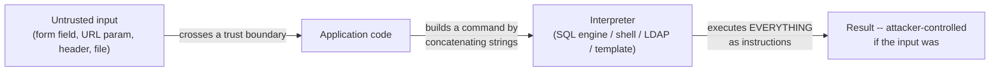

# Lecture 1 — How Injection Works

> **Duration:** ~2 hours. **Outcome:** You can explain the single shape behind every injection vulnerability — untrusted data crossing a trust boundary into an interpreter that can't tell data from instructions — and recognize that shape in SQL, OS command, LDAP, and template-engine contexts, including inside Crunch Notes' own source.

Every vulnerability class in this course has a *pattern* underneath the acronym. Injection's pattern is the cleanest one you'll meet, and once you see it you cannot unsee it: it shows up in languages you've never used, frameworks you've never opened, and code you'll write next month without thinking about this lecture at all — which is exactly why it's worth thirty more seconds of thought right now.

## 1. The universal shape

An **interpreter** is any component that takes a string and executes it as instructions: a SQL engine, an OS shell, an LDAP directory server, a template engine, a regex engine, even `eval()` in a scripting language. Interpreters are enormously useful precisely *because* they blur the line between "data" and "code" — that's the whole point of a query language or a shell.

**Injection happens when untrusted data crosses into an interpreter without being kept separate from the instructions.** The interpreter has no way to know that the string `' OR '1'='1` wasn't part of the program you meant to write — from its point of view, it's all just... the program.



Notice this diagram is nearly identical to the trust-boundary diagrams you drew in Week 2's data-flow diagrams — that's not a coincidence. **Injection is what happens when a trust boundary exists on your DFD but nothing at the code level actually enforces it.** STRIDE's Tampering category, applied to a data flow that reaches an interpreter, *is* injection — Week 2 already gave you the map; this week gives you the fix.

## 2. Worked example — SQL injection in Crunch Notes' login

Open `crunch_notes.db`'s `/login` route (VULN #1 in your `app.py`). Here's the query, built with an f-string:

```python
query = (
    "SELECT id, username, is_admin FROM users "
    f"WHERE username = '{username}' AND password = '{password}'"
)
```

If you submit `username=grace` and `password=correct-horse-battery`, the interpolated SQL is exactly what the developer intended:

```sql
SELECT id, username, is_admin FROM users WHERE username = 'grace' AND password = 'correct-horse-battery'
```

Now submit `username = admin' -- ` (note the trailing space before `--`) with **any** password. The interpolated SQL becomes:

```sql
SELECT id, username, is_admin FROM users WHERE username = 'admin' -- ' AND password = 'anything'
```

`--` starts a SQL comment; everything after it, including the real password check, is discarded by the interpreter. The query becomes "find the user named `admin`," full stop — no password required. **You never broke the SQL engine.** It executed your input exactly as written, correctly, as instructions. That's the whole vulnerability: the engine did its job perfectly on a program you didn't intend to write.

A second classic payload, `' OR '1'='1`, works differently — it doesn't comment anything out, it makes the `WHERE` clause **always true**:

```sql
WHERE username = '' OR '1'='1' AND password = ''
```

`'1'='1'` is always true, so (depending on operator precedence — worth tracing by hand) the query can return the *first* row in the table regardless of credentials. Try both payloads against your own `/login` in Exercise 1 and watch the difference in what each one returns.

## 3. Worked example — OS command injection in Crunch Notes' diagnostics

VULN #4, the `/diagnostics/ping` route, hands user input straight to a shell:

```python
output = os.popen(f"ping -c 1 {host}").read()
```

A legitimate `host=127.0.0.1` becomes `ping -c 1 127.0.0.1` — exactly intended. But the shell doesn't stop reading at the end of a hostname; it keeps interpreting **shell metacharacters** anywhere in the string. Submit `host=127.0.0.1; whoami`:

```bash
ping -c 1 127.0.0.1; whoami
```

The `;` is a shell command separator — you didn't inject *into* the ping command, you injected a **second, entirely separate command** after it, and the shell dutifully ran both. `&&`, `|`, backticks, and `$()` are all variations on the same theme: characters that mean something special to the interpreter (here, the shell) rather than to the application. This is strictly more dangerous than SQL injection in one specific way — a shell can read files, spawn processes, and reach the network, so command injection is very often a direct path to full control of the host, not just its data.

## 4. The same shape, two contexts you won't build a lab for this week

You don't need a running LDAP server or a template-injection-vulnerable route to recognize the pattern — the shape is identical, just the interpreter and its metacharacters change.

**LDAP injection.** An app authenticating against a directory server might build a filter like this:

```python
# VULNERABLE (illustrative -- not part of Crunch Notes)
ldap_filter = f"(&(uid={username})(userPassword={password}))"
```

LDAP filter syntax uses `(`, `)`, `&`, `|`, and `*` as its own metacharacters. A username of `*)(uid=*))(|(uid=*` can reshape the filter's logic the same way `' OR '1'='1` reshapes a `WHERE` clause — different syntax, same "my input became part of the program" bug.

**Template injection (SSTI).** Some frameworks let you render a template *string* built partly from user input, not just fill placeholders inside a fixed template:

```python
# VULNERABLE (illustrative -- Crunch Notes never does this)
from flask import render_template_string
return render_template_string(f"<h1>Hi {name}</h1>")   # name is user input
```

`render_template_string` re-parses its **entire first argument** as Jinja2 template syntax before rendering. If `name` is `{{ 7*7 }}`, Jinja2 doesn't print the literal text `{{ 7*7 }}` — it evaluates it and prints `49`, because as far as the template engine is concerned, that text *is* the template, expressions and all. In real-world SSTI, attackers escalate from "I can evaluate expressions" to walking Python's object graph to reach `os.system` — full server-side code execution from a single string. Compare this to Crunch Notes' `render_template_string(SEARCH_HTML, q=q, rows=rows)` calls: those are safe from SSTI because `SEARCH_HTML` is a **fixed template string written by the developer**, and `q` is passed as a *value to fill a placeholder*, not concatenated into the template text itself. The vulnerability in `/search` is real (VULN #2), but it's SQL injection and XSS — not SSTI — precisely because of that distinction. Keep it straight: passing untrusted data **as a template** is the SSTI bug; passing it **as a value into** a fixed template is fine (assuming the output encoding is also correct, which Lecture 3 covers).

## 5. Why blocklists lose

A **blocklist** defense tries to reject known-bad characters or patterns: strip out `'`, reject strings containing `--`, block `;` and `|`. It fails for a structural reason, not a laziness reason: **you are trying to enumerate an infinite set of ways to break out of a context, using a finite list you wrote before the attacker thought of their payload.**

A few ways blocklists get bypassed, all real, all worth internalizing:

- **Encoding tricks.** URL-encode the dangerous character (`%27` for `'`), and a blocklist checking the raw string before decoding never sees it — but the interpreter, downstream, decodes it and executes it anyway.
- **Case variation.** A blocklist for `SELECT` misses `SeLeCt` if the SQL engine is case-insensitive (most are).
- **Alternate syntax for the same effect.** Blocking `--` doesn't stop `/* comment */`-style comments, or a UNION-based payload that never uses a comment at all.
- **Context-dependent characters.** The character that's dangerous depends entirely on *where* in the query your input lands. A blocklist tuned for a quoted-string context does nothing for a payload landing in a numeric context (Section 6 below) or an `ORDER BY` clause, where different characters matter.

Blocklists aren't worthless everywhere — they can be one *layer* of defense-in-depth. But as the **primary** defense against injection, they lose to anyone patient enough to try a second payload. Lecture 2 explains the fix that doesn't have this problem.

## 6. A context blocklists miss completely: numeric injection

VULN #5, `/profile?id=`, builds its query differently from `/login`:

```python
query = f"SELECT username FROM users WHERE id = {user_id}"
```

There are **no quotes anywhere** around `{user_id}` — it's meant to be a bare number. A blocklist built to catch `'` (thinking "SQL injection needs a quote to break out of a string") does **nothing** here, because there's no string to break out of. Submit `id=1 OR 1=1` and the query becomes:

```sql
SELECT username FROM users WHERE id = 1 OR 1=1
```

— syntactically valid, no quote in sight, and it matches every row. This is why "the fix is escaping quotes" is itself a category error: the vulnerability isn't about quotes, it's about **untrusted data being treated as part of the query's syntax at all**, whatever that syntax happens to look like at the injection point.

## 7. Check yourself

- In your own words, define the trust boundary that injection crosses, and connect it to a STRIDE category from Week 2.
- Trace, by hand, what the interpolated SQL looks like for `/login` with `username = admin'--` and no password. Which part of the intended query gets discarded, and why?
- Why is OS command injection often considered more dangerous than SQL injection, even though both are "the same shape"?
- Explain the difference between passing user input **as a template** (SSTI-vulnerable) versus **as a value into** a fixed template (not SSTI-vulnerable), using Crunch Notes' `/search` route as the example.
- Give two concrete reasons a blocklist checking for `'` fails to protect `/profile?id=`.
- Name the four interpreter contexts this lecture covered. Pick one you didn't build a lab for (LDAP or template injection) and describe, in one sentence, what its "metacharacters" are.

If those are automatic, Lecture 2 gives you the fix for the SQL half of this lecture — one that doesn't have any of Section 5's bypass problems.

## Further reading

- **OWASP — Injection Prevention Cheat Sheet (overview):** <https://cheatsheetseries.owasp.org/cheatsheets/Injection_Prevention_Cheat_Sheet.html>
- **OWASP — OS Command Injection Defense Cheat Sheet:** <https://cheatsheetseries.owasp.org/cheatsheets/OS_Command_Injection_Defense_Cheat_Sheet.html>
- **OWASP — LDAP Injection Prevention Cheat Sheet:** <https://cheatsheetseries.owasp.org/cheatsheets/LDAP_Injection_Prevention_Cheat_Sheet.html>
- **PortSwigger — Server-side template injection:** <https://portswigger.net/web-security/server-side-template-injection>
- **MITRE CWE-89 — SQL Injection:** <https://cwe.mitre.org/data/definitions/89.html>
- **MITRE CWE-78 — OS Command Injection:** <https://cwe.mitre.org/data/definitions/78.html>
