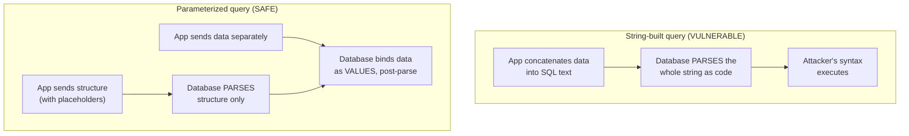

# Lecture 2 — Parameterized SQL as the Defense

> **Duration:** ~2 hours. **Outcome:** You can rewrite any string-built SQL query as a parameterized one in Python, explain precisely why parameterization is a *complete* fix and escaping is not, recognize the ORM APIs that silently reopen the same hole, and verify a fix by re-running your own attack payloads against it.

Lecture 1 showed you the disease. This lecture gives you the one cure that actually works — not "a good practice," not "one layer of many," the **correct, complete fix** for SQL injection. If you remember exactly one sentence from this entire course, a strong candidate is: *never build a SQL string by concatenating untrusted data into it — always send the data separately, as parameters.*

## 1. What "parameterized" actually means

A **parameterized query** (also called a **prepared statement**) separates the query's *structure* from its *data* at the API level, before either one reaches the database:

```python
# The structure -- with placeholders, no data
query = "SELECT id, username, is_admin FROM users WHERE username = ? AND password = ?"

# The data -- passed separately, never concatenated into the string above
db.execute(query, (username, password))
```

The `?` (SQLite/`pyodbc` style — PostgreSQL's `psycopg2` uses `%s`, named-parameter styles use `:name`) is a **placeholder**, not a piece of the SQL text. The database driver sends the query text and the parameter values to the database as **two separate messages**. The database parses and compiles the query structure *first*, with placeholders standing in for values yet to come — and only *then* substitutes the actual values, purely as data, into the already-compiled plan. There is no step where the database re-parses your password as if it might contain SQL syntax, because by the time your password arrives, parsing is already finished.

This is why parameterization isn't "escaping done well" — it's a structurally different operation. Escaping tries to neutralize dangerous characters *before* they enter a string that still gets parsed as code. Parameterization never lets the data enter that parse step **at all**.



## 2. Fixing Crunch Notes' login (VULN #1)

The vulnerable version, from Lecture 1:

```python
query = (
    "SELECT id, username, is_admin FROM users "
    f"WHERE username = '{username}' AND password = '{password}'"
)
row = db.execute(query).fetchone()
```

The fix — same logic, parameterized:

```python
query = "SELECT id, username, is_admin FROM users WHERE username = ? AND password = ?"
row = db.execute(query, (username, password)).fetchone()
```

Re-run last lecture's payload, `username = admin'-- `, against the fixed version. The database receives the **literal string** `admin'-- ` as the value to compare against the `username` column — not as SQL syntax to interpret. No row has a username that is literally `admin'-- ` (with the quote and dashes as actual characters), so the login correctly fails. The payload that bypassed authentication a page ago is now just... a wrong password attempt. That's the whole fix, and notice what *didn't* change: you didn't strip characters, didn't reject the input, didn't write a regex. You just stopped letting data pretend to be code.

## 3. Fixing Crunch Notes' search (VULN #2, the SQLi half)

```python
# VULNERABLE
query = f"SELECT title FROM notes WHERE title LIKE '%{q}%'"
rows = db.execute(query).fetchall()
```

Parameterizing a `LIKE` pattern means building the wildcard characters into the **value**, not the query text:

```python
# FIXED
query = "SELECT title FROM notes WHERE title LIKE ?"
pattern = f"%{q}%"          # wildcards added to the VALUE, still just data
rows = db.execute(query, (pattern,)).fetchall()
```

The `%` characters are now part of the bound parameter, not the SQL text — the database treats the whole `pattern` string, wildcards included, as an opaque value to match against, never as syntax. (Note: `/search`'s **reflected XSS** half — the `q|safe` in the template — is a separate bug in a separate context, fixed with output encoding in Lecture 3, not with parameterization. One route, two independent flaws, two independent fixes — a pattern you'll see constantly in real code.)

## 4. Why escaping is not enough

"Escaping" means transforming dangerous characters into a form the interpreter treats as literal data instead of syntax — for SQL, typically doubling single quotes (`'` becomes `''`) or using a driver's `escape_string()` function. It's a real technique, used correctly inside database drivers' own internals — but as something *you* do by hand or via a library function before building a query string, it fails for reasons that compound:

- **It's context-specific and easy to get subtly wrong.** The right escaping rules differ by database, by whether the value lands inside quotes vs. a numeric/identifier context (recall VULN #5's `id = {user_id}` — there's nothing to escape when there are no quotes to break out of), and by character encoding. Get any of that wrong and the escaping does nothing.
- **It's something you have to remember to do, every single time, at every single query.** Parameterization is structural — you can't "forget" to use a placeholder the way you can forget to call an escape function on one query out of two hundred.
- **Second-order injection defeats naive escaping entirely.** If you escape input on the way *in* but the database stores the *unescaped* original (common — you shouldn't be storing mangled data), then read that value back out and concatenate it into a **second** query later without escaping again, you've reintroduced the exact bug you thought you'd fixed. Parameterization has no equivalent failure mode, because it never depends on a one-time transformation of the string at all — you parameterize every query, every time, regardless of where the data came from.

**The rule that replaces all of this:** parameterize every query that includes any data that didn't come from a fixed, developer-written literal — full stop, no exceptions for "this one's probably fine."

## 5. ORM pitfalls — an ORM does not automatically save you

Object-relational mappers (SQLAlchemy, Django ORM, ActiveRecord, and similar) parameterize automatically **when you use their normal query-building API**. The danger is that every mainstream ORM also offers an escape hatch for raw SQL — and that escape hatch reopens the exact same hole if you build its string by hand:

```python
# SAFE -- SQLAlchemy's normal filter API parameterizes automatically
user = session.query(User).filter(User.username == username).first()

# VULNERABLE -- text() accepts a raw string; f-string interpolation defeats it
from sqlalchemy import text
result = session.execute(text(f"SELECT * FROM users WHERE username = '{username}'"))

# SAFE -- text() used CORRECTLY, with bound parameters
result = session.execute(text("SELECT * FROM users WHERE username = :u"), {"u": username})
```

The same trap exists in Django's `Model.objects.raw()` and `.extra()`, and in every ORM with a `.raw_sql()`-shaped door. **"We use an ORM" is not a security control by itself** — the control is "every query, including the ones that drop into raw SQL, passes data as bound parameters." Reviewing code for injection means specifically hunting for string formatting (`f"..."`, `.format()`, `%`, `+`) anywhere near a query-building call, ORM or not — that's exactly the review habit Week 11 formalizes.

## 6. Verifying the fix — proof, not confidence

A fix you haven't tested against the payload that broke it is a fix you're *hoping* works. This week's exercises have you build a small, reusable habit: keep a table of injection payloads and re-run every one of them against the fixed endpoint, recording the result.

```python
import sqlite3, requests

payloads = [
    ("sqli-comment-bypass", "admin'-- "),
    ("sqli-or-true", "' OR '1'='1"),
    ("sqli-union-probe", "' UNION SELECT 1,2,3-- "),
]

conn = sqlite3.connect("findings.db")
for name, payload in payloads:
    resp = requests.post("http://127.0.0.1:5000/login",
                          data={"username": payload, "password": "x"})
    blocked = "Welcome" not in resp.text     # did the payload NOT bypass auth?
    conn.execute(
        "INSERT INTO verifications (payload_name, payload, target, blocked) VALUES (?, ?, ?, ?)",
        (name, payload, "/login", blocked),
    )
conn.commit()
```

Query it back with plain SQL — `SELECT payload_name, blocked FROM verifications WHERE target = '/login'` — and you have something a code review comment saying "looks fixed to me" never gives you: **evidence**. Exercise 1 has you build exactly this, and the mini-project extends it across every endpoint in Crunch Notes.

## 7. Check yourself

- In your own words, why does sending the query structure and the data as two separate messages make injection structurally impossible, rather than just "harder"?
- Fix this query by hand, on paper: `f"SELECT * FROM orders WHERE customer_id = {cid}"`.
- Give two independent reasons escaping-by-hand fails as a primary defense, without repeating each other.
- What is second-order injection, and why does parameterization avoid it while a one-time input-escaping step doesn't?
- Name one raw-SQL escape hatch in a mainstream ORM, and explain how to use it safely.
- Why is "we re-ran the same payload that broke the old code and it's blocked now" stronger evidence of a fix than "I re-read the diff and it looks right"?

If those are automatic, you're ready to fix VULN #1 and #2 for real in Exercise 1. Lecture 3 shifts from the database to the browser — same underlying pattern, different interpreter.

## Further reading

- **OWASP — SQL Injection Prevention Cheat Sheet:** <https://cheatsheetseries.owasp.org/cheatsheets/SQL_Injection_Prevention_Cheat_Sheet.html>
- **OWASP — Query Parameterization Cheat Sheet:** <https://cheatsheetseries.owasp.org/cheatsheets/Query_Parameterization_Cheat_Sheet.html>
- **Python — `sqlite3`: SQL operations:** <https://docs.python.org/3/library/sqlite3.html#sqlite3-placeholders>
- **PostgreSQL — `psycopg` parameterized queries:** <https://www.psycopg.org/docs/usage.html#passing-parameters-to-sql-queries>
- **SQLAlchemy — Working with `text()` and bound parameters:** <https://docs.sqlalchemy.org/en/20/core/sqlelement.html#sqlalchemy.sql.expression.text>
- **MITRE CWE-89 — Improper Neutralization of Special Elements used in an SQL Command:** <https://cwe.mitre.org/data/definitions/89.html>
