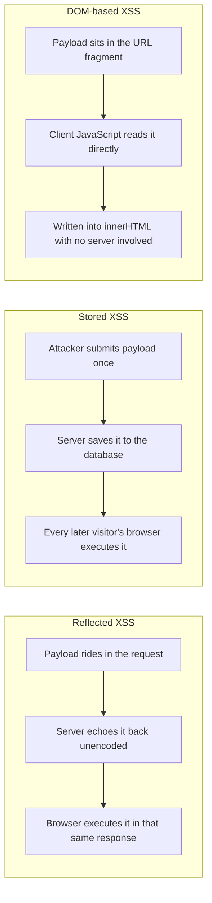
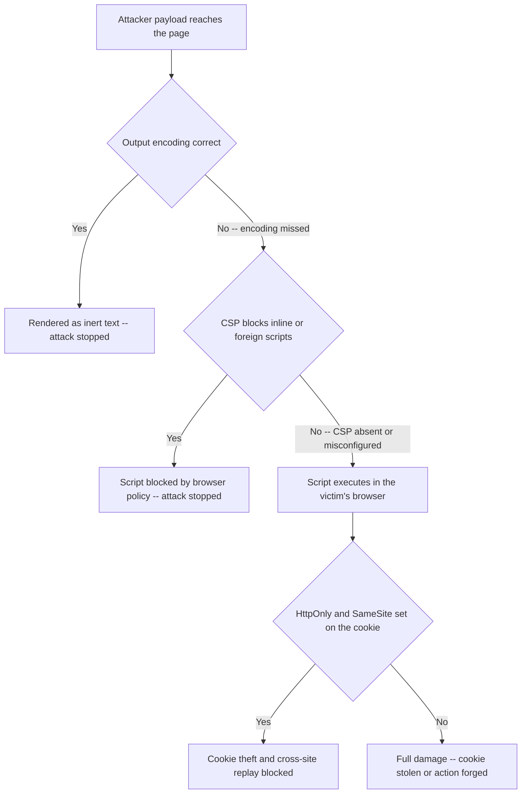

# Lecture 3 — XSS & Output Encoding

> **Duration:** ~2 hours. **Outcome:** You can distinguish reflected, stored, and DOM-based XSS by where the untrusted data flows; pick the correct output encoding for HTML-body, attribute, and JavaScript contexts; explain why autoescaping templates still get bypassed in practice; and describe CSP's role as a second, independent layer of defense.

Cross-site scripting is injection — the exact pattern from Lecture 1, aimed at a different interpreter. Instead of a SQL engine or a shell, the interpreter is **the victim's own browser**, and the "code" is HTML and JavaScript. That reframing matters: once you see XSS as "untrusted data crossing into the browser's HTML/JS interpreter without being kept separate from markup," the fix stops being a mystery — it's the same shape as Lecture 2's fix, applied to a different boundary: **encode the data for the specific context it's about to land in, so the browser can never confuse it for markup or script.**

## 1. Three flavors, one underlying bug

| Type | Where the untrusted data travels | Example in Crunch Notes |
|---|---|---|
| **Reflected** | Server receives it in the request, echoes it straight back in the *same* response, unencoded | VULN #2 — `/search?q=` echoed via `{{ q|safe }}` |
| **Stored** | Server saves it (database, file), then serves it back unencoded to *other* requests, possibly *other users*, later | VULN #3 — note bodies rendered via `{{ n['body']|safe }}` |
| **DOM-based** | Never touches the server at all — client-side JavaScript reads untrusted data (URL, `location.hash`) and writes it into the page unencoded | VULN #7 — `/welcome?name=` written into `innerHTML` |

Reflected and stored differ only in **how long the payload persists and who it reaches** — reflected needs the victim to click a crafted link right now; stored waits in the database and can hit every user who ever views the poisoned page, which is why stored XSS is generally considered more severe. DOM-based is different in kind: it can happen with **zero server involvement**, so server-side input validation and output encoding do nothing to stop it — the fix has to live in the client-side JavaScript itself (Section 5).


*Same underlying bug, three different paths the untrusted data takes to reach the browser's parser.*

## 2. Reflected XSS, traced through Crunch Notes' search

```python
return render_template_string(SEARCH_HTML, q=q, rows=rows)
```

```html
<p>Results for: {{ q|safe }}</p>
```

Jinja2 **autoescapes by default** — ordinarily `{{ q }}` would turn `<` into `&lt;` automatically, which is exactly the encoding this lecture is about to explain. The `|safe` filter explicitly **disables** that autoescaping for this one value — a real pattern, usually introduced by a developer who legitimately needed to render *some* trusted HTML somewhere and reached for `|safe` without noticing it also applied to untrusted user input on the same line, or copy-pasted a snippet without understanding what the filter does.

Visit `/search?q=<script>alert(document.cookie)</script>`. The server builds the page, and because `|safe` skips escaping, the raw `<script>` tag lands in the HTML exactly as written. The browser parses the response, sees a real `<script>` element, and executes it — with the same privileges as any other script on the page, including reading cookies and making requests as the logged-in user. **The server never distinguished "text I'm displaying" from "markup the browser should render"** — that distinction is the entire job of output encoding, and it was explicitly switched off.

## 3. Stored XSS, traced through Crunch Notes' notes

```html
{{ n['body']|safe }}
```

Post a note through `/notes/new` with `body = `. The `INSERT` is parameterized (no SQL injection here — see the comment in `app.py`), so the raw string, tags and all, lands in the `notes.body` column exactly as typed. Every later visit to `/notes` renders it with `|safe`, so **every visitor's browser executes it**, not just yours. This is the severity jump from reflected to stored: reflected requires tricking one victim into clicking a crafted link *right now*; stored just requires one attacker submitting a form once, and then it fires on autopilot for anyone who loads the page — including, in a real app, an administrator whose session cookie is now worth far more to steal than a regular user's.

## 4. Context-aware output encoding — the actual fix

**Output encoding** transforms data so the interpreter it's about to enter treats it as inert text, never as markup or code — the exact XSS analog of Lecture 2's parameterization. The critical detail: **the correct encoding depends entirely on which context the data lands in.** HTML-body encoding does not protect an HTML attribute; attribute encoding does not protect a `<script>` block. Get the context wrong and the encoding does nothing.

| Context | Example sink | Encode with |
|---|---|---|
| HTML body text | `<p>{data}</p>` | HTML-entity encode (`<` → `&lt;`, `>` → `&gt;`, `&` → `&amp;`, etc.) |
| HTML attribute value | `<input value="{data}">` | HTML-attribute encoding (entity-encode `"` too, or use a library that handles quoting) |
| Inside a `<script>` block | `<script>var x = "{data}";</script>` | JavaScript-string encoding — **not** HTML encoding, a different escape set entirely (`\"`, `\\`, `\n`, etc.) |
| URL / query parameter | `<a href="/go?u={data}">` | URL-encoding (percent-encoding) |
| CSS value | `div { color: {data}; }` | CSS encoding — and prefer not letting untrusted data reach CSS at all |

In Flask/Jinja2, the fix for both Crunch Notes bugs is simply **removing `|safe`** and letting the framework's default autoescaping do its job:

```html
<!-- FIXED: no |safe -- Jinja2 autoescapes {{ q }} and {{ n['body'] }} for HTML-body context -->
<p>Results for: {{ q }}</p>
...
<div>...<br>{{ n['body'] }}</div>
```

Now `<script>alert(1)</script>` renders as the *literal text* `&lt;script&gt;alert(1)&lt;/script&gt;` — visible on the page as text, never parsed as an element. The lesson generalizes past Jinja2: **React escapes by default** (`{data}` in JSX is safe; `dangerouslySetInnerHTML` is the explicit opt-out, named that way on purpose), **Django templates autoescape by default** (`{{ data|safe }}` and `` are the opt-outs), **Vue templates escape `{{ data }}` by default** (`v-html` is the opt-out). Every mainstream template engine's safety net has a name for its escape hatch, and every real-world stored/reflected XSS you'll ever triage traces back to someone using that escape hatch on data that turned out not to be trustworthy.

### When you actually need to render some HTML

Sometimes the requirement is real — a rich-text notes feature legitimately needs to allow `<b>` and `<a>` but not `<script>`. The correct tool is an **allowlist HTML sanitizer** (Python: `bleach`; JS: `DOMPurify`), which parses the markup and strips everything not on an explicit allowlist of safe tags/attributes — never a homemade regex trying to strip `<script>` tags, which is a blocklist problem with all of Lecture 1 Section 5's failure modes (nested tags, malformed markup that browsers "fix" differently than your regex expects, attribute-based vectors like `onerror=` on an allowed `` tag).

## 5. DOM-based XSS — the fix lives in JavaScript, not the server

VULN #7's entire bug is client-side:

```javascript
document.getElementById("greeting").innerHTML = "Hi, " + name + "!";
```

`innerHTML` is a **sink** — a browser API that parses its argument as HTML and inserts it into the live page. `name` comes from `location.search`, a **source** the attacker fully controls via the URL they send a victim. No server round-trip is involved at all: the vulnerable code runs entirely in the victim's browser, on data the browser itself handed to the script. Visit `/welcome?name=` and watch it fire — the server never even saw that payload; it was never part of any HTTP response body coming from Flask.

The fix is to stop treating untrusted text as HTML on the client:

```javascript
// FIXED -- textContent inserts data as literal text, never parsed as markup
document.getElementById("greeting").textContent = "Hi, " + name + "!";
```

`textContent` (or, in frameworks, the framework's default text-binding — JSX's `{data}`, Vue's `{{ data }}`) never invokes the HTML parser on its argument at all — there is no markup interpretation to exploit. Other common DOM sinks worth recognizing: `document.write()`, `eval()`, `setTimeout(string, ...)`, `element.outerHTML`, and jQuery's `$(userInput)` / `.html()`. The common thread across all DOM XSS fixes: **stop asking the browser to parse untrusted data as markup or code; ask it to display or store the data as plain text instead.**

## 6. Content Security Policy — a second, independent layer

**CSP** is an HTTP response header that tells the browser which sources of script, style, and other resources are allowed to execute on a page — a policy the browser itself enforces, on top of whatever the page's HTML contains:

```
Content-Security-Policy: default-src 'self'; script-src 'self'; object-src 'none'
```

With a policy like this, even if an attacker *does* get a `<script>` tag injected onto the page (encoding missed somewhere, a sanitizer bug, a third-party widget with its own flaw), the browser refuses to execute inline scripts or scripts from any origin other than the page's own — the attack still fails, at a completely different layer than output encoding. That's the point of calling CSP **defense-in-depth**, not the primary fix: it's a safety net that catches encoding mistakes, not a substitute for making the encoding correct in the first place. A strict CSP typically also blocks **inline** `<script>` and `onclick="..."`-style inline event handlers entirely, forcing scripts into separate files or `nonce`-tagged blocks — which independently makes a whole class of reflected/stored XSS payloads (the ones that rely on inline `<script>` or `onerror=`) stop working even before you've fixed the encoding bug that let them in.

One more layer worth naming here, even though it doesn't stop XSS from executing: cookie flags. `HttpOnly` on a session cookie stops JavaScript (including injected JavaScript) from reading it via `document.cookie` at all, and `SameSite=Lax`/`Strict` limits when that cookie is sent on cross-site requests. Neither flag fixes an XSS bug — but both reduce what a successful XSS payload can actually accomplish, which is exactly the damage-limitation mindset this course has drilled since Week 1's attacker/defender framing.


*Each layer only has to catch what the layer before it missed -- that is what "defense in depth" means.*

## 7. Check yourself

- Explain, in one sentence each, what distinguishes reflected, stored, and DOM-based XSS by *where the data travels*, not by what the payload looks like.
- Why does removing `|safe` fix both `/search` and `/notes` in Crunch Notes, and what exactly does Jinja2 do differently once autoescaping is back on?
- Why is HTML-body encoding insufficient to protect a value placed inside a `<script>` block?
- What is a DOM XSS "sink," and name two beyond `innerHTML`.
- Why is `bleach`/`DOMPurify` the right tool when you need to allow *some* HTML, instead of a regex that strips `<script>` tags?
- Explain why CSP is called "defense-in-depth" rather than "the fix" for XSS, using a concrete scenario where CSP saves you and output encoding alone wouldn't have.

If those are automatic, Exercise 3 has you exploit and fix VULN #3 for real, with VULN #2 and #7 as a stretch goal using exactly this lecture's rules.

## Further reading

- **OWASP — Cross Site Scripting Prevention Cheat Sheet:** <https://cheatsheetseries.owasp.org/cheatsheets/Cross_Site_Scripting_Prevention_Cheat_Sheet.html>
- **OWASP — DOM based XSS Prevention Cheat Sheet:** <https://cheatsheetseries.owasp.org/cheatsheets/DOM_based_XSS_Prevention_Cheat_Sheet.html>
- **MDN — Content Security Policy (CSP):** <https://developer.mozilla.org/en-US/docs/Web/HTTP/CSP>
- **Flask/Jinja2 — Autoescaping:** <https://jinja.palletsprojects.com/en/stable/templates/#html-escaping>
- **DOMPurify — official repository:** <https://github.com/cure53/DOMPurify>
- **`bleach` (Python HTML sanitizer) — official docs:** <https://bleach.readthedocs.io/>
- **MDN — Set-Cookie: the `HttpOnly`, `Secure`, and `SameSite` attributes:** <https://developer.mozilla.org/en-US/docs/Web/HTTP/Headers/Set-Cookie>
