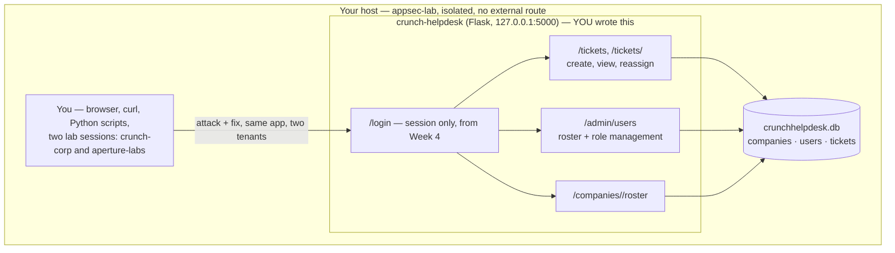

# Week 6 — Access Control & Authorization

> **Goal:** by Sunday you can take an app that checks "are you logged in?" and nothing else, and rebuild it so every single server-side request asks the *real* question — "are you logged in **as someone allowed to do this, to this exact object**?" — with a documented RBAC/ABAC model, ownership checks on every object route, and a data-driven test matrix that proves it, row by row, in SQL.

Welcome back to **C50 · Crunch AppSec**. Week 3 introduced A01 Broken Access Control as one line in a ten-category survey. This week it gets the full week it deserves, because in real breach data it earns one: broken access control has topped the OWASP Top 10 since 2021, and the two failure shapes behind most of those breaches — **IDOR** (fetch someone else's object by guessing or changing an ID) and **privilege escalation** (do something your role was never granted) — are conceptually simple and devastatingly common, because "did I remember to check *this specific* thing" is exactly the kind of check that's easy to skip once, on one route, under deadline pressure, and never notice.

The core idea this week is a distinction most junior code misses entirely: **authentication answers "who are you," authorization answers "what are you allowed to do."** A login screen only answers the first question. Every route that touches data or performs an action has to answer the second one too, **on every request, on the server, checked against the actual object being accessed** — never inferred from what the client claims, never cached from an earlier check, and never left to "well, the UI doesn't show that button to this role" (a client-side hidden button stops nothing; the server is the only place authorization is real).

> **Ethics & legality — binding, every week.** All work below is **authorized, legal, defensive-minded** security practice performed **only inside your isolated `appsec-lab`** from Week 1 — against `crunch-helpdesk`, an app **you write, own, and run only on `127.0.0.1`**, populated entirely with fictional companies, fictional users, and fictional tickets you generate yourself. You will never be given instructions aimed at an authorization boundary you don't own or don't have explicit written authorization to test. Every IDOR and every privilege-escalation path demonstrated here is demonstrated against your own local target, and every single one is immediately paired with a source-level fix and a re-test recorded as evidence — you never leave a flaw "shown but not closed." Written authorization, defined scope, and the law govern every exercise this week and every week after it.

## Learning objectives

By the end of this week, you will be able to:

- **Separate authentication from authorization** and explain, precisely, why a route that only checks `if "user_id" in session` has answered just the first of the two questions every protected route must answer.
- **Model access with RBAC and ABAC**, choose between them (or combine them) for a given feature, and express the policy in a form that stays maintainable as the app grows past a handful of roles.
- **Enforce deny-by-default authorization on every server-side request** — no route is implicitly allowed; every route explicitly states who may reach it, and an unmatched case is a `403`, never a `200`.
- **Find and fix IDOR and horizontal/vertical privilege escalation** in a real Flask + SQLite app, at the source, by adding the ownership and role checks the original code silently skipped.
- **Test authorization systematically** with a data-driven "role × resource × action" matrix instead of a handful of manual clicks — the only method that actually proves coverage rather than sampling it.

## Prerequisites

- **Week 1 completed** — your isolated `appsec-lab` Docker network is up and verified.
- **Week 3 (OWASP Top 10)** strongly recommended — this week is the full-depth version of A01 Broken Access Control, which Week 3 only introduced in `crunch-notes`'s `/notes/<note_id>` and `/admin/users` routes.
- **Week 4 (Authentication)** helpful — this week assumes you already know how to check "is there a valid session," and builds the "is this session allowed to do *this*" layer on top of it.
- Python 3.10+, `pip`, and `sqlite3` (ships with Python). Comfortable reading and writing ~30-line Flask route handlers.

## This week's lab: `crunch-helpdesk`

Every lecture, exercise, challenge, and the mini-project all point at the same small app: a **multi-tenant support-ticket system**. Two fictional companies (`crunch-corp` and `aperture-labs`) share one deployment, each with its own users and its own tickets — the shape of nearly every real B2B SaaS product, and exactly the shape that makes access control both essential and easy to get wrong.



Two companies, on purpose: every exercise this week has you log in as a **member of Crunch Corp** and try to reach **Aperture Labs's** data, and as a **low-privilege member** try to reach an **admin-only** action — the exact two failure shapes (horizontal and vertical escalation) this week's lectures name.

### Set it up once (do this before Lecture 1)

```bash
mkdir -p crunch-helpdesk && cd crunch-helpdesk
python3 -m venv .venv && source .venv/bin/activate
pip install flask==3.0.3
```

`schema.sql`:

```sql
CREATE TABLE companies (
    id   INTEGER PRIMARY KEY,
    name TEXT NOT NULL UNIQUE
);

CREATE TABLE users (
    id         INTEGER PRIMARY KEY,
    company_id INTEGER NOT NULL REFERENCES companies(id),
    username   TEXT NOT NULL UNIQUE,
    password   TEXT NOT NULL,                 -- plaintext lab-only stand-in; Week 4 covers real storage
    role       TEXT NOT NULL DEFAULT 'member'  -- 'member' | 'agent' | 'manager' | 'admin'
        CHECK (role IN ('member','agent','manager','admin'))
);

CREATE TABLE tickets (
    id           INTEGER PRIMARY KEY,
    company_id   INTEGER NOT NULL REFERENCES companies(id),
    created_by   INTEGER NOT NULL REFERENCES users(id),
    assigned_to  INTEGER REFERENCES users(id),
    subject      TEXT NOT NULL,
    body         TEXT NOT NULL,
    status       TEXT NOT NULL DEFAULT 'open' CHECK (status IN ('open','in_progress','closed')),
    created_at   TEXT NOT NULL DEFAULT (datetime('now'))
);
```

`seed.py`:

```python
import sqlite3

db = sqlite3.connect("crunchhelpdesk.db")
db.executescript(open("schema.sql").read())

db.executemany(
    "INSERT INTO companies (id, name) VALUES (?, ?)",
    [(1, "crunch-corp"), (2, "aperture-labs")],
)

db.executemany(
    "INSERT INTO users (id, company_id, username, password, role) VALUES (?, ?, ?, ?, ?)",
    [
        (1, 1, "cc-alice",   "labpass1", "member"),   # crunch-corp, ordinary member
        (2, 1, "cc-bob",     "labpass1", "agent"),    # crunch-corp, support agent
        (3, 1, "cc-carol",   "labpass1", "manager"),  # crunch-corp, manager
        (4, 1, "cc-dave",    "labpass1", "admin"),    # crunch-corp, admin
        (5, 2, "al-erin",    "labpass1", "member"),   # aperture-labs, ordinary member
        (6, 2, "al-frank",   "labpass1", "agent"),    # aperture-labs, support agent
        (7, 2, "al-grace",   "labpass1", "manager"),  # aperture-labs, manager
        (8, 2, "al-heidi",   "labpass1", "admin"),    # aperture-labs, admin
    ],
)

db.executemany(
    "INSERT INTO tickets (id, company_id, created_by, assigned_to, subject, body, status) VALUES (?, ?, ?, ?, ?, ?, ?)",
    [
        (1, 1, 1, 2, "VPN keeps dropping",        "Disconnects every ~20 minutes on the office wifi.", "open"),
        (2, 1, 3, 2, "Payroll export is wrong",     "Q2 export double-counted three contractors.",       "in_progress"),
        (3, 1, 1, None, "Can't reset my password",  "Reset email never arrives, checked spam.",          "open"),
        (4, 2, 5, 6, "Lab sensor offline",          "Sensor 4B stopped reporting readings at 03:00.",    "open"),
        (5, 2, 7, 6, "Vendor contract renewal",      "Need the signed PDF before Friday's board call.",   "in_progress"),
    ],
)
db.commit()
db.close()
print("seeded crunchhelpdesk.db — 2 companies, 8 users, 5 tickets")
```

`app.py` — the full app; each lecture below walks through one or more of its marked `# VULNERABLE` lines:

```python
import sqlite3

from flask import Flask, g, jsonify, request, session

app = Flask(__name__)
app.config["SECRET_KEY"] = "lab-only-dev-key"
DB_PATH = "crunchhelpdesk.db"


def get_db():
    if "db" not in g:
        g.db = sqlite3.connect(DB_PATH)
        g.db.row_factory = sqlite3.Row
    return g.db


@app.teardown_appcontext
def close_db(exception=None):
    db = g.pop("db", None)
    if db is not None:
        db.close()


@app.route("/login", methods=["POST"])
def login():
    username = request.form["username"]
    password = request.form["password"]
    row = get_db().execute(
        "SELECT * FROM users WHERE username = ? AND password = ?", (username, password)
    ).fetchone()
    if row is None:
        return jsonify(error="invalid credentials"), 401
    session["user_id"] = row["id"]
    session["company_id"] = row["company_id"]
    session["role"] = row["role"]
    return jsonify(message=f"welcome {row['username']}", role=row["role"])


@app.route("/tickets/<ticket_id>")
def get_ticket(ticket_id):
    if "user_id" not in session:
        return jsonify(error="login required"), 401
    # VULNERABLE (IDOR) — fetches by ID alone. No check that this ticket's
    # company_id matches session['company_id'], let alone that this user
    # created or is assigned to it. Any authenticated user can read any
    # ticket at any company by walking the integer ID.
    row = get_db().execute("SELECT * FROM tickets WHERE id = ?", (ticket_id,)).fetchone()
    if row is None:
        return jsonify(error="not found"), 404
    return jsonify(dict(row))


@app.route("/tickets")
def list_tickets():
    if "user_id" not in session:
        return jsonify(error="login required"), 401
    # VULNERABLE (missing tenant filter) — every authenticated user sees
    # every ticket at every company, regardless of role.
    rows = get_db().execute("SELECT * FROM tickets").fetchall()
    return jsonify([dict(r) for r in rows])


@app.route("/tickets/<ticket_id>/reassign", methods=["POST"])
def reassign_ticket(ticket_id):
    if "user_id" not in session:
        return jsonify(error="login required"), 401
    # VULNERABLE (vertical escalation) — reassigning who owns a ticket is a
    # manager-level action. This route checks only that *someone* is logged
    # in, never the caller's role, so a plain 'member' can reassign anyone's
    # ticket to anyone.
    new_owner = request.form["assigned_to"]
    get_db().execute(
        "UPDATE tickets SET assigned_to = ? WHERE id = ?", (new_owner, ticket_id)
    )
    get_db().commit()
    return jsonify(message=f"ticket {ticket_id} reassigned to user {new_owner}")


@app.route("/admin/users")
def admin_users():
    # VULNERABLE (vertical escalation) — checks login, never role. Any
    # authenticated user, including the lowest-privilege 'member', can list
    # every user at every company, admins included.
    if "user_id" not in session:
        return jsonify(error="login required"), 401
    rows = get_db().execute("SELECT id, company_id, username, role FROM users").fetchall()
    return jsonify([dict(r) for r in rows])


@app.route("/admin/users/<user_id>/promote", methods=["POST"])
def promote_user(user_id):
    # VULNERABLE (vertical + horizontal escalation) — checks login, never
    # role, and never company. A member at crunch-corp can promote a user
    # at aperture-labs to 'admin'.
    if "user_id" not in session:
        return jsonify(error="login required"), 401
    new_role = request.form["role"]
    get_db().execute("UPDATE users SET role = ? WHERE id = ?", (new_role, user_id))
    get_db().commit()
    return jsonify(message=f"user {user_id} promoted to {new_role}")


@app.route("/companies/<company_id>/roster")
def company_roster(company_id):
    if "user_id" not in session:
        return jsonify(error="login required"), 401
    # VULNERABLE (IDOR, multi-tenant) — takes company_id from the URL, never
    # compares it to session['company_id']. Any logged-in user at any
    # company can read any other company's full user roster.
    rows = get_db().execute(
        "SELECT id, username, role FROM users WHERE company_id = ?", (company_id,)
    ).fetchall()
    return jsonify([dict(r) for r in rows])


if __name__ == "__main__":
    app.run(host="127.0.0.1", port=5000, debug=True)
```

```bash
python3 seed.py
python3 app.py
```

Sanity check — this should return `{"message":"welcome cc-alice","role":"member"}`:

```bash
curl -s -c cc-alice.txt -X POST http://127.0.0.1:5000/login -d "username=cc-alice&password=labpass1"
```

Six flaws, one file, two failure shapes — that's the map for the whole week:

| Route | Flaw | Failure shape | Covered in |
|---|---|---|---|
| `/tickets/<id>` | fetch by ID, no company/ownership check | IDOR, cross-tenant | Lecture 2 |
| `/tickets` (list) | no tenant filter at all | IDOR, cross-tenant | Lecture 2 |
| `/companies/<id>/roster` | URL `company_id` never compared to session | IDOR, multi-tenant | Lecture 2 |
| `/tickets/<id>/reassign` | login checked, role never checked | Vertical escalation | Lecture 3 |
| `/admin/users` | login checked, role never checked | Vertical escalation | Lecture 3 |
| `/admin/users/<id>/promote` | login checked; role and company never checked | Vertical **and** horizontal escalation | Lecture 3 |

## This week's map

Work top to bottom. Each piece assumes the ones before it.

| # | File | What's inside | ~Time |
|--:|------|---------------|------:|
| 1 | [lecture-notes/01-authz-models-rbac-and-abac.md](./lecture-notes/01-authz-models-rbac-and-abac.md) | Authn vs. authz; RBAC roles/permissions; ABAC attributes/policies; choosing and combining the two | 2h |
| 2 | [lecture-notes/02-idor-and-object-level-authz.md](./lecture-notes/02-idor-and-object-level-authz.md) | Why object references leak; exploiting `/tickets/<id>` and the roster route in the lab; ownership-check patterns | 2h |
| 3 | [lecture-notes/03-privilege-escalation-and-fail-closed.md](./lecture-notes/03-privilege-escalation-and-fail-closed.md) | Horizontal vs. vertical escalation; missing function-level checks; deny-by-default design | 2h |
| 4 | [exercises/exercise-01-exploit-and-fix-idor.md](./exercises/exercise-01-exploit-and-fix-idor.md) | Exploit the cross-tenant IDOR, record evidence, fix with ownership checks, re-test | 1.5h |
| 5 | [exercises/exercise-02-implement-rbac.md](./exercises/exercise-02-implement-rbac.md) | Build a role-permission matrix in SQLite; write a `@require_role` decorator; lock down the admin and reassign routes | 1.5h |
| 6 | [exercises/exercise-03-authz-test-matrix.md](./exercises/exercise-03-authz-test-matrix.md) | Build a data-driven role × resource × action test matrix; run it against every route; log pass/fail to SQLite | 1.5h |
| 7 | [challenges/challenge-01-close-privilege-escalation.md](./challenges/challenge-01-close-privilege-escalation.md) | A subtler escalation bug hidden in a new route, far less hand-holding | 1.5h |
| 8 | [challenges/challenge-02-multi-tenant-isolation.md](./challenges/challenge-02-multi-tenant-isolation.md) | Prove — and enforce — zero cross-tenant leakage across every route, systematically | 1.5h |
| 9 | [mini-project/README.md](./mini-project/README.md) | Rebuild `crunch-helpdesk`'s authorization to fail closed, end to end, with a proof matrix | 3h |
| 10 | [homework.md](./homework.md) | Extra practice, spread across the week | 5h |
| 11 | [quiz.md](./quiz.md) | 15 self-check questions + answer key | 1h |
| 12 | [resources.md](./resources.md) | Official docs, standards, and the few links worth your time | — |

## Weekly schedule

Adds up to roughly the course's full-time pace of **~28 hours**. Treat it as a target, not a stopwatch.

| Day | Focus | Lectures | Exercises | Challenges | Quiz/Read | Homework | Mini-Project | Daily Total |
|-----------|------------------------------------------|---------:|----------:|-----------:|----------:|---------:|-------------:|------------:|
| Monday | Authz models — RBAC & ABAC | 2h | 0h | 0h | 0.5h | 1h | 0h | 3.5h |
| Tuesday | IDOR & object-level authz | 2h | 1.5h | 0h | 0.5h | 1h | 0h | 5h |
| Wednesday | Privilege escalation & fail-closed | 2h | 1.5h | 0h | 0.5h | 1h | 0h | 5h |
| Thursday | RBAC implementation + test matrix | 0h | 1.5h | 0h | 0.5h | 1h | 0.5h | 3.5h |
| Friday | Escalation challenge + tenant isolation | 0h | 0h | 3h | 0.5h | 1h | 0.5h | 5h |
| Saturday | Mini-project | 0h | 0h | 0h | 0h | 0h | 2h | 2h |
| Sunday | Quiz + review | 0h | 0h | 0h | 1h | 0h | 0h | 1h |
| **Total** | | **6h** | **4.5h** | **3h** | **3.5h** | **5h** | **3h** | **25h** |

## By the end of this week you can…

- Look at any route handler and answer, in order, both questions it must answer: "who is this?" (authentication) and "is *this specific* action, on *this specific* object, allowed for them?" (authorization) — and name which one a given line of code is checking.
- Choose RBAC, ABAC, or a hybrid for a given feature, and justify the choice by how the access rule actually varies (by role alone, or by role plus resource attributes like ownership and tenant).
- Find an IDOR by testing what happens when you change nothing but the ID in a request, and fix it with a query that filters by owner **in the `WHERE` clause**, not an `if` check applied after the fact.
- Tell horizontal escalation (same role, someone else's data) from vertical escalation (a higher role's action) in one sentence each, and close both with the same underlying discipline: deny by default, allow explicitly.
- Build and run a role × resource × action test matrix in SQL/Python that proves — with rows of evidence, not a memory of manual clicking — that every route enforces exactly the policy you intended.

## Up next

[Week 7 — Cryptography basics for developers](../week-07-cryptography-basics-for-developers/) — you've locked down *who* can do *what*; next week is about protecting the data itself, at rest and in transit, when access control alone isn't enough.

---

*Part of the Code Crunch Worldwide open curriculum · GPL-3.0 · If you find errors, please open an issue or PR.*
