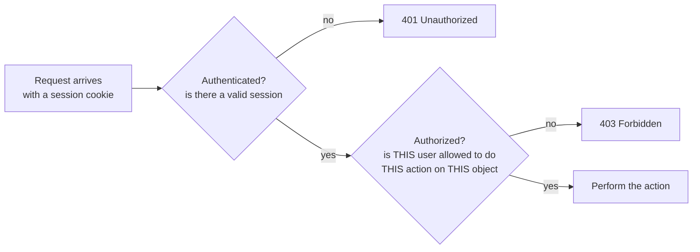
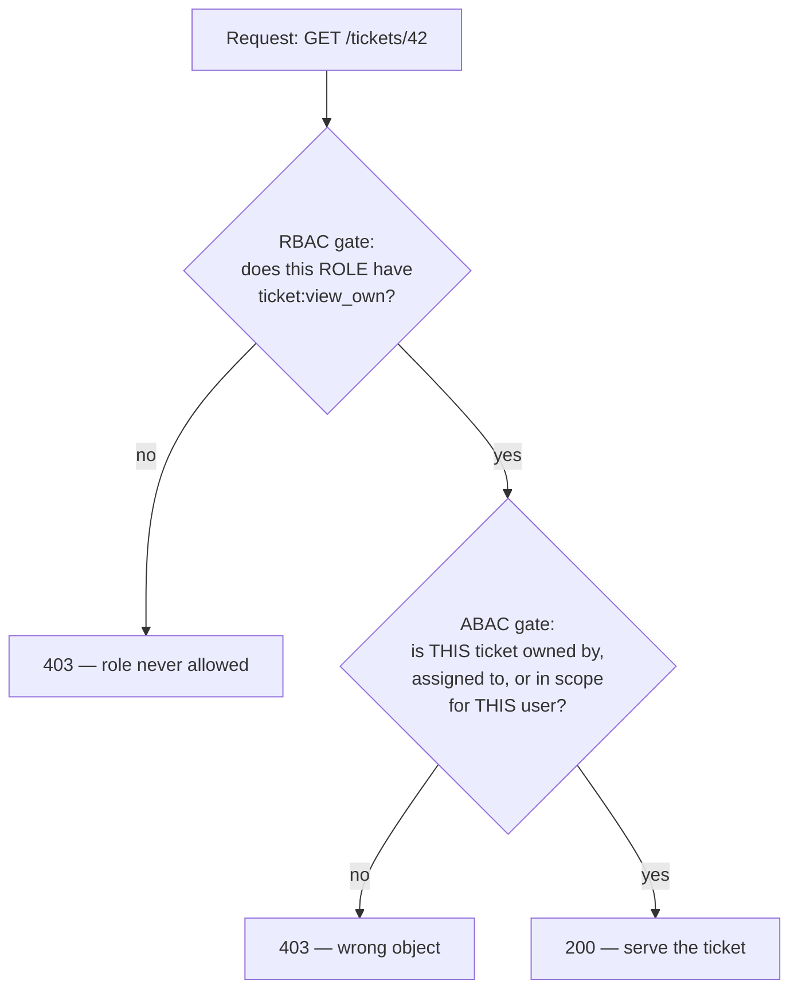

# Lecture 1 — Authorization Models: RBAC & ABAC

> **Duration:** ~2 hours. **Outcome:** You can state, precisely, the difference between authentication and authorization; design a role-permission matrix for a real app; write a simple attribute-based policy that RBAC alone can't express; and choose between the two (or combine them) for a given feature, with a reason you could defend in a design review.

> **Lab reminder.** Every example below runs against `crunch-helpdesk`, the multi-tenant app you set up in this week's [README](../README.md) — your own Flask process, your own SQLite file, two fictional companies you seeded yourself. Nothing here is aimed at a system you don't own.

## 1. Two questions, not one

Every protected action in a web app answers two separate questions, in order:

1. **Authentication — "who are you?"** Verified identity: a valid session, a valid token, a valid API key. Week 4 was entirely about getting this right.
2. **Authorization — "are you allowed to do *this*?"** A policy decision: given who you are (and, often, what you're trying to touch), is this specific action permitted?

The bug this week exists to kill is treating question 1's answer as if it also answered question 2. Look at `crunch-helpdesk`'s `/admin/users` route from the README:

```python
@app.route("/admin/users")
def admin_users():
    if "user_id" not in session:          # answers "who are you?"
        return jsonify(error="login required"), 401
    rows = get_db().execute("SELECT id, company_id, username, role FROM users").fetchall()
    return jsonify([dict(r) for r in rows])   # never answered "are you allowed to see this?"
```

`if "user_id" not in session` is a **complete, correct** authentication check — it proves a real, logged-in user is making this request. It is **zero percent** of an authorization check — it says nothing about whether *this* user, with *this* role, should be allowed to list every user at every company. That gap — a real login gate with no authorization gate behind it — is the single most common shape of A01 Broken Access Control, and it's the shape you'll spend this whole week closing.


*Two gates, not one. `crunch-helpdesk`'s vulnerable routes stop after the first gate — this week rebuilds the second one, on every route.*

## 2. RBAC — role-based access control

**RBAC**'s idea: group users into **roles**, group allowed actions into **permissions**, and grant permissions to roles rather than to individual users. A user's access is entirely determined by which role(s) they hold.

`crunch-helpdesk` already has four roles seeded into the `users` table: `member`, `agent`, `manager`, `admin`. The design work is deciding, explicitly, what each role can do — written down as a table, not left as an assumption in each developer's head:

| Permission | member | agent | manager | admin |
|---|:---:|:---:|:---:|:---:|
| create a ticket | ✅ | ✅ | ✅ | ✅ |
| view own tickets | ✅ | ✅ | ✅ | ✅ |
| view tickets assigned to them | — | ✅ | ✅ | ✅ |
| view **all** tickets at their company | — | — | ✅ | ✅ |
| reassign a ticket | — | — | ✅ | ✅ |
| view the company user roster | — | — | ✅ | ✅ |
| promote/demote a user's role | — | — | — | ✅ |
| view users at **other** companies | — | — | — | — |

That last row matters: **no role** grants cross-company access — that's not a role permission at all, it's a tenant boundary, which Section 4 covers separately. Notice the table is a genuine matrix, not a hierarchy where each role simply inherits the one below it — a `manager` can reassign tickets but an `agent` cannot, even though both can view assigned tickets. Don't assume a strict ladder; write down the real matrix.

### 2.1 Modeling it as data, not `if`-chains

The naive RBAC implementation is a wall of `if session["role"] == "admin" or session["role"] == "manager":` scattered across every route — it works at first and rots fast, because the *same* logic gets re-typed, slightly differently, in a dozen places, and one typo silently opens a hole. The maintainable version stores the matrix as data:

```sql
CREATE TABLE roles (
    role_name TEXT PRIMARY KEY
);

CREATE TABLE permissions (
    permission_name TEXT PRIMARY KEY  -- e.g. 'ticket:reassign', 'user:promote'
);

CREATE TABLE role_permissions (
    role_name       TEXT NOT NULL REFERENCES roles(role_name),
    permission_name TEXT NOT NULL REFERENCES permissions(permission_name),
    PRIMARY KEY (role_name, permission_name)
);

INSERT INTO roles VALUES ('member'), ('agent'), ('manager'), ('admin');

INSERT INTO permissions VALUES
    ('ticket:create'), ('ticket:view_own'), ('ticket:view_assigned'),
    ('ticket:view_company'), ('ticket:reassign'),
    ('roster:view'), ('user:promote');

INSERT INTO role_permissions VALUES
    ('member',  'ticket:create'), ('member',  'ticket:view_own'),
    ('agent',   'ticket:create'), ('agent',   'ticket:view_own'), ('agent',   'ticket:view_assigned'),
    ('manager', 'ticket:create'), ('manager', 'ticket:view_own'), ('manager', 'ticket:view_assigned'),
    ('manager', 'ticket:view_company'), ('manager', 'ticket:reassign'), ('manager', 'roster:view'),
    ('admin',   'ticket:create'), ('admin',   'ticket:view_own'), ('admin',   'ticket:view_assigned'),
    ('admin',   'ticket:view_company'), ('admin',   'ticket:reassign'), ('admin',   'roster:view'),
    ('admin',   'user:promote');
```

One query answers "can this role do this?" — and it's the *same* query everywhere, not a re-typed condition:

```sql
SELECT EXISTS (
    SELECT 1 FROM role_permissions
    WHERE role_name = ? AND permission_name = ?
) AS allowed;
```

A single Python decorator wraps that query and becomes the enforcement point for every route (Exercise 2 builds this out fully):

```python
from functools import wraps

def require_permission(permission_name):
    def decorator(view_func):
        @wraps(view_func)
        def wrapped(*args, **kwargs):
            if "role" not in session:
                return jsonify(error="login required"), 401
            allowed = get_db().execute(
                "SELECT EXISTS (SELECT 1 FROM role_permissions "
                "WHERE role_name = ? AND permission_name = ?)",
                (session["role"], permission_name),
            ).fetchone()[0]
            if not allowed:
                return jsonify(error="forbidden"), 403
            return view_func(*args, **kwargs)
        return wrapped
    return decorator

@app.route("/tickets/<ticket_id>/reassign", methods=["POST"])
@require_permission("ticket:reassign")
def reassign_ticket(ticket_id):
    ...
```

Change the policy by editing rows in `role_permissions`, never by hunting through route handlers for scattered `if` statements. That's RBAC's core strength: **one source of truth, one enforcement point, trivially auditable** — `SELECT * FROM role_permissions WHERE role_name = 'agent'` *is* the complete, current answer to "what can an agent do," no code reading required.

### 2.2 Where RBAC runs out of road

RBAC answers "what can this **role** do" — it has no native concept of *which specific object*. `ticket:view_own` is a permission name, but nothing in the `role_permissions` table says "own" means "where `tickets.created_by` equals *this* user's ID, and `tickets.company_id` equals *this* user's company." That distinction — role-level "can they do this kind of thing at all" versus object-level "can they do it to *this* object" — is exactly the seam Lecture 2 spends the whole lecture on. RBAC alone also strains when a rule depends on something that isn't a role at all: "only during business hours," "only from a company-managed device," "only if the ticket is still `open`." Modeling every one of those as a new role (`manager-business-hours`, `manager-open-tickets-only`) causes **role explosion** — the classic RBAC failure mode where the role table grows faster than the actual policy complexity, because roles are the only lever RBAC gives you.

## 3. ABAC — attribute-based access control

**ABAC**'s idea: instead of (or alongside) roles, write policies as boolean expressions over **attributes** of the subject (the user), the resource (the object), the action, and sometimes the environment (time, IP, device). NIST SP 800-162 formalizes this as the reference model this course's ABAC treatment follows.

| Attribute category | Example, in `crunch-helpdesk` terms |
|---|---|
| Subject | `user.id`, `user.role`, `user.company_id` |
| Resource | `ticket.id`, `ticket.company_id`, `ticket.created_by`, `ticket.assigned_to` |
| Action | `view`, `reassign`, `promote` |
| Environment | request time, source IP, whether MFA was used this session |

An ABAC rule is a function of all four, evaluated **per request, against the actual object**, not looked up once from a role table:

```python
def can_view_ticket(user: dict, ticket: dict) -> bool:
    # Attribute-based rule: same tenant, AND (owns it OR assigned to it OR high-privilege role)
    if user["company_id"] != ticket["company_id"]:
        return False
    if user["id"] == ticket["created_by"]:
        return True
    if user["id"] == ticket["assigned_to"]:
        return True
    if user["role"] in ("manager", "admin"):
        return True
    return False
```

Notice what this function expresses that the pure RBAC table in Section 2 physically cannot: `user["company_id"] != ticket["company_id"]` is the multi-tenant boundary check, and `user["id"] == ticket["created_by"]` is the *ownership* check — both are comparisons against **this specific resource's attributes**, not lookups in a static role table. This is precisely the check missing from `crunch-helpdesk`'s vulnerable `/tickets/<id>` route, and precisely what Lecture 2 teaches you to add back.

### 3.1 RBAC and ABAC together — the pattern this course uses

In practice, mature systems rarely pick one exclusively — they use RBAC for the coarse "what kind of action is this role even allowed to attempt" question, and ABAC-style object checks for the fine "is this specific object theirs to touch" question, applied in that order:

```python
@app.route("/tickets/<ticket_id>")
@require_permission("ticket:view_own")   # RBAC gate: can this role view tickets AT ALL
def get_ticket(ticket_id):
    ticket = get_db().execute("SELECT * FROM tickets WHERE id = ?", (ticket_id,)).fetchone()
    if ticket is None:
        return jsonify(error="not found"), 404
    user = {"id": session["user_id"], "company_id": session["company_id"], "role": session["role"]}
    if not can_view_ticket(user, dict(ticket)):   # ABAC gate: is THIS ticket theirs to view
        return jsonify(error="forbidden"), 403
    return jsonify(dict(ticket))
```

RBAC decides the *category* of access fast, cheaply, and auditably; ABAC decides the *instance*. Skip the RBAC gate and every request pays the cost of an object-level check even for roles that should never reach the route at all; skip the ABAC gate — as `crunch-helpdesk`'s current code does — and RBAC's "the role is allowed to view tickets" silently becomes "the role can view *anyone's* ticket," which is the exact IDOR Lecture 2 exploits.



## 4. Multi-tenancy is its own attribute, always checked

`company_id` deserves special emphasis because it's the attribute every route in a multi-tenant app must check, regardless of role or permission — an `admin` at `crunch-corp` should never see `aperture-labs`'s data, full stop, no permission grants that. Treat tenant isolation as a **mandatory floor check that runs before any role or ownership logic**, not as one more attribute among many:

```python
def enforce_tenant(user: dict, resource: dict) -> None:
    """Raise before any other check runs. Call this first, every time, no exceptions."""
    if user["company_id"] != resource["company_id"]:
        abort(403)
```

Section 3's `can_view_ticket` already folds this in as its first check — that ordering is deliberate and required: a role or ownership match can never override a tenant mismatch. Challenge 2 this week makes you prove, systematically, that this floor holds on **every** route, not just the ones you remembered to think about.

## 5. Choosing between them — a decision, not a preference

| Situation | Reach for |
|---|---|
| A small, stable number of access levels (member/agent/manager/admin) that map cleanly to job function | RBAC |
| Access depends on *which specific object* — ownership, tenant, assignment | ABAC (object-level check) |
| A rule depends on something that isn't identity at all — time, device, request origin | ABAC |
| You need a fast, auditable answer to "what can this role do" without touching the database per-object | RBAC |
| Both are true at once (nearly every real app) | **Both, layered** — RBAC for the coarse gate, ABAC-style object checks for the fine one, exactly Section 3.1's pattern |

The wrong instinct to avoid: reaching for a fine-grained ABAC policy engine on day one for a four-role internal tool (over-engineering that nobody can audit at a glance), or trying to force pure RBAC to express "only the owner" by inventing a `ticket-owner-{id}` role per ticket (role explosion in its purest form — you'd need one role per row in the `tickets` table). `crunch-helpdesk`'s design — RBAC for the four roles, an explicit `can_view_ticket`-style function for ownership and tenancy — is the boring, correct answer for the vast majority of real apps, this one included.

## 6. Check yourself

- In one sentence each, what question does authentication answer, and what question does authorization answer?
- Why does `if "user_id" in session` fully satisfy authentication but say nothing about authorization?
- Design the `role_permissions` row(s) needed to let `agent` view tickets assigned to them but not reassign tickets. Write the `INSERT`.
- Name one access rule `crunch-helpdesk` needs that RBAC alone cannot express, and explain why.
- Write, from memory, the three checks `can_view_ticket` performs and the order they run in. Why must the tenant check run first?
- What is "role explosion," and what's the ABAC-shaped fix instead of adding more roles?
- Give one situation where RBAC alone is the right call and ABAC would be over-engineering.

If those are automatic, Lecture 2 puts this into practice by actually exploiting `crunch-helpdesk`'s missing object-level check — the IDOR Section 3 just showed you how to close, seen first from the attacker's side.

## Further reading

- **OWASP — Access Control Cheat Sheet:** <https://cheatsheetseries.owasp.org/cheatsheets/Access_Control_Cheat_Sheet.html>
- **OWASP — Authorization Cheat Sheet:** <https://cheatsheetseries.owasp.org/cheatsheets/Authorization_Cheat_Sheet.html>
- **NIST SP 800-162 — Guide to Attribute Based Access Control (ABAC) Definition and Considerations:** <https://csrc.nist.gov/pubs/sp/800/162/final>
- **NIST — Role Based Access Control (RBAC) overview:** <https://csrc.nist.gov/projects/role-based-access-control>
