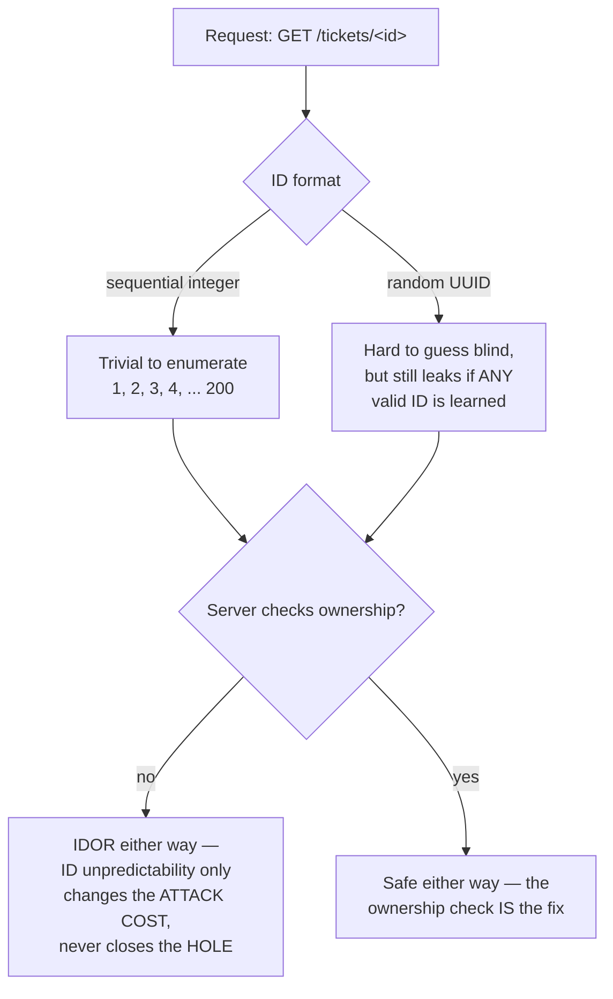

# Lecture 2 — IDOR & Object-Level Authorization

> **Duration:** ~2 hours. **Outcome:** You can explain why a bare object ID in a URL or request body is dangerous by default; demonstrate an IDOR against your own lab target and capture it as evidence; and fix object-level access with a `WHERE`-clause ownership filter — the pattern that closes the flaw at the query, not with an `if` bolted on after.

> **Lab reminder.** Every exploit in this lecture runs against **fictional accounts and fictional data you created yourself** in `crunch-helpdesk`, on `127.0.0.1`, inside your isolated `appsec-lab`. You are logging in as `cc-alice` and `al-erin` — two accounts you seeded — and observing what each can reach. Nothing here is aimed at a system you don't own.

## 1. What IDOR actually is

**IDOR — Insecure Direct Object Reference** — is what happens when an application uses a value the client controls (a URL path segment, a query parameter, a form field, a JSON body field) to look up an object **directly**, with no check that the requester is actually allowed to touch that specific object. The name is precise: the reference to the object (`ticket_id=42`) is "direct" (used as-is in the lookup) and "insecure" (unchecked). It is one of the oldest, simplest, and most reliably-found vulnerability classes in web security — no special tooling required, just changing a number and watching what comes back.

Look again at `crunch-helpdesk`'s `/tickets/<ticket_id>` route:

```python
@app.route("/tickets/<ticket_id>")
def get_ticket(ticket_id):
    if "user_id" not in session:
        return jsonify(error="login required"), 401
    row = get_db().execute("SELECT * FROM tickets WHERE id = ?", (ticket_id,)).fetchone()
    if row is None:
        return jsonify(error="not found"), 404
    return jsonify(dict(row))
```

The `WHERE id = ?` clause is parameterized correctly — this is **not** a SQL injection bug (Week 5 covered that class; this route has no injection flaw at all). The bug is a **missing predicate**: the query should also say "and this ticket belongs to the requester's company, and the requester created it or is assigned to it or holds a role that grants broader visibility" — Lecture 1's `can_view_ticket` function, in other words — and it says none of that. `WHERE id = ?` alone means "give me whatever has this ID," full stop, regardless of who's asking.

## 2. Demonstrating it, honestly, in your own lab

This is reconnaissance against your own seeded data — you already know what `ticket_id` 4 is (Aperture Labs's "Lab sensor offline," from `seed.py`), so there's no guessing involved; the point is to observe that the server doesn't care who's asking.

```bash
# Log in as cc-alice — crunch-corp, role 'member', created ticket 3
curl -s -c cc-alice.txt -X POST http://127.0.0.1:5000/login \
  -d "username=cc-alice&password=labpass1"

# cc-alice's own ticket — expected and fine
curl -s -b cc-alice.txt http://127.0.0.1:5000/tickets/3

# cc-alice reading ANOTHER crunch-corp user's ticket she never created or was assigned to
curl -s -b cc-alice.txt http://127.0.0.1:5000/tickets/2
# {"assigned_to":2,"body":"Q2 export double-counted three contractors.", ... }
# cc-alice has no business seeing carol's payroll ticket — horizontal escalation

# cc-alice reading a ticket that belongs to a DIFFERENT COMPANY entirely
curl -s -b cc-alice.txt http://127.0.0.1:5000/tickets/4
# {"assigned_to":6,"body":"Sensor 4B stopped reporting readings at 03:00.", ... }
# a crunch-corp member just read aperture-labs internal ticket content — cross-tenant IDOR
```

Three requests, one changed number each time, zero exploit tooling. That's the entire attack — which is exactly why IDOR shows up in breach reports and bug bounty payouts so often: the barrier to finding it is almost nothing, and the barrier to introducing it is just as low (one forgotten `WHERE` predicate).

### 2.1 Sequential IDs make this worse, but random IDs don't fix it

`crunch-helpdesk`'s `id` columns are `INTEGER PRIMARY KEY` — small, sequential, and trivially enumerable (`for i in range(1, 200): try /tickets/{i}`). Swapping to a random UUID (`ticket_id = 'a13f...e920'` instead of `42`) removes the *enumeration* convenience but **does not fix the vulnerability** — if an attacker legitimately learns one valid UUID (it's in a URL they were emailed, a shared link, a support ticket reply visible in a browser history), the exact same unchecked `WHERE id = ?` still serves it to anyone. Treat UUIDs as a defense-in-depth speed bump against casual enumeration, never as a substitute for the real fix: **the server must check ownership on every object access, regardless of how hard the ID is to guess.**



## 3. The fix: filter in the query, not after it

There are two places you could add the ownership check. One is fragile; one is robust.

**Fragile — fetch first, check after:**

```python
row = get_db().execute("SELECT * FROM tickets WHERE id = ?", (ticket_id,)).fetchone()
if row["company_id"] != session["company_id"]:      # easy to forget on ONE of several return paths
    return jsonify(error="forbidden"), 403
return jsonify(dict(row))
```

This works, but every new code path that returns early (a second `if` added six months later by someone in a hurry, an early `return` inserted above the check during a refactor) can silently skip the check. It also has a subtler leak: if `row` is `None` you must be careful your "not found" branch runs *before* you try to read `row["company_id"]`, or the fix itself throws.

**Robust — filter in the `WHERE` clause itself:**

```python
@app.route("/tickets/<ticket_id>")
def get_ticket(ticket_id):
    if "user_id" not in session:
        return jsonify(error="login required"), 401
    row = get_db().execute(
        """SELECT * FROM tickets
           WHERE id = ?
             AND company_id = ?
             AND (created_by = ? OR assigned_to = ? OR ? IN ('manager','admin'))""",
        (ticket_id, session["company_id"],
         session["user_id"], session["user_id"], session["role"]),
    ).fetchone()
    if row is None:
        # Deliberately identical to "wrong ID" — see Section 4 on why.
        return jsonify(error="not found"), 404
    return jsonify(dict(row))
```

If the ticket exists but belongs to the wrong company, or exists in the right company but isn't owned/assigned/in-scope for this user, the query simply returns **no row** — there is no separate branch to forget, because the authorization check and the data lookup are the same operation. This is the pattern to default to for every object-fetch route in this course from here on: **the ownership predicate lives in the query**, not as a follow-up `if`.

### 3.1 A reusable ownership-check builder

Repeating that four-line `WHERE` clause on every route invites the same drift RBAC's `if`-chains did in Lecture 1. Wrap it once:

```python
def owned_ticket_query():
    """Returns (sql_fragment, params) — the tenant + ownership predicate, reusable everywhere."""
    return (
        "company_id = ? AND (created_by = ? OR assigned_to = ? OR ? IN ('manager','admin'))",
        (session["company_id"], session["user_id"], session["user_id"], session["role"]),
    )

def get_ticket_or_404(ticket_id):
    frag, params = owned_ticket_query()
    row = get_db().execute(
        f"SELECT * FROM tickets WHERE id = ? AND {frag}", (ticket_id, *params)
    ).fetchone()
    return row
```

Every route that touches a single ticket by ID — `get_ticket`, a future `update_ticket`, a future `delete_ticket` — calls `get_ticket_or_404` and gets the tenant-plus-ownership check for free, in one place, auditable in one place, fixed in one place if the policy ever changes.

## 4. Don't leak existence through the error itself

A subtle follow-on mistake: returning a **different** error for "doesn't exist" versus "exists but isn't yours."

```python
# LEAKY — tells an attacker which IDs are real, even though they can't read them
if row is None:
    exists = get_db().execute("SELECT 1 FROM tickets WHERE id = ?", (ticket_id,)).fetchone()
    if exists:
        return jsonify(error="forbidden — not your ticket"), 403
    return jsonify(error="not found"), 404
```

That "helpful" distinction hands an attacker a free oracle: run through IDs 1–500, and every `403` (versus `404`) confirms a ticket exists at that ID even though its contents stay hidden — useful reconnaissance for guessing total customer count, active ID ranges, or correlating IDs across systems. The fix from Section 3's query — return `404` uniformly whenever the row isn't found **for this requester**, regardless of whether it exists for someone else — costs nothing and closes this leak automatically, because the query itself never distinguishes the two cases.

## 5. IDOR isn't only `GET` — and it isn't only URLs

`crunch-helpdesk`'s roster route shows the same flaw shape on a path parameter used for a *different* purpose than "which record to fetch" — here it's "which company's records to list":

```python
@app.route("/companies/<company_id>/roster")
def company_roster(company_id):
    if "user_id" not in session:
        return jsonify(error="login required"), 401
    rows = get_db().execute(
        "SELECT id, username, role FROM users WHERE company_id = ?", (company_id,)
    ).fetchall()
    return jsonify([dict(r) for r in rows])
```

`cc-alice` (crunch-corp, `company_id=1`) can call `GET /companies/2/roster` and read Aperture Labs's entire user list — an IDOR on a **collection**, not a single object, and one that doesn't even require finding a "right" ID, since company IDs in a small system are easy to enumerate outright (`1`, `2`, `3`, ...). The fix ignores the URL parameter for anything except routing, and substitutes the session's own `company_id`:

```python
@app.route("/companies/<company_id>/roster")
def company_roster(company_id):
    if "user_id" not in session:
        return jsonify(error="login required"), 401
    if int(company_id) != session["company_id"]:
        return jsonify(error="forbidden"), 403
    rows = get_db().execute(
        "SELECT id, username, role FROM users WHERE company_id = ?", (session["company_id"],)
    ).fetchall()
    return jsonify([dict(r) for r in rows])
```

The general lesson: **any client-supplied identifier that selects a tenant, an owner, or a scope — not just a single record's primary key — needs the same object-level check.** IDOR is a pattern, not a single route shape; look for it anywhere a value from the client narrows which rows a query returns, including request bodies (`POST` a `company_id` field the server trusts) and even response-shaping query strings (`?company_id=2&format=csv`).

## 6. Recording the exploit and the fix as evidence

Consistent with this course's data-tooling rule, capture demonstrate → remediate → re-test as **rows**, not a narrative you'll forget the details of:

```sql
CREATE TABLE authz_findings (
    finding_id     INTEGER PRIMARY KEY,
    route          TEXT NOT NULL,
    flaw_type      TEXT NOT NULL CHECK (flaw_type IN ('idor','horizontal_escalation','vertical_escalation')),
    demonstrated_as TEXT NOT NULL,   -- which session/account exploited it
    demonstrated_evidence TEXT NOT NULL,  -- the request + unexpected response, verbatim
    fix_description TEXT,
    retested_at      TEXT,
    status           TEXT NOT NULL DEFAULT 'open' CHECK (status IN ('open','fixed','retested_ok'))
);

INSERT INTO authz_findings
    (route, flaw_type, demonstrated_as, demonstrated_evidence, status)
VALUES
    ('/tickets/<id>', 'idor', 'cc-alice',
     'GET /tickets/4 returned aperture-labs ticket body while logged in as crunch-corp member',
     'open');
```

Exercise 1 builds this table out fully and has you run the demonstrate → fix → re-test loop against all three IDOR-shaped routes in `crunch-helpdesk`, closing each with a `status = 'retested_ok'` row backed by a real second request that now correctly returns `403`/`404`.

## 7. Check yourself

- In your own words, what makes a direct object reference "insecure" — is it the reference itself, or something else?
- Why doesn't switching `id` from a sequential integer to a random UUID fix an IDOR by itself?
- Rewrite this vulnerable query so the ownership check lives in the `WHERE` clause instead of a follow-up `if`: `SELECT * FROM invoices WHERE id = ?`.
- Why is returning `404` for "not found" and `404` (not `403`) for "found, but not yours" the safer choice? What does the alternative leak?
- Find, in `crunch-helpdesk`'s `/tickets` list route (no `<id>`, just `/tickets`), the same missing-predicate flaw as `/tickets/<id>` — what's the one-line fix?
- Is the roster route's flaw (Section 5) still "IDOR" even though `company_id` isn't a single record's primary key? Defend your answer.

If those are automatic, Exercise 1 has you run the exact demonstrate → fix → re-test loop from Section 6 against `crunch-helpdesk`'s three IDOR routes and log every step to SQLite. Lecture 3 then covers the other authorization failure shape — not "whose object is this," but "is this action even at your access level" — privilege escalation.

## Further reading

- **OWASP — Insecure Direct Object References (IDOR), Testing Guide:** <https://owasp.org/www-project-web-security-testing-guide/latest/4-Web_Application_Security_Testing/05-Authorization_Testing/04-Testing_for_Insecure_Direct_Object_References>
- **OWASP Top 10 (2021) — A01 Broken Access Control:** <https://owasp.org/Top10/A01_2021-Broken_Access_Control/>
- **PortSwigger — Insecure Direct Object References:** <https://portswigger.net/web-security/access-control/idor>
- **CWE-639 — Authorization Bypass Through User-Controlled Key:** <https://cwe.mitre.org/data/definitions/639.html>
