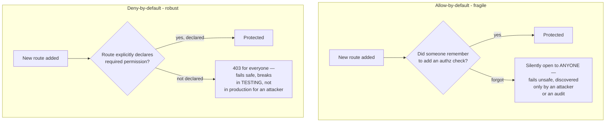

# Lecture 3 — Privilege Escalation & Failing Closed

> **Duration:** ~2 hours. **Outcome:** You can tell horizontal from vertical privilege escalation in one sentence each; find a missing function-level authorization check by reading a route handler; and design routes and route registration so an unmatched or forgotten case denies by default instead of silently allowing.

> **Lab reminder.** Every exploit in this lecture runs against `crunch-helpdesk`'s own seeded accounts on `127.0.0.1`, inside your isolated `appsec-lab`. You are logging in as low-privilege accounts you created (`cc-alice`, a `member`) and observing what happens when you call admin-shaped routes. Nothing here is aimed at a system you don't own.

## 1. Two shapes of escalation

Lecture 2 was about **object-level** authorization — "is this ticket yours?" This lecture is about **function-level** authorization — "is this *action* even something your role is allowed to perform, on anyone's object?" The two combine into a full picture of what "broken access control" covers, and privilege escalation itself splits into two distinct shapes worth naming precisely, because they're diagnosed and fixed slightly differently:

| Shape | Definition | `crunch-helpdesk` example |
|---|---|---|
| **Horizontal escalation** | Same privilege level, different identity — accessing another user's data or acting as another user, without gaining new capabilities | `cc-alice` reading `cc-carol`'s ticket (Lecture 2's IDOR *is* horizontal escalation, viewed through the object lens) |
| **Vertical escalation** | Reaching a **higher** privilege level than assigned — a `member` performing an `admin`-only or `manager`-only action | `cc-alice` (role `member`) successfully calling `/admin/users` or `/tickets/<id>/reassign` |

The two aren't mutually exclusive — `crunch-helpdesk`'s `/admin/users/<id>/promote` route is **both at once**: a low-privilege user reaching an admin-only *function* (vertical) against a user record at a *different company* (horizontal, in the object sense). Naming both dimensions precisely matters because your fix has to close both: a role check alone would stop the vertical half but miss a same-role, cross-tenant abuse; a tenant check alone would stop the horizontal half but let a `member` at the *right* company still promote themselves.

## 2. Missing function-level access control

The specific bug pattern behind vertical escalation, almost every time: a route checks that the caller is *authenticated*, and stops there — never checking *role* at all.

```python
@app.route("/tickets/<ticket_id>/reassign", methods=["POST"])
def reassign_ticket(ticket_id):
    if "user_id" not in session:          # authentication: checked
        return jsonify(error="login required"), 401
    # authorization: NEVER CHECKED — no role gate exists on this route at all
    new_owner = request.form["assigned_to"]
    get_db().execute("UPDATE tickets SET assigned_to = ? WHERE id = ?", (new_owner, ticket_id))
    get_db().commit()
    return jsonify(message=f"ticket {ticket_id} reassigned to user {new_owner}")
```

Demonstrated, honestly, against your own lab:

```bash
# Log in as cc-alice — role 'member', which the Lecture 1 permission table
# grants NO reassignment permission to at all
curl -s -c cc-alice.txt -X POST http://127.0.0.1:5000/login \
  -d "username=cc-alice&password=labpass1"

# member successfully performs a manager-only action
curl -s -b cc-alice.txt -X POST http://127.0.0.1:5000/tickets/2/reassign \
  -d "assigned_to=1"
# {"message":"ticket 2 reassigned to user 1"}   <- should have been 403
```

Nothing exotic — no crafted payload, no injected character, just a `POST` to a route that exists and works exactly as written, because the code never asked the second question. This is why vertical escalation is so often found by simple, boring means: reading the client-side code or the API docs for a route name that sounds privileged (`/admin/...`, `/reassign`, `/promote`, `/delete-user`), then just calling it directly instead of clicking a UI button that happens not to be shown to your role. **A hidden button is not a security control** — it's a UI convenience, and the server-side route behind it has to enforce the same policy on its own, because `curl` doesn't respect hidden buttons.

### 2.1 The fix: the same `require_permission` decorator, applied everywhere it's missing

Lecture 1 built `require_permission()` and demonstrated it on this exact route. The complete fix is applying it — and, just as importantly, **auditing every route that changed state or returned sensitive data to confirm one exists**:

```python
@app.route("/tickets/<ticket_id>/reassign", methods=["POST"])
@require_permission("ticket:reassign")
def reassign_ticket(ticket_id):
    new_owner = request.form["assigned_to"]
    get_db().execute("UPDATE tickets SET assigned_to = ? WHERE id = ?", (new_owner, ticket_id))
    get_db().commit()
    return jsonify(message=f"ticket {ticket_id} reassigned to user {new_owner}")


@app.route("/admin/users")
@require_permission("roster:view")
def admin_users():
    rows = get_db().execute("SELECT id, company_id, username, role FROM users").fetchall()
    return jsonify([dict(r) for r in rows])


@app.route("/admin/users/<user_id>/promote", methods=["POST"])
@require_permission("user:promote")
def promote_user(user_id):
    # Still needs a TENANT check too — Section 3 covers why a permission
    # check alone isn't the whole fix for this specific route.
    ...
```

## 3. When a role check alone isn't the whole fix

`/admin/users/<user_id>/promote` is the route where relying on the RBAC gate alone still leaves a hole. Once `@require_permission("user:promote")` is in place, only `admin`-role sessions can reach the function body at all — that closes the *vertical* half. But nothing yet stops `cc-dave` (admin at `crunch-corp`, `company_id=1`) from promoting a user at `aperture-labs` (`company_id=2`) — a legitimate admin action, at the wrong tenant. This is the horizontal half, and it needs Lecture 1's tenant check layered on top, same as any object-level route:

```python
@app.route("/admin/users/<user_id>/promote", methods=["POST"])
@require_permission("user:promote")
def promote_user(user_id):
    target = get_db().execute("SELECT * FROM users WHERE id = ?", (user_id,)).fetchone()
    if target is None:
        return jsonify(error="not found"), 404
    if target["company_id"] != session["company_id"]:   # tenant floor check, ALWAYS, even for admins
        return jsonify(error="forbidden"), 403
    new_role = request.form["role"]
    get_db().execute("UPDATE users SET role = ? WHERE id = ?", (new_role, user_id))
    get_db().commit()
    return jsonify(message=f"user {user_id} promoted to {new_role}")
```

The lesson generalizes past this one route: **RBAC answers "is this role allowed to attempt this kind of action," and object/tenant checks answer "is this specific target in scope for this specific caller" — a fully-fixed route almost always needs both**, in that order, exactly as Lecture 1, Section 3.1 laid out. A route with only the RBAC gate is half-fixed and will pass a casual "does a `member` get blocked?" test while still failing the real one: "does an `admin` at the wrong company get blocked?"

## 4. Deny by default — the design principle behind every fix so far

Step back from the individual route fixes and name the principle they all share: **every route should start from "forbidden" and require an explicit, positive reason to allow the request through — never the reverse.** A codebase that defaults to *allow* and relies on developers remembering to add a *deny* check on every sensitive route will, eventually and predictably, ship a route where someone forgot. A codebase that defaults to *deny* and requires an explicit permission grant to reach the handler body fails safe when someone forgets — the forgotten route simply doesn't work, which gets caught in testing, instead of silently working for everyone.



### 4.1 Making deny-by-default structural, not a habit

A principle you have to *remember* on every route is a principle you'll eventually forget on one. The stronger version makes it a property of the **framework wiring itself**, so a missing check is a startup error or an automatic block, not a silent gap. One concrete pattern for Flask — a global `before_request` hook that requires every view function to have explicitly opted in to a permission, and blocks anything that hasn't:

```python
PUBLIC_ROUTES = {"login", "static"}   # the only endpoints allowed with NO permission declared

@app.before_request
def enforce_deny_by_default():
    endpoint = request.endpoint
    if endpoint in PUBLIC_ROUTES:
        return  # explicitly public, not forgotten
    view_func = app.view_functions.get(endpoint)
    if not getattr(view_func, "_declares_permission", False):
        # A route exists with NO @require_permission and isn't in the public
        # allowlist — that's a bug in the route, not a valid "no auth needed"
        # case, so it fails closed rather than silently serving the request.
        return jsonify(error="forbidden — route missing an authorization check"), 403
```

`require_permission` from Lecture 1 marks the functions it wraps (`wrapped._declares_permission = True`) so this hook can tell "deliberately checked" apart from "checked nothing." Now a new route added six months from now, by someone who's never read this lecture, that forgets `@require_permission` entirely doesn't silently ship open — it 403s for every caller, including the developer testing it locally, which turns a security bug into an obvious functional bug caught before merge. This is the single highest-leverage change in this week's material: it converts "did every developer remember" (a people problem, which fails eventually) into "does the framework block anything undeclared" (a structural property, which doesn't).

## 5. A checklist for every new route, from here forward

Apply this to any route you write for the rest of this course — and to `crunch-helpdesk`'s remaining unaudited routes in Exercise 2:

1. **Authentication** — does it check for a valid session/token at all? (Public routes are the explicit, named exception, never the default.)
2. **Function-level authorization (RBAC)** — does the caller's role have the permission this action requires, checked via the shared decorator, not a re-typed `if`?
3. **Object/tenant-level authorization (ABAC)** — if the route touches a specific object, does the query (or an explicit check) confirm this object belongs to this caller's scope — owner, assignment, or tenant?
4. **Fails closed** — if any of 1–3 is ambiguous, missing, or errors out, does the route return `403`/`401`, never fall through to `200`?

Four questions, asked of every route, every time — that discipline, not any single clever check, is what actually closes access control gaps at scale.

## 6. Check yourself

- Give the one-sentence definition of horizontal escalation and vertical escalation, each with a `crunch-helpdesk` example not already used above.
- Why is `/admin/users/<id>/promote` an example of *both* escalation shapes at once? What check closes each half?
- Why doesn't a hidden UI button count as an authorization control? What does `curl` prove about that?
- Explain, precisely, why allow-by-default fails *unsafe* (discovered by an attacker) while deny-by-default fails *safe* (discovered in testing).
- Walk through the `before_request` hook in Section 4.1: what happens the first time a brand-new route is added without `@require_permission`, and who notices first — an attacker, or the developer who wrote it?
- Run the Section 5 four-question checklist against `crunch-helpdesk`'s `/tickets` (list) route from the README. Which question(s) does it currently fail?

If those are automatic, Exercise 2 has you build the full `require_permission` + deny-by-default machinery from this lecture and Lecture 1, and apply it to every remaining unprotected route in `crunch-helpdesk`. Exercise 3 then proves the result systematically with a data-driven role × resource × action test matrix — the only way to actually know, with evidence, that nothing was missed.

## Further reading

- **OWASP Top 10 (2021) — A01 Broken Access Control:** <https://owasp.org/Top10/A01_2021-Broken_Access_Control/>
- **OWASP — Authorization Cheat Sheet, "Fail Securely" section:** <https://cheatsheetseries.owasp.org/cheatsheets/Authorization_Cheat_Sheet.html>
- **CWE-862 — Missing Authorization:** <https://cwe.mitre.org/data/definitions/862.html>
- **CWE-863 — Incorrect Authorization:** <https://cwe.mitre.org/data/definitions/863.html>
- **PortSwigger — Privilege Escalation:** <https://portswigger.net/web-security/access-control#privilege-escalation>
