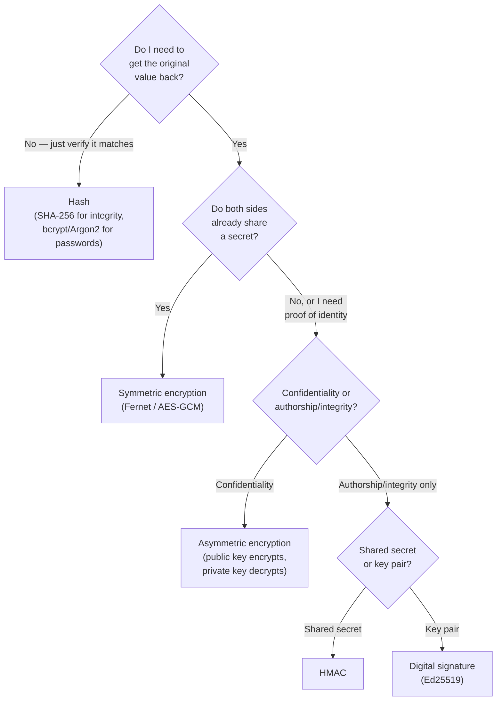

# Lecture 2 — Crypto Primitives for Developers

> **Duration:** ~2 hours. **Outcome:** You can name the three jobs cryptography does — hashing, encryption, and signing — say which one a given problem needs, tell symmetric apart from asymmetric, and write correct, vetted-library code for each, in Python, without inventing anything yourself.

Every cryptographic mistake in this course so far — Week 4's password hashing, this week's broken vault — traces back to one root cause: **using the wrong primitive, or a homemade one, for the job.** This lecture gives you the vocabulary and the decision process to never make that mistake again. The rule for the whole lecture, stated once so it can be assumed everywhere else: **never invent a cryptographic algorithm. Use a vetted library, use it the way its documentation shows, and if you're unsure which primitive you need, that uncertainty is the thing to resolve before writing any code.**

## 1. Three jobs, three primitives

| Primitive | Question it answers | Needs a key? | Example use |
|---|---|---|---|
| **Hash** | "Does this data match what I expect, or has it changed?" | No | Password storage (Week 4), file integrity checks, git commit IDs |
| **Encryption** (symmetric or asymmetric) | "Can only the intended party read this?" | Yes | Storing a secret at rest, a TLS session, an encrypted backup |
| **Signature** (or MAC) | "Did this come from who it claims, unaltered?" | Yes (private key or shared secret) | Verifying a webhook payload, software update integrity, TLS certificates |

These are not interchangeable, and mixing them up is a real, common bug class:

- **Hashing a password and treating it like encryption** — you can't "decrypt" a hash to recover the password, and you shouldn't be able to; that's the point (Week 4).
- **"Encrypting" something with a hash function** — a hash has no key and no decryption; if you need to get the original value back, you needed encryption, not a hash.
- **Encrypting data without also authenticating it** — this week's `homemade_encrypt` (XOR) and `broken_ecb_encrypt`/`broken_cbc_encrypt` all suffer this: nothing detects if the ciphertext was tampered with in transit or at rest. Modern practice defaults to **authenticated encryption (AEAD)**, covered in Section 3, specifically to close this gap.

## 2. Hashing — one-way, no key

A cryptographic hash function takes input of any size and produces a fixed-size digest, deterministically, with two properties that matter for security work: it's **effectively irreversible** (you can't recover the input from the digest) and **collision-resistant** (finding two different inputs with the same digest is computationally infeasible for a good hash function).

```python
import hashlib

digest = hashlib.sha256(b"hello, crunch").hexdigest()
print(digest)   # always the same 64-hex-char output for this exact input
```

**SHA-256** is the vetted general-purpose choice for integrity checks (verifying a downloaded file matches its published hash, deduplicating content, git's own object model). It is explicitly **not** an appropriate choice for hashing passwords — Week 4 covered why: SHA-256 is *fast*, and password storage needs a function that's deliberately *slow* and memory-hard (bcrypt, scrypt, Argon2) to resist brute-force guessing. "Hashing" is one word covering two different tools with opposite speed requirements — pick the one built for the job.

## 3. Symmetric encryption — one shared key

Symmetric encryption uses the **same key** to encrypt and decrypt. It's fast and the right choice whenever both sides already share a secret (an app encrypting its own data at rest, two services with a pre-shared key). The vetted primitive is **AES**, and the vetted *mode* — this is where this week's lab breaks things — is an **authenticated** mode, not plain block-cipher chaining.

The modern, hard-to-get-wrong choice in Python is `cryptography`'s `Fernet`, which bundles AES-128 in CBC mode, HMAC for authentication, and IV generation into one API:

```python
from cryptography.fernet import Fernet

key = Fernet.generate_key()          # cryptographically secure, correct length, every time
f = Fernet(key)

token = f.encrypt(b"the vault entry's real secret")
print(token)                         # base64 token: ciphertext + IV + HMAC, all in one

plaintext = f.decrypt(token)         # raises InvalidToken if the ciphertext was tampered with
print(plaintext)
```

Notice what `Fernet` does for you that this week's `homemade_encrypt` did not: it generates a **fresh, random IV every call** (no static-IV bug possible), and it **authenticates** the ciphertext (tampering raises `InvalidToken` instead of silently decrypting to garbage). That authentication step is the entire reason "just use AES" isn't sufficient advice on its own — AES is a cipher, not a complete encryption scheme, and the mode you wrap it in determines whether you get authentication for free or have to add it yourself.

For more control (key rotation across services, associated data that's authenticated but not encrypted, non-Python interop), use **AES-GCM** directly:

```python
import os
from cryptography.hazmat.primitives.ciphers.aead import AESGCM

key = AESGCM.generate_key(bit_length=256)
aesgcm = AESGCM(key)
nonce = os.urandom(12)               # GCM nonce: 12 bytes, MUST be unique per key, never reused

ciphertext = aesgcm.encrypt(nonce, b"the vault entry's real secret", associated_data=None)
plaintext = aesgcm.decrypt(nonce, ciphertext, associated_data=None)
```

`AESGCM` is an **AEAD** (Authenticated Encryption with Associated Data) construction: it produces ciphertext plus an authentication tag in one step, and decryption fails loudly if either the ciphertext or the (optional) associated data was altered. The one rule that must never be broken with GCM: **never reuse a (key, nonce) pair.** Reusing a nonce with the same key doesn't just weaken GCM — it can fully break its authentication guarantee. `Fernet` sidesteps this risk entirely by generating the IV internally on every call; `AESGCM` hands you that responsibility directly, which is exactly why Exercise 2 has you reach for `Fernet` first and `AESGCM` only when you need the extra control.

## 4. Asymmetric encryption and signing — a key pair

Asymmetric (public-key) cryptography uses **two mathematically linked keys**: a public key you share freely, and a private key you never share. What each direction accomplishes:

- **Encrypt with the public key → only the private key holder can decrypt.** Used when anyone should be able to send you something confidential, but only you should read it.
- **Sign with the private key → anyone with the public key can verify.** Used when you want to prove a message came from you, unaltered — you don't need to keep the message secret, you need to prove authorship.

That second case — signing — is what this week's `webhook()` endpoint needs, and it's worth separating from encryption clearly: **a signature does not hide the data; it proves who sent it and that it wasn't changed.**

**Ed25519** is the current vetted default for digital signatures — fast, small keys, and resistant to the kind of implementation footguns that made older RSA signature code error-prone:

```python
from cryptography.hazmat.primitives.asymmetric.ed25519 import (
    Ed25519PrivateKey,
)

private_key = Ed25519PrivateKey.generate()
public_key = private_key.public_key()

message = b"payload from Crunch Vault's webhook"
signature = private_key.sign(message)

# Anywhere the public key is available (it's meant to be shared):
public_key.verify(signature, message)   # raises InvalidSignature if it doesn't match
```

If both parties already share a secret (no key pair needed) and you just need "did this message come from someone who knows the shared secret, unaltered," an **HMAC** is the simpler, symmetric equivalent of a signature — Section 5 covers it, and Exercise 3 implements both HMAC and Ed25519 so you can feel the difference between "shared-secret authentication" and "public-key authentication" directly.

## 5. HMAC — a keyed hash for shared-secret authentication

An HMAC (Hash-based Message Authentication Code) combines a hash function with a secret key to produce a tag that proves both integrity (the message wasn't altered) and authenticity (whoever produced the tag knew the key) — without needing a full key pair:

```python
import hashlib
import hmac

secret = b"a-shared-webhook-signing-key"
payload = b'{"event": "vault.entry.created"}'

tag = hmac.new(secret, payload, hashlib.sha256).hexdigest()
```

The verifying side recomputes the same tag from the payload and the shared secret, and compares. **How** that comparison happens is the exact bug in this week's `webhook()` route — covered fully in Lecture 3 and fixed in Exercise 3 — but the short version: use `hmac.compare_digest()`, never `==`, for any comparison involving a secret-derived value.

## 6. Key management — the part every primitive depends on

None of the above matters if the **key itself** is generated, stored, or transmitted badly. Three rules that apply across every primitive in this lecture:

1. **Generate keys with a cryptographically secure random source** — `os.urandom()`, the `secrets` module, or a library's own `generate_key()`/`generate()` helper (as used throughout this lecture). Never `random.random()`, `random.randint()`, or anything seeded from a predictable value like the current time. Lecture 3 shows exactly why.
2. **Store keys the way you'd store any other secret** — the vault/injection model from Lecture 1, not a hardcoded constant in source.
3. **Scope and rotate keys** like any other credential — a compromised encryption key should be replaceable without re-architecting the whole system, which means your code should read the key from configuration, never bake it in.


*Answer three questions and the primitive picks itself — the mistakes this course cares about all come from skipping this diagram and reaching for whatever's already imported.*

## 7. Check yourself

- Name the three cryptographic jobs and, for each, whether it needs a key.
- Why is SHA-256 the right choice for a file-integrity check but the wrong choice for password storage?
- What does "authenticated encryption" add on top of plain AES, and why does `Fernet` give it to you automatically?
- What is the one rule you must never break when using AES-GCM directly?
- What's the difference between what encryption proves and what a signature proves?
- When would you reach for HMAC instead of a full asymmetric signature?
- Name the three key-management rules from Section 6, in your own words.

If those are automatic, Lecture 3 takes the primitives from this lecture and shows you exactly how they get broken in practice — ECB mode, a static IV, a weak RNG, a homemade scheme — using the code in `crypto_experiments.py` from this week's lab.

## Further reading

- **OWASP Cryptographic Storage Cheat Sheet:** <https://cheatsheetseries.owasp.org/cheatsheets/Cryptographic_Storage_Cheat_Sheet.html>
- **`cryptography` library docs — Fernet:** <https://cryptography.io/en/latest/fernet/>
- **`cryptography` library docs — AEAD (AES-GCM):** <https://cryptography.io/en/latest/hazmat/primitives/aead/>
- **`cryptography` library docs — Ed25519:** <https://cryptography.io/en/latest/hazmat/primitives/asymmetric/ed25519/>
- **Python `hmac` module:** <https://docs.python.org/3/library/hmac.html>
- **NIST SP 800-57 — Key Management Recommendations:** <https://csrc.nist.gov/pubs/sp/800/57/pt1/r5/final>
