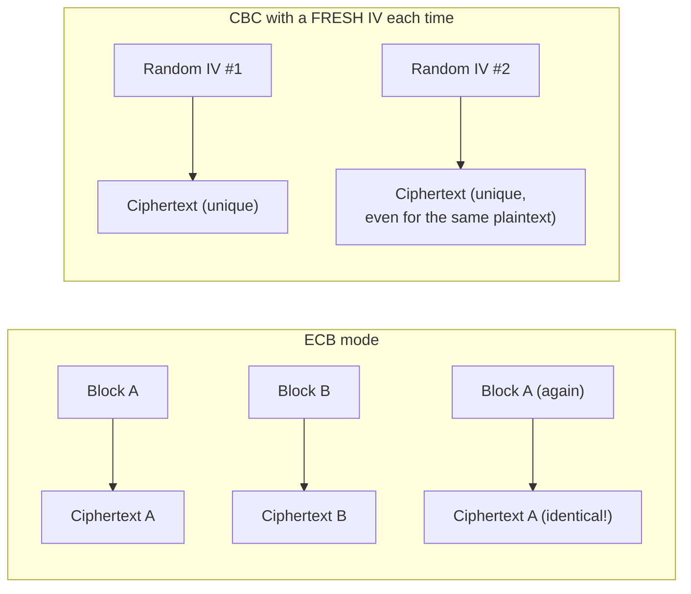

# Lecture 3 — Crypto Failures & How to Avoid Them

> **Duration:** ~2 hours. **Outcome:** You can look at a piece of encryption code and name, specifically, which of four classic failures it has — ECB mode, a static/reused IV, a non-cryptographic RNG, or a homemade scheme — reproduce the failure yourself in the lab to see why it matters, and rewrite it correctly with a vetted API.

Lecture 2 gave you the right tools. This lecture is about the four ways developers reach for a *wrong* tool while believing it's right — because the broken code still runs, still produces ciphertext-looking output, and still "works" in every manual test anyone bothers to run. Every failure below is demonstrated **offline, against data you generate yourself, inside the isolated lab** — no network calls, no real secrets, no third-party systems involved anywhere in this lecture.

## 1. ECB mode — the pattern that leaks through "encryption"

AES is a **block cipher**: it encrypts fixed-size (16-byte) blocks. What happens *between* blocks is determined by the cipher **mode**, and ECB (Electronic Codebook) mode is the one mode that does nothing between blocks at all — each 16-byte block is encrypted independently, with the same key, no chaining.

The consequence: **identical plaintext blocks always produce identical ciphertext blocks.** Reproduce it yourself with this week's `crypto_experiments.py`:

```python
from crypto_experiments import broken_ecb_encrypt

# Two blocks of repeated plaintext, 16 bytes each
plaintext = b"AAAAAAAAAAAAAAAA" + b"BBBBBBBBBBBBBBBB" + b"AAAAAAAAAAAAAAAA"
ct = broken_ecb_encrypt(plaintext)

block1, block2, block3 = ct[0:16], ct[16:32], ct[32:48]
print(block1 == block3)   # True -- the two "AAAA..." blocks produced IDENTICAL ciphertext
```

`block1 == block3` prints `True`. Nothing about the key or the algorithm changed — the *mode* leaked the fact that block 1 and block 3 of the plaintext were identical, without decrypting anything. This is the famous "ECB penguin" problem: encrypt an image with ECB and the outline of the original image is still visible in the ciphertext, because large flat-color regions turn into repeated identical blocks. Any structured data — repeated headers, padding, predictable field boundaries — leaks the same way. **There is no correct use of ECB mode for general-purpose encryption.** If a library, a tutorial, or an LLM suggests `AES.MODE_ECB`, that's the signal to stop and use an authenticated mode instead.

## 2. Static or reused IVs — the fix that isn't quite fixed

CBC (Cipher Block Chaining) mode fixes ECB's block-independence problem by XORing each plaintext block with the *previous ciphertext block* before encrypting — which requires a starting value for the very first block: the **initialization vector (IV)**. The IV doesn't need to be secret, but it **must be unique per encryption, ideally random.** Reuse it, and CBC's chaining guarantee breaks in a specific, exploitable way:

```python
from crypto_experiments import broken_cbc_encrypt

ct1 = broken_cbc_encrypt(b"Transfer $100 to Alice.")
ct2 = broken_cbc_encrypt(b"Transfer $100 to Alice.")

print(ct1 == ct2)   # True -- same plaintext, same key, same (static) IV -> identical ciphertext
```

Two identical messages, encrypted at different times, produce **byte-for-byte identical ciphertext.** An observer who can't decrypt either message can still tell they're the same message — and more damagingly, if any two *different* messages share the same first block after XOR with the IV, an attacker who can influence what gets encrypted (a chosen-plaintext scenario) can start recovering information about the key relationship or forging valid-looking ciphertext for other messages. The fix is not "pick a better static value" — there is no static value that's safe. The fix is: **generate a fresh, random IV/nonce for every single encryption call**, and store it alongside the ciphertext (it doesn't need to be secret) so decryption can use it. This is exactly what `Fernet` does automatically and what `AESGCM` requires you to do yourself with `os.urandom(12)` on every call — see Lecture 2, Section 3.


*Same plaintext block, same key: ECB always leaks the repetition; CBC only avoids it when the IV is actually random and never reused.*

## 3. Weak RNG — predictable "randomness"

Every primitive in Lecture 2 assumes its key, IV, or nonce came from a source an attacker cannot predict. Python's `random` module is a Mersenne Twister PRNG: fast, high-quality for simulations and games, and **completely unsuitable for security** — its output is fully determined by its seed, and with enough observed output, the entire internal state (and therefore all future output) can be reconstructed.

Reproduce it yourself:

```python
import random

random.seed(1337)                 # a fixed, known seed -- e.g. from system time at startup
key_attempt = "".join(str(random.randint(0, 9)) for _ in range(16))
print(key_attempt)                # deterministic: this exact seed ALWAYS produces this exact string
```

Run that twice and you get the identical "key" both times. `make_key_weak()` in this week's `app.py` doesn't call `random.seed()` explicitly, but that doesn't save it — if the process seeds from a low-entropy source (or an attacker can narrow down the seed, e.g. a timestamp at process start), the entire keyspace an attacker needs to search collapses from "cryptographically infeasible" to "a few million guesses," which is well within reach of an offline brute-force.

The fix: use a **cryptographically secure** random source for anything security-relevant — a key, an IV/nonce, a session token, a password-reset token, a CSRF token:

```python
import os
import secrets

random_bytes = os.urandom(32)             # OS-level CSPRNG, any length
token = secrets.token_urlsafe(32)         # URL-safe string, ideal for tokens/links
secret_key = secrets.token_bytes(32)      # ideal for a symmetric key
```

`secrets` (Python 3.6+) is purpose-built for exactly this: tokens, keys, and anything else that must be unguessable. The rule of thumb that never fails: **if the value protects something, it comes from `os.urandom`/`secrets`, never from `random`.**

## 4. Homemade schemes — XOR and "I invented my own cipher"

This week's `homemade_encrypt`/`homemade_decrypt` use a repeating-key XOR — take each plaintext byte, XOR it with the corresponding byte of a repeating key. It "encrypts" in the sense that the output isn't human-readable. It is not encryption in any meaningful security sense, for two independent reasons:

**No authentication.** Nothing detects tampering. Flip any bit of the ciphertext and `homemade_decrypt` produces different-but-plausible-looking output with no error, no exception, nothing — the vault has no way to know its data was altered.

**Key reuse breaks it completely, with no key needed.** If the same repeating key encrypts two different messages, XOR-ing the two ciphertexts together cancels the key out entirely:

```python
from crunch_vault_lab.app import homemade_encrypt   # illustrative import path

key = "crunchkey12345"
ct1 = bytes.fromhex(homemade_encrypt("Transfer $100 to Alice", key))
ct2 = bytes.fromhex(homemade_encrypt("Transfer $900 to Carol", key))

xored = bytes(a ^ b for a, b in zip(ct1, ct2))
# xored now equals (plaintext1 XOR plaintext2) -- the KEY CANCELS OUT.
# An attacker with no knowledge of `key` can recover both plaintexts from
# this alone using known-plaintext or frequency analysis ("crib dragging").
```

This is not a contrived edge case — it's the *default* outcome of reusing an XOR key across more than one message, and this week's vault reuses `VAULT_KEY` for every single entry it stores. "Rolling your own crypto" almost never fails in an obvious way during development; it fails quietly, in production, against an attacker who understands the math you didn't apply. The entire fix, covered hands-on in Exercise 2, is: **delete the homemade cipher, replace it with `Fernet` or `AESGCM`, generate the key with `secrets`/`os.urandom`, and store the key the way Lecture 1 describes — never as a module-level constant.**

## 5. Putting it together — a before/after checklist

| Symptom in the code | Failure | Vetted fix |
|---|---|---|
| `AES.MODE_ECB` anywhere | ECB mode | An authenticated mode (`Fernet`, `AESGCM`) |
| An IV/nonce that's a constant, `b"\x00"*16`, or derived from something predictable | Static/reused IV | Fresh `os.urandom(n)` per encryption, or let `Fernet` generate it |
| `random.random()`, `random.randint()`, or a seeded `random.Random()` for a key/token | Weak RNG | `secrets` module or `os.urandom()` |
| A custom `encrypt()`/`decrypt()` function you wrote from scratch | Homemade scheme | `cryptography`'s `Fernet` or `AESGCM` |
| `if given == expected:` comparing a signature/token/HMAC | Timing side-channel | `hmac.compare_digest()` |

That checklist is, in miniature, this week's whole thesis: **every one of these failures is invisible in a functional test and glaring under five minutes of adversarial thinking.** The fix is never "write more careful homemade code" — it's "stop writing homemade code."

## 6. Check yourself

- Why does ECB mode leak information even though the key and algorithm are both strong?
- What specifically goes wrong when the same IV is reused across two CBC encryptions of the same plaintext?
- Why is `random.random()` unsafe for generating a key, even though its output "looks random"?
- What are the two independent reasons repeating-key XOR fails as encryption?
- Given the checklist in Section 5, what's the single vetted-library fix that resolves four of the five rows?
- Why does "the ciphertext decrypted to something plausible" not prove the encryption was tampered-proof?

If those are automatic, you're ready for Exercises 1–3, which take everything from all three lectures this week and apply it directly to `leaky-crunch-vault` and Crunch Vault.

## Further reading

- **OWASP Cryptographic Storage Cheat Sheet — algorithm guidance:** <https://cheatsheetseries.owasp.org/cheatsheets/Cryptographic_Storage_Cheat_Sheet.html>
- **NIST SP 800-38A — Block cipher modes of operation:** <https://csrc.nist.gov/pubs/sp/800/38/a/final>
- **"The ECB Penguin" (visual demo of ECB pattern leakage):** <https://words.filippo.io/the-ecb-penguin/>
- **Python `secrets` module:** <https://docs.python.org/3/library/secrets.html>
- **`cryptography` library — AEAD primitives:** <https://cryptography.io/en/latest/hazmat/primitives/aead/>
