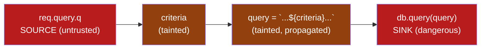
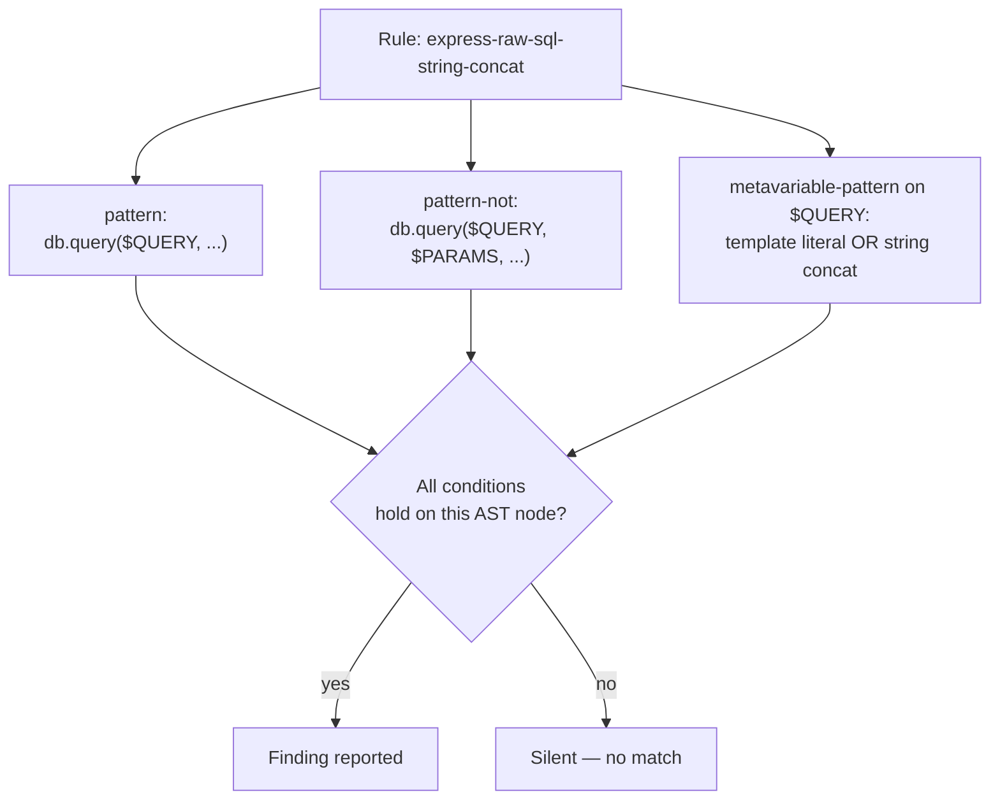

# Lecture 1 — SAST: Reading the Source

> **Duration:** ~2 hours. **Outcome:** You can explain how static analysis models code as data and control flow, name what it catches (injection sinks, taint, dangerous API calls) and what it structurally cannot see, read and write a Semgrep rule, and run one against real source.

> **Framing, read first.** Everything below runs against source code you already have legitimate access to: the published, deliberately-vulnerable code of your own Week 1 lab targets (Juice Shop's public repository). Reading and analyzing code is not an attack — there is no "victim" here, only a codebase you're allowed to look at. The same tool and technique, pointed at a codebase you don't have authorization to analyze, would be a different, out-of-scope act. That boundary holds for every week of this course.

## 1. What "static" actually means

Every scanner class this week answers the same question — "is this vulnerable?" — from a different vantage point. SAST answers it **without running the program at all**. It reads source code (or, for some tools, compiled bytecode) as text and structure, builds an internal model of it, and pattern-matches against that model for shapes known to be dangerous.

That's a meaningfully different claim than "SAST finds bugs." What SAST actually does is:

1. **Parse** source into an **Abstract Syntax Tree (AST)** — a structured representation of the code's grammar (this is a function call, this is an assignment, this is a string concatenation), independent of formatting or variable names.
2. **Build a Control-Flow Graph (CFG)** — which statements can execute after which, including branches and loops.
3. **Track data flow** across that graph — specifically, **taint tracking**: does a value that originated from an untrusted **source** (user input, a query parameter, a file read) ever reach a dangerous **sink** (a SQL query, a shell command, an `eval`) without passing through a **sanitizer** on the way?
4. **Pattern-match** the resulting model against a library of known-dangerous shapes — this is where a "rule" comes in, and it's the unit you'll write yourself in Section 5.

None of that requires executing a single line. That's SAST's superpower (it can be run in seconds, on every commit, with no running environment needed) and its fundamental limitation (it reasons about code *shape*, not actual runtime behavior) — you'll see the concrete consequences of that limitation in Section 3.

## 2. Worked example: tracing taint by hand

Before trusting a tool to do this, do it once yourself — it's the only way to develop intuition for what "the tool found a real bug" versus "the tool got confused" actually looks like. Consider this Express route, a simplified version of a pattern that shows up in real vulnerable apps (including, in spirit, parts of Juice Shop's search feature):

```javascript
// routes/search.js
app.get('/rest/products/search', (req, res) => {
  const criteria = req.query.q ? req.query.q : '';           // (1) SOURCE
  const query = `SELECT * FROM products WHERE name LIKE '%${criteria}%'`;  // (2) concatenation
  db.query(query, (err, rows) => {                            // (3) SINK
    res.json(rows);
  });
});
```

Trace it the way a SAST engine's data-flow analysis does, step by step:

1. **Source identified:** `req.query.q` — anything arriving via the URL's query string is untrusted by definition. The engine tags the variable `criteria` as **tainted** the moment it's assigned from this source.
2. **Propagation tracked:** `criteria` flows into a template-literal string concatenation that builds `query`. The taint **propagates** — `query` is now tainted too, because it was built, in part, from tainted data. This is the step naive scanners get wrong (they only check the source line and the sink line, missing multi-hop propagation); a real taint engine follows the value through every reassignment.
3. **No sanitizer on the path:** the engine checks whether `criteria` passed through any function it recognizes as neutralizing (parameterized-query binding, an allowlist regex, an escaping function). Here — nothing. Straight concatenation.
4. **Sink reached:** `db.query(query, ...)` is a known-dangerous sink for this database driver — it executes a raw SQL string. Tainted data reached a dangerous sink with **no sanitizer on the path**. That's a **source-to-sink taint flow**, and it's precisely the shape a SAST SQL-injection rule is written to catch.


*The exact shape a Semgrep taint rule matches: an unbroken path from a tagged source to a tagged sink, with no recognized sanitizer node on the path.*

Compare that to the fixed version — same inputs, same route, one change:

```javascript
app.get('/rest/products/search', (req, res) => {
  const criteria = req.query.q ? req.query.q : '';
  const query = 'SELECT * FROM products WHERE name LIKE ?';
  db.query(query, [`%${criteria}%`], (err, rows) => {   // parameter binding — the value never enters the query string
    res.json(rows);
  });
});
```

The taint engine still marks `criteria` as tainted from `req.query.q` — nothing about the *source* changed. But it now recognizes the second argument to `db.query` as a **bound parameter array**, a known sanitizer pattern for this driver: tainted data reaches the driver, but never as part of the SQL string itself. The flow is broken at exactly the point Week 5 taught you to break it. This is what "the engine models sanitizers" means in practice — it's not magic, it's a library of recognized-safe patterns per language and framework, exactly like the rule you'll write in Section 5 and extend in Challenge 1.

## 3. What SAST catches — and what it structurally cannot see

| SAST catches well | SAST is structurally blind to |
|---|---|
| Known source→sink taint flows (SQL/command/LDAP injection, XSS via unescaped output) | **Business logic flaws** — e.g. a checkout flow that lets you apply the same discount code twice; there's no "dangerous shape" to pattern-match, the code is syntactically fine and semantically wrong |
| Use of known-dangerous APIs (`eval`, `exec`, insecure deserialization, weak crypto primitives like MD5 for passwords) | **Missing authorization checks** — code that *correctly* reads a resource by ID has no dangerous shape at all; the bug is the *absence* of an `if (resource.owner !== currentUser)` check that was never written (this is why Week 6's IDOR class is so hard for SAST to find reliably) |
| Hardcoded secrets and credentials committed to source | **Runtime configuration** — a perfectly safe piece of code deployed with `DEBUG=true` in production, or a misconfigured cloud storage bucket; SAST never sees the deployed environment |
| Insecure defaults in framework configuration (missing `httpOnly` on cookies, disabled CSRF protection) | **Anything requiring the app to actually run** — a race condition, a flaw that only appears under concurrent load, a logic error that depends on real data shapes |
| Dangerous patterns across an entire codebase in seconds, on every commit | **Cross-service flaws** — a vulnerability that only exists because Service A trusts a header Service B sets, when SAST only ever sees one repository at a time |

The honest summary: **SAST is excellent at finding "this specific dangerous shape of code exists" and poor at finding "this code does the wrong thing."** That's not a flaw in the tools — it's what static analysis, by definition, can and cannot reason about. This is exactly why Week 8 pairs SAST with DAST (Lecture 2, which *does* exercise the running app) and SCA (Lecture 3, which checks a completely different attack surface — your dependencies).

## 4. Running Semgrep, hands-on

[Semgrep](https://semgrep.dev/) is the open-source SAST tool this course uses: fast, multi-language, human-readable rules in YAML, and a large free community ruleset. Install it:

```bash
pip install semgrep
semgrep --version
```

Clone Juice Shop's source — this is the published source of your own Week 1 lab target, not a third-party system:

```bash
mkdir -p c50-week-08 && cd c50-week-08
git clone --depth 1 https://github.com/juice-shop/juice-shop.git juice-shop-src
cd juice-shop-src
```

Run Semgrep's free, curated "auto" ruleset, which picks rules relevant to the languages it detects (here: JavaScript/TypeScript, Node/Express patterns):

```bash
semgrep --config=auto --json --output=../semgrep-results.json .
```

This takes a minute or two on a codebase this size. Semgrep prints a human-readable summary to the terminal and writes full structured results to `semgrep-results.json` — that JSON file is what Exercise 1 parses and what Exercise 3 loads into your findings database. Each result in the JSON carries, among other fields: `check_id` (the rule that fired), `path` and `start.line`/`end.line` (exactly where), `extra.severity`, and `extra.message` (why the rule considers this dangerous). That's the anatomy of a **SAST finding** — a rule ID, a precise location, and a rationale, which is exactly the shape you'll normalize into a database row in Exercise 3.

## 5. Anatomy of a Semgrep rule

A Semgrep rule is a YAML document describing a pattern to match. Here's a real, minimal one for the exact SQL-injection shape traced in Section 2:

```yaml
rules:
  - id: express-raw-sql-string-concat
    languages: [javascript, typescript]
    severity: ERROR
    message: >
      User-controlled data appears to be concatenated directly into a SQL
      query string instead of using a parameterized query. See Week 5,
      Lecture 2 for the fix.
    metadata:
      cwe: "CWE-89: SQL Injection"
      owasp: "A03:2021 - Injection"
    patterns:
      - pattern: db.query($QUERY, ...)
      - pattern-not: db.query($QUERY, $PARAMS, ...)
      - metavariable-pattern:
          metavariable: $QUERY
          patterns:
            - pattern-either:
                - pattern: "`... ${$X} ...`"
                - pattern: "'...' + $X + '...'"
```

Read it the way Semgrep's engine does:

- **`pattern`** — the base shape to look for: any call to `db.query` with a first argument and *something else* (`...` means "any additional arguments, don't care what").
- **`pattern-not`** — explicitly exclude the safe shape: a call where a second argument (the bound-parameters array) is present. This is how the rule encodes "parameterized calls are fine" without a separate taint-sanitizer model — for a rule this narrow, a syntactic exclusion is enough; more general taint rules (like the ones in the `auto` ruleset) use `pattern-sources`/`pattern-sinks`/`pattern-sanitizers` blocks instead.
- **`metavariable-pattern`** — a refinement: only flag it if the query argument itself (`$QUERY`) looks like a template literal or string concatenation, i.e., is actually built from other values rather than being a plain literal string with no interpolation.
- **`metadata`** — CWE and OWASP category tags. This matters more than it looks: it's what lets you later group findings across tools (Semgrep, ZAP, Trivy) by the *same* underlying weakness class in your Week 8 findings database, instead of three unrelated-looking alerts.



Test the rule against the two snippets from Section 2 directly:

```bash
semgrep --config=express-raw-sql-string-concat.yaml routes/search.js
```

Run it against the vulnerable version first (should fire once), then the fixed, parameterized version (should stay silent). **A rule you haven't tested against both a true-positive and a true-negative case is a rule you don't actually trust yet** — this two-sided test is exactly what Challenge 1 requires you to formalize.

## 6. Reading Semgrep's own severity, and why it isn't your risk score

Semgrep assigns each finding a severity (`INFO`, `WARNING`, `ERROR`) based on the *rule author's* judgment about how dangerous the pattern generally is. That is **not the same thing** as the risk score you've been computing since Week 1 (`likelihood × impact`, specific to *your* target and *your* context). A rule tagged `ERROR` for "hardcoded API key" is a strong signal — but whether it's a Critical or a Medium in *your* risk register depends on what that key actually authorizes, in your specific app. Carrying scanner severity into your database as one field, and your own triaged risk score as a separate field, is exactly what Exercise 3's schema does — never overwrite one with the other.

## 7. Check yourself

- In your own words, what are the three things a SAST engine builds from source code before it can pattern-match anything?
- Walk through Section 2's taint trace from memory: name the source, the propagation step, and the sink, and explain exactly what changed in the fixed version to break the flow.
- Give one concrete example of a real vulnerability class SAST is good at finding, and one it's structurally blind to — and explain *why*, not just *that*.
- In the Section 5 rule, what does `pattern-not` accomplish, and why is `metavariable-pattern` needed in addition to it?
- Why is a scanner's own severity rating not the same thing as your risk = likelihood × impact score?

If those are automatic, Lecture 2 takes the opposite vantage point: instead of reading source you can't run, you'll probe a running application you can't see the source of.

## Further reading

- **Semgrep — Rule syntax reference:** <https://semgrep.dev/docs/writing-rules/rule-syntax>
- **Semgrep — Taint tracking (pattern-sources / pattern-sinks):** <https://semgrep.dev/docs/writing-rules/data-flow/taint-mode>
- **OWASP — Source Code Analysis Tools:** <https://owasp.org/www-community/Source_Code_Analysis_Tools>
- **MITRE — Common Weakness Enumeration (CWE), the taxonomy behind rule metadata:** <https://cwe.mitre.org/>
- **Juice Shop — source repository (this lecture's analysis target):** <https://github.com/juice-shop/juice-shop>
