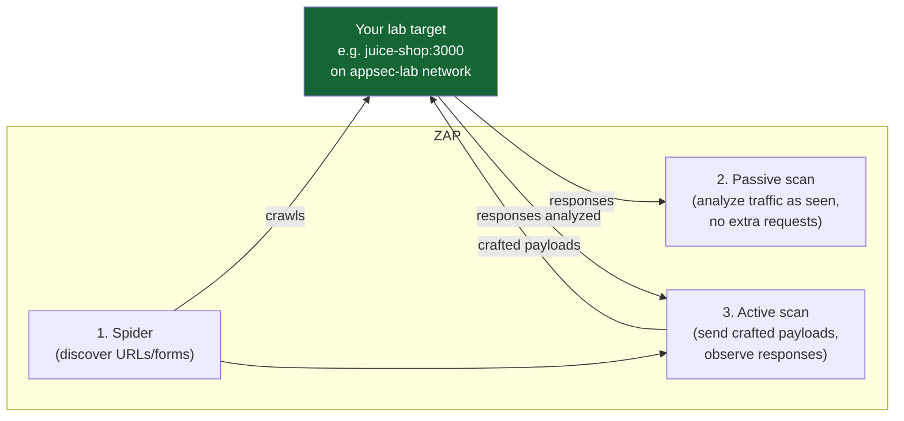

# Lecture 2 — DAST: Probing the Running App

> **Duration:** ~2 hours. **Outcome:** You can explain how dynamic analysis finds vulnerabilities without ever reading source, run OWASP ZAP's spider and active scanner against a running lab target (both anonymous and authenticated), and read a ZAP alert well enough to say whether it's worth your time.

> **Framing, read first.** Every scan in this lecture targets `127.0.0.1`-published ports on your own `appsec-lab` Docker network — the same isolated lab from Week 1, verified unreachable from anywhere else. DAST tools send real HTTP traffic to a real running server, which makes the isolation boundary matter *more*, not less, than it did for SAST. **Never point ZAP, or any active scanner, at a host you don't own or don't have explicit written authorization to test** — active scanning generates real load and real requests, and doing it against a system outside your authorization is not a gray area, it's unauthorized access. Every alert in this lecture is taught so you can detect and fix it, never to run it against someone else.

## 1. What "dynamic" actually means

Lecture 1's SAST engine never executed a line of code — it reasoned about source as text and structure. DAST does the exact opposite: it treats the application as a **black box**. It has no idea what language the backend is written in, has never seen a single line of source, and doesn't care. All it knows is: send an HTTP request, observe the HTTP response, and — critically — send *many* requests designed to provoke a vulnerable response, then look for the tells.

Concretely, a DAST tool does three things:

1. **Discover** — crawl (spider) the application to build a map of every URL, form, and parameter it can find, the same way a real visitor's browser would, just automated and exhaustive.
2. **Passively analyze** — inspect every response it sees during discovery for issues visible without sending anything malicious: missing security headers, verbose error messages, cookies without `Secure`/`HttpOnly` flags, information disclosure in comments.
3. **Actively probe** — for each discovered input (a form field, a query parameter, a JSON body field), send crafted payloads designed to trigger a vulnerable response — an XSS payload to see if it reflects unescaped, a SQL-injection payload to see if the response changes shape, a path-traversal payload to see if it returns a file it shouldn't.

The critical difference from SAST: DAST **actually exercises the running application** — the real server, the real database, the real middleware stack, exactly as an attacker's traffic would. That's simultaneously its strength (it validates the vulnerability actually works end-to-end, not just "the code shape looks dangerous") and a set of real constraints you don't have with SAST: it needs a running target, it only finds what it can *reach* (an endpoint the crawler never discovers gets zero coverage), and every probe is a real, logged request against a real server.

## 2. SAST vs. DAST, side by side

| | SAST (Lecture 1) | DAST (this lecture) |
|---|---|---|
| **What it sees** | Source code — text, AST, data flow | HTTP traffic in and out — requests and responses only |
| **Needs the app running?** | No | Yes — this is a live, running target |
| **Language-aware?** | Yes, per-language rules | No — language-agnostic, works the same against Node, Java, PHP, anything |
| **Finds unreachable code paths?** | Yes (and this is a weakness — see Section 7) | No — if the crawler can't reach it, it's invisible |
| **Validates exploitability?** | No — flags a *shape*, not a proven exploit | Often yes — an XSS alert usually means the payload actually reflected |
| **False-positive shape** | "This pattern looks dangerous but is actually sanitized elsewhere the tool didn't see" | "This header is technically missing but this specific endpoint is a JSON API no browser renders as HTML, so it doesn't matter" |
| **Coverage limit** | Every line of code that exists, whether reachable or not | Only what the crawler actually discovered and could authenticate into |

Neither one is "better" — they see genuinely different things, which is why Section 3 of Lecture 3 will show you findings that only SAST caught, only DAST caught, and — interestingly — the same underlying bug caught by both, described completely differently.

## 3. ZAP's architecture

[OWASP ZAP](https://www.zaproxy.org/) (Zed Attack Proxy) is the open-source DAST tool this course uses. It operates as an intercepting proxy with three main jobs, in order:



- **Spider** walks every link and form it can find, exactly like a very thorough, very fast user clicking everything. A modern single-page app (Juice Shop is Angular) also needs the **AJAX spider**, which actually renders JavaScript in a headless browser to discover routes a plain HTML crawler would miss entirely — a real, common DAST blind spot if you forget it.
- **Passive scan** happens automatically on every response ZAP sees, with **zero additional requests sent** — it's just inspecting traffic that was going to happen anyway. This is where missing-header and cookie-flag findings come from, and it's safe to run against anything you're already browsing.
- **Active scan** is the one that matters most for finding real vulnerabilities *and* the one that carries real weight to run responsibly: it sends deliberately malicious-looking payloads to every discovered input. This is the step that must never leave your isolated lab.

## 4. Hands-on: a baseline scan

ZAP ships an official Docker image with pre-built automation scripts. Confirm your lab is up first (`docker network ls` should show `appsec-lab`, and `curl -s -o /dev/null -w '%{http_code}\n' http://127.0.0.1:3000` should print `200`).

Run ZAP's **baseline scan** — spider plus passive analysis only, no active attacks, a good fast first pass — joined to the same isolated network as your target so it reaches it by container name rather than through the host at all:

```bash
docker run --rm --network appsec-lab \
  -v "$(pwd)/zap-reports:/zap/wrk/:rw" \
  zaproxy/zap-stable zap-baseline.py \
  -t http://juice-shop:3000 \
  -J baseline-report.json -r baseline-report.html
```

Note two deliberate choices here: `--network appsec-lab` keeps this scan entirely inside your isolated lab network (matching Week 1's isolation rules — no route out, no host-network exposure), and `-t http://juice-shop:3000` targets the container by its Docker DNS name rather than `127.0.0.1`, since the ZAP container and the target are peers on the same isolated network. Open `zap-reports/baseline-report.html` in a browser for a readable summary, and keep `baseline-report.json` — that's what Exercise 2 and Exercise 3 parse programmatically.

## 5. Authenticated scanning

An anonymous crawl only ever sees what an unauthenticated visitor sees — the login page, public product listing, registration form. Most of an application's real attack surface sits **behind** a login, and Week 1's attack-surface mapping already told you that (recall Exercise 2's `requires_auth` column). To scan behind auth, ZAP needs a way to log in itself, which means giving it a **context** — a scoped configuration describing the target, the auth mechanism, and a session-tracking strategy.

The simplest reliable approach for a form-login app like Juice Shop is a **context file** with an authentication script, generated once through ZAP's desktop UI or built by hand as XML, then reused headlessly:

```bash
docker run --rm --network appsec-lab \
  -v "$(pwd)/zap-reports:/zap/wrk/:rw" \
  zaproxy/zap-stable zap-full-scan.py \
  -t http://juice-shop:3000 \
  -z "-config replacer.full_list(0).description=auth \
      -config replacer.full_list(0).enabled=true \
      -config replacer.full_list(0).matchtype=REQ_HEADER \
      -config replacer.full_list(0).matchstr=Authorization \
      -config replacer.full_list(0).regex=false \
      -config replacer.full_list(0).replacement='Bearer YOUR_JUICE_SHOP_JWT'" \
  -J full-report.json -r full-report.html
```

This example uses ZAP's **replacer** to inject a bearer token (Juice Shop's login API returns a JWT you can grab once via `curl -X POST http://127.0.0.1:3000/rest/user/login -H 'Content-Type: application/json' -d '{"email":"test@test.com","password":"..."}'` against an account you create in your own lab) into every outgoing request — a simpler, scriptable alternative to a full login-macro context file, and good enough for this week's exercises. **Never scan authenticated with a real user's real credentials against a real system** — this technique is for your own lab account, on your own lab target, full stop.

The practical payoff: an authenticated `zap-full-scan.py` run against Juice Shop typically surfaces dramatically more findings than the anonymous baseline — the entire basket/checkout flow, profile editing, and order history are invisible to an anonymous crawler and become reachable once ZAP can log in.

## 6. Reading a ZAP alert

Every ZAP finding carries a **Risk** rating and a **Confidence** rating — two independent axes, and conflating them is the single most common DAST-triage mistake:

| | Low confidence | Medium confidence | High confidence |
|---|---|---|---|
| **High risk** | Worth a quick look — could be a big deal, verify by hand before acting | Investigate soon | **Triage first — highest-priority queue** |
| **Medium risk** | Usually low priority | Standard triage queue | Confirmed and real, moderate impact |
| **Low risk / Informational** | Usually safe to defer or batch-dismiss | Often just noise (missing headers on a JSON API, for instance) | Real but low-impact; fix opportunistically |

**Risk** is "how bad would this be if real" (ZAP's judgment about the alert type — reflected XSS is inherently higher risk than a missing `X-Content-Type-Options` header). **Confidence** is "how sure is ZAP that this specific instance is real" (a pattern match versus an actually-confirmed reflected payload). A `High risk / Low confidence` alert deserves your attention *precisely because* it might be a serious finding hiding behind an uncertain detection — don't let low confidence make you skip it, but do verify it by hand before it goes in your backlog as confirmed.

A concrete common false-positive pattern worth knowing by heart: ZAP frequently flags **missing `X-Frame-Options` / `Content-Security-Policy` headers on pure JSON API endpoints** (e.g., `/rest/products/search`). Those headers exist to stop a browser from rendering *HTML* content in a dangerous context (clickjacking, script injection via rendered markup) — an endpoint that only ever returns `application/json` and is never loaded directly in a browser frame genuinely doesn't need them the same way an HTML page does. That's a real "technically true, contextually irrelevant" false positive, and knowing why it's irrelevant (not just that it's "probably fine") is exactly the triage judgment Lecture 3 formalizes.

## 7. What DAST catches — and what it structurally cannot see

| DAST catches well | DAST is structurally blind to |
|---|---|
| Vulnerabilities in the actually-running, actually-reachable app — validated end-to-end, not just a suspicious code shape | **Anything the crawler never discovered** — an admin endpoint with no link anywhere in the UI, a parameter name the spider never guessed |
| Missing security headers, weak TLS config, verbose error/debug output — things only visible in real responses | **Source-level issues with no observable behavioral difference** — a hardcoded secret that's never reflected in any response looks identical, from outside, to one that doesn't exist |
| Real, framework-agnostic behavior — works the same whether the backend is Node, Java, or PHP | **Logic flaws requiring a specific, meaningful sequence of actions** a generic crawler won't stumble into (e.g., "apply this promo code twice in the same session") |
| Session and auth-flow weaknesses exercised as a real client would hit them | **Anything behind an auth flow it can't complete** — MFA, CAPTCHAs, or complex multi-step logins will silently cap what an automated scan can reach unless specifically handled |

Notice the pattern completing from Lecture 1: SAST is blind to logic flaws because it never runs the code; DAST is blind to logic flaws because a generic crawler doesn't know your business rules either. **Neither tool class replaces the manual, human review Week 11 teaches** — automation narrows what a human needs to look at by hand, it doesn't eliminate the need for one.

## 8. Check yourself

- In one sentence, what's the fundamental difference in vantage point between SAST and DAST?
- Name ZAP's three stages in order, and state which one(s) are safe to run against something you're merely browsing versus which one requires the same authorization discipline as any other active security test.
- Why does an authenticated scan typically surface far more findings than an anonymous baseline scan, and what specifically does Juice Shop's checkout flow illustrate about that?
- Explain Risk versus Confidence as two independent axes, and describe what a `High risk / Low confidence` alert should make you do next.
- Give the concrete missing-header false-positive example from Section 6, and explain *why* it's a false positive in that specific context, not just that it "usually is."

If those are automatic, Lecture 3 closes the loop: a third scanner class that looks at neither your source nor your running app, but at everything you *didn't write yourself* — and the triage discipline that turns all three tools' output into one backlog you can actually act on.

## Further reading

- **OWASP ZAP — Getting Started guide:** <https://www.zaproxy.org/getting-started/>
- **OWASP ZAP — Docker packages and automation:** <https://www.zaproxy.org/docs/docker/>
- **OWASP ZAP — Authentication methods:** <https://www.zaproxy.org/docs/desktop/start/features/authentication/>
- **OWASP — Testing Guide (the manual methodology DAST partially automates):** <https://owasp.org/www-project-web-security-testing-guide/>
- **OWASP — Risk Rating Methodology** (the same likelihood/impact reasoning, applied to how ZAP itself ranks alert types): <https://owasp.org/www-community/OWASP_Risk_Rating_Methodology>
