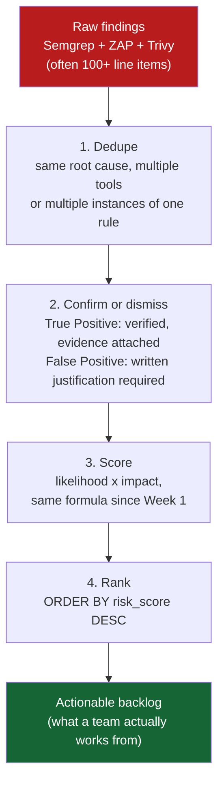

# Lecture 3 — SCA & Triaging Findings

> **Duration:** ~2 hours. **Outcome:** You can explain what software composition analysis checks and where it's blind, run Trivy against a real dependency tree, and — the core skill this whole week has been building toward — take raw output from three different scanners and turn it into one deduplicated, justified, risk-ranked backlog in a database.

> **Framing, read first.** SCA in this lecture scans the dependency manifest of your own lab target's source (Juice Shop's `package.json`/`package-lock.json`), checking it against public, defensive vulnerability databases. Nothing here contacts, probes, or attacks any third party — you are reading a list of library versions and cross-referencing it against a published advisory database, the software-security equivalent of checking a car's recall list against its VIN.

## 1. The third blind spot: code you didn't write

Lecture 1's SAST reads your own source. Lecture 2's DAST probes your own running app. Neither one looks — at all — at the dozens or hundreds of third-party libraries your application actually depends on, which is often the *majority* of the code that ends up running in production. A modern Node.js app pulls in a handful of direct dependencies, each of which pulls in more, and so on; Juice Shop's `package-lock.json` resolves to **well over a thousand** total packages once transitive dependencies are counted. You wrote none of them, but every one of them runs with your application's privileges.

**Software Composition Analysis (SCA)** answers a narrower, more mechanical question than SAST or DAST: *"Do any of the specific library versions I depend on have a publicly known, already-disclosed vulnerability?"* It does this by:

1. **Resolving your dependency tree** from a lockfile (`package-lock.json`, `requirements.txt`, `go.sum`, etc.) — the exact versions actually installed, not just the loose ranges in `package.json`.
2. **Matching each package@version against a vulnerability database** — public feeds of disclosed CVEs and advisories mapped to specific affected version ranges.
3. **Reporting known-vulnerable matches**, typically with a CVE ID, a severity (often a CVSS score), and — the genuinely hard part covered in Section 3 — whether an upgrade is even available.

This is fundamentally a **lookup problem**, not a code-analysis problem: SCA doesn't read a single line of the vulnerable library's code, doesn't run it, doesn't check whether your app actually uses the vulnerable function. It checks version strings against a list. That simplicity is exactly why it's fast and exactly why Section 3 will show you its sharpest limitation.

## 2. Hands-on: scanning with Trivy

[Trivy](https://trivy.dev/) (Aqua Security) is a fast, open-source scanner that covers dependency files, container images, and infrastructure-as-code from one tool — this course uses its filesystem/dependency mode. Install it:

```bash
# macOS
brew install trivy
# Linux — see resources.md for the official install script
trivy --version
```

Scan the same Juice Shop source you cloned in Exercise 1 (this reads only the lockfile, not the app's own code — Trivy never needs the app running):

```bash
cd juice-shop-src
trivy fs --scanners vuln --format json --output ../trivy-results.json .
```

Trivy resolves every dependency in `package-lock.json`, checks each against its vulnerability database (built from the [OSV](https://osv.dev/) format, aggregating GitHub Security Advisories, npm advisories, and more), and reports matches. A real scan of Juice Shop's dependency tree — because Juice Shop deliberately pins some older, vulnerable packages as part of its own teaching design — typically returns dozens of findings across every severity band. Each result carries a `VulnerabilityID` (the CVE or advisory ID), `PkgName` and `InstalledVersion`, `FixedVersion` (if a patched release exists), and a `Severity`. That's the anatomy of an **SCA finding** — a package, a version, a known-CVE identifier, and (crucially) whether a fix exists at all.

An equally valid alternative worth knowing is Google's [OSV-Scanner](https://google.github.io/osv-scanner/), which queries the same open OSV database directly:

```bash
osv-scanner --lockfile=package-lock.json --json > ../osv-results.json
```

Either tool answers the same question from the same underlying data; this course standardizes on Trivy for the hands-on work because one tool also covers container-image scanning, which later weeks' supply-chain material (Week 9) builds on.

## 3. What SCA catches — and its sharpest limitation: reachability

| SCA catches well | SCA is structurally blind to |
|---|---|
| Any dependency with a **publicly disclosed** CVE matching its exact installed version | **Zero-days** — vulnerabilities nobody has disclosed yet have no database entry to match against, by definition |
| Transitive dependencies buried many layers deep that no human would find by manually reading `package.json` | **Whether the vulnerable code path is actually reachable** — the single biggest source of SCA false-positive-*feeling* noise, covered below |
| License and supply-chain provenance issues (some SCA tools flag license conflicts too, not covered further this week) | **Vulnerabilities in code you wrote yourself** — that's SAST's job entirely; SCA only ever looks at third-party dependency manifests |
| A fast, cheap first pass across an entire dependency tree in seconds | **Anything not captured in a lockfile** — a vendored copy of a library pasted directly into your repo, with no `package.json` entry, is invisible to SCA |

The **reachability problem** deserves its own callout because it's the thing that makes SCA output feel noisier than it is: a scanner reports that `library-x@2.1.0` has a known Remote Code Execution CVE in its `parseUntrustedXML()` function. Technically true. But if your application only ever calls `library-x`'s unrelated `formatDate()` function and never touches `parseUntrustedXML()` anywhere in the actual call graph, the vulnerable *code* is present on disk but never *executes* in your application. That finding is real (the vulnerable version genuinely is installed) but its **practical risk in your specific app may be near zero** — which is not the same thing as a false positive (the CVE is real and correctly matched), but does mean its priority in your risk-ranked backlog should reflect actual exposure, not just the CVE's raw severity score. Confirming reachability — does your code path actually call the vulnerable function — is exactly the kind of judgment call the triage discipline in Section 5 exists to make explicit and written-down, rather than silently assumed.

## 4. Three tools, three shapes of finding — the reconciliation problem

Before triage can happen, you need to recognize a subtler issue: **the same underlying weakness can show up as three differently-worded findings from three different tools**, and treating them as three separate bugs inflates your backlog and wastes remediation effort. Consider a single real weakness — Juice Shop storing a JWT secret insecurely — and how each tool might describe it:

| Tool | What it reports | How it's worded |
|---|---|---|
| **Semgrep (SAST)** | Hardcoded string literal used as a JWT signing secret in `routes/verify.ts` | `"Hardcoded secret used in jwt.sign() call"` — file + line number |
| **ZAP (DAST)** | Possibly nothing directly — a hardcoded signing secret isn't observable purely from HTTP traffic unless it enables a downstream exploit ZAP happens to find | (often silent on this specific weakness — a real example of a gap only SAST fills) |
| **Trivy (SCA)** | Might flag the JWT library version itself if that specific library version had a *separate*, unrelated disclosed CVE | `"CVE-2022-23529 in jsonwebtoken@8.5.1"` — package + CVE, describing the *library's* bug, not your usage of it |

This table makes a point worth sitting with: it's entirely possible for **three tools to report zero, one, or three things about the same area of the app, none of which describe the exact same underlying weakness** — SAST found your *usage* mistake, SCA (if it fired at all) found the *library's own* unrelated bug, and DAST found nothing because the weakness isn't observable purely over HTTP. Reconciliation, which Challenge 2 formalizes, means grouping findings that genuinely are duplicates of the same root cause (three tools describing the identical missing-validation bug in slightly different words) while correctly keeping genuinely distinct findings separate (your code's mistake and the library's separate CVE, even though both involve the word "JWT").

## 5. The triage funnel

Raw scanner output across all three tools for a real app like Juice Shop routinely runs into the hundreds of line items. A findings backlog nobody can actually work through isn't a deliverable — it's noise with a database schema. Triage is the disciplined funnel that turns raw output into something a team can act on:



Each stage has a concrete rule:

1. **Dedupe.** Two findings are duplicates if they describe the same root cause in the same location — not merely the same rule ID. Fifty instances of "missing input length check" across fifty different form fields are fifty *real, distinct* findings (each needs its own fix), not one duplicated fifty times; but the same SQL-injection flow reported by both Semgrep's taint rule and a generic linter is one finding with two sources.
2. **Confirm or dismiss.** A **true positive** needs evidence — for SAST, the actual reachable call path; for DAST, the actual reflected payload or response difference; for SCA, confirmation the vulnerable function is in your call graph (or an honest note that you couldn't confirm reachability and are scoring conservatively as a result). A **false positive** needs a *written* reason just as rigorous — "sanitized three lines earlier via the framework's built-in escaping, confirmed by reading the code" is a real justification; "doesn't look like a big deal" is not, and would fail this course's Exercise 3 checklist.
3. **Score.** Every confirmed finding gets the same `likelihood × impact` treatment every risk in this course has gotten since Week 1 — a Trivy finding for a library with a public, weaponized exploit and no fix available scores very differently than one with a patch one `npm update` away.
4. **Rank.** The whole point of doing this in a database rather than a document: `SELECT * FROM findings WHERE status = 'confirmed' ORDER BY risk_score DESC` is the entire "what do we work on first" conversation, answered in one query, every time, instantly re-runnable as new findings come in.

## 6. Storing the backlog — extending `appsec.db`

This week's findings live in the same SQLite database you've built since Week 1, with two new tables that unify all three scanner types under one queryable shape:

```sql
CREATE TABLE scanners (
    scanner_id   INTEGER PRIMARY KEY,
    name         TEXT NOT NULL UNIQUE,             -- 'semgrep', 'zap', 'trivy'
    category     TEXT NOT NULL
                    CHECK (category IN ('sast','dast','sca')),
    version      TEXT
);

CREATE TABLE findings (
    finding_id       INTEGER PRIMARY KEY,
    scanner_id       INTEGER NOT NULL REFERENCES scanners(scanner_id),
    target_id        INTEGER NOT NULL REFERENCES targets(target_id),
    rule_id          TEXT NOT NULL,                -- semgrep check_id / zap pluginid / trivy VulnerabilityID
    title            TEXT NOT NULL,
    severity_raw     TEXT NOT NULL,                -- the scanner's own rating, unmodified
    severity_normal  TEXT NOT NULL                 -- unified across tools
                        CHECK (severity_normal IN ('info','low','medium','high','critical')),
    file_path        TEXT,                          -- SAST
    line_number      INTEGER,                       -- SAST
    url              TEXT,                          -- DAST
    cve_id           TEXT,                           -- SCA
    package_name     TEXT,                           -- SCA
    package_version  TEXT,                           -- SCA
    description      TEXT NOT NULL,
    raw_output       TEXT,                            -- original JSON blob for this finding
    status           TEXT NOT NULL DEFAULT 'new'
                        CHECK (status IN
                          ('new','confirmed','false_positive','duplicate','wontfix','fixed')),
    triage_notes     TEXT,                              -- required once status leaves 'new'
    likelihood       INTEGER CHECK (likelihood BETWEEN 1 AND 5),
    impact           INTEGER CHECK (impact BETWEEN 1 AND 5),
    risk_score       INTEGER,                            -- likelihood * impact, same formula since Week 1
    discovered_at    TIMESTAMP NOT NULL DEFAULT CURRENT_TIMESTAMP
);
```

Notice the deliberate split between `severity_raw` (what the tool itself said — never discard this, it's your audit trail back to the original report) and `severity_normal` (a five-band scale you map every tool's own vocabulary onto, so a single `ORDER BY` can rank Semgrep's `ERROR`, ZAP's `High`, and Trivy's `CRITICAL` findings against each other on one consistent scale — that mapping is exactly what Exercise 3 has you build). The `status` and `triage_notes` columns are where the funnel from Section 5 becomes rows you can query — `WHERE status = 'false_positive' AND triage_notes IS NULL` should always return zero rows in a properly triaged backlog, and Exercise 3's checklist verifies exactly that.

## 7. Check yourself

- In one sentence, what question does SCA answer that neither SAST nor DAST answers?
- Explain the "reachability problem" in your own words, and why a technically-real CVE match can still deserve a low risk score in your specific app.
- Using Section 4's JWT-secret example, explain how the same underlying weakness could produce zero, one, or multiple findings depending on which tools happen to catch which angle of it.
- Walk through all four stages of the triage funnel from memory, and state what a *false positive* needs, in writing, before it's allowed to leave `status = 'new'`.
- Why does the `findings` table keep both `severity_raw` and `severity_normal` instead of just normalizing and discarding the original?

You've now completed the full picture this week set out to teach: three scanner classes, three different blind spots, one funnel that turns their combined noise into a single ranked backlog. Exercises 1–3 have you run every step of this for real against your own lab; the mini-project asks you to wire all three together end to end.

## Further reading

- **Trivy — Vulnerability scanning documentation:** <https://trivy.dev/latest/docs/scanner/vulnerability/>
- **OSV — Open Source Vulnerability database and schema:** <https://osv.dev/>
- **OSV-Scanner — official documentation:** <https://google.github.io/osv-scanner/>
- **GitHub Security Advisories database:** <https://github.com/advisories>
- **NIST National Vulnerability Database (NVD):** <https://nvd.nist.gov/>
- **OWASP — Dependency-Check** (a longstanding alternative SCA tool, useful for comparison in Challenge 2): <https://owasp.org/www-project-dependency-check/>
- **CISA — Known Exploited Vulnerabilities (KEV) Catalog** (a good reachability/priority signal: is this CVE actually being exploited in the wild right now): <https://www.cisa.gov/known-exploited-vulnerabilities-catalog>
