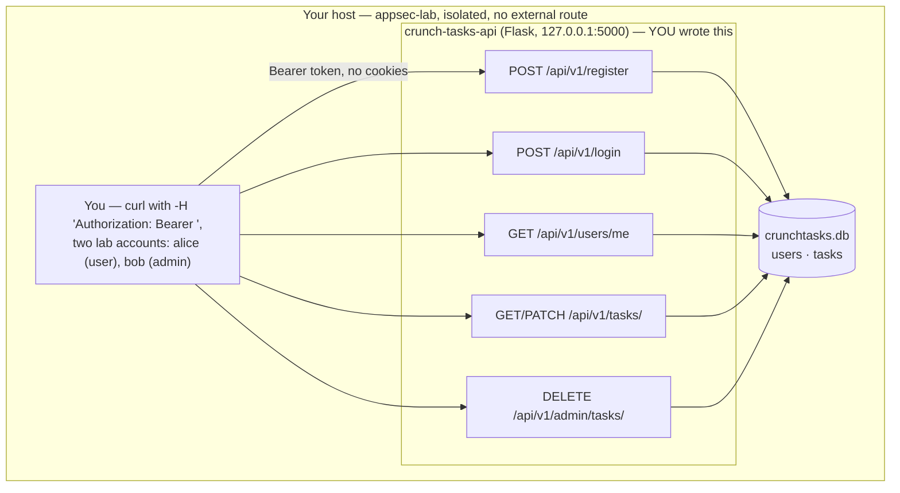

# Week 9 — API & Supply-Chain Security

> **Goal:** by Sunday you can look at a JSON API and name, from the request/response alone, whether it's leaking an object it shouldn't (BOLA), a function it shouldn't (BFLA), more fields than it should (excessive data exposure), or letting a client set fields it was never meant to touch (mass assignment) — fix all four at the source, add real rate limiting — and, on the other half of the app you didn't write yourself, generate a software bill of materials, scan it for known vulnerabilities, and defend the build pipeline against a poisoned or impersonated dependency.

Welcome back to **C50 · Crunch AppSec**. Weeks 3 and 6 taught access control against a browser-facing app with session cookies. This week is the same discipline — **who's allowed to do what, to which object** — applied to a JSON API talking to a mobile app or another service over Bearer tokens, where the failure modes have their own names and their own shapes. Then the week pivots to a different kind of "who's allowed to do what": not your users, but your **dependencies** — the thousands of lines of code sitting in `requirements.txt` that you imported and never read, any one of which could be malicious, abandoned, or quietly vulnerable. Both halves of this week share one sentence: **the part of the app you didn't write by hand is still your responsibility to secure.**

APIs fail differently than server-rendered web apps for a specific, structural reason: there's no HTML, no hidden form fields, and often no browser at all watching the response — just a client trusting whatever JSON comes back and a server trusting whatever JSON comes in. That missing browser is exactly why the [OWASP API Security Top 10](https://owasp.org/API-Security/editions/2023/en/0x11-t10/) exists as its own list, separate from the web Top 10 you learned in Week 3: broken object-level authorization (BOLA) is 2023's #1 API risk for the same reason IDOR was Week 3's #1 web risk — a client-supplied ID, trusted without an ownership check — but it shows up as a bare `GET /api/v1/tasks/482` with a Bearer token instead of a cookie-carrying browser request, and the *fix* still has to happen at the same place: the `WHERE` clause.

> **Ethics & legality — binding, every week.** All work below is **authorized, legal, defensive-minded** security practice performed **only inside your isolated `appsec-lab`** from Week 1, against `crunch-tasks-api` — a JSON API **you write, own, and run only on `127.0.0.1`**, populated entirely with fictional users and fictional tasks you generate yourself. The supply-chain half of this week never contacts a real package index with intent to attack it: dependency-confusion and typosquatting are demonstrated against **local, offline package indexes you build yourself** (a plain directory served with `python -m http.server` on `127.0.0.1`, or a `--find-links` folder) — you will never publish a package to PyPI, npm, or any real registry, and you will never install a package whose name you didn't choose yourself for this lab. Any install-time code used to *demonstrate* the risk is a harmless print statement you wrote, run with no network access, exactly like every "malware" example in this course — isolated, no-network, and immediately paired with the detection and defense that would have caught it. Written authorization, defined scope, and the law govern every exercise this week and every week after it.

## Learning objectives

By the end of this week, you will be able to:

- **Recognize** API-specific risks distinct from the web Top 10 — broken object-level authorization (BOLA), broken function-level authorization (BFLA), mass assignment, excessive data exposure, and missing/weak rate limiting — as concrete request/response patterns, not acronyms.
- **Enforce** object- and function-level authorization on every API endpoint, the same "deny by default, check the actual object" discipline from Weeks 3 and 6, applied to Bearer-token requests instead of session cookies.
- **Prevent** mass assignment (a client setting fields it was never authorized to set) and excessive data exposure (a response leaking fields the client never needed) with explicit allowlists at both the input and output boundary.
- **Defend the software supply chain** with pinned, hashed lockfiles; a generated and scanned SBOM (software bill of materials); and an understanding of dependency confusion, typosquatting, and compromised-package attacks concrete enough to explain to a teammate in one sentence each.
- **Detect and record** vulnerable and malicious dependencies as structured findings in a SQL database, so "what's still unpatched in our supply chain" is one query away — never a spreadsheet, never a memory.

## Prerequisites

- **Week 1 completed** — your isolated `appsec-lab` Docker network is up.
- **Week 3 (OWASP Top 10)** and **Week 6 (Access Control & Authorization)** — this week assumes you're fluent in "authentication answers who, authorization answers what" and in IDOR/ownership-check patterns; it applies that exact vocabulary to a token-authenticated JSON API instead of a session-cookie web app.
- **Week 8 (SAST/DAST/SCA)** helpful but not required — you've already run `pip-audit` once; this week goes deeper on what it's actually scanning against and adds SBOM generation on top of it.
- Python 3.10+, `pip`, and `sqlite3` (ships with Python). Comfortable making HTTP requests with `curl` and reading JSON.

## This week's lab: `crunch-tasks-api`

Every lecture, exercise, and challenge in the first half of the week point at the same small app: a **JSON task-management API** authenticated with Bearer tokens instead of session cookies — the shape of almost every mobile-app backend or service-to-service integration you'll ever touch.



No browser anywhere in this diagram — every request is a `curl` command carrying a token in a header. That's deliberate: it's the actual shape of API traffic, and it's why "just don't show the button" (a web-era instinct) was never a real defense to begin with.

### Set it up once (do this before Lecture 1)

```bash
mkdir -p crunch-tasks-api && cd crunch-tasks-api
python3 -m venv .venv && source .venv/bin/activate
pip install flask==3.0.3
```

`schema.sql`:

```sql
CREATE TABLE users (
    id            INTEGER PRIMARY KEY,
    username      TEXT UNIQUE NOT NULL,
    email         TEXT UNIQUE NOT NULL,
    password_hash TEXT NOT NULL,
    api_token     TEXT UNIQUE NOT NULL,
    role          TEXT NOT NULL DEFAULT 'user' CHECK (role IN ('user','admin')),
    credits       INTEGER NOT NULL DEFAULT 0
);

CREATE TABLE tasks (
    id           INTEGER PRIMARY KEY,
    user_id      INTEGER NOT NULL REFERENCES users(id),
    title        TEXT NOT NULL,
    body         TEXT NOT NULL,
    is_complete  INTEGER NOT NULL DEFAULT 0,
    reward_cents INTEGER NOT NULL DEFAULT 0,
    created_at   TEXT NOT NULL DEFAULT (datetime('now'))
);
```

`seed.py`:

```python
import hashlib
import sqlite3


def sha256(text):
    return hashlib.sha256(text.encode()).hexdigest()


db = sqlite3.connect("crunchtasks.db")
db.executescript(open("schema.sql").read())

db.executemany(
    "INSERT INTO users (id, username, email, password_hash, api_token, role, credits) VALUES (?, ?, ?, ?, ?, ?, ?)",
    [
        (1, "alice", "alice@crunch.io", sha256("alice-pass"), "tok_alice_LABONLY_0001", "user", 5),
        (2, "bob", "bob@crunch.io", sha256("bob-pass"), "tok_bob_LABONLY_0002", "admin", 5),
    ],
)
db.executemany(
    "INSERT INTO tasks (id, user_id, title, body, is_complete, reward_cents) VALUES (?, ?, ?, ?, ?, ?)",
    [
        (1, 1, "Renew SSL cert", "Expires end of month, don't forget.", 0, 0),
        (2, 1, "Draft Q3 budget notes", "Confidential — do not share outside finance.", 0, 0),
        (3, 2, "Rotate deploy key", "Monthly rotation, see runbook.", 0, 0),
    ],
)
db.commit()
db.close()
print("seeded crunchtasks.db — 2 users (alice=user, bob=admin), 3 tasks")
```

`app.py` — the full API; each lecture below walks through one or more of its marked `# VULNERABLE` lines:

```python
import hashlib
import sqlite3

from flask import Flask, g, jsonify, request

app = Flask(__name__)
DB_PATH = "crunchtasks.db"


def sha256(text):
    return hashlib.sha256(text.encode()).hexdigest()


def get_db():
    if "db" not in g:
        g.db = sqlite3.connect(DB_PATH)
        g.db.row_factory = sqlite3.Row
    return g.db


@app.teardown_appcontext
def close_db(exception=None):
    db = g.pop("db", None)
    if db is not None:
        db.close()


def current_user():
    auth = request.headers.get("Authorization", "")
    if not auth.startswith("Bearer "):
        return None
    token = auth.removeprefix("Bearer ")
    return get_db().execute("SELECT * FROM users WHERE api_token = ?", (token,)).fetchone()


@app.route("/api/v1/register", methods=["POST"])
def register():
    data = request.get_json(force=True, silent=True) or {}
    import secrets

    token = "tok_" + secrets.token_hex(12)
    # VULNERABLE (mass assignment) — every key the client sends is written
    # straight into the INSERT, including 'role' and 'credits', fields a
    # brand-new signup should never control. Nothing here restricts the
    # request body to username/email/password.
    db = get_db()
    db.execute(
        "INSERT INTO users (username, email, password_hash, api_token, role, credits) "
        "VALUES (?, ?, ?, ?, ?, ?)",
        (
            data.get("username"),
            data.get("email"),
            sha256(data.get("password", "")),
            token,
            data.get("role", "user"),
            data.get("credits", 0),
        ),
    )
    db.commit()
    return jsonify(message="registered", api_token=token), 201


@app.route("/api/v1/login", methods=["POST"])
def login():
    # VULNERABLE (missing rate limiting) — no attempt counter, no lockout, no
    # delay, no CAPTCHA. At API scale this is a scriptable credential-stuffing
    # endpoint with no friction at all.
    data = request.get_json(force=True, silent=True) or {}
    row = get_db().execute(
        "SELECT * FROM users WHERE username = ? AND password_hash = ?",
        (data.get("username"), sha256(data.get("password", ""))),
    ).fetchone()
    if row is None:
        return jsonify(error="invalid credentials"), 401
    return jsonify(message=f"welcome {row['username']}", api_token=row["api_token"])


@app.route("/api/v1/users/me")
def whoami():
    user = current_user()
    if user is None:
        return jsonify(error="invalid or missing token"), 401
    # VULNERABLE (excessive data exposure) — returns the ENTIRE row, including
    # password_hash and api_token, to the client that already has the token.
    # A field the API happens to store is not the same as a field the API
    # should ever return.
    return jsonify(dict(user))


@app.route("/api/v1/tasks/<task_id>")
def get_task(task_id):
    user = current_user()
    if user is None:
        return jsonify(error="invalid or missing token"), 401
    # VULNERABLE (BOLA — broken object-level authorization) — fetches by ID
    # alone, no check that this task belongs to the calling user. Any valid
    # token can read any task by walking the integer ID.
    row = get_db().execute("SELECT * FROM tasks WHERE id = ?", (task_id,)).fetchone()
    if row is None:
        return jsonify(error="not found"), 404
    return jsonify(dict(row))


@app.route("/api/v1/tasks/<task_id>", methods=["PATCH"])
def update_task(task_id):
    user = current_user()
    if user is None:
        return jsonify(error="invalid or missing token"), 401
    data = request.get_json(force=True, silent=True) or {}
    # VULNERABLE (mass assignment, again) — every key in the request body is
    # written into the UPDATE, unfiltered. A caller can PATCH 'user_id' to
    # steal a task, or 'reward_cents' to pay themselves for work never done,
    # by simply including those keys in the JSON body.
    db = get_db()
    columns = ", ".join(f"{k} = ?" for k in data.keys())
    if columns:
        db.execute(f"UPDATE tasks SET {columns} WHERE id = ?", (*data.values(), task_id))
        db.commit()
    row = db.execute("SELECT * FROM tasks WHERE id = ?", (task_id,)).fetchone()
    return jsonify(dict(row)) if row else (jsonify(error="not found"), 404)


@app.route("/api/v1/admin/tasks/<task_id>", methods=["DELETE"])
def admin_delete_task(task_id):
    user = current_user()
    # VULNERABLE (BFLA — broken function-level authorization) — checks that
    # *some* valid token was presented, never that the caller's role is
    # 'admin'. Any authenticated user, including alice, can reach an
    # admin-only function simply by knowing the URL.
    if user is None:
        return jsonify(error="invalid or missing token"), 401
    get_db().execute("DELETE FROM tasks WHERE id = ?", (task_id,))
    get_db().commit()
    return jsonify(message=f"task {task_id} deleted")


if __name__ == "__main__":
    app.run(host="127.0.0.1", port=5000, debug=True)
```

```bash
python3 seed.py
python3 app.py
```

Sanity check — this should return `{"message":"welcome alice","api_token":"tok_alice_LABONLY_0001"}`:

```bash
curl -s -X POST http://127.0.0.1:5000/api/v1/login \
  -H "Content-Type: application/json" \
  -d '{"username":"alice","password":"alice-pass"}'
```

Five flaws, one file, five API-specific categories — that's the map for the whole week's first half:

| API Top 10 category | Where it lives in `crunch-tasks-api` | Covered in |
|---|---|---|
| Broken Object-Level Authorization (BOLA) | `GET /api/v1/tasks/<id>` (no ownership check) | Lecture 1 |
| Broken Function-Level Authorization (BFLA) | `DELETE /api/v1/admin/tasks/<id>` (no role check) | Lecture 1 |
| Mass Assignment | `POST /api/v1/register` (client sets `role`/`credits`), `PATCH /api/v1/tasks/<id>` (client sets any column, incl. `user_id`) | Lecture 1 |
| Excessive Data Exposure | `GET /api/v1/users/me` (returns `password_hash`, `api_token`) | Lecture 1 |
| Unrestricted Resource Consumption (missing rate limits) | `POST /api/v1/login` (no lockout, no throttle) | Lecture 1 |

Lecture 2 turns each of those five fixes into a general design discipline (authentication, input validation, output shaping, rate limiting, versioning). Lecture 3 leaves the app you wrote entirely and turns to `requirements.txt` — the part of `crunch-tasks-api` you *didn't* write yourself.

## This week's map

Work top to bottom. Each piece assumes the ones before it.

| # | File | What's inside | ~Time |
|--:|------|---------------|------:|
| 1 | [lecture-notes/01-api-top-10-risks.md](./lecture-notes/01-api-top-10-risks.md) | The API Top 10 at a glance; BOLA, BFLA, mass assignment, excessive data exposure, and missing rate limits — each demonstrated and fixed in `crunch-tasks-api` | 2h |
| 2 | [lecture-notes/02-securing-api-design.md](./lecture-notes/02-securing-api-design.md) | API authentication choices, schema-based input validation, output shaping/serializers, real rate limiting, and versioning without leaking internals | 2h |
| 3 | [lecture-notes/03-software-supply-chain-security.md](./lecture-notes/03-software-supply-chain-security.md) | Dependency confusion, typosquatting, compromised packages, lockfiles/pinning with hashes, SBOMs, and verifying provenance | 2h |
| 4 | [exercises/exercise-01-fix-broken-object-authz.md](./exercises/exercise-01-fix-broken-object-authz.md) | Demonstrate the BOLA on `/tasks/<id>`, fix it, re-test | 1.5h |
| 5 | [exercises/exercise-02-stop-mass-assignment.md](./exercises/exercise-02-stop-mass-assignment.md) | Demonstrate both mass-assignment flaws, fix both with explicit allowlists, re-test | 1.5h |
| 6 | [exercises/exercise-03-generate-and-scan-an-sbom.md](./exercises/exercise-03-generate-and-scan-an-sbom.md) | Generate a CycloneDX SBOM for `crunch-tasks-api`'s dependencies, scan it, log findings to SQLite | 1.5h |
| 7 | [challenges/challenge-01-harden-a-lab-api.md](./challenges/challenge-01-harden-a-lab-api.md) | Harden `crunch-tasks-api` end to end — BFLA, excessive exposure, rate limiting, all in one pass | 2h |
| 8 | [challenges/challenge-02-simulate-a-dependency-attack.md](./challenges/challenge-02-simulate-a-dependency-attack.md) | Build a local, offline dependency-confusion scenario and prove pinning/hash-checking stops it | 1.5h |
| 9 | [mini-project/README.md](./mini-project/README.md) | Secure the whole lab API and its supply chain, end to end, with a findings database | 4h |
| 10 | [homework.md](./homework.md) | Extra practice, spread across the week | 5h |
| 11 | [quiz.md](./quiz.md) | 15 self-check questions + answer key | 1h |
| 12 | [resources.md](./resources.md) | Official docs, standards, and the few links worth your time | — |

## Weekly schedule

Adds up to roughly the course's full-time pace of **~28 hours**. Treat it as a target, not a stopwatch.

| Day | Focus | Lectures | Exercises | Challenges | Quiz/Read | Homework | Mini-Project | Daily Total |
|-----------|------------------------------------------|---------:|----------:|-----------:|----------:|---------:|-------------:|------------:|
| Monday | API Top 10 overview; BOLA, BFLA | 2h | 0h | 0h | 0.5h | 1h | 0h | 3.5h |
| Tuesday | Fix BOLA + mass assignment | 0h | 3h | 0h | 0.5h | 1h | 0h | 4.5h |
| Wednesday | Securing API design (authn, validation, rate limits) | 2h | 0h | 0h | 0.5h | 1h | 0h | 3.5h |
| Thursday | Supply-chain security; generate + scan an SBOM | 2h | 1.5h | 0h | 0.5h | 1h | 0.5h | 5.5h |
| Friday | Harden-the-API + simulate-a-dependency-attack challenges | 0h | 0h | 3.5h | 0.5h | 1h | 0.5h | 5.5h |
| Saturday | Mini-project | 0h | 0h | 0h | 0h | 0h | 3h | 3h |
| Sunday | Quiz + review | 0h | 0h | 0h | 1h | 0h | 0h | 1h |
| **Total** | | **6h** | **4.5h** | **3.5h** | **3.5h** | **5h** | **4h** | **~26.5h** |

## By the end of this week you can…

- Look at an API request/response pair and name which of BOLA, BFLA, mass assignment, excessive data exposure, or missing rate limiting it demonstrates — and fix the right one at the right layer (query predicate, role check, field allowlist, or throttle).
- Explain in one sentence why "the mobile app's UI doesn't expose that field" is not a security control, on an API exactly as it wasn't on a web app in Weeks 3 and 6.
- Generate a software bill of materials for a real Python project, read what's actually in it, and scan it for known vulnerabilities with an open-source tool.
- Explain dependency confusion and typosquatting well enough to design a defense for each — private-index priority and package-name reservation for the first, careful reading and hash-pinning for the second — without needing to attack a real registry to prove it.
- Record every API and dependency finding as a queryable SQL row, exactly the discipline every findings report in this course has used since Week 1.

## Up next

[Week 10 — Secure SDLC & CI/CD security](../week-10-secure-sdlc-and-ci-cd-security/) — you've secured the application and everything it depends on; next week is about the pipeline that builds and ships it, which attackers increasingly target in its own right.

---

*Part of the Code Crunch Worldwide open curriculum · GPL-3.0 · If you find errors, please open an issue or PR.*
