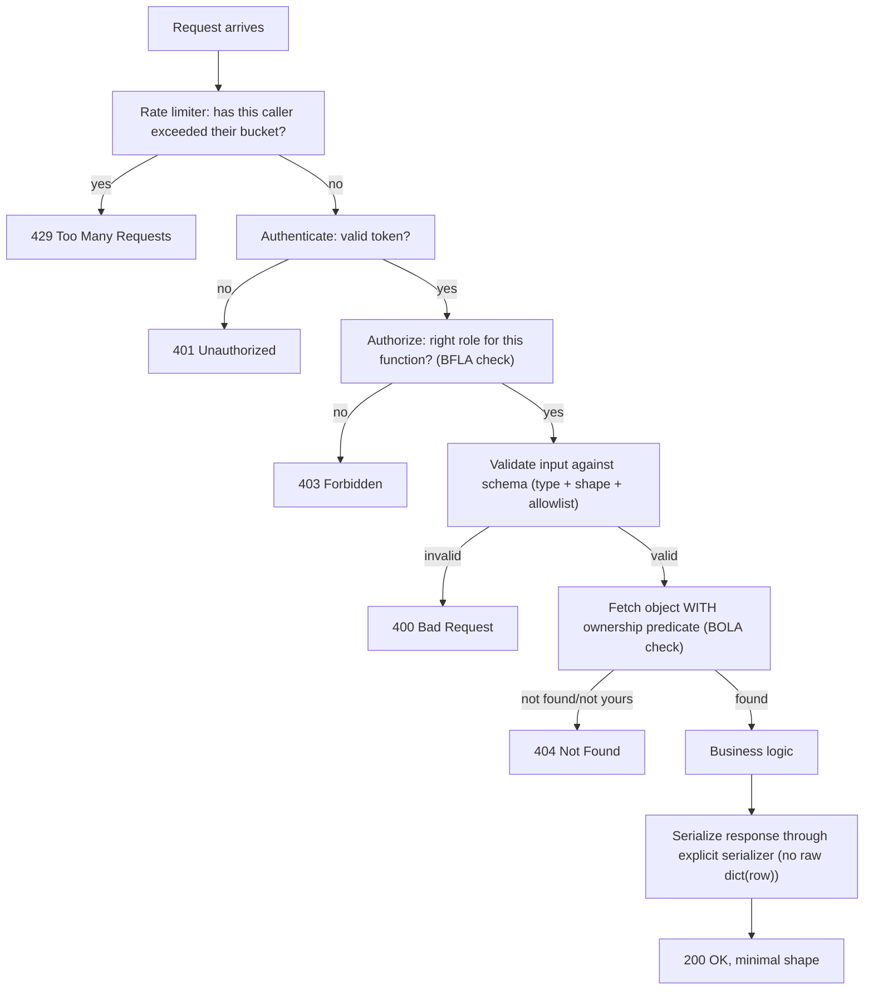

# Lecture 2 — Securing API Design

> **Duration:** ~2 hours. **Outcome:** You can choose an appropriate API authentication mechanism, validate input at the edge with a schema instead of ad hoc `if` checks, shape output with an explicit serializer, add real rate limiting, and version an API without leaking what's running underneath.

Lecture 1 fixed five specific lines in `crunch-tasks-api`. This lecture is about the **design habits** that prevent whole categories of bug before they're ever written — the difference between "I patched this one endpoint" and "I built the endpoint so this class of mistake isn't possible here." Five disciplines, each mapping directly back to one of Lecture 1's five categories.

## 1. Authentication for APIs

Lecture 1's fixes assumed Bearer tokens already existed. This section is about *which* kind of token, and why the choice matters.

### API keys — simple, static, coarse

A bare secret string sent in a header (`X-API-Key: ...` or `Authorization: Bearer ...` with an opaque token, exactly like `crunch-tasks-api`'s `tok_alice_LABONLY_0001`). Simple to implement, simple to revoke (delete the row), but carries **no built-in expiry** and **no built-in claims** — the server has to look the token up in a database on every request to learn who it belongs to and what it's allowed to do. Fine for service-to-service integrations and small APIs; `crunch-tasks-api` uses this style deliberately, because it's the simplest mechanism that still requires everything Lecture 1 taught you to get right.

### JWTs (JSON Web Tokens) — self-contained, stateless, harder to revoke

A JWT is a signed (and optionally encrypted) blob containing claims — `user_id`, `role`, an expiry (`exp`), issued directly to the client after login. The server can verify it (check the signature, check `exp`) **without a database lookup**, which is the entire appeal at scale. The cost: a JWT issued for 24 hours is valid for 24 hours **even if you delete the user's account five minutes later**, unless you build a separate revocation mechanism (a denylist, a short expiry plus refresh tokens, or a per-user "token version" column checked against every JWT's claim). Two mistakes recur constantly in the wild:

- **Trusting the `alg` header.** A JWT's header names its own signing algorithm. Some libraries, misconfigured, will accept a token whose header says `"alg": "none"` and skip signature verification entirely — an attacker can then hand-craft any claims they like. **Always pin the expected algorithm server-side**; never let the token tell the verifier which algorithm to use.
- **Putting sensitive data in the payload.** A JWT's payload is **base64-encoded, not encrypted** — anyone holding the token can decode and read every claim in it (try `echo '<payload-part>' | base64 -d` on any JWT you're issued). Put a user ID and a role in there; never a password, a full profile, or anything you wouldn't put in a URL query string.

### OAuth 2.0 / OpenID Connect — delegated authorization

When your API needs to let a *third party* act on a user's behalf — "let this other app read your Crunch tasks without ever seeing your password" — that's what OAuth 2.0 is for: the user authorizes a scoped, revocable token issued to the third-party app, never handing over their actual credentials. This is heavier machinery than `crunch-tasks-api` needs (it's a single first-party API with its own login), so this course doesn't implement it — but recognize the shape: if your API is ever meant to be called by code you don't control, on behalf of a user, reach for OAuth 2.0/OIDC rather than inventing a bespoke delegation scheme.

**Choosing between them:** API keys for service-to-service and simple first-party APIs; JWTs when you need statelessness at scale and can tolerate (or design around) delayed revocation; OAuth 2.0 the moment a third party needs delegated, scoped access to a user's data.

## 2. Input validation at the edge

Lecture 1's mass-assignment fix used a manual allowlist (`{k: v for k, v in data.items() if k in ALLOWED_FIELDS}`). That works, but it doesn't validate *types* or *shapes* — a client could still send `{"title": 12345}` or `{"is_complete": "definitely"}` and the manual allowlist would let it straight through to the database. The fix that scales is a **schema**, validated once, at the boundary, before any business logic runs.

```python
from marshmallow import Schema, fields, ValidationError


class TaskUpdateSchema(Schema):
    title = fields.Str(validate=lambda s: 1 <= len(s) <= 200)
    body = fields.Str(validate=lambda s: len(s) <= 5000)
    is_complete = fields.Boolean()


@app.route("/api/v1/tasks/<task_id>", methods=["PATCH"])
def update_task(task_id):
    user = current_user()
    if user is None:
        return jsonify(error="invalid or missing token"), 401
    try:
        clean = TaskUpdateSchema().load(request.get_json(force=True, silent=True) or {}, partial=True)
    except ValidationError as err:
        return jsonify(error="validation failed", details=err.messages), 400
    if not clean:
        return jsonify(error="no updatable fields provided"), 400
    ...  # same allowlisted UPDATE as Lecture 1, now type-checked too
```

The schema does three jobs the manual allowlist couldn't: it defines the **exact field set** (same effect as the allowlist — `user_id` and `reward_cents` simply aren't declared, so `.load()` drops them or, with `unknown="raise"`, rejects the request outright), it enforces **types** (a string where a string is expected, a boolean where a boolean is expected), and it enforces **shape constraints** (length limits) that prevent a separate class of bug — an unbounded `body` field being used to exhaust storage or memory. `marshmallow`, `pydantic`, and `jsonschema` all solve this the same way in Python; pick one and use it at every boundary, not just the endpoints that felt risky enough to bother with.

**Validate at the edge, not scattered through business logic.** The moment request data passes the schema, every function downstream can assume it's well-typed and within bounds — which is exactly the same "validate once, trust after" discipline Week 5 taught for parameterized SQL: the boundary is where untrusted data becomes trusted data, and it should be one clearly identifiable place, not re-checked ad hoc in six different functions with six different half-complete `if` chains.

## 3. Output shaping — serializers, not `dict(row)`

Lecture 1's excessive-data-exposure fix hand-wrote the response fields (`jsonify(id=..., username=..., ...)`). That works for one route; a **serializer** makes the same discipline reusable and impossible to accidentally bypass:

```python
def serialize_user(row):
    """The ONLY function allowed to turn a users row into a client-facing dict.
    Add a field here deliberately; never expose one by omission-of-a-filter."""
    return {
        "id": row["id"],
        "username": row["username"],
        "email": row["email"],
        "role": row["role"],
        "credits": row["credits"],
    }


def serialize_task(row):
    return {
        "id": row["id"],
        "title": row["title"],
        "body": row["body"],
        "is_complete": bool(row["is_complete"]),
        "created_at": row["created_at"],
    }
```

Every route that returns a user or a task calls `serialize_user(row)` / `serialize_task(row)` — never `dict(row)` directly, anywhere, for any reason. This is the API equivalent of Lecture 1's `SELECT id, username, role FROM users` instead of `SELECT *`: naming exactly what leaves the boundary, once, in one auditable place, instead of trusting every future route author to remember to filter it by hand. The single biggest practical win: when someone adds a new column to `users` next year (a `stripe_customer_id`, say), it does **not** automatically start appearing in API responses — it has to be added to `serialize_user` on purpose, by someone who has to think about whether it belongs there.

## 4. Rate limiting

Lecture 1 demonstrated the *absence* of a limiter on `/login`. Here's the actual fix, first the concept, then a real implementation.

**The concept — a token bucket.** Each caller (identified by IP, API key, or user ID) gets a bucket that holds up to `N` tokens; each request consumes one token; the bucket refills at a fixed rate. Once the bucket is empty, further requests are rejected (`429 Too Many Requests`) until it refills. This allows short bursts of legitimate traffic while capping sustained abuse — a hard "max 5 requests total, ever" would be too strict for a real user occasionally mistyping a password twice in a row.

**A minimal implementation with `Flask-Limiter`:**

```python
from flask_limiter import Limiter
from flask_limiter.util import get_remote_address

limiter = Limiter(app=app, key_func=get_remote_address, default_limits=["200 per hour"])


@app.route("/api/v1/login", methods=["POST"])
@limiter.limit("5 per minute")   # tighter limit on the sensitive endpoint
def login():
    ...
```

```bash
pip install flask-limiter
```

**Re-test the same loop from Lecture 1** — request 6 and onward within the same minute should now return `429`, not `401`:

```bash
for i in $(seq 1 8); do
  curl -s -o /dev/null -w "%{http_code} " -X POST http://127.0.0.1:5000/api/v1/login \
    -H "Content-Type: application/json" -d '{"username":"alice","password":"guess'"$i"'"}'
done
echo
```

Two design choices matter beyond the code: **key the limiter on something an attacker can't cheaply rotate** (a per-account counter is stronger than a per-IP one for credential stuffing, since an attacker can trivially move to a new IP but not to a new target account), and **return `429` with a `Retry-After` header**, so well-behaved clients know exactly how long to back off, instead of hammering the endpoint blind.

## 5. Versioning without leaking internals

`crunch-tasks-api`'s routes already carry a `/api/v1/` prefix — a deliberate, minimal form of API versioning: when you need to make a breaking change, you ship `/api/v2/...` alongside the still-running `/api/v1/...`, rather than breaking every existing client the moment you deploy. Two security-relevant habits belong next to versioning, because they're usually decided at the same time a team designs its API surface:

- **Don't leak what's running underneath.** A default Flask error page, a `Server: Werkzeug/3.0.3 Python/3.11.4` response header, or a stack trace in a 500 response all hand an attacker your exact framework and version — precisely the information Week 8's SCA scanning is meant to weaponize *defensively*, on your own stack, before someone else weaponizes it against you. Disable Flask's debug mode in anything beyond your own laptop (Week 3, A05), and set a generic `Server` header rather than the framework default.
- **Deprecate old versions on a schedule, in writing, and enforce it.** An API version nobody maintains anymore, still reachable, is an unpatched, unmonitored copy of every vulnerability every *other* version has since fixed — API versioning without a sunset plan just accumulates permanently-vulnerable surface area with a `/v1/` label on it.

## 6. Putting all five together

The fixed shape of a single `crunch-tasks-api` route, incorporating every discipline from this lecture, reads top to bottom as one clean sequence:



*Five checks, five categories from Lecture 1, one order that never changes: rate limit, authenticate, authorize the function, validate the input, authorize the object, then — and only then — touch business logic and shape the output.*

## 7. Check yourself

- When would you reach for an API key over a JWT, and what's the practical cost of a JWT's statelessness when you need to revoke access early?
- Why is putting a user's email in a JWT payload a mistake, even though the token is cryptographically signed?
- What does a schema (marshmallow/pydantic) catch that a manual `{k: v for k, v in data.items() if k in ALLOWED}` allowlist doesn't?
- Why does `serialize_user()` protect the API against a *future* mistake (a newly added column) better than a one-off `jsonify(id=..., ...)` written by hand in a single route?
- In the flowchart above, why does the rate-limit check run *before* authentication, and why does the object-ownership check (BOLA) run *after* the function-level role check (BFLA) rather than before it?

Lecture 3 leaves `crunch-tasks-api`'s own code entirely and turns to the dependencies it's built on — the part of the app you never wrote a single line of, and the part where most real supply-chain breaches actually happen.

## Further reading

- **OWASP API Security — API2:2023 Broken Authentication:** <https://owasp.org/API-Security/editions/2023/en/0xa2-broken-authentication/>
- **OWASP Cheat Sheet — JSON Web Token for Java (concepts apply beyond Java):** <https://cheatsheetseries.owasp.org/cheatsheets/JSON_Web_Token_for_Java_Cheat_Sheet.html>
- **`marshmallow` — schema validation for Python:** <https://marshmallow.readthedocs.io/>
- **`Flask-Limiter` — official docs:** <https://flask-limiter.readthedocs.io/>
- **OWASP API Security — API4:2023 Unrestricted Resource Consumption:** <https://owasp.org/API-Security/editions/2023/en/0xa4-unrestricted-resource-consumption/>
