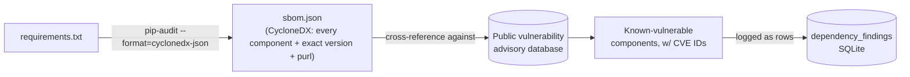

# Lecture 3 — Software Supply-Chain Security

> **Duration:** ~2 hours. **Outcome:** You can explain dependency confusion, typosquatting, and compromised-package attacks precisely enough to defend against each; you can pin a lockfile with hashes, generate a software bill of materials (SBOM) for a real project, scan it for known vulnerabilities, and record what you find in a database instead of a spreadsheet.

`crunch-tasks-api`'s `app.py` is maybe 120 lines. Its `requirements.txt` pulls in Flask, which pulls in Werkzeug, Jinja2, MarkupSafe, click, itsdangerous, blinker — each of which was written by someone else, is maintained by someone else, gets updated on someone else's schedule, and could be compromised without your ever knowing until it's exploited. **The software supply chain is every piece of code your application depends on that you didn't write and, in almost every real project, never read.** This lecture is about treating that dependency tree with the same rigor Weeks 1–8 applied to code you wrote by hand.

> Every technique in this lecture is demonstrated against **local, offline artifacts you build yourself** — a local package index served on `127.0.0.1`, packages you author, and `requirements.txt` files you control. Nothing here contacts a real package registry with intent to attack it, publishes anything publicly, or installs a package whose source you didn't write for this lab.

## 1. Dependency confusion

**Dependency confusion** exploits how package managers resolve a name when the *same* package name exists in two places: a private/internal index (your company's internal `crunch-utils` package, say) and a public index (PyPI, npm). If the tooling is configured to check the public index — or checks it *first*, or checks it as a fallback with no verification that the internal one "wins" — an attacker who **publishes a public package under your internal package's exact name** can get their code installed inside your build, your CI pipeline, or a developer's laptop, with no phishing and no credential theft required. This is not a hypothetical: security researcher Alex Birsan demonstrated exactly this technique against dozens of major companies in 2021 by publishing higher-versioned public packages matching internal package names he'd found referenced in leaked `package.json`/`requirements.txt` files — a widely reported, real, historical case, referenced here purely as background, never as a target.

**Demonstrate the mechanism locally — no real registry involved.** Build two local "indexes" as plain directories, one standing in for "internal," one for "public":

```bash
mkdir -p ~/c50-week-09/confusion-demo/{internal-index,public-index}
cd ~/c50-week-09/confusion-demo
```

A trivial internal package, version `1.0.0`, that just prints where it came from:

```bash
mkdir -p crunch_internal_pkg && cd crunch_internal_pkg
cat > setup.py <<'EOF'
from setuptools import setup
setup(name="crunch-internal-pkg", version="1.0.0", py_modules=["crunch_internal_pkg"])
EOF
cat > crunch_internal_pkg.py <<'EOF'
print("crunch_internal_pkg 1.0.0 -- this is the REAL internal package")
EOF
python3 -m build --sdist --outdir ../internal-index/
cd ..
```

Now the "public" impostor — same name, a *higher* version number (package managers prefer the highest version by default, which is exactly the lever this attack pulls):

```bash
mkdir -p crunch_public_pkg && cd crunch_public_pkg
cat > setup.py <<'EOF'
from setuptools import setup
setup(name="crunch-internal-pkg", version="9.9.9", py_modules=["crunch_internal_pkg"])
EOF
cat > crunch_internal_pkg.py <<'EOF'
print("crunch_internal_pkg 9.9.9 -- if this were real, this is where install-time code runs")
EOF
python3 -m build --sdist --outdir ../public-index/
cd ..
```

`pip install` with **both** local directories as `--find-links` sources, simulating a misconfigured pipeline that trusts both an internal and a public source equally:

```bash
python3 -m venv victim-env && source victim-env/bin/activate
pip install --find-links internal-index --find-links public-index crunch-internal-pkg
python3 -c "import crunch_internal_pkg"
```

Watch which version actually gets imported. Because `pip` prefers the **highest version number** across all configured sources unless told otherwise, the `9.9.9` impostor wins over the real `1.0.0` internal package — even though the internal index was listed *first*. That version-number preference, combined with the fact that any name collision at all is possible when two indexes are searched together, is the entire attack.

**The defense, in order of strength:**

1. **Scope your private packages so a public-index name collision is structurally impossible** — e.g., a registered, verified namespace/scope (`@yourcompany/crunch-internal-pkg` on npm, a private index with no public fallback at all) rather than a bare name any public account can also claim.
2. **Pin your internal index as the *only* source for internal package names**, with `--index-url` (not `--extra-index-url`, which searches both) or an explicit per-package index mapping, so there is no ambiguity for the resolver to get wrong.
3. **Reserve the name on the public index too**, even if you never intend to publish there — an empty placeholder package under your internal name, owned by you, closes the door a squatter would otherwise walk through.

## 2. Typosquatting

**Typosquatting** is simpler and needs no internal/public confusion at all: an attacker publishes a malicious package under a name that's a **near-miss** of a popular, legitimate one — a transposed letter, a missing hyphen, a common misspelling — betting that a developer will mistype `pip install requsts` instead of `pip install requests`, or copy-paste a typo from a tutorial, a Stack Overflow answer, or an LLM-generated snippet that hallucinated a package name that doesn't quite exist. Real, publicly documented incidents include packages like `python3-dateutil` (mimicking the legitimate `dateutil`) and numerous npm packages one character off from popular libraries — cited here as historical, educational context, never as a target to reproduce against a real registry.

**Demonstrate the pattern locally** — two packages in your own `internal-index`, one legitimate-looking name, one a deliberate one-character typo, so you can *see* how easy the visual confusion is without ever touching a real package name:

```bash
cd ~/c50-week-09/confusion-demo
mkdir -p crunch_logger && cd crunch_logger
cat > setup.py <<'EOF'
from setuptools import setup
setup(name="crunch-logger", version="1.0.0", py_modules=["crunch_logger"])
EOF
echo 'print("crunch_logger: legitimate")' > crunch_logger.py
python3 -m build --sdist --outdir ../internal-index/
cd ..

mkdir -p crunch_1ogger && cd crunch_1ogger   # note: digit "1" instead of letter "l"
cat > setup.py <<'EOF'
from setuptools import setup
setup(name="crunch-1ogger", version="1.0.0", py_modules=["crunch_1ogger"])
EOF
echo 'print("crunch_1ogger: if this were real, this would be the typosquat payload")' > crunch_1ogger.py
python3 -m build --sdist --outdir ../internal-index/
cd ..
```

Read `crunch-logger` and `crunch-1ogger` side by side in a proportional font — most people miss the difference on the first pass, which is the entire point of the technique. The defense is almost entirely **process, not tooling**: pin exact package names and versions in a reviewed lockfile (Section 4), review new or changed dependencies in code review the same way you'd review application code, and prefer a small number of well-known, high-download-count packages over adding a new, obscure one for a feature you could write in ten lines yourself.

## 3. Compromised packages

Dependency confusion and typosquatting both rely on an attacker getting you to **choose** the wrong package. A **compromised package** is worse: it's a package you *already correctly depend on*, whose legitimate maintainer's account, build pipeline, or publishing credentials got taken over, and a malicious version gets published *under the real name*, at a *version number after the one you're pinned to* — which is exactly why "just always take the latest version" is not automatically safer than pinning. Publicly reported incidents worth knowing about (again, historical/educational context only): the `event-stream` npm package (2018), where a new "maintainer" who'd been added to a widely-used package quietly shipped a version with an obfuscated payload targeting a specific downstream project; and the `ctx` and `phpass` PyPI incidents (2022), where attackers registered expired or hijacked package names/maintainer access and published versions with credential-stealing code.

The uncomfortable truth these incidents share: **none of them were caught by "looks like a normal update."** They were caught by researchers or automated tooling noticing something structurally off — an unexpected new maintainer, a version jump with no corresponding public changelog or diff, obfuscated code in a package that had none before. Which is exactly what the rest of this lecture builds toward: tooling that catches the *pattern* of compromise, because a human skimming a changelog won't.

## 4. Lockfiles, pinning, and hashes

A `requirements.txt` with bare names (`flask`, `requests`) lets **every future install** pick up whatever the latest version happens to be *at install time* — different developers, different CI runs, and production can all end up on different actual code, and any one of those installs could silently pick up a just-compromised version the moment it's published. **Pinning** fixes the version; **hashing** additionally fixes the *exact bytes*, so even a compromised index serving a tampered file under the same name and version number is caught.

```
# requirements.txt -- pinned, but NOT hash-checked (better than nothing, not enough alone)
flask==3.0.3
requests==2.31.0
```

Generate a fully hash-pinned lockfile with `pip-tools`:

```bash
pip install pip-tools
echo -e "flask==3.0.3\nrequests==2.31.0" > requirements.in
pip-compile --generate-hashes --output-file requirements.lock.txt requirements.in
```

The resulting `requirements.lock.txt` contains, per package, one or more `--hash=sha256:...` lines. Installing **with** hash verification enforced means a tampered file — even one served under the exact right name and version — fails to install:

```bash
pip install --require-hashes -r requirements.lock.txt
```

`--require-hashes` additionally forces **every** package in the file to carry a hash — if even one transitive dependency is missing one, the install refuses outright, which is exactly the fail-closed behavior you want: an incomplete lockfile should block a deploy, not silently fall back to unverified installs.

## 5. SBOMs — software bill of materials

A **software bill of materials (SBOM)** is a structured, machine-readable inventory of every component in your software — direct and transitive dependencies, their exact versions, and (ideally) their licenses — in a standard format (this course uses **CycloneDX**, one of the two dominant open standards alongside SPDX). Think of it as the ingredient label for your codebase: not a security control by itself, but the prerequisite for almost every other supply-chain control, because you can't scan, verify, or respond to a vulnerability in a component you don't know you have.

Generate one for `crunch-tasks-api` with `pip-audit`, which can emit a CycloneDX-format SBOM directly from your installed environment or your requirements file:

```bash
pip install pip-audit
pip-audit -r requirements.txt --format=cyclonedx-json -o sbom.json
```

`sbom.json` now lists every package, its exact version, and its package URL (`purl`) — a stable, standard identifier (`pkg:pypi/flask@3.0.3`) that other tools, including vulnerability databases, can match against exactly, with no ambiguity about which "flask" or which "3.0.3" you mean.



*The SBOM is the map; the scan (next section) is what finds the problems on that map; the database is where you keep score.*

Why this matters beyond this week's exercise: when a new CVE drops for a widely used library (a Log4Shell-style event), an organization with SBOMs on file for all its services can answer "are we affected, and where?" with a script run against stored SBOMs in minutes. An organization without them has to manually `pip freeze` or read `package-lock.json` across every service by hand — the same "no shared queryable record" problem every findings database in this course has existed to solve, now applied to dependencies instead of code-level vulnerabilities.

## 6. Scanning for known vulnerabilities

An SBOM lists what you have; a **scan** cross-references that list against a public advisory database and tells you what's actually vulnerable. `pip-audit` does both jobs — SBOM generation (above) and vulnerability scanning — with the same tool, against the same [Python Packaging Advisory Database](https://github.com/pypa/advisory-database) used in Week 8:

```bash
pip-audit -r requirements.txt
```

Sample output shape (illustrative — run it yourself against your own `requirements.txt` for real numbers):

```
Name   Version  ID                  Fix Versions
------ -------- ------------------- -------------
flask  0.12.2   PYSEC-2019-107      1.0
Jinja2 2.10     PYSEC-2019-27       2.10.1
```

Every row is a known CVE/PYSEC advisory affecting the *exact pinned version* you're running — not a guess, a cross-reference against a maintained public database, keyed by the same `pkg:pypi/name@version` identifier your SBOM already recorded.

## 7. Verifying provenance

Pinning and hashing (Section 4) prove the file you installed matches the file you expected, bit for bit. **Provenance** goes one step further: proving the file was actually **built from the source code it claims to be built from**, by the entity that claims to have built it — closing the gap a compromised-maintainer attack (Section 3) can still slip through, since a hash-pin faithfully verifies a *malicious* file too, if that's the file that got published under the version you pinned.

Two mechanisms worth knowing, both increasingly available in the Python and JS ecosystems:

- **Sigstore / `cosign`** — a free, public system for signing build artifacts and publishing the signature to a public, tamper-evident transparency log, so anyone can verify "this exact file was signed by this exact CI pipeline, for this exact source commit" without either party managing long-lived signing keys themselves.
- **PEP 740 / npm provenance attestations** — package-index-native provenance: PyPI and npm are rolling out attestations that cryptographically bind a published package back to the specific public CI run and source repository that built it, verifiable directly through the registry's own tooling.

Neither is universal yet — plenty of legitimate packages don't publish provenance attestations at all — so today's practical floor is Section 4's hash-pinning plus Section 6's scanning; provenance verification is the next layer up, worth adopting wherever your critical dependencies already support it.

## 8. Check yourself

- In your local demo, why did the `9.9.9` "public" impostor package win over the real `1.0.0` internal one, even though the internal index was listed first in `--find-links`?
- Name the one structural fix that closes dependency confusion entirely, as opposed to a fix that only makes it less likely.
- Why is "always install the latest version" not a safe default against a compromised-package attack, even though it *is* a reasonable default against known, already-scanned vulnerabilities?
- What does `--require-hashes` add on top of plain version pinning (`flask==3.0.3`), and what specifically does it protect against?
- An SBOM by itself finds zero vulnerabilities. What does it make possible that wasn't possible without it?

Exercise 3 puts this into practice: generate `crunch-tasks-api`'s real SBOM, scan it, and log every finding into a SQLite database exactly like every findings report this course has built since Week 1.

## Further reading

- **CycloneDX — official specification:** <https://cyclonedx.org/specification/overview/>
- **`pip-audit` (PyPA official) — SBOM generation and vulnerability scanning:** <https://github.com/pypa/pip-audit>
- **`pip-tools` — hash-pinned lockfiles:** <https://pip-tools.readthedocs.io/>
- **Sigstore — keyless code signing and transparency logs:** <https://www.sigstore.dev/>
- **NIST SP 800-218 (Secure Software Development Framework) — supply-chain practices:** <https://csrc.nist.gov/pubs/sp/800/218/final>
