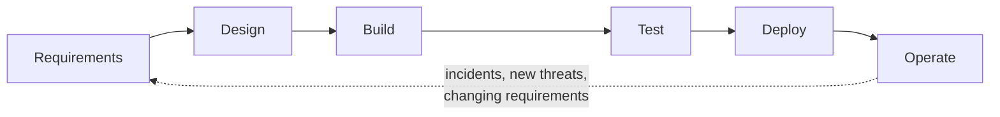

# Lecture 1 — Security Across the SDLC

> **Duration:** ~2 hours. **Outcome:** You can name the specific security activity that belongs at each phase of the software development lifecycle — requirements, design, build, test, deploy, operate — explain why doing security only at the end fails, and map this week's `phases` table so pipeline posture becomes a queryable record instead of a slide from a kickoff meeting nobody revisits.

## 1. "We'll do a pentest before launch" is not a security program

Every prior week in this course taught you a vulnerability class and how to fix instances of it. This week zooms out one level: **when** in a project's life does that fixing actually happen, and who's responsible for it happening at all? A surprisingly common real-world answer is "security is a phase near the end, right before ship" — usually a penetration test, sometimes a scan, occasionally both. That model has a structural flaw: by the time a pentest happens, the architecture is fixed, the data model is fixed, the authentication scheme is fixed, and the team is usually already behind schedule. A pentest finding "your session tokens never expire" at that point doesn't get an architecture fix — it gets a workaround, shipped under deadline pressure, that satisfies the letter of the finding without the spirit of it.

**Security across the SDLC** means the opposite: spreading security activities across every phase, so each one catches the class of problem that's cheapest and most effective to catch *there*, rather than concentrating everything into one expensive, late, adversarial gate. This isn't about doing *more* security work overall — done well, it's often less total effort, because a bad assumption caught in a design review costs a conversation, while the same bad assumption caught in production costs an incident, a hotfix written under pressure, and possibly a disclosure. The exact multiplier people love to quote for "how much cheaper" is disputed and varies wildly by project — don't repeat a specific number as if it were physics. The qualitative point is not disputed: earlier is cheaper, and "spread across every phase" is what makes earlier possible at all, because there's no single "security phase" to skip past.



Notice the loop back from **Operate** to **Requirements**. This is not a waterfall you walk once — it's a cycle. An incident in production is itself new information that should change next quarter's requirements and threat model, exactly the way Week 2 described a threat model as a living document, not a one-time diagram.

## 2. Requirements — decide what "secure" means before anyone writes code

Functional requirements describe what the system should do. **Security requirements** describe what it must never allow, and they belong in the same document, not a separate one nobody reads.

- **Abuse cases / misuse cases** — for every user story, write the attacker's version. "As a user, I can reset my password via email" pairs with "As an attacker, I cannot trigger a reset for an account I don't own, and cannot use a reset link more than once or after it expires." Week 4's password-reset hardening exists because someone, somewhere, skipped writing that second sentence.
- **Data classification** — decide up front what data the system will hold (PII, payment data, health data, none of the above) because that classification drives *everything* downstream: which compliance regime applies, what encryption is required at rest and in transit (Week 7), what logging is even legal (you cannot log what you're not allowed to store).
- **Security acceptance criteria** — a story isn't "done" when the happy path works; it's done when the abuse case in the same story has been demonstrated to fail correctly. This is the same "prove the negative" discipline Week 5's mini-project used: a fix isn't real until you've re-run the attack and watched it fail.

## 3. Design — this is where Week 2's STRIDE work lives

Design is where you draw the data-flow diagram, identify trust boundaries, and run STRIDE against every element crossing one — exactly Week 2's mini-project. Concrete design-phase activities:

- **Threat modeling** (Week 2) — before code exists, not after.
- **Choosing the authentication and authorization model** (Weeks 4 and 6) — RBAC vs. ABAC, session vs. token, deliberately, in a design document, rather than however the first engineer who touched the login route happened to implement it.
- **Secure defaults** — deny-by-default access control, fail-closed error handling, TLS everywhere, no feature that ships "insecure until someone remembers to lock it down later."
- **Architecture review** — a second set of eyes on the trust boundaries specifically, not just "does this scale."

The output of design isn't a diagram in a slide deck that nobody opens again — it's the STRIDE threat model and the data-flow diagram from Week 2, versioned alongside the code, updated when the architecture changes.

## 4. Build — where Weeks 3, 5, 6, 7, and 9 actually get applied

"Build" is every day-to-day engineering activity: writing code, choosing libraries, reviewing pull requests. This is where the vulnerability classes from Weeks 3–9 either get avoided or get introduced:

- **Secure coding standards** — the parameterized-query discipline from Week 5, the output-encoding rules from the same week, applied as a house style, not tribal knowledge one senior engineer remembers.
- **Dependency selection policy** — before adding a library, check it's maintained, has no typosquatting-adjacent name (Week 9), and doesn't duplicate something already vetted.
- **Secrets discipline** — Week 7's rule that nothing sensitive is ever committed, enforced with pre-commit hooks and the secret-scanning gate this week wires into CI (Lecture 3).
- **Peer review with a security lens** — not "does this work," but "what happens if this input is malicious" — a full preview of Week 11's secure code review.
- **SAST as you type or at commit time** — catching the Week 8 class of finding before it's even pushed, when it's cheapest to fix (the author still has the context in their head).

## 5. Test — verification that the defenses actually hold

Testing isn't just "does the feature work" — it's "does the abuse case from Requirements actually fail, and does it fail the *same way* every time":

- **Security test cases derived directly from Requirements' abuse cases** — if you wrote "an attacker cannot reuse a password-reset token," Test is where you write the automated test that proves it, and re-runs it on every future change.
- **DAST** (Week 8) — probing the running app the way an outside attacker would, catching what SAST structurally can't see (runtime behavior, misconfigured headers, session handling).
- **SCA re-run** (Week 8/9) — dependencies drift; a library clean at build time can have a new advisory published the next day, which is exactly why Lecture 3 turns this into a pipeline gate rather than a one-time check.

## 6. Deploy — this week's center of gravity

Deploy is where code becomes a running system, and it's the phase this week spends the most time on, for a specific reason: **the deploy phase increasingly has its own attack surface, separate from the application's.** A CI/CD pipeline typically holds more privilege than the application it builds — deploy keys, cloud credentials, signing keys — which makes it a higher-value target than the app itself in some organizations. Lecture 2 covers this in depth. The short version of what belongs here:

- Automated security gates that **fail the build** (Lecture 3) — SAST, SCA, secret scanning wired as pass/fail steps, not reports.
- A hardened pipeline: least-privilege runner permissions, pinned dependencies (including the pipeline's own third-party actions), no long-lived secrets sitting in plaintext.
- **Signed, verified artifacts** — proof that what gets deployed is exactly what passed every gate above, not something swapped in between build and deploy.
- Rollback and canary plans — deploy-phase security also means being able to *undo* a bad deploy quickly, which matters as much as preventing one.

## 7. Operate — the phase that feeds back into Requirements

Once running, a system needs:

- **Logging and monitoring** built for detection, not just debugging — Challenge 2 this week builds exactly this kind of detector for a pipeline-level attack.
- **Incident response** — a plan for what happens when, not if, something gets through every earlier gate.
- **Patch management** — the SCA finding from Test doesn't stop mattering after deploy; a new CVE disclosed against a dependency you're already running in production needs the same "re-run the scan, gate the next build" treatment.
- **Periodic re-threat-modeling** — Operate's incidents and near-misses are new information Requirements and Design should incorporate next cycle, which is exactly the loop back in the diagram in Section 1.

## 8. Recording the mapping as data

Rather than a slide that goes stale, this week's activities get stored as queryable rows — the first table in the `pipeline.db` schema you'll build across this week's exercises and extend in the mini-project:

```sql
CREATE TABLE phases (
    id       INTEGER PRIMARY KEY,
    phase    TEXT NOT NULL
                CHECK (phase IN
                  ('requirements','design','build','test','deploy','operate')),
    activity TEXT NOT NULL,      -- e.g. 'Threat modeling (STRIDE)'
    control  TEXT NOT NULL,      -- e.g. 'Data-flow diagram + STRIDE pass per element'
    owner    TEXT NOT NULL,      -- role responsible, e.g. 'tech lead', 'whole team'
    notes    TEXT
);
```

A populated table for Crunch Deploy lets you answer, in one query, "what security activity covers the build phase?" — `SELECT activity, control FROM phases WHERE phase = 'build';` — instead of scrolling through a wiki page last edited before the current team existed. Exercise 1 has you seed this table for real; the mini-project extends it to the finished, fully-hardened pipeline.

## 9. Check yourself

- Why does "we'll pentest before launch" fail as a complete security program, without citing a specific cost multiplier you can't actually verify?
- Name the security activity that belongs in Requirements, and explain why it has to exist *before* Design, not after.
- Which phase does Week 2's STRIDE threat modeling belong to, and why does it decay if it's never revisited?
- Name two things that belong specifically in the Deploy phase that don't belong in Build, and explain the difference.
- Why does the SDLC diagram in Section 1 loop back from Operate to Requirements instead of ending at Operate?

Lecture 2 goes deep on the Deploy phase's own attack surface — the CI/CD pipeline itself, and the four categories of risk that make it a target independent of anything in your application code.

## Further reading

- **OWASP — Software Assurance Maturity Model (SAMM):** <https://owaspsamm.org/> — a full framework for exactly this "activity per phase" mapping, at an organizational maturity level beyond this week's single-pipeline scope.
- **NIST SP 800-218 — Secure Software Development Framework (SSDF):** <https://csrc.nist.gov/pubs/sp/800/218/final> — the U.S. government's own phase-by-phase practice catalog, a good cross-check against this lecture's phase breakdown.
- **OWASP — Top 10 CI/CD Security Risks:** <https://owasp.org/www-project-top-10-ci-cd-security-risks/> — previews Lecture 2's entire structure; worth skimming now.
