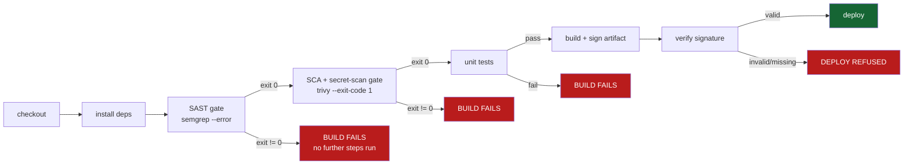

# Lecture 3 — Security Gates & Artifact Integrity

> **Duration:** ~2 hours. **Outcome:** You can wire Semgrep and Trivy into a CI/CD pipeline as steps whose exit code fails the build, tune the gate so it blocks real risk without drowning developers in noise, and sign a build artifact so the deploy step refuses anything that isn't provably the thing that passed every gate.

## 1. From "we ran a scan" to "the build failed"

Week 8 taught you to run Semgrep, ZAP, and Trivy against a target and triage what came back — a **report**, read by a human, sometime after the fact. This week's shift is small in mechanics and large in effect: the exact same tools, wired so their **exit code decides whether the build proceeds**. A scanner that only ever produces a report nobody's forced to read gets ignored the first time a deadline is tight. A scanner whose non-zero exit code stops `git push` from ever reaching production cannot be quietly ignored — which is precisely why "add a gate" and "run a scan" are different disciplines, even when the underlying tool command is identical.



*Each gate's exit code decides the next step: any non-zero result fails the build closed, and deploy only runs after signature verification passes.*

Every arrow into a red box is a place this week's pipeline can stop cold before a bad artifact ever reaches "deploy." That's the whole point of a gate: it fails **closed** — no finding means proceed, but any error running the check itself (tool crashed, couldn't reach its rule database) should also be treated as a failure, not silently skipped. A gate that fails open on error is not a gate.

## 2. Wiring Semgrep as a SAST gate

Week 8 ran Semgrep to produce a report:

```bash
semgrep --config=auto .
```

As a **gate**, the same command needs a flag that turns findings into a non-zero exit code:

```yaml
- name: SAST gate (Semgrep)
  run: |
    pip install semgrep
    semgrep --config=auto --error .
```

`--error` makes Semgrep exit non-zero when any finding at or above its default severity threshold is present — which fails this step, which (absent `continue-on-error: true`, which you should not set on a real gate) stops the job before later steps run. Run this against Crunch Deploy's `app.py` and the `subprocess.run(..., shell=True, ...)` pattern from Section 3's `GATE-BAIT` comment should surface as a real finding.

## 3. Wiring Trivy as an SCA + secret-scanning gate

Week 8 used Trivy for dependency scanning specifically. Trivy's filesystem mode also has a **secret scanner** built in, which means one tool covers two of this week's gate categories at once:

```yaml
- name: SCA + secret-scan gate (Trivy)
  run: |
    curl -sfL https://raw.githubusercontent.com/aquasecurity/trivy/main/contrib/install.sh | sh -s -- -b /usr/local/bin
    trivy fs --scanners vuln,secret --exit-code 1 --severity HIGH,CRITICAL .
```

(Note the irony of using a `curl | sh` installer here — this is the project's own official documented install method for its CLI, run once as a tooling setup, not a runtime dependency of the app itself. It's still worth minimizing: pinning to a specific Trivy release archive with a checksum check is the more defensible version for a production pipeline, and is what Exercise 2 has you do.)

`--exit-code 1` is Trivy's build-failing flag — without it, Trivy still prints findings but always exits `0`, meaning a pipeline step running it would always "pass" regardless of what it found. This is the single most common mistake teams make wiring up a scanner for the first time: installing and running the tool, but forgetting the flag that actually makes a finding stop the build. Against Crunch Deploy's `requirements.txt`, this should surface the two deliberately old, publicly-advisoried packages from this week's README.

## 4. Tuning gates so they block real risk, not everything

A gate with zero tolerance — failing on any finding of any severity — trains developers to route around it within a week, the same alert-fatigue problem Week 8's triage funnel exists to solve, just showing up at build time instead of report time. The fix is the same discipline, applied to gate design:

- **Severity threshold, not zero tolerance.** `--severity HIGH,CRITICAL` on Trivy above; Semgrep's default `--error` severity can similarly be scoped. Low/medium findings can still be surfaced — as a non-blocking step, or uploaded to a dashboard — without stopping the build.
- **A written, expiring allowlist for accepted risk — never a silent suppression.** Sometimes a finding is real but the fix isn't ready this sprint (a dependency upgrade that requires a larger migration). The correct mechanism is an explicit, reviewed exception with a reason and an expiry date, not a comment that silently tells the scanner to ignore a rule forever. `# nosemgrep: rule-id -- reason, ticket-1234, review-by 2026-09-01` is defensible; a bare suppression with no reason is exactly the "doesn't look like a big deal" dismissal Week 8 explicitly disallowed.
- **Fail fast, in order of speed.** SAST and secret-scanning are typically faster than a full test suite; running them first means a real finding fails the build in seconds, not after a ten-minute test run has already spent the time.

## 5. Why the artifact itself needs a guarantee, not just the code that built it

Every gate so far checks the **source**. None of them prove that the thing actually deployed is the thing that passed those gates. That gap is exactly what SolarWinds and Codecov (Lecture 2, Section 1) exploited: the tampering happened **between** a clean build step and the deploy step, where nothing was watching. **Artifact signing** closes that specific gap: it proves "this exact file, byte for byte, is what this specific, trusted build process produced" — so a substituted or tampered artifact fails verification even if every upstream gate passed cleanly.

## 6. Hands-on: signing with GPG (this week's lab technique)

The lab technique this week uses GnuPG (`gpg`), because it needs no external service and no network dependency — ideal for a fully local, isolated lab. Generate a signing key once (in the lab, **not** a key you use for anything else):

```bash
gpg --quick-generate-key "Crunch Deploy CI <ci@crunch-deploy.lab>" ed25519 sign 1y
gpg --list-secret-keys --keyid-format long   # note the key ID
```

Build and sign the artifact:

```bash
tar -czf crunch-widgets.tar.gz app.py requirements.txt
gpg --detach-sign --armor -u "ci@crunch-deploy.lab" crunch-widgets.tar.gz
# produces crunch-widgets.tar.gz.asc -- the detached signature
```

Verify before deploy — this is the actual gate:

```bash
gpg --verify crunch-widgets.tar.gz.asc crunch-widgets.tar.gz
echo $?   # 0 == valid signature from a key you trust; non-zero == FAIL, do not deploy
```

Tamper with the artifact after signing (`echo extra >> crunch-widgets.tar.gz`) and re-run the verify step — it now fails, exactly as it should, because the bytes no longer match what was signed. Exercise 3 wires this exact `gpg --verify` exit code as a hard gate in front of the deploy step, using `deploy/deploy.sh`.

**The private signing key never lives in the repository.** In a real pipeline it's stored as a platform secret, scoped to the one job that signs, following every leaked-secret defense from Lecture 2. In this week's local lab via `act`, you'll pass it through `act`'s own secrets file — gitignored, never committed — exactly the same principle at lab scale.

## 7. How this compares to the industry-standard approach

GPG with a long-lived key pair is a correct, teachable technique — and also not quite what most modern CI/CD platforms do by default anymore. Know the comparison:

| | This week's lab (GPG) | Industry standard (Sigstore/cosign + SLSA) |
|---|---|---|
| **Key material** | A long-lived key pair you generate and manage yourself | **Keyless** — a short-lived certificate issued per-build, bound to the pipeline's own OIDC identity (e.g., "this exact GitHub Actions workflow, this exact repo") |
| **Trust anchor** | Whoever holds the private key | A public, append-only transparency log (Rekor) anyone can audit, without ever trusting a single held secret |
| **What's proven** | This artifact was signed by this key | This artifact was built by this exact, named CI workflow, from this exact source commit (a **provenance attestation**, per the SLSA framework) |
| **Revocation problem** | A leaked long-lived key must be manually revoked and rotated everywhere it's trusted | Nothing to leak — each signing identity exists for one build and is never reused |

You'll see cosign and Sigstore referenced constantly in real-world CI/CD security material; recognizing that this week's GPG technique is a deliberately simpler stand-in for the same underlying guarantee — "prove what built this, prove nobody touched it since" — is the point, not memorizing cosign's CLI flags.

## 8. Storing gate results and posture as data

Every gate run, every finding, and every signature verification this week produces gets written as rows, extending the `phases` table from Lecture 1 into a full pipeline-posture schema:

```sql
CREATE TABLE gate_runs (
    id             INTEGER PRIMARY KEY,
    run_id         TEXT NOT NULL,       -- e.g. a timestamp or short hash identifying one act run
    gate           TEXT NOT NULL
                      CHECK (gate IN ('sast','sca','secret_scan','signing')),
    tool           TEXT NOT NULL,       -- 'semgrep' | 'trivy' | 'gpg'
    status         TEXT NOT NULL CHECK (status IN ('pass','fail')),
    findings_count INTEGER NOT NULL DEFAULT 0,
    run_at         TEXT NOT NULL DEFAULT CURRENT_TIMESTAMP
);

CREATE TABLE findings (
    id           INTEGER PRIMARY KEY,
    gate_run_id  INTEGER NOT NULL REFERENCES gate_runs(id),
    severity     TEXT NOT NULL,
    rule_id      TEXT NOT NULL,
    location     TEXT NOT NULL,
    description  TEXT NOT NULL,
    status       TEXT NOT NULL DEFAULT 'open'
                    CHECK (status IN ('open','fixed','accepted_risk'))
);

CREATE TABLE signatures (
    id          INTEGER PRIMARY KEY,
    artifact    TEXT NOT NULL,
    digest      TEXT NOT NULL,        -- sha256 of the artifact at signing time
    signed_by   TEXT NOT NULL,        -- key fingerprint / identity
    verified    INTEGER NOT NULL,     -- 0 or 1
    verified_at TEXT NOT NULL DEFAULT CURRENT_TIMESTAMP
);
```

`SELECT * FROM gate_runs WHERE status = 'fail' ORDER BY run_at DESC` is your build history's honest record — every time a gate did its job, queryable, forever, instead of a green checkmark in a UI that tells you nothing about what almost shipped.

## 9. Check yourself

- What's the difference between "we ran Semgrep" and "Semgrep is a gate," in terms of what actually happens to the build?
- Which single flag turns Trivy from "prints findings, always exits 0" into "fails the build on a real finding," and why is forgetting it the most common mistake in wiring up a new scanner?
- Why is a zero-tolerance gate (fails on any finding of any severity) usually worse for security in practice than a tuned one with a severity threshold?
- Explain, specifically, what artifact signing proves that an upstream SAST/SCA/secret-scan gate does not.
- Name one concrete difference between this week's GPG technique and Sigstore/cosign's keyless approach.

You've now closed the loop this week set out to build: the right activity at every SDLC phase (Lecture 1), a pipeline hardened against its own attack surface (Lecture 2), and gates plus signed artifacts that make "it built successfully" and "it's safe to deploy" the same statement instead of two unrelated ones. Exercises 1–3 build every piece of this for real against Crunch Deploy; the mini-project wires it all together end to end.

## Further reading

- **Semgrep — CI mode and exit codes:** <https://semgrep.dev/docs/semgrep-ci/overview/>
- **Trivy — Exit codes and CI integration:** <https://trivy.dev/latest/docs/configuration/exit-code/>
- **Sigstore — cosign documentation:** <https://docs.sigstore.dev/cosign/overview/>
- **SLSA — Supply-chain Levels for Software Artifacts:** <https://slsa.dev/>
- **in-toto — framework for supply-chain integrity attestations:** <https://in-toto.io/>
- **GnuPG — detached signatures:** <https://www.gnupg.org/gph/en/manual/x135.html>
