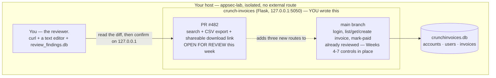

# Week 11 — Secure Code Review

> **Goal:** by Sunday you can pick up a pull request cold — no framework magic assumed, no "looks fine" skimming — and run the same repeatable method every time: map every entry point, follow untrusted input by hand to the dangerous operation it reaches, and check off the specific controls (auth, authz, injection, crypto, secrets) the last seven weeks taught you to expect. Then you can write up what you found so a developer fixes it on the first read, not the third — with a location, a reproduction, an impact, and a concrete source-level fix, tracked to resolution in a database instead of a forgotten comment thread.

Welcome back to **C50 · Crunch AppSec**. Weeks 1–10 gave you a threat-modeling method, the OWASP Top 10 by name, and hands-on fixes for authentication, injection, access control, secrets/crypto, and automated scanning. This week asks a different question than any of those: **you're not attacking your own app anymore — you're reading somebody else's code and deciding whether it's safe to ship.** That's the actual day job. Automated scanners (Week 8) catch known-bad patterns fast, but they can't tell you whether a `WHERE` clause checks the right tenant column, whether a "shareable link" feature quietly reintroduced a hardcoded secret, or whether a session check that's present on nine routes was simply *forgotten* on the tenth. Only a human reading the diff with a method catches that — and a method is the whole point of this week, because "read it carefully" is not a method; it's a hope.

> **Ethics & legality — binding, every week.** Everything below is **authorized, legal, defensive-minded** security work performed **only inside your isolated `appsec-lab`** from Week 1 — reading and running `crunch-invoices`, a small Flask + SQLite invoicing app **you write and own**, on `127.0.0.1`, populated entirely with fictional accounts, fictional users, and fictional invoices you generate yourself. Every proof-of-concept request in this week's lectures and exercises targets your own local instance to *confirm a finding you already suspect from reading the code* — never to go probing a system you don't own or don't have explicit written authorization to review. A code review is, in fact, the most defensive-minded activity in this entire course: the whole point is to close a hole before an attacker — real or simulated — ever gets to try it. Written authorization, defined scope, and the law govern every exercise this week and every week after it.

## Learning objectives

By the end of this week, you will be able to:

- **Run a repeatable secure code review** on any codebase, in order: map entry points, catalog dangerous sinks, taint-trace data between them, and verify the controls the threat model expects — instead of an unstructured read-through that depends on what you happen to notice.
- **Trace untrusted input to a dangerous sink by hand**, across function calls and layers, and state precisely where — and whether — it gets sanitized or authorized along the way.
- **Verify, don't assume,** that authentication, authorization, injection defenses, cryptography, and secrets handling are actually present at the source, for every route that needs them — not just the ones that look risky at a glance.
- **Write findings a developer can act on** — specific location, reproducible steps, real impact, a concrete source-level fix, correct severity — and avoid the two failure modes that make a report useless: vague hand-waving and the false alarm that burns trust.
- **Track review findings and their resolution status in a database**, so "we found it" turns into "we fixed it, and here's the retest that proves it" instead of a bullet point nobody follows up on.

## Prerequisites

- **Weeks 1–7 completed.** Specifically: your isolated `appsec-lab` is up (Week 1); you can name a trust boundary and read a data-flow diagram (Week 2); you know the OWASP Top 10 by name (Week 3); you've hardened login and sessions (Week 4); you've fixed injection with parameterized queries (Week 5); you've fixed IDOR and privilege escalation with ownership-filtered queries and role checks (Week 6); and you've found and fixed hardcoded secrets and homemade crypto (Week 7). This week's review method exists specifically to verify all five of those controls are actually in a codebase — you're checking your own recent work against itself.
- **Week 8 (SAST/DAST/SCA) helpful, used directly in Challenge 2** — you'll run the scanner you set up that week against this week's lab app and compare its output to your own manual findings.
- Python 3.10+, `pip`, `sqlite3` (ships with Python), and `git` (for reading the pull request as a real diff). Comfortable reading ~150 lines of Flask route handlers without running them first.

## This week's lab: `crunch-invoices`

Every lecture, exercise, challenge, and the mini-project point at the same small app: a two-tenant invoicing service. Two fictional customer accounts (`crunch-retail`, `crunch-wholesale`) and a third internal `crunch-ops` account for superadmin staff share one deployment — small enough to read end to end in one sitting, real enough that every finding this week is a finding you'd recognize in production code.



Unlike earlier weeks, you do **not** start by attacking anything. You start by **reading**. The `main` branch below has already been through the controls from Weeks 4–7 and is the trusted baseline; a colleague's pull request, `PR #482`, adds three routes on top of it. Your job all week is that PR — plus, in Challenge 1, the whole app.

### Set up the baseline once (do this before Lecture 1)

```bash
mkdir -p crunch-invoices && cd crunch-invoices
python3 -m venv .venv && source .venv/bin/activate
pip install flask==3.0.3 argon2-cffi==23.1.0
git init -q
```

`schema.sql`:

```sql
CREATE TABLE accounts (
    id   INTEGER PRIMARY KEY,
    name TEXT NOT NULL UNIQUE
);

CREATE TABLE users (
    id            INTEGER PRIMARY KEY,
    account_id    INTEGER NOT NULL REFERENCES accounts(id),
    username      TEXT NOT NULL UNIQUE,
    password_hash TEXT NOT NULL,
    role          TEXT NOT NULL DEFAULT 'member'
        CHECK (role IN ('member','billing_admin','superadmin'))
);

CREATE TABLE invoices (
    id            INTEGER PRIMARY KEY,
    account_id    INTEGER NOT NULL REFERENCES accounts(id),
    customer_name TEXT NOT NULL,
    amount_cents  INTEGER NOT NULL,
    status        TEXT NOT NULL DEFAULT 'unpaid' CHECK (status IN ('unpaid','paid','void')),
    created_at    TEXT NOT NULL DEFAULT (datetime('now'))
);
```

`seed.py`:

```python
import sqlite3
from argon2 import PasswordHasher

ph = PasswordHasher()
db = sqlite3.connect("crunchinvoices.db")
db.executescript(open("schema.sql").read())

db.executemany(
    "INSERT INTO accounts (id, name) VALUES (?, ?)",
    [(1, "crunch-retail"), (2, "crunch-wholesale"), (3, "crunch-ops")],
)

pw = ph.hash("labpass1")
db.executemany(
    "INSERT INTO users (id, account_id, username, password_hash, role) VALUES (?, ?, ?, ?, ?)",
    [
        (1, 1, "cr-nina",  pw, "member"),
        (2, 1, "cr-omar",  pw, "billing_admin"),
        (3, 2, "wh-priya", pw, "member"),
        (4, 2, "wh-quinn", pw, "billing_admin"),
        (5, 3, "ops-sam",  pw, "superadmin"),
    ],
)

db.executemany(
    "INSERT INTO invoices (id, account_id, customer_name, amount_cents, status) VALUES (?, ?, ?, ?, ?)",
    [
        (1, 1, "Aperture Labs",     452000, "unpaid"),
        (2, 1, "Globex Retailers",  118500, "paid"),
        (3, 1, "Initech Storefront", 76200, "unpaid"),
        (4, 2, "Umbrella Wholesale", 990000, "unpaid"),
        (5, 2, "Stark Distribution", 214300, "paid"),
    ],
)
db.commit()
db.close()
print("seeded crunchinvoices.db — 3 accounts, 5 users, 5 invoices")
```

`app.py` — the reviewed **main branch**, already carrying the controls from Weeks 4–7:

```python
"""
crunch-invoices -- Flask + SQLite invoicing app, C50 Week 11 lab.
Two fictional customer accounts share one deployment; a third is Crunch's
own internal ops account. All accounts, users, and invoices are fictional
data you generate yourself, running only on 127.0.0.1.
"""
import sqlite3

from argon2 import PasswordHasher
from flask import Flask, g, jsonify, request, session

app = Flask(__name__)
app.config["SECRET_KEY"] = "lab-only-dev-key"
DB_PATH = "crunchinvoices.db"
ph = PasswordHasher()


def get_db():
    if "db" not in g:
        g.db = sqlite3.connect(DB_PATH)
        g.db.row_factory = sqlite3.Row
    return g.db


@app.teardown_appcontext
def close_db(exception=None):
    db = g.pop("db", None)
    if db is not None:
        db.close()


def require_login():
    if "user_id" not in session:
        return jsonify(error="login required"), 401
    return None


def require_role(*roles):
    if "user_id" not in session:
        return jsonify(error="login required"), 401
    if session["role"] not in roles:
        return jsonify(error="forbidden"), 403
    return None


@app.route("/login", methods=["POST"])
def login():
    username = request.form["username"]
    password = request.form["password"]
    row = get_db().execute("SELECT * FROM users WHERE username = ?", (username,)).fetchone()
    if row is None:
        return jsonify(error="invalid credentials"), 401
    try:
        ph.verify(row["password_hash"], password)
    except Exception:
        return jsonify(error="invalid credentials"), 401
    session["user_id"] = row["id"]
    session["account_id"] = row["account_id"]
    session["role"] = row["role"]
    return jsonify(message=f"welcome {row['username']}", role=row["role"])


@app.route("/invoices")
def list_invoices():
    err = require_login()
    if err:
        return err
    rows = get_db().execute(
        "SELECT id, customer_name, amount_cents, status, created_at "
        "FROM invoices WHERE account_id = ? ORDER BY created_at DESC",
        (session["account_id"],),
    ).fetchall()
    return jsonify([dict(r) for r in rows])


@app.route("/invoices/<invoice_id>")
def get_invoice(invoice_id):
    err = require_login()
    if err:
        return err
    row = get_db().execute(
        "SELECT * FROM invoices WHERE id = ? AND account_id = ?",
        (invoice_id, session["account_id"]),
    ).fetchone()
    if row is None:
        return jsonify(error="not found"), 404
    return jsonify(dict(row))


@app.route("/invoices", methods=["POST"])
def create_invoice():
    err = require_login()
    if err:
        return err
    customer_name = request.form["customer_name"]
    amount_cents = int(request.form["amount_cents"])
    cur = get_db().execute(
        "INSERT INTO invoices (account_id, customer_name, amount_cents) VALUES (?, ?, ?)",
        (session["account_id"], customer_name, amount_cents),
    )
    get_db().commit()
    return jsonify(id=cur.lastrowid), 201


@app.route("/invoices/<invoice_id>/mark-paid", methods=["POST"])
def mark_paid(invoice_id):
    err = require_role("billing_admin", "superadmin")
    if err:
        return err
    get_db().execute(
        "UPDATE invoices SET status = 'paid' WHERE id = ? AND account_id = ?",
        (invoice_id, session["account_id"]),
    )
    get_db().commit()
    return jsonify(message=f"invoice {invoice_id} marked paid")


if __name__ == "__main__":
    app.run(host="127.0.0.1", port=5050, debug=True)
```

```bash
python3 seed.py
git add schema.sql seed.py app.py
git commit -q -m "crunch-invoices: reviewed baseline (Weeks 4-7 controls in place)"
python3 app.py
```

Sanity check — this should return `{"message":"welcome cr-nina","role":"member"}`:

```bash
curl -s -c cr-nina.txt -X POST http://127.0.0.1:5050/login -d "username=cr-nina&password=labpass1"
```

### The pull request under review: `PR #482` — invoice search, CSV export, and shareable download links

A teammate opened this PR against the branch above, with the description: *"Adds a search box for the invoice list, a one-click CSV export for billing admins, and shareable download links so a customer can grab their own invoice without logging in. Tested locally, ready for review."* Save it as `pr-482.diff` — you'll apply it before Exercise 1 and read it cold before you run anything:

```diff
--- a/app.py
+++ b/app.py
@@
 import sqlite3
+import hashlib

 from argon2 import PasswordHasher
-from flask import Flask, g, jsonify, request, session
+from flask import Flask, g, jsonify, request, session, Response

 app = Flask(__name__)
 app.config["SECRET_KEY"] = "lab-only-dev-key"
 DB_PATH = "crunchinvoices.db"
 ph = PasswordHasher()
+
+# Signing key for shareable, no-login invoice download links (INV-482)
+SIGNING_KEY = "crunch-invoices-2024"
@@
 @app.route("/invoices/<invoice_id>/mark-paid", methods=["POST"])
 def mark_paid(invoice_id):
     err = require_role("billing_admin", "superadmin")
     if err:
         return err
     get_db().execute(
         "UPDATE invoices SET status = 'paid' WHERE id = ? AND account_id = ?",
         (invoice_id, session["account_id"]),
     )
     get_db().commit()
     return jsonify(message=f"invoice {invoice_id} marked paid")
+
+
+def build_search_query(term, status_filter=None):
+    """Build the WHERE clause for the invoice search box (INV-482)."""
+    clause = f"customer_name LIKE '%{term}%'"
+    if status_filter:
+        clause += f" AND status = '{status_filter}'"
+    return clause
+
+
+@app.route("/invoices/search")
+def search_invoices():
+    term = request.args.get("q", "")
+    status_filter = request.args.get("status")
+    where_clause = build_search_query(term, status_filter)
+    sql = (
+        "SELECT id, account_id, customer_name, amount_cents, status "
+        f"FROM invoices WHERE {where_clause}"
+    )
+    rows = get_db().execute(sql).fetchall()
+    return jsonify([dict(r) for r in rows])
+
+
+@app.route("/invoices/export")
+def export_invoices():
+    if "user_id" not in session:
+        return jsonify(error="login required"), 401
+    rows = get_db().execute("SELECT * FROM invoices").fetchall()
+    lines = ["id,account_id,customer_name,amount_cents,status,created_at"]
+    for r in rows:
+        lines.append(
+            f"{r['id']},{r['account_id']},{r['customer_name']},"
+            f"{r['amount_cents']},{r['status']},{r['created_at']}"
+        )
+    return Response("\n".join(lines), mimetype="text/csv")
+
+
+def sign_invoice_id(invoice_id):
+    """Homemade signature for a shareable, no-login download link (INV-482)."""
+    return hashlib.md5((SIGNING_KEY + str(invoice_id)).encode()).hexdigest()
+
+
+@app.route("/invoices/<invoice_id>/download-link")
+def download_link(invoice_id):
+    err = require_login()
+    if err:
+        return err
+    sig = sign_invoice_id(invoice_id)
+    return jsonify(url=f"/invoices/download/{invoice_id}?sig={sig}")
+
+
+@app.route("/invoices/download/<invoice_id>")
+def download_invoice(invoice_id):
+    sig = request.args.get("sig", "")
+    expected = sign_invoice_id(invoice_id)
+    if sig == expected:
+        row = get_db().execute("SELECT * FROM invoices WHERE id = ?", (invoice_id,)).fetchone()
+        if row is None:
+            return jsonify(error="not found"), 404
+        return jsonify(dict(row))
+    return jsonify(error="invalid signature"), 403
```

```bash
git apply pr-482.diff
```

Three new routes, one new helper function, one new module-level constant — that's the whole PR. It looks small, it looks tested ("tested locally"), and it is exactly the size of PR that gets rubber-stamped in a hurry. It isn't safe to merge. Finding out *why*, precisely and in writing, is this week.

## This week's map

Work top to bottom. Each piece assumes the ones before it.

| # | File | What's inside | ~Time |
|--:|------|---------------|------:|
| 1 | [lecture-notes/01-a-repeatable-review-method.md](./lecture-notes/01-a-repeatable-review-method.md) | The four-step method: map entry points, catalog sinks, taint-trace, verify controls | 2h |
| 2 | [lecture-notes/02-following-data-to-the-sink.md](./lecture-notes/02-following-data-to-the-sink.md) | Hand taint-tracing across functions; worked traces on `PR #482`'s injection, authz, and crypto flaws | 2h |
| 3 | [lecture-notes/03-writing-actionable-findings.md](./lecture-notes/03-writing-actionable-findings.md) | The findings template, a severity rubric, a worked write-up, and the `review_findings` schema | 2h |
| 4 | [exercises/exercise-01-review-for-injection-and-authz.md](./exercises/exercise-01-review-for-injection-and-authz.md) | Cold-read `PR #482`, flag suspected injection & authz flaws, then confirm each against the running app | 1.5h |
| 5 | [exercises/exercise-02-taint-trace-a-flaw.md](./exercises/exercise-02-taint-trace-a-flaw.md) | Hand-trace the search-route injection and the export-route authz gap, hop by hop | 1.5h |
| 6 | [exercises/exercise-03-write-a-findings-report.md](./exercises/exercise-03-write-a-findings-report.md) | Turn Exercise 1's suspicions into full findings, stored and queried in `review_findings.db` | 1.5h |
| 7 | [challenges/challenge-01-full-review-of-a-lab-app.md](./challenges/challenge-01-full-review-of-a-lab-app.md) | Review the *entire* app — main branch included — with the full four-step method, no hand-holding | 1.5h |
| 8 | [challenges/challenge-02-review-versus-scanner.md](./challenges/challenge-02-review-versus-scanner.md) | Run Week 8's scanner against `crunch-invoices`; compare its findings to yours; explain the gap | 1.5h |
| 9 | [mini-project/README.md](./mini-project/README.md) | Full secure code review of `crunch-invoices`, checklist-driven, tracked to resolution in SQLite | 3h |
| 10 | [homework.md](./homework.md) | Extra practice, spread across the week | 4h |
| 11 | [quiz.md](./quiz.md) | 14 self-check questions + answer key | 1h |
| 12 | [resources.md](./resources.md) | Official guides, standards, and the few links worth your time | — |

## Weekly schedule

Adds up to roughly **26 hours**. Treat it as a target, not a stopwatch.

| Day | Focus | Lectures | Exercises | Challenges | Quiz/Read | Homework | Mini-Project | Daily Total |
|-----------|-----------------------------------------|---------:|----------:|-----------:|----------:|---------:|-------------:|------------:|
| Monday | The repeatable review method | 2h | 0h | 0h | 0.5h | 1h | 0h | 3.5h |
| Tuesday | Following data to the sink | 2h | 1.5h | 0h | 0.5h | 1h | 0h | 5h |
| Wednesday | Writing actionable findings | 2h | 1.5h | 0h | 0.5h | 1h | 0h | 5h |
| Thursday | Findings report + review prep | 0h | 1.5h | 0h | 0.5h | 1h | 0.5h | 3.5h |
| Friday | Full review + scanner bake-off | 0h | 0h | 3h | 0.5h | 1h | 0.5h | 5h |
| Saturday | Mini-project | 0h | 0h | 0h | 0h | 0h | 3h | 3h |
| Sunday | Quiz + review | 0h | 0h | 0h | 1h | 0h | 0h | 1h |
| **Total** | | **6h** | **4.5h** | **3h** | **3.5h** | **5h** | **4h** | **26h** |

## By the end of this week you can…

- Sit down with a diff you've never seen and, before running a single command, produce an entry-point table and a suspect list of sinks it touches.
- Trace a query parameter or form field by hand through however many function calls stand between the request and the database call, the shell call, or the crypto call it reaches — and say exactly where it was or wasn't checked.
- Look at any route and answer, from the source alone: is there a login check? A role check? An ownership filter *in the query*? A parameterized statement? A vetted crypto primitive? No secret sitting in the file?
- Write a finding a developer can fix from your report alone — no follow-up meeting required — and track it from `open` to `retested_ok` in a database, not a memory.

## Up next

[Week 12 — Capstone: secure application](../week-12-capstone-secure-application/) — threat-model, build, test, and defend a small application end to end, applying every control and every review method from the last eleven weeks to code that's entirely your own.

---

*Part of the Code Crunch Worldwide open curriculum · GPL-3.0 · If you find errors, please open an issue or PR.*
