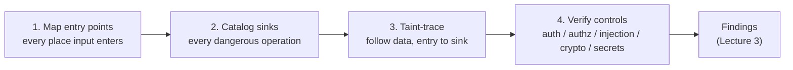
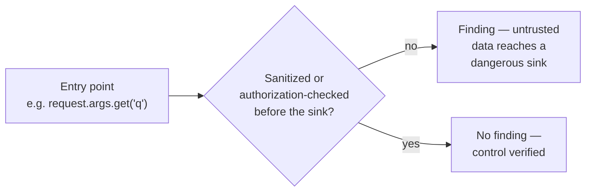

# Lecture 1 — A Repeatable Review Method

> **Duration:** ~2 hours. **Outcome:** You can run a four-step method — map entry points, catalog sinks, taint-trace data between them, verify the controls the threat model expects — against any codebase, starting cold, without depending on what you happen to notice on a first read.

> **Lab reminder.** Everything in this lecture reads and runs `crunch-invoices`, an app **you wrote and own**, on `127.0.0.1`, inside your isolated `appsec-lab`. Reading someone else's pull request for a living is legitimate, authorized, defensive work by definition — you are the last line of defense between a bug and production. Nothing here is aimed at code you don't have explicit authorization to review.

## 1. Why "read it carefully" isn't a method

Ask ten engineers how they review a pull request and most will say some version of "I read through it and look for anything that seems off." That's not a method — it's a hope that your attention, on this particular Tuesday, happens to land on the one line that matters. It fails in exactly the way `PR #482` from this week's README is built to fail: three small, plausible-looking routes, each one a single function, each one "tested locally." A skim-based review reads top to bottom, nods at code that *looks* like the code around it, and moves on. It has no way to notice that `search_invoices` is missing the `require_login()` call every other route has, because noticing an absence requires comparing against something, and a skim doesn't compare — it just reads.

A **method** is a fixed sequence of questions you ask of *any* codebase, in the same order, every time, regardless of how confident you feel after the first pass. This week's method has four steps:

1. **Map entry points** — every place attacker-influenced data can get in.
2. **Catalog sinks** — every place that data can do something dangerous.
3. **Taint-trace** — follow data from each entry point toward each sink it can reach, by hand (full depth in Lecture 2).
4. **Verify controls** — for every entry point and every sink, check that the specific control the threat model requires (auth, authz, injection defense, safe crypto, no exposed secrets) is actually present in the source, not assumed.



Steps 1 and 2 are exhaustive inventories — you are building lists, not judgments yet. Step 3 connects the two lists with evidence. Step 4 is where judgment happens, and it only works because steps 1–3 already told you *where to look* and *what's actually there*, instead of what you assume is there because it's "probably fine, it's just a search box."

## 2. Step 1 — Map entry points

An **entry point** is anywhere data enters your program under an attacker's (or a careless caller's) control. For a web app like `crunch-invoices`, that means every route, and for every route: the URL path segments, the query string, form fields, JSON bodies, headers, and cookies. It is *not* limited to what "looks like" user input — a header, a cookie value, and a file name are all just as attacker-controlled as a form field, even though they don't appear in a big obvious `<input>` on a page.

Don't rely on memory or a mental model of "the routes I know about." **Grep for the routing decorator** and build the list mechanically:

```bash
grep -n "@app.route" app.py
```

```
36:@app.route("/login", methods=["POST"])
50:@app.route("/invoices")
63:@app.route("/invoices/<invoice_id>")
77:@app.route("/invoices", methods=["POST"])
90:@app.route("/invoices/<invoice_id>/mark-paid", methods=["POST"])
104:def build_search_query(term, status_filter=None):
112:@app.route("/invoices/search")
122:@app.route("/invoices/export")
134:def sign_invoice_id(invoice_id):
139:@app.route("/invoices/<invoice_id>/download-link")
147:@app.route("/invoices/download/<invoice_id>")
```

(Line numbers will differ slightly once you've applied `pr-482.diff` locally — that's expected; grep against your own working copy, don't trust a lecture's line numbers.)

Turn that list into a table, one row per entry point, with **every** parameter it accepts and **whether it requires a session** — filled in by reading the function body, not by guessing from the route name:

| Route | Method | Params (source) | Login required? (read the body) |
|---|---|---|---|
| `/login` | POST | `username`, `password` (form) | N/A — this *is* the login |
| `/invoices` | GET | none | Yes — `require_login()` |
| `/invoices/<invoice_id>` | GET | `invoice_id` (path) | Yes — `require_login()` |
| `/invoices` | POST | `customer_name`, `amount_cents` (form) | Yes — `require_login()` |
| `/invoices/<invoice_id>/mark-paid` | POST | `invoice_id` (path) | Yes — `require_role("billing_admin","superadmin")` |
| `/invoices/search` | GET | `q`, `status` (query string) | **?** — check the body, don't assume |
| `/invoices/export` | GET | none | **?** — check the body, don't assume |
| `/invoices/<invoice_id>/download-link` | GET | `invoice_id` (path) | **?** — check the body, don't assume |
| `/invoices/download/<invoice_id>` | GET | `invoice_id` (path), `sig` (query string) | **?** — check the body, don't assume |

Notice the table above deliberately leaves the last column as "check, don't assume" for every route in `PR #482` — that's the discipline. The first five rows are the reviewed `main` branch; you already know their answer because you (or a prior reviewer) verified it. The bottom four are new, unreviewed, and get no benefit of the doubt regardless of how small or "just a search box" they look.

### 2.1 Entry points beyond HTTP routes

`crunch-invoices` is small enough that every entry point is an HTTP route, but don't let that narrow your instinct on other codebases. Also inventory:

- **CLI arguments and environment variables**, if attacker-influenced (a filename passed on the command line, a config value read from a `.env` an attacker can influence).
- **File uploads** — the file's name, its declared content-type, and its bytes are three separate untrusted inputs, not one.
- **Webhooks and callbacks** — an inbound webhook from a third party is exactly as untrusted as a browser request, and is easy to forget because "it's not a user, it's an integration."
- **Message-queue consumers** — a worker pulling a job payload off a queue is an entry point the moment anything upstream of that queue is attacker-influenceable.
- **Deserialization boundaries** — anywhere `pickle.loads`, `yaml.load` (without `SafeLoader`), or a custom binary parser reads bytes from outside the process.

The unifying test: **"does this value ever contain something the app's owner didn't choose?"** If yes, it's an entry point, and it goes in the table, no matter how deep in the codebase it sits or how unlikely it seems that anyone would touch it.

## 3. Step 2 — Catalog sinks

A **sink** is any operation dangerous enough that untrusted data reaching it, unchecked, causes a security problem. Build this list the same mechanical way — grep for the operation, not for "code that looks scary":

```bash
grep -n "execute(\|Response(\|hashlib\|SIGNING_KEY\|==\s*expected" app.py
```

| Sink category | What to grep for | Danger if untrusted data arrives unchecked |
|---|---|---|
| **SQL execution** | `execute(`, `executemany(` | SQL injection (Week 5) |
| **Shell execution** | `os.system(`, `subprocess.*shell=True` | OS command injection |
| **Template rendering / eval** | `render_template_string(`, `eval(`, `exec(` | Server-side template injection, arbitrary code execution |
| **File path construction** | `open(`, `send_file(`, `os.path.join(` with a request-derived segment | Path traversal, arbitrary file read |
| **Outbound HTTP** | `requests.get(`, `urllib.request.` with a request-derived URL | SSRF |
| **Deserialization** | `pickle.loads(`, `yaml.load(` | Arbitrary code execution |
| **Authorization decision points** | anywhere a role or ownership check *should* run before a query or action | Broken access control (Week 6) — the "sink" here is the decision itself |
| **Cryptographic operations** | `hashlib.`, `hmac.`, a module-level key/token constant | Weak crypto, hardcoded secrets (Week 7) |
| **Logging** | `log.info(`, `print(` with request-derived data | Log injection, or secrets leaking into logs |

For `crunch-invoices`, the sink catalog for `PR #482` alone is short and dense — three sinks in three new routes:

| Sink | Location | Category |
|---|---|---|
| `get_db().execute(sql)` in `search_invoices` | SQL execution, built from `f"... WHERE {where_clause}"` | Injection |
| the (missing) role/account check in `export_invoices` | Authorization decision point | Broken access control |
| `hashlib.md5(...)` in `sign_invoice_id`, and the `sig == expected` compare in `download_invoice` | Cryptographic operation | Weak crypto / hardcoded secret |

Three routes, three sink categories, in code that is individually about ten lines each — this is exactly why a sink catalog matters more than a vibe. Nothing in `PR #482` *looks* alarming at a glance; the danger only becomes visible once you know these three operation types are inherently dangerous and go looking for exactly them.

## 4. Step 3 — Taint-trace, in one sentence (full depth in Lecture 2)

Once you have entry points and sinks as two lists, the connective step is: **for each entry point, does its data reach a sink, and if so, is it sanitized, parameterized, or authorization-checked somewhere on the way?** That's taint tracing, and it's the subject of all of Lecture 2 — for now, hold onto the one-sentence version and the picture:



## 5. Step 4 — Verify the controls the last seven weeks taught

This is the step that turns a generic "looks for bugs" review into a **specifically targeted** one. For every entry point and sink pair, ask the five questions below — not "does this feel secure," but these five, in this order, every time:

| # | Control | The exact question to ask at the source | Week it came from |
|---|---|---|---|
| 1 | **Authentication** | Does this route check for a valid session *before* doing anything with the request, on every code path, including early returns? | Week 4 |
| 2 | **Authorization** | For any route touching a specific object or a privileged action: does the query filter by owner/tenant **in the `WHERE` clause**, and does a role check run for privileged actions? Not "is there an `if` somewhere" — *which* `if`, checking *which* value? | Week 6 |
| 3 | **Injection** | Is every SQL statement, shell command, and template built with parameters/placeholders — never an f-string, `%`-format, `.format()`, or `+` concatenation splicing untrusted data into the statement itself? | Week 5 |
| 4 | **Cryptography** | Are only vetted library primitives used (`hmac.new` + `hmac.compare_digest`, `argon2`/`bcrypt`, a real AEAD cipher) — never a homemade construction, never a fast general-purpose hash used as a MAC, never a plain `==` comparing a signature? | Week 7 |
| 5 | **Secrets** | Is every key, token, password, or credential loaded from environment/secret storage at runtime — never a literal string sitting in a source file, a config file, or (per Week 7) anywhere in the git history? | Week 7 |

Run these five questions against `PR #482`'s three new routes and — without yet reading Lectures 2 or 3 — you can already predict where this is going: `search_invoices` fails question 1 (no login check at all) and question 3 (the `WHERE` clause is built with an f-string); `export_invoices` fails question 2 (checks login, never role or account); and `sign_invoice_id`/`download_invoice` fail questions 4 and 5 together (a hardcoded key, `hashlib.md5` used as a homemade MAC, and a non-constant-time `==` compare). That prediction, and confirming it precisely, is Exercise 1.

## 6. Putting the method together on `PR #482`

To summarize the whole method as one pass you'll actually run:

1. `grep -n "@app.route" app.py` on the branch **after** applying the PR → build the entry-point table (Section 2), flagging every route the PR touches or adds as "unreviewed."
2. `grep -n "execute(\|hashlib\|SIGNING_KEY"` (and the equivalent for your stack's dangerous operations) → build the sink catalog (Section 3).
3. For each new/changed entry point, trace its parameters toward every sink it can reach (Lecture 2).
4. For each trace, run the five-question control checklist above and record a finding for every "no" (Lecture 3).

This is deliberately mechanical. The goal is that two different reviewers, running the same four steps against the same PR, converge on the same list of routes and the same list of sinks — even if they word the findings differently — because steps 1 and 2 are inventories, not opinions. The judgment only enters at step 4, and by then it's judgment applied to a specific, complete list, not judgment applied to whatever caught your eye.

## 7. Check yourself

- Why is "I read through it and it looked fine" not a method, even when the reviewer is experienced and careful?
- Why build the entry-point table by grepping the routing decorator instead of reading the PR description's list of "what this adds"?
- Name three entry points a web app can have that are **not** HTTP routes.
- Why is an authorization decision point listed as a "sink" in Section 3's catalog, when it isn't an operation like a SQL call — what's the danger if untrusted data (or an untrusted caller) reaches it unchecked?
- For `crunch-invoices`'s `export_invoices` route, which of the five control questions in Section 5 does it fail, and which does it pass?
- Why does a hardcoded signing key and a homemade MD5-based signature fail *two* separate questions (4 and 5) instead of one?

If those are automatic, Lecture 2 goes deep on Step 3 — taint tracing by hand, with full worked traces through `PR #482`'s injection, authorization, and crypto flaws — and Lecture 3 turns every "no" from Section 5 into a finding a developer can act on.

## Further reading

- **OWASP Code Review Guide:** <https://owasp.org/www-project-code-review-guide/>
- **OWASP Top 10 (2021):** <https://owasp.org/Top10/>
- **CWE — Common Weakness Enumeration:** <https://cwe.mitre.org/>
- **Google Engineering Practices — "How to Do a Code Review":** <https://google.github.io/eng-practices/review/reviewer/>
