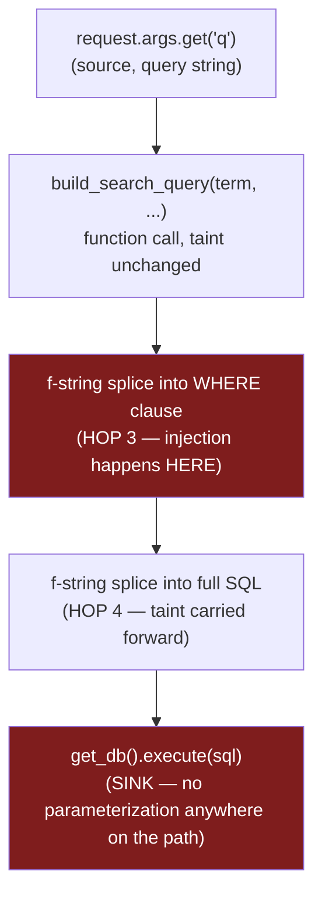
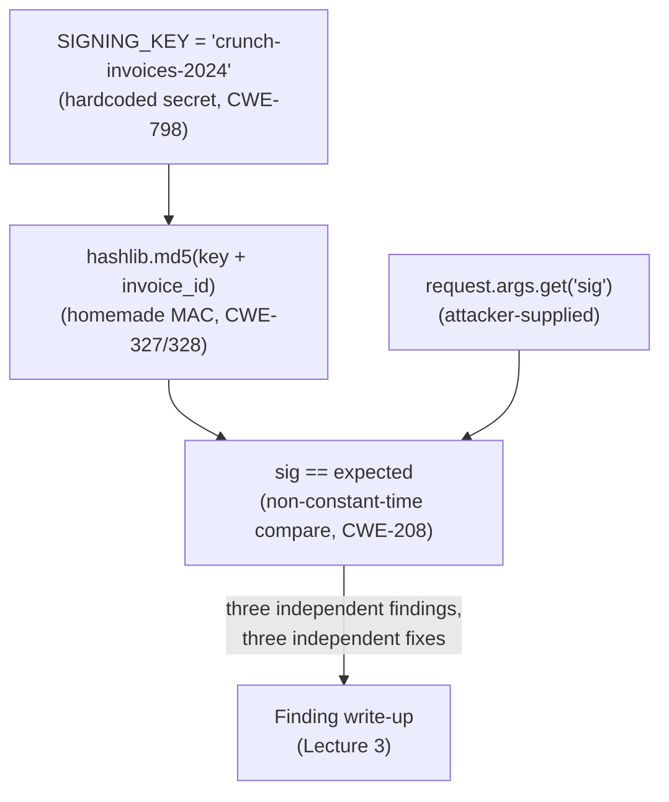

# Lecture 2 — Following Data to the Sink

> **Duration:** ~2 hours. **Outcome:** You can hand-trace a value from where it enters a program to every dangerous operation it reaches, across function calls and files, naming each hop, and stating precisely whether a real sanitizer, a real authorization check, or nothing at all stands between the two — using `PR #482`'s three flaws as full worked examples.

> **Lab reminder.** Every trace below runs against `crunch-invoices` with `pr-482.diff` applied, on `127.0.0.1`, inside your isolated `appsec-lab` — code you wrote, reviewing a PR you also wrote, so every "attack" request is a confirmation of a flaw you already found by reading, not a probe against a stranger's system.

## 1. Taint tracing, defined precisely

**Taint tracing** is the discipline of following a value from its **source** (where attacker-influenced data enters — Lecture 1's entry points) to a **sink** (a dangerous operation — Lecture 1's sink catalog), recording every place the value is read, transformed, or passed to another function along the way, and checking at each hop whether a **sanitizer** (something that actually neutralizes the danger) sits between source and sink. If a source reaches a sink with no real sanitizer anywhere on the path, that's a vulnerability. If a real sanitizer sits between them, the path is safe *for that specific sink* — a value can be safely sanitized for SQL and still be dangerous for a shell command three lines later, so "sanitized" is always relative to the specific sink you're checking.

The three things you are tracking at every hop:

- **Where is the value right now?** (a variable name, a function argument, a dict key)
- **What just happened to it?** (read as-is, concatenated with something else, passed to a function, type-converted)
- **Is that a real sanitizer for the sink I'm heading toward?** (a parameterized query placeholder is; a string `.replace()` is usually not; an `int()` cast stops SQL injection into a numeric column but proves nothing about authorization)

Doing this **by hand** — not with a tool — is the point of this lecture. Automated taint analysis (part of the SAST tooling from Week 8) is valuable at scale, but it has known blind spots (Week 8 covers this; Challenge 2 this week measures it directly), and every security engineer needs the manual skill underneath the tool, both to review code no scanner covers and to know when to distrust a scanner's "no issues found."

## 2. Worked trace 1 — the SQL injection in `/invoices/search`

**Source:** `request.args.get("q", "")` and `request.args.get("status")` in `search_invoices`. Both come straight from the query string — fully attacker-controlled, no framework validation applied to either.

**Sink:** `get_db().execute(sql)` — a raw SQL execution call.

Trace it hop by hop, reading the actual code from `pr-482.diff`:

```python
@app.route("/invoices/search")
def search_invoices():
    term = request.args.get("q", "")                      # HOP 1 — source
    status_filter = request.args.get("status")             # HOP 1 — source (second value)
    where_clause = build_search_query(term, status_filter)  # HOP 2 — passed into a helper
    sql = (
        "SELECT id, account_id, customer_name, amount_cents, status "
        f"FROM invoices WHERE {where_clause}"               # HOP 4 — spliced into the final SQL string
    )
    rows = get_db().execute(sql).fetchall()                 # SINK — executed as-is
```

```python
def build_search_query(term, status_filter=None):
    clause = f"customer_name LIKE '%{term}%'"                # HOP 3 — spliced into a string via f-string
    if status_filter:
        clause += f" AND status = '{status_filter}'"         # HOP 3b — same, for the second value
    return clause
```

| Hop | Location | Expression | Tainted? | Real sanitizer applied? |
|---|---|---|---|---|
| 1 | `search_invoices`, line "`term = request.args.get(\"q\", \"\")`" | `term` | Yes — direct from query string | No — no encoding, no type check, no allowlist |
| 2 | `search_invoices` → `build_search_query(term, status_filter)` | function call, taint crosses the function boundary unchanged | Yes | No — the function receives the raw string |
| 3 | `build_search_query`, `f"customer_name LIKE '%{term}%'"` | `clause` | Yes | **No — this *is* the injection point.** An f-string splices `term` directly into a SQL string literal. If `term` contains `' OR '1'='1` the resulting clause changes the query's logic; if it contains `'; DROP TABLE invoices; --` (SQLite allows only one statement per `execute()` call by default, but UNION-based and boolean-based extraction still apply) the attacker is writing SQL, not searching for a customer name |
| 4 | `search_invoices`, `f"... WHERE {where_clause}"` | `sql` | Yes (inherited from hop 3) | No — `where_clause` is concatenated into the full statement with no re-escaping, and none would help at this point anyway; the damage happened at hop 3 |
| **Sink** | `get_db().execute(sql)` | the string `sql`, executed | — | **Reaches the sink with zero real sanitization at any hop** |



Confirm the read against the running app — this is verification of a flaw already found on paper, not exploration:

```bash
curl -s "http://127.0.0.1:5050/invoices/search?q=x%27%20OR%20%271%27%3D%271"
# q = x' OR '1'='1  --  every row matches regardless of customer_name, across every account
```

**The fix, precisely:** never build the `WHERE` clause as a string. Pass `term` and `status_filter` as **parameters** to a placeholder-based query, the same pattern Week 5 established and this app's own `main`-branch routes already use correctly:

```python
def search_invoices_query(term, status_filter=None):
    sql = "SELECT id, account_id, customer_name, amount_cents, status FROM invoices WHERE customer_name LIKE ?"
    params = [f"%{term}%"]
    if status_filter:
        sql += " AND status = ?"
        params.append(status_filter)
    return sql, params
```

Note that the `%` wildcard characters still get built into the *value* (`f"%{term}%"`), which is fine — that's data, bound as a parameter. What changes is that `term` itself never touches the SQL string; it travels through the `?` placeholder as a bound value, which the SQLite driver treats as data no matter what characters it contains.

## 3. Worked trace 2 — the missing authorization check in `/invoices/export`

Taint tracing isn't only for injection. The same hop-by-hop discipline applies when the "sink" is a **decision point** — a place a role or ownership check should run — rather than a data-execution call.

**Source:** `session` — specifically, whatever role and account the currently logged-in user has (or doesn't have).

**Sink:** the `get_db().execute("SELECT * FROM invoices")` call — a query returning every invoice, across every account, with no `WHERE` clause at all.

```python
@app.route("/invoices/export")
def export_invoices():
    if "user_id" not in session:                    # HOP 1 — checks ONLY that a session exists
        return jsonify(error="login required"), 401
    rows = get_db().execute("SELECT * FROM invoices").fetchall()   # SINK — no account_id filter, no role check
```

| Hop | Location | What's checked | What's *not* checked |
|---|---|---|---|
| 1 | `if "user_id" not in session"` | Only that *some* valid session exists | `session["role"]` is never read anywhere in this function; `session["account_id"]` is never read anywhere in this function |
| **Sink** | `SELECT * FROM invoices` (no `WHERE`) | Nothing | Every invoice, from every account, returned to any authenticated user regardless of role |

Compare this directly to `mark_paid` in the reviewed `main` branch, which does the equivalent trace correctly:

```python
@app.route("/invoices/<invoice_id>/mark-paid", methods=["POST"])
def mark_paid(invoice_id):
    err = require_role("billing_admin", "superadmin")   # checks session["role"] against an allowlist
    ...
    get_db().execute(
        "UPDATE invoices SET status = 'paid' WHERE id = ? AND account_id = ?",
        (invoice_id, session["account_id"]),             # AND filters by the caller's own account
    )
```

`mark_paid` checks role **and** filters by `session["account_id"]` in the query itself — two separate control checks, both present. `export_invoices` has neither. The taint here isn't "a string reaches a SQL call unescaped" — the SQL has no injectable input at all, it's a literal constant string — it's that **the session's role and account never get read before a sensitive bulk-read runs.** This is exactly why Lecture 1 lists an authorization decision point as its own sink category: the vulnerability isn't in *how* the query is built, it's in the fact that *no check ran before it did.*

```bash
curl -s -b cr-nina.txt http://127.0.0.1:5050/invoices/export
# cr-nina is a crunch-retail 'member' -- gets back invoices from crunch-wholesale too
```

**The fix:** require the same role check as `mark_paid`, and filter by `session["account_id"]` in the query — export becomes "every invoice **for my account**, if I'm a billing admin," not "every invoice, period, if I'm logged in at all."

## 4. Worked trace 3 — the crypto/secrets flaw in the download link

**Source (this time, two of them):** the module-level constant `SIGNING_KEY = "crunch-invoices-2024"`, and `request.args.get("sig", "")` in `download_invoice`.

**Sink:** the comparison `sig == expected`, and the `hashlib.md5(...)` call that produced `expected`.

```python
SIGNING_KEY = "crunch-invoices-2024"                       # HOP 1 — a secret, hardcoded in source

def sign_invoice_id(invoice_id):
    return hashlib.md5((SIGNING_KEY + str(invoice_id)).encode()).hexdigest()   # HOP 2 — SINK A

@app.route("/invoices/download/<invoice_id>")
def download_invoice(invoice_id):
    sig = request.args.get("sig", "")                       # HOP 1' — source, the attacker-supplied signature
    expected = sign_invoice_id(invoice_id)
    if sig == expected:                                     # SINK B
        ...
```

Three separate findings live in these six lines, and tracing each precisely matters because each has a **different fix**:

- **Sink A — `hashlib.md5(SIGNING_KEY + str(invoice_id))` as a signature.** This is a homemade message authentication code: plain concatenation followed by a general-purpose hash, not the vetted `hmac.new(key, msg, hashlib.sha256)` construction Week 7 taught. Simple concatenation-then-hash constructions are vulnerable to length-extension attacks against Merkle–Damgård hashes like MD5, and MD5 itself is cryptographically broken for collision resistance. The fix is `hmac.new(SIGNING_KEY.encode(), str(invoice_id).encode(), hashlib.sha256).hexdigest()` — never string concatenation into a general hash.
- **Hardcoded key — `SIGNING_KEY` as a source-level constant.** Independent of which hash is used, a secret sitting in a committed source file is a Week 7 finding on its own: `git log -p` recovers it forever, and every developer with repo read access has it. The fix is loading it from an environment variable or a secrets manager, never a literal in `app.py`.
- **Sink B — `sig == expected`.** Even with a proper `hmac`-based signature, comparing it with Python's `==` short-circuits on the first differing byte, which leaks timing information an attacker can use to guess the correct signature one byte at a time. The fix is `hmac.compare_digest(sig, expected)`, which always takes the same time regardless of where the strings first differ.



Note that these three findings are **independent** — fixing one does not fix the others. Switching to `hmac.new(..., hashlib.sha256)` while still comparing with `==` leaves the timing leak. Switching the comparison to `hmac.compare_digest` while the key stays hardcoded in source leaves the secret exposed the moment anyone reads the repository or its history. A taint trace that stops at the first fix and declares victory is an incomplete review — trace every hop to its actual sink, and report every independent flaw the trace surfaces.

## 5. Tracing fast without tooling: the practical technique

For a codebase larger than one file, the by-hand technique that scales is: **grep for the exact variable or parameter name across the whole tree, and follow every place it's assigned to a new name.**

```bash
grep -rn "invoice_id" app.py          # every place this specific parameter is read or passed onward
grep -rn "SIGNING_KEY" .              # confirm it's used nowhere else, and never loaded from env anywhere
grep -rn "where_clause\|build_search_query" app.py
```

Stop tracing a given path the moment you hit **either** a genuine sink (record the finding) **or** a genuine sanitizer for that sink (the path is closed for that specific danger — but keep checking whether the same tainted value reaches a *different* sink elsewhere, since one value can be safely handled for SQL and still be dangerous for a shell command or a template three lines later).

## 6. Sanitizer or not? A quick test

Not everything that transforms a value is a real sanitizer for the sink you're worried about. Before crediting a control, ask: **does this specific operation change what the sink can do with the value, for the specific danger this sink represents?**

| Operation seen in a trace | Real sanitizer for SQL injection? | Real sanitizer for authorization? |
|---|---|---|
| `int(invoice_id)` | Partial — rules out non-numeric injection payloads in a numeric context, but a parameterized query is still required for defense in depth | **No** — converting a type says nothing about whether the caller is allowed to see that ID |
| `sql.replace("'", "''")` | **No** — a hand-rolled escaping attempt is exactly the kind of "looks like a fix" pattern this course flags as broken; use parameterized queries, not string surgery | N/A |
| A `?` placeholder bound via `execute(sql, params)` | **Yes** — the driver treats the value as data, never as SQL syntax, regardless of content | N/A |
| `if "user_id" in session` | N/A | **Partial** — proves authentication, proves nothing about authorization for *this* object or *this* role |
| `WHERE id = ? AND account_id = ?` bound to `session["account_id"]` | Also a SQL sanitizer (parameterized) | **Yes** — the ownership check lives in the query itself, per Week 6 |

## 7. Check yourself

- In the injection trace (Section 2), at which exact hop does the vulnerability actually happen — hop 3, or the final `execute()` call? Defend your answer.
- Why does converting `invoice_id` with `int()` fail as a sanitizer for an authorization question, even though it's a perfectly good sanitizer against certain injection payloads?
- In the authz trace (Section 3), what's the "sink" — and why is a decision point a legitimate sink category even though no data is executed there?
- Name the three *independent* findings in the crypto trace (Section 4), and explain why fixing only one of them leaves the route still vulnerable.
- Why can a value be "sanitized" for one sink and still dangerous for a different sink reached later in the same function?
- What's the fast, tool-free technique for tracing a specific parameter through a codebase larger than one file?

If those are automatic, Exercise 2 has you produce full hop tables and mermaid traces like this lecture's, by hand, for both the injection and the authorization flaw — and Lecture 3 turns every finding these traces produced into a report a developer can act on immediately.

## Further reading

- **OWASP — Source-Sink-Sanitizer terminology, Testing Guide:** <https://owasp.org/www-project-web-security-testing-guide/>
- **CWE-89 — SQL Injection:** <https://cwe.mitre.org/data/definitions/89.html>
- **CWE-798 — Use of Hard-coded Credentials:** <https://cwe.mitre.org/data/definitions/798.html>
- **CWE-208 — Observable Timing Discrepancy:** <https://cwe.mitre.org/data/definitions/208.html>
- **Python `hmac` module documentation (`compare_digest`):** <https://docs.python.org/3/library/hmac.html>
