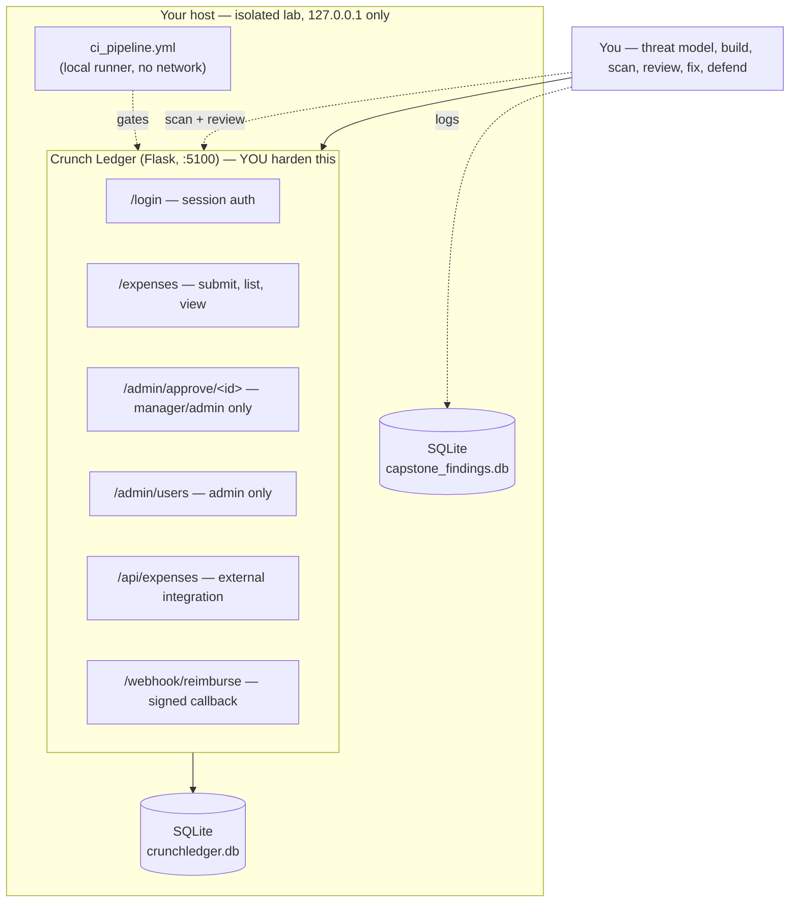

# Week 12 — Capstone — Secure Application

> **Goal:** by Sunday you can take a small application from a data-flow diagram to a shipped, defensible, secure release: threat-model it with STRIDE, build or harden every control the last eleven weeks taught you, run the full automated-plus-manual hunt against it in your own isolated lab, remediate and re-test every finding, and stand behind every decision in a design review — on one app you own, end to end.

Welcome to the last week of **C50 · Crunch AppSec**. Eleven weeks built you, piece by piece, into someone who can secure a real application: an isolated lab and a risk register (Week 1), STRIDE and data-flow diagrams (Week 2), the OWASP Top 10 named and demonstrated (Week 3), authentication and session security (Week 4), injection defense (Week 5), access control and authorization (Week 6), secrets management and applied crypto (Week 7), SAST/DAST/SCA tooling (Week 8), API and supply-chain security (Week 9), secure SDLC and CI/CD (Week 10), and secure code review (Week 11). This week nothing is new. This week every one of those disciplines runs **on one app, in the right order, under your own judgment** — the way it actually happens on a real team, not one topic at a time with a lecture pointing at the answer.

The target: **Crunch Ledger**, a small Flask + SQLite expense-reporting app for a fictional company — employees submit expenses, managers approve them, admins manage users and a webhook integration with a (fictional, lab-only) reimbursement processor. It is deliberately shipped with **eleven vulnerabilities spanning every control category this course covered**: weak password storage, a missing session-cookie flag, a SQL injection in search, an IDOR on individual expense records, a missing role check on approvals, a hardcoded webhook secret, a weak-RNG password-reset token, a non-constant-time signature check, an unauthenticated API route, a known-vulnerable dependency, and a CI pipeline with no security gates at all. You will threat-model it first — so you find some of these from the design, not just from a scanner — then fix every one at the source, prove each fix with a re-test, and defend the whole thing in front of a reviewer who wasn't there for the build.

If you'd rather harden an app of your own instead of Crunch Ledger, you may — **Lecture 1** tells you exactly how to confirm your app has equivalent surface area (auth, data access, at least one privileged action, at least one external integration) before you commit a whole week to it. Everything below assumes Crunch Ledger by default; swap in your own app's names where the instructions reference `crunch-ledger`.

> **Ethics & legality — binding, every week, capstone most of all.** Everything below is **authorized, legal, defensive-minded** security work performed **only inside the isolated lab you own** — Crunch Ledger runs exclusively on `127.0.0.1`, seeded entirely with fictional employees, fictional expenses, and fictional API keys/secrets (`sk_live_REDACTED-EXAMPLE-not-a-real-key...`, and similar clearly-labeled placeholders) that you generate yourself. Every scanning technique, every exploit demonstration, and every "attack" this week is run against **your own local target, with your own written scope and authorization document from Week 1, kept current through this final week** — never against a system you don't own or lack explicit permission to test. Any offensive technique you run is immediately paired with a fix and a re-test; you never leave a flaw "demonstrated but not closed." This is the standard the whole course has held since Week 1, and it is the standard your capstone package will be judged against.

## Learning objectives

By the end of this week, you will be able to:

- **Threat-model** a small application with STRIDE and a data-flow diagram, producing a written scope/authorization statement and a risk register that drives every decision that follows.
- **Build security in**, not bolt it on: secure authentication and session handling, injection defense via parameterized queries, deny-by-default access control, managed secrets and vetted cryptographic primitives, and a hardened API and CI/CD pipeline — applied together, on one coherent app.
- **Run the full hunt** — SAST, DAST, and SCA tooling plus a structured manual code review — against your own build, and triage the combined findings into one prioritized backlog stored in a database, not a chat thread.
- **Remediate at the source and re-test**, proving with a logged, repeatable check that every finding you claim is fixed is actually fixed — not just edited and forgotten.
- **Defend the design**: explain, to a reviewer who did not watch you build it, why each control is shaped the way it is, what residual risk remains, and why that residual risk is acceptable to ship.

## Prerequisites

- **Weeks 1–11 completed**, or working knowledge of their content. Specifically: your isolated lab and written scope document are current (Week 1); you can produce a STRIDE model and DFD from a system description (Week 2); you can name OWASP Top 10 categories on sight (Week 3); you've hardened a login/session flow (Week 4); you default to parameterized queries and input validation (Week 5); you enforce ownership and role checks in the query, not an `if` bolted on after (Week 6); you manage secrets and pick the right crypto primitive (Week 7); you can wire and read SAST/DAST/SCA tool output (Week 8); you've secured an API and a dependency supply chain (Week 9); you've added security gates to an SDLC/CI pipeline (Week 10); and you can read a diff and flag a vulnerability by category, not just by gut feel (Week 11).
- Python 3.10+, `pip`, `git`, `sqlite3` (ships with Python). Flask, `cryptography`, and `bandit`/`pip-audit` from earlier weeks — reinstall into a fresh virtualenv for this week's lab (setup below).
- [C33 Crunch SQL](../../../C33-CRUNCH-SQL/) helps for the findings-and-evidence database work but isn't required — every query this week is explained from scratch.

## This week's target: Crunch Ledger



### Set up the lab (do this first)

```bash
mkdir -p ~/c50-week-12/crunch-ledger && cd ~/c50-week-12/crunch-ledger
git init -q
python3 -m venv venv && source venv/bin/activate
pip install flask==2.3.2 cryptography bandit pip-audit
```

`requirements.txt` — the app's dependency manifest, seeded with one known-vulnerable pin on purpose (VULN #10, closed in Exercise 3 / Challenge 1 via Week 9's SCA discipline):

```text
flask==2.3.2
cryptography>=41.0.0
```

`config.py` — **VULN #6**, a hardcoded webhook-signing secret and Flask secret key straight in source, the same class of mistake Week 7 named:

```python
# config.py -- VULN #6: hardcoded secrets in source, same class Week 7 covered.
# Fixed in Exercise 2 by moving both to environment injection.
FLASK_SECRET_KEY = "crunch-ledger-dev-key-2024"
WEBHOOK_SIGNING_SECRET = "whsec_FAKElab000000000000000000000000"
```

`app.py` — the full starter app; every numbered comment below is one of this week's eleven deliberate vulnerabilities:

```python
#!/usr/bin/env python3
"""
Crunch Ledger -- a DELIBERATELY vulnerable Flask + SQLite expense-reporting
app for C50 Week 12. Run ONLY on 127.0.0.1, inside your own isolated lab.
Every account, expense, and secret here is fictional and lab-only.
"""
import hashlib
import hmac
import random
import sqlite3

from flask import Flask, g, jsonify, request, session

from config import FLASK_SECRET_KEY, WEBHOOK_SIGNING_SECRET

app = Flask(__name__)
app.secret_key = FLASK_SECRET_KEY
# VULN #2 -- session cookie missing Secure/HttpOnly/SameSite hardening.
# Week 4 covered this exact gap. Fixed in Exercise 2.
DB_PATH = "crunchledger.db"


def get_db():
    if "db" not in g:
        g.db = sqlite3.connect(DB_PATH)
        g.db.row_factory = sqlite3.Row
    return g.db


@app.teardown_appcontext
def close_db(exception=None):
    db = g.pop("db", None)
    if db is not None:
        db.close()


# ---------------------------------------------------------------------------
# VULN #1 -- password storage is unsalted single-round SHA-256, not a KDF.
# Week 4 named this exact mistake. Fixed in Exercise 2 with a proper KDF.
# ---------------------------------------------------------------------------
def hash_password(password: str) -> str:
    return hashlib.sha256(password.encode()).hexdigest()


@app.route("/login", methods=["POST"])
def login():
    username = request.form["username"]
    password = request.form["password"]
    row = get_db().execute(
        "SELECT * FROM users WHERE username = ?", (username,)
    ).fetchone()
    if row is None or row["password_hash"] != hash_password(password):
        return jsonify(error="invalid credentials"), 401
    session["user_id"] = row["id"]
    session["role"] = row["role"]
    return jsonify(message=f"welcome {username}", role=row["role"])


# ---------------------------------------------------------------------------
# VULN #3 -- SQL injection. The search term is string-formatted straight
# into the query instead of parameterized. Week 5's whole week was this
# exact mistake. Fixed in Exercise 2.
# ---------------------------------------------------------------------------
@app.route("/expenses/search")
def search_expenses():
    if "user_id" not in session:
        return jsonify(error="login required"), 401
    term = request.args.get("q", "")
    query = f"SELECT * FROM expenses WHERE memo LIKE '%{term}%'"
    rows = get_db().execute(query).fetchall()
    return jsonify([dict(r) for r in rows])


# ---------------------------------------------------------------------------
# VULN #4 -- IDOR. Fetches by ID alone, no check that this expense belongs
# to the requester. Week 6's exact failure shape. Fixed in Exercise 2.
# ---------------------------------------------------------------------------
@app.route("/expenses/<expense_id>")
def get_expense(expense_id):
    if "user_id" not in session:
        return jsonify(error="login required"), 401
    row = get_db().execute(
        "SELECT * FROM expenses WHERE id = ?", (expense_id,)
    ).fetchone()
    if row is None:
        return jsonify(error="not found"), 404
    return jsonify(dict(row))


# ---------------------------------------------------------------------------
# VULN #5 -- vertical escalation. Approving an expense is a manager/admin
# action; this route checks only that someone is logged in. Week 6's other
# failure shape. Fixed in Exercise 2.
# ---------------------------------------------------------------------------
@app.route("/admin/approve/<expense_id>", methods=["POST"])
def approve_expense(expense_id):
    if "user_id" not in session:
        return jsonify(error="login required"), 401
    get_db().execute(
        "UPDATE expenses SET status = 'approved' WHERE id = ?", (expense_id,)
    )
    get_db().commit()
    return jsonify(message=f"expense {expense_id} approved")


# ---------------------------------------------------------------------------
# VULN #7 -- weak RNG for a security token. `random` is Mersenne Twister
# output, not cryptographically secure. Week 7's exact lesson. Fixed in
# Exercise 2.
# ---------------------------------------------------------------------------
def make_reset_token() -> str:
    return "".join(str(random.randint(0, 9)) for _ in range(8))


@app.route("/password-reset/request", methods=["POST"])
def request_reset():
    username = request.form["username"]
    token = make_reset_token()
    get_db().execute(
        "UPDATE users SET reset_token = ? WHERE username = ?", (token, username)
    )
    get_db().commit()
    return jsonify(message="reset token issued", token=token)  # lab-only: token echoed for testing


# ---------------------------------------------------------------------------
# VULN #8 -- non-constant-time signature comparison. `==` on secret-derived
# strings leaks timing information one byte at a time. Week 7's exact
# lesson. Fixed in Exercise 2.
# ---------------------------------------------------------------------------
@app.route("/webhook/reimburse", methods=["POST"])
def webhook_reimburse():
    payload = request.get_data()
    expected = hmac.new(WEBHOOK_SIGNING_SECRET.encode(), payload, hashlib.sha256).hexdigest()
    given = request.headers.get("X-Signature", "")
    if given == expected:  # VULN #8: should be hmac.compare_digest(given, expected)
        return jsonify(status="processed")
    return jsonify(status="rejected"), 400


# ---------------------------------------------------------------------------
# VULN #9 -- unauthenticated API route. No session check, no API key check
# at all. Week 9's exact lesson. Fixed in Exercise 2.
# ---------------------------------------------------------------------------
@app.route("/api/expenses")
def api_expenses():
    rows = get_db().execute("SELECT * FROM expenses").fetchall()
    return jsonify([dict(r) for r in rows])


if __name__ == "__main__":
    app.run(host="127.0.0.1", port=5100, debug=True)
```

`schema.sql` and `seed.py`:

```sql
CREATE TABLE users (
    id            INTEGER PRIMARY KEY,
    username      TEXT NOT NULL UNIQUE,
    password_hash TEXT NOT NULL,
    role          TEXT NOT NULL DEFAULT 'employee' CHECK (role IN ('employee','manager','admin')),
    reset_token   TEXT
);

CREATE TABLE expenses (
    id          INTEGER PRIMARY KEY,
    user_id     INTEGER NOT NULL REFERENCES users(id),
    amount_cents INTEGER NOT NULL,
    memo        TEXT NOT NULL,
    status      TEXT NOT NULL DEFAULT 'pending' CHECK (status IN ('pending','approved','rejected'))
);
```

```python
import hashlib
import sqlite3

db = sqlite3.connect("crunchledger.db")
db.executescript(open("schema.sql").read())
db.executemany(
    "INSERT INTO users (id, username, password_hash, role) VALUES (?, ?, ?, ?)",
    [
        (1, "cl-erin",  hashlib.sha256(b"labpass1").hexdigest(), "employee"),
        (2, "cl-mona",  hashlib.sha256(b"labpass1").hexdigest(), "manager"),
        (3, "cl-admin", hashlib.sha256(b"labpass1").hexdigest(), "admin"),
    ],
)
db.executemany(
    "INSERT INTO expenses (id, user_id, amount_cents, memo, status) VALUES (?, ?, ?, ?, ?)",
    [
        (1, 1, 4599, "Client lunch, Q3 kickoff", "pending"),
        (2, 1, 12000, "Conference travel, Austin", "pending"),
        (3, 2, 3200, "Team offsite supplies", "approved"),
    ],
)
db.commit()
db.close()
print("seeded crunchledger.db -- 3 users, 3 expenses")
```

`ci_pipeline.yml` — **VULN #11**: a CI config that runs tests but has **no SAST, no SCA, and no required review** before it "deploys," the exact gap Week 10 covered (fixed in Exercise 2 / Challenge 1 with the gates Week 10 taught):

```yaml
name: crunch-ledger-ci
on: [push]
jobs:
  build-and-deploy:
    runs-on: ubuntu-latest
    steps:
      - uses: actions/checkout@v4
      - run: pip install -r requirements.txt
      - run: python -m pytest tests/ || true   # VULN #11a: failures don't block
      - run: echo "deploying straight to prod, no gate, no approval"  # VULN #11b
```

Bring the app up and confirm it runs:

```bash
python3 seed.py
python3 app.py
curl -s -o /dev/null -w "%{http_code}\n" http://127.0.0.1:5100/api/expenses   # expect: 200, unauthenticated -- VULN #9
```

Eleven deliberate vulnerabilities, one app, every category this course covered — write this table down, you'll reference it all week:

| # | Where | Flaw | Category (week) |
|---|-------|------|------------------|
| 1 | `app.py: hash_password` | Unsalted single-round SHA-256 for passwords, no KDF | Auth (Week 4) |
| 2 | `app.py` (`app.secret_key` config) | Session cookie missing `Secure`/`HttpOnly`/`SameSite` | Auth (Week 4) |
| 3 | `app.py: search_expenses` | SQL injection via string-formatted `LIKE` query | Injection (Week 5) |
| 4 | `app.py: get_expense` | IDOR — no ownership check on `/expenses/<id>` | Access control (Week 6) |
| 5 | `app.py: approve_expense` | Vertical escalation — no role check on approval | Access control (Week 6) |
| 6 | `config.py` | Hardcoded webhook secret + Flask secret key | Secrets (Week 7) |
| 7 | `app.py: make_reset_token` | Weak RNG (`random`) for a security token | Crypto (Week 7) |
| 8 | `app.py: webhook_reimburse` | Non-constant-time signature comparison (`==`) | Crypto (Week 7) |
| 9 | `app.py: api_expenses` | Unauthenticated API route | API security (Week 9) |
| 10 | `requirements.txt` | Pinned dependency version with a known advisory | Supply chain (Week 9) |
| 11 | `ci_pipeline.yml` | No SAST/SCA gate; failures don't block; no approval before deploy | CI/CD (Week 10) |

## This week's map

Work top to bottom. Each piece assumes the ones before it.

| # | File | What's inside | ~Time |
|--:|------|---------------|------:|
| 1 | [lecture-notes/01-capstone-scoping-and-threat-model.md](./lecture-notes/01-capstone-scoping-and-threat-model.md) | Choosing/confirming your target, scope and authorization, STRIDE + DFD, the risk register | 2h |
| 2 | [lecture-notes/02-building-security-in.md](./lecture-notes/02-building-security-in.md) | Fixing all eleven vulnerabilities: auth/session, injection, access control, secrets/crypto, API, pipeline | 2.5h |
| 3 | [lecture-notes/03-verify-remediate-and-defend.md](./lecture-notes/03-verify-remediate-and-defend.md) | Running SAST/DAST/SCA + manual review, triage, remediation evidence, and the design-defense prep | 2h |
| 4 | [exercises/exercise-01-capstone-threat-model.md](./exercises/exercise-01-capstone-threat-model.md) | Produce the DFD, STRIDE table, and risk register for Crunch Ledger, logged to SQLite | 1.5h |
| 5 | [exercises/exercise-02-capstone-secure-build.md](./exercises/exercise-02-capstone-secure-build.md) | Implement all eleven fixes at the source | 2h |
| 6 | [exercises/exercise-03-capstone-hunt-and-triage.md](./exercises/exercise-03-capstone-hunt-and-triage.md) | Run Bandit, a DAST probe script, `pip-audit`, and a manual review pass; triage findings in a database | 1.5h |
| 7 | [challenges/challenge-01-capstone-remediate-and-retest.md](./challenges/challenge-01-capstone-remediate-and-retest.md) | Close every remaining finding and prove each fix with a logged re-test | 2h |
| 8 | [challenges/challenge-02-capstone-defense-review.md](./challenges/challenge-02-capstone-defense-review.md) | A structured design-defense: answer a reviewer's questions and sign off residual risk | 1.5h |
| 9 | [mini-project/README.md](./mini-project/README.md) | Ship the full secure-application package: threat model, build, hunt, remediation, defense | 3h |
| 10 | [homework.md](./homework.md) | Extra practice, spread across the week | 4h |
| 11 | [quiz.md](./quiz.md) | 15 self-check questions + answer key | 1h |
| 12 | [resources.md](./resources.md) | OWASP, NIST, and CI/CD security references worth your time | — |

## Weekly schedule

Adds up to roughly the course's full-time pace of **~24 hours**. Treat it as a target, not a stopwatch.

| Day | Focus | Lectures | Exercises | Challenges | Quiz/Read | Homework | Mini-Project | Daily Total |
|-----------|--------------------------------------------------|---------:|----------:|-----------:|----------:|---------:|-------------:|------------:|
| Monday | Set up the lab; scope and threat model | 2h | 1.5h | 0h | 0.5h | 1h | 0h | 5h |
| Tuesday | Building security in — auth, injection, access control | 1.5h | 1h | 0h | 0.5h | 1h | 0h | 4h |
| Wednesday | Building security in — secrets, crypto, API, pipeline | 1h | 1h | 0h | 0.5h | 1h | 0h | 3.5h |
| Thursday | Hunt & triage; begin remediation | 2h | 1.5h | 1h | 0.5h | 1h | 0h | 6h |
| Friday | Remediate + retest; design-defense prep | 0h | 0h | 2.5h | 0.5h | 1h | 1h | 5h |
| Saturday | Mini-project | 0h | 0h | 0h | 0h | 0h | 2h | 2h |
| Sunday | Quiz + course review | 0h | 0h | 0h | 1h | 0h | 0h | 1h |
| **Total** | | **6.5h** | **5h** | **3.5h** | **3.5h** | **4h** | **3h** | **~26.5h** |

## By the end of this week you can…

- Produce a STRIDE threat model and data-flow diagram for a real application and use it to find design-level flaws before a single scanner runs.
- Build or harden a small application with secure authentication, injection defense, deny-by-default access control, managed secrets, vetted cryptography, and a hardened API and CI/CD pipeline — as one coherent system, not eleven disconnected fixes.
- Run SAST, DAST, and SCA tooling alongside a manual review, and merge the results into one triaged, prioritized findings backlog stored in a database.
- Remediate every finding at the source and prove each fix with a logged, repeatable re-test — never claiming "fixed" without evidence.
- Defend a security design under real questioning: name the residual risk, justify why it's acceptable, and back every claim with the evidence you generated this week.

## Ethics reminder

Every account, expense, secret, and vulnerability in Crunch Ledger is fictional lab data, generated by you, for a target that runs only on `127.0.0.1` inside your own isolated lab. The written scope and authorization you produced in Week 1 — kept current every week since — governs every scan, every exploit demonstration, and every fix this week. Nothing in this capstone is aimed at a system you don't own; if a task ever seems to want that, stop and re-read your Week 1 scope document.

## Course complete

This is the final week of **C50 · Crunch AppSec**. Eleven weeks built the pieces — a lab and a risk register, STRIDE and DFDs, the OWASP Top 10, authentication, injection defense, access control, secrets and crypto, SAST/DAST/SCA tooling, API and supply-chain security, secure SDLC/CI-CD, and secure code review. This week you ran all of them together, on one app, and defended the result. That is the whole arc of the course: from "what can go wrong" to "I can build something that doesn't, and prove it." From here, the natural next stops are **[C48 Crunch Blue](../../../C48-CRUNCH-BLUE/)** or **[C51 Crunch Cloud Security](../../../C51-CRUNCH-CLOUD-SECURITY/)** (defending the infrastructure this app would actually run on), **[C45 Crunch Red](../../../C45-CRUNCH-RED/)** (the authorized offensive side of everything you just defended against), and **[C49 Crunch Forensics](../../../C49-CRUNCH-FORENSICS/)** (what happens after a defense like this one fails anyway).

---

*Part of the Code Crunch Worldwide open curriculum · GPL-3.0 · If you find errors, please open an issue or PR.*
