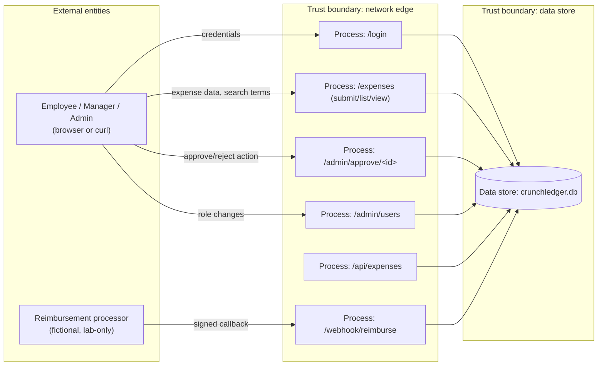
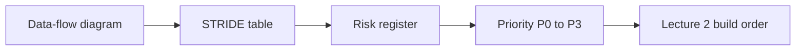

# Lecture 1 — Capstone Scoping & Threat Model

> **Duration:** ~2 hours. **Outcome:** You have a written scope and authorization statement for your capstone target, a data-flow diagram, a full STRIDE table, and a risk register in SQLite — the four artifacts that drive every fix you make for the rest of the week.

> **Lab reminder.** Everything in this lecture is scoped to **Crunch Ledger**, a fictional expense-reporting app you run yourself on `127.0.0.1`, seeded with fictional users and fictional expenses. If you choose to harden your own app instead (Section 1 below tells you how to confirm it qualifies), the same discipline applies: written scope, isolated lab, fictional data, your own system only.

## 1. Choosing your target

Every capstone needs one small, real application with enough surface area to exercise the whole course. This week defaults to **Crunch Ledger** — the app introduced in this week's [README](../README.md), already seeded with eleven vulnerabilities spanning every control category from Weeks 4–10. Using it guarantees full coverage and lets every exercise this week give you exact line numbers to check your work against.

If you'd rather use an app of your own — a side project, something from an earlier week's mini-project, anything you already have running — confirm it has **at least this much surface area** before committing a week to it:

- At least one authentication flow (a login, even a simple one).
- At least one data-access route that returns a specific record by an identifier the client supplies (the shape an IDOR needs to exist).
- At least one privileged action a subset of users can do that others can't (the shape a privilege-escalation bug needs to exist).
- At least one place a secret or credential is used (an API key, a signing secret, a database password) — even one hardcoded value counts.
- A database you can query directly, so the findings and evidence work later in the week has somewhere to write to.

If your app is missing more than one of these, use Crunch Ledger instead — a shallow target produces a shallow capstone, and the mini-project rubric checks for coverage across all five categories, not just the ones your app happens to have.

## 2. Scope and written authorization — before anything else

Every course week since Week 1 has opened with the same sentence: authorized, legal, defensive work, inside a lab you own, with written scope. The capstone is not an exception — if anything it's the week where skipping this step is most tempting, because by now the mechanics feel routine and it's easy to treat "it's just my own app" as automatic authorization. Write it down anyway. A one-paragraph scope statement, saved as `SCOPE.md` in your capstone repo, is the artifact a reviewer will ask for first:

```markdown
# Capstone Scope & Authorization

**Target:** Crunch Ledger, a Flask + SQLite app I wrote and run on 127.0.0.1 only.
**Authorized by:** myself, as the sole owner and operator of this lab environment.
**In scope:** app.py, config.py, requirements.txt, ci_pipeline.yml, crunchledger.db,
  and every route the app exposes on 127.0.0.1:5100.
**Out of scope:** any system other than this lab; no external network calls of any
  kind are part of this capstone.
**Data:** all users, expenses, and secrets are fictional, generated by seed.py,
  and contain no real credentials or personal data.
**Duration:** this capstone week only. Re-confirmed before every scan or exploit run.
```

This document is not decoration. Exercise 1 references it directly, Challenge 2's design defense asks you to produce it on request, and the mini-project rubric checks that it exists and is accurate before it checks anything else.

## 3. The data-flow diagram

A **data-flow diagram (DFD)** — introduced in Week 2 — draws every process, every data store, every external entity, and every flow between them, plus the **trust boundaries** where privilege or trust level changes. STRIDE is applied *per element*, and the DFD is what tells you which elements exist to apply it to. Draw Crunch Ledger's before you write a single STRIDE row:



Two trust boundaries matter here: the **network edge**, where an unauthenticated external entity becomes an authenticated (or, per VULN #9, un-authenticated) internal actor; and the **data store boundary**, where every process reads or writes shared data regardless of who's asking unless a query says otherwise. Every one of Crunch Ledger's eleven vulnerabilities lives at one of these two boundaries — that's not a coincidence, it's exactly where access-control and trust decisions get made or skipped.

## 4. STRIDE, applied to the whole diagram

Week 2 introduced STRIDE (Spoofing, Tampering, Repudiation, Information disclosure, Denial of service, Elevation of privilege) as a per-element checklist. Applied to Crunch Ledger's DFD, several rows map directly onto vulnerabilities you already know are seeded in the app — which is the point: a good threat model finds flaws **before** you run a single tool, purely from reasoning about the design.

| STRIDE category | Element | Threat | Maps to |
|---|---|---|---|
| **S**poofing | `/login` | Weak password hashing makes offline cracking of a leaked hash fast | VULN #1 |
| **S**poofing | `/webhook/reimburse` | A forged callback could be accepted if the signature check is broken | VULN #8 |
| **T**ampering | `/expenses/search` | Attacker-controlled input reaches SQL directly | VULN #3 |
| **T**ampering | `/admin/approve/<id>` | Any logged-in user can tamper with approval state regardless of role | VULN #5 |
| **R**epudiation | all write routes | No audit log records who approved what, or when | *(new gap — not one of the 11, found only by threat-modeling)* |
| **I**nfo disclosure | `/expenses/<id>` | Any user can read any other user's expense by ID | VULN #4 |
| **I**nfo disclosure | `/api/expenses` | No authentication at all — the entire expense table is public | VULN #9 |
| **D**enial of service | `/expenses/search` | Unbounded `LIKE '%...%'` scan on an unindexed column at scale | *(new gap — noted, not fixed this week; out of scope, logged as accepted risk)* |
| **E**levation of privilege | `/admin/approve`, `/admin/users` | No role check lets an employee act as a manager or admin | VULN #5 |

Two rows above are **not** in the app's known-vulnerability table: the missing audit log (Repudiation) and the unbounded search query (Denial of service). This is exactly what a threat model is for — it surfaces design gaps a code scanner never will, because there's no "vulnerable line" for a control that was never built at all. Log both as new risk-register entries in Section 5, and note explicitly in your write-up which findings came from *threat modeling* versus which came from *scanning* (Lecture 3) versus *manual review* (also Lecture 3) — the mini-project's after-action-style report asks you to attribute each finding to its source, because a portfolio piece that shows you can find flaws three different ways is worth more than one that shows only one.

## 5. The risk register

A risk register turns "we talked about some threats" into rows you can prioritize, assign, and close. Log it in SQLite — the same discipline every week of this course has used for evidence:

```sql
CREATE TABLE risk_register (
    risk_id       INTEGER PRIMARY KEY,
    stride_category TEXT NOT NULL CHECK (stride_category IN
        ('spoofing','tampering','repudiation','info_disclosure','dos','elevation')),
    element       TEXT NOT NULL,
    description   TEXT NOT NULL,
    source        TEXT NOT NULL CHECK (source IN ('threat_model','scan','manual_review')),
    likelihood    TEXT NOT NULL CHECK (likelihood IN ('low','medium','high')),
    impact        TEXT NOT NULL CHECK (impact IN ('low','medium','high')),
    priority      TEXT,   -- computed below, not entered by hand
    status        TEXT NOT NULL DEFAULT 'open' CHECK (status IN ('open','mitigated','accepted')),
    notes         TEXT
);

INSERT INTO risk_register
    (stride_category, element, description, source, likelihood, impact, status)
VALUES
    ('elevation', '/admin/approve/<id>', 'No role check — any logged-in user can approve any expense',
     'threat_model', 'high', 'high', 'open'),
    ('repudiation', 'all write routes', 'No audit log of who approved/changed what, or when',
     'threat_model', 'medium', 'medium', 'open'),
    ('dos', '/expenses/search', 'Unbounded LIKE scan, no rate limit or pagination',
     'threat_model', 'low', 'low', 'accepted');
```

Compute priority instead of guessing it — a simple likelihood × impact grid, expressed as a `CASE`, is enough to rank a register this size without a scoring framework heavier than the app itself:

```sql
UPDATE risk_register
SET priority = CASE
    WHEN likelihood = 'high' AND impact = 'high' THEN 'P0'
    WHEN likelihood = 'high' OR  impact = 'high' THEN 'P1'
    WHEN likelihood = 'medium' AND impact = 'medium' THEN 'P2'
    ELSE 'P3'
END;

SELECT priority, stride_category, element, description
FROM risk_register
ORDER BY priority, risk_id;
```

The `accepted` status on the DoS row is deliberate: not every risk gets fixed this week, and pretending otherwise would make the register dishonest. A capstone that ships with one clearly-justified accepted risk, documented with its reasoning, is stronger evidence of judgment than one that claims a perfect zero — Challenge 2's design defense specifically asks you to justify at least one `accepted` row, not just list the ones you fixed.

## 6. From register to build order

The register is what tells you what to build in Lecture 2, and in what order — not the vulnerability numbering from the README, which is just a reference table, but the **priority** column you just computed. `P0` and `P1` rows (the role checks, the IDOR, the injection, the hardcoded secrets) come first; `P2`/`P3` rows (session-cookie hardening, the CI pipeline gates) can follow once the highest-impact holes are closed. This ordering matters for the same reason it mattered in Week 1's risk register: a capstone that runs out of time on Friday should have fixed the things that matter most, not whichever vulnerability happened to be first in the README's numbered list.


*How the threat-modeling artifacts feed, in order, into what gets built first.*

## 7. Check yourself

- What's the difference between a data-flow diagram's "process" and "data store," and why does STRIDE apply differently to each?
- Name one threat from Section 4's table that came purely from reasoning about the diagram, with no corresponding "vulnerable line" of code anywhere in the app. Why couldn't a scanner have found it?
- Why is `accepted` a legitimate status for a risk-register row, and what has to be true for that status to be defensible rather than lazy?
- If your risk register had ten `P0` rows and you only had time to fix seven this week, which three would you leave open, and how would you justify that choice in writing?
- Why does the written scope/authorization document matter even when the target is an app you wrote yourself, with no other users?

If those are automatic, Exercise 1 has you produce all four artifacts — scope statement, DFD, STRIDE table, and risk register — for real, against your own Crunch Ledger checkout, with the register loaded into SQLite and queryable. Lecture 2 then takes that prioritized register and turns it into fixes.

## Further reading

- **OWASP Threat Modeling Process:** <https://owasp.org/www-community/Threat_Modeling_Process>
- **Microsoft — The STRIDE Threat Model:** <https://learn.microsoft.com/en-us/previous-versions/commerce-server/ee823878(v=cs.20)>
- **OWASP Risk Rating Methodology:** <https://owasp.org/www-community/OWASP_Risk_Rating_Methodology>
- **NIST SP 800-154 — Guide to Data-Centric System Threat Modeling:** <https://csrc.nist.gov/pubs/sp/800/154/ipd>
