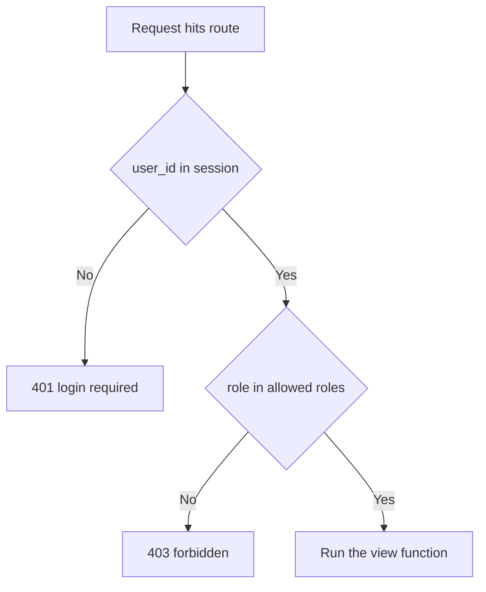
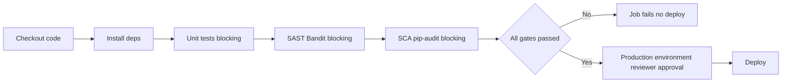

# Lecture 2 — Building Security In

> **Duration:** ~2.5 hours. **Outcome:** You have fixed all eleven of Crunch Ledger's seeded vulnerabilities at the source, in priority order from Lecture 1's risk register, using the exact patterns Weeks 4, 5, 6, 7, 9, and 10 taught — and you can explain, for each one, why the fix closes the whole class of bug and not just this one line.

> **Lab reminder.** Every fix below is applied to **your own Crunch Ledger checkout**, running on `127.0.0.1`. Nothing here is a new technique — this lecture is the whole course's toolkit, applied in one sitting, to one app.

## 1. Auth and session (VULN #1, #2 — Week 4)

**Password storage.** Unsalted single-round SHA-256 is fast by design — exactly wrong for a password hash, since fast means cheap to brute-force offline. Replace it with a proper KDF. `werkzeug.security` ships one already, or reach for `bcrypt` directly:

```python
from werkzeug.security import generate_password_hash, check_password_hash

def hash_password(password: str) -> str:
    return generate_password_hash(password)  # PBKDF2-SHA256, salted, tunable iterations

def verify_password(password: str, stored_hash: str) -> bool:
    return check_password_hash(stored_hash, password)
```

Update `login()` to use `verify_password` instead of a direct hash comparison, and update `seed.py` to store `generate_password_hash(...)` output instead of raw SHA-256. Every previously-seeded account's password hash changes shape — re-run `seed.py` against a fresh `crunchledger.db` rather than trying to migrate the old hashes in place; this is a lab, not a production migration, and starting clean is faster and just as valid as evidence.

**Session cookie hardening.** Three Flask config lines close VULN #2 — no code path changes, just the cookie's own attributes:

```python
app.config.update(
    SESSION_COOKIE_SECURE=True,     # never sent over plain HTTP
    SESSION_COOKIE_HTTPONLY=True,   # unreadable to page JavaScript, blocks session-cookie theft via XSS
    SESSION_COOKIE_SAMESITE="Lax",  # not sent on most cross-site requests, blunts CSRF
)
```

`SESSION_COOKIE_SECURE=True` will refuse to set the cookie at all over plain `http://127.0.0.1` in some Flask/Werkzeug versions during local testing — that's expected in a real deployment (HTTPS everywhere) but inconvenient in a local-only lab. Note this explicitly in your remediation evidence as a known lab-only deviation, and confirm the setting is correct by reading Flask's response headers (`Set-Cookie: ... Secure; HttpOnly; SameSite=Lax`) rather than by whether the login flow "feels" like it worked in a browser — the header is the evidence, not the browser behavior.

## 2. Injection defense (VULN #3 — Week 5)

The fix is the one this entire course has repeated since Week 5: never format user input into a query string; always pass it as a bound parameter.

```python
# Before (VULN #3):
query = f"SELECT * FROM expenses WHERE memo LIKE '%{term}%'"
rows = get_db().execute(query).fetchall()

# After:
rows = get_db().execute(
    "SELECT * FROM expenses WHERE memo LIKE ?", (f"%{term}%",)
).fetchall()
```

The wildcard characters (`%`) move into the **parameter value**, never into the SQL string itself — SQLite's placeholder binding treats the entire parameter as literal data, so a search term of `%' OR 1=1 --` is treated as a literal (and useless) search string, not as SQL syntax. Confirm the fix by re-running the exact injection probe you'd use to demonstrate the flaw (`?q=%' OR 1=1 --`) and observing it now returns zero or few rows instead of the entire table.

## 3. Access control (VULN #4, #5 — Week 6)

Both fixes follow Week 6's rule: **the ownership or role check lives in the query itself**, not as an `if` bolted on after the fetch.

```python
# VULN #4 fix -- ownership filter in the WHERE clause
@app.route("/expenses/<expense_id>")
def get_expense(expense_id):
    if "user_id" not in session:
        return jsonify(error="login required"), 401
    row = get_db().execute(
        """SELECT * FROM expenses
           WHERE id = ?
             AND (user_id = ? OR ? IN ('manager', 'admin'))""",
        (expense_id, session["user_id"], session["role"]),
    ).fetchone()
    if row is None:
        return jsonify(error="not found"), 404
    return jsonify(dict(row))
```

```python
# VULN #5 fix -- a reusable role-gate decorator, applied to every privileged route
from functools import wraps

def require_role(*allowed_roles):
    def decorator(view_func):
        @wraps(view_func)
        def wrapped(*args, **kwargs):
            if "user_id" not in session:
                return jsonify(error="login required"), 401
            if session["role"] not in allowed_roles:
                return jsonify(error="forbidden"), 403
            return view_func(*args, **kwargs)
        return wrapped
    return decorator

@app.route("/admin/approve/<expense_id>", methods=["POST"])
@require_role("manager", "admin")
def approve_expense(expense_id):
    get_db().execute(
        "UPDATE expenses SET status = 'approved' WHERE id = ?", (expense_id,)
    )
    get_db().commit()
    return jsonify(message=f"expense {expense_id} approved")
```

Apply `@require_role("admin")` to `/admin/users` the same way. Re-test both by logging in as `cl-erin` (employee) and confirming each now returns `403`, then logging in as `cl-mona` (manager) and confirming `/admin/approve/<id>` still succeeds while `/admin/users` (admin-only) still correctly fails for her too — proving the fix draws the line at the right place, not just "any check at all."


*The require_role decorator gates every privileged route before its own logic ever runs.*

## 4. Secrets and applied crypto (VULN #6, #7, #8 — Week 7)

**Hardcoded secrets → environment injection.** Remove both values from `config.py` entirely and read them from the environment, failing loudly if either is missing rather than silently falling back to a default (a silent fallback is just a hardcoded secret with extra steps):

```python
# config.py, after
import os

FLASK_SECRET_KEY = os.environ["FLASK_SECRET_KEY"]
WEBHOOK_SIGNING_SECRET = os.environ["WEBHOOK_SIGNING_SECRET"]
```

```bash
export FLASK_SECRET_KEY=$(python3 -c "import secrets; print(secrets.token_hex(32))")
export WEBHOOK_SIGNING_SECRET=$(python3 -c "import secrets; print(secrets.token_hex(32))")
python3 app.py
```

Note the `secrets` module here, not `random` — which is exactly the fix for VULN #7 too:

```python
# VULN #7 fix -- cryptographically secure token generation
import secrets

def make_reset_token() -> str:
    return secrets.token_urlsafe(24)   # secrets, not random -- CSPRNG-backed
```

`secrets.token_urlsafe` draws from the operating system's cryptographically secure random source, not a seeded, predictable Mersenne Twister — the same distinction Week 7 drilled into every crypto-primitive choice this week revisits.

```python
# VULN #8 fix -- constant-time comparison
import hmac

@app.route("/webhook/reimburse", methods=["POST"])
def webhook_reimburse():
    payload = request.get_data()
    expected = hmac.new(WEBHOOK_SIGNING_SECRET.encode(), payload, hashlib.sha256).hexdigest()
    given = request.headers.get("X-Signature", "")
    if hmac.compare_digest(given, expected):   # constant-time, not `==`
        return jsonify(status="processed")
    return jsonify(status="rejected"), 400
```

`hmac.compare_digest` runs in time independent of *where* the first mismatch occurs, closing the timing side-channel `==` opens. This is a one-line fix with an outsized payoff — exactly the kind of finding Week 7 wanted you to be able to spot on sight in any language, and it's worth calling out by name in your remediation evidence rather than folding it silently into "fixed the webhook."

## 5. API and supply-chain security (VULN #9, #10 — Week 9)

**Unauthenticated API route.** Add the same role gate used for the admin routes — an "API" route is not exempt from authorization just because it's meant for machine callers instead of a browser:

```python
@app.route("/api/expenses")
@require_role("manager", "admin")
def api_expenses():
    rows = get_db().execute("SELECT * FROM expenses").fetchall()
    return jsonify([dict(r) for r in rows])
```

If a real external integration needs this route (rather than an internal manager/admin user), the correct pattern is a separate API-key check — a distinct credential, scoped to this one route, rotatable independently of any human's session — not reuse of the session cookie. Week 9 covered this distinction; note in your remediation evidence which pattern you chose and why.

**Known-vulnerable dependency.** Run the SCA scan Week 9 taught before touching the pin:

```bash
pip-audit -r requirements.txt
```

Read the advisory `pip-audit` reports, confirm which fixed version resolves it, and bump the pin deliberately rather than blindly taking `latest` (a blind jump can introduce a breaking API change alongside the fix):

```text
flask==3.0.3
cryptography>=42.0.0
```

Re-run `pip install -r requirements.txt` inside your virtualenv and re-run the full test suite before considering this fix done — a dependency bump that breaks the app isn't a fix, it's a new incident.

## 6. Secure SDLC and CI/CD (VULN #11 — Week 10)

The pipeline gets three fixes, each one a gate Week 10 named: fail on test failure, add a SAST/SCA gate, and require a review step before anything reaches "prod."

```yaml
name: crunch-ledger-ci
on: [push, pull_request]
jobs:
  security-gates:
    runs-on: ubuntu-latest
    steps:
      - uses: actions/checkout@v4
      - run: pip install -r requirements.txt bandit pip-audit
      - name: Unit tests (blocking)
        run: python -m pytest tests/            # no `|| true` -- a failure now fails the job
      - name: SAST (Bandit, blocking)
        run: bandit -r . -x ./venv -ll           # -ll: fail on medium+ severity findings
      - name: SCA (pip-audit, blocking)
        run: pip-audit -r requirements.txt
  deploy:
    needs: security-gates
    runs-on: ubuntu-latest
    environment:
      name: production          # GitHub Environments support required-reviewer rules
    steps:
      - run: echo "deploy step -- only runs if security-gates passed AND a reviewer approved the environment"
```

The `deploy` job's `needs: security-gates` means a failing test, a Bandit medium-or-higher finding, or a `pip-audit` advisory now **blocks deployment automatically** — the pipeline enforces the gate; no human has to remember to check. The `environment: production` block additionally lets a real CI platform require a human approval before the deploy step runs at all, closing the "no approval required" half of VULN #11 alongside the "failures don't block" half.


*The CI pipeline's gate order: any failed step blocks the deploy job entirely.*

## 7. Confirm the whole build, together

Before moving to Lecture 3's hunt, restart the app with the fixed code and re-run every exploit from the README's numbered table by hand, confirming each now fails the way a secured route should:

```bash
python3 app.py   # with FLASK_SECRET_KEY / WEBHOOK_SIGNING_SECRET exported

# VULN #3 -- injection probe should now return an empty/harmless result
curl -s "http://127.0.0.1:5100/expenses/search?q=%25%27%20OR%201%3D1%20--"

# VULN #4/#5 -- cl-erin (employee) should now get 403/404 on other users' data and on approve
curl -s -c erin.txt -X POST http://127.0.0.1:5100/login -d "username=cl-erin&password=labpass1"
curl -s -i -b erin.txt http://127.0.0.1:5100/expenses/3
curl -s -i -b erin.txt -X POST http://127.0.0.1:5100/admin/approve/1

# VULN #9 -- unauthenticated call should now be 401/403, not 200
curl -s -o /dev/null -w "%{http_code}\n" http://127.0.0.1:5100/api/expenses
```

Every one of these is a manual smoke test, not a substitute for the systematic hunt Lecture 3 runs next — but it's the fast, cheap check that tells you whether you're ready for that hunt to find *new* findings, rather than re-discovering the same eleven bugs you just fixed.

## 8. Check yourself

- Why does moving the ownership check into the SQL `WHERE` clause close the IDOR more durably than an `if` statement placed after the fetch?
- Why is `secrets.token_urlsafe` the right choice for a password-reset token and `random.randint` never acceptable, even for a "low-stakes" token?
- What's the difference between `==` and `hmac.compare_digest`, and why does that difference matter for a webhook signature specifically, not just in the abstract?
- Why does the CI fix need **both** "tests actually block" and "a SAST/SCA gate exists" — what does one alone still leave open?
- If you added an API-key check instead of reusing the session cookie for `/api/expenses`, what's the one property an API key has that a session cookie doesn't, and why does that matter for an external integration?

If those are automatic, Exercise 2 has you apply every fix in this lecture to your own checkout, end to end, and re-test each one exactly as Section 7 demonstrated. Lecture 3 then runs the full automated-plus-manual hunt against your now-hardened build — proving, independently of your own confidence, that the fixes hold.

## Further reading

- **OWASP Password Storage Cheat Sheet:** <https://cheatsheetseries.owasp.org/cheatsheets/Password_Storage_Cheat_Sheet.html>
- **OWASP Session Management Cheat Sheet:** <https://cheatsheetseries.owasp.org/cheatsheets/Session_Management_Cheat_Sheet.html>
- **OWASP Query Parameterization Cheat Sheet:** <https://cheatsheetseries.owasp.org/cheatsheets/Query_Parameterization_Cheat_Sheet.html>
- **Python `secrets` module docs:** <https://docs.python.org/3/library/secrets.html>
- **pip-audit:** <https://pypi.org/project/pip-audit/>
